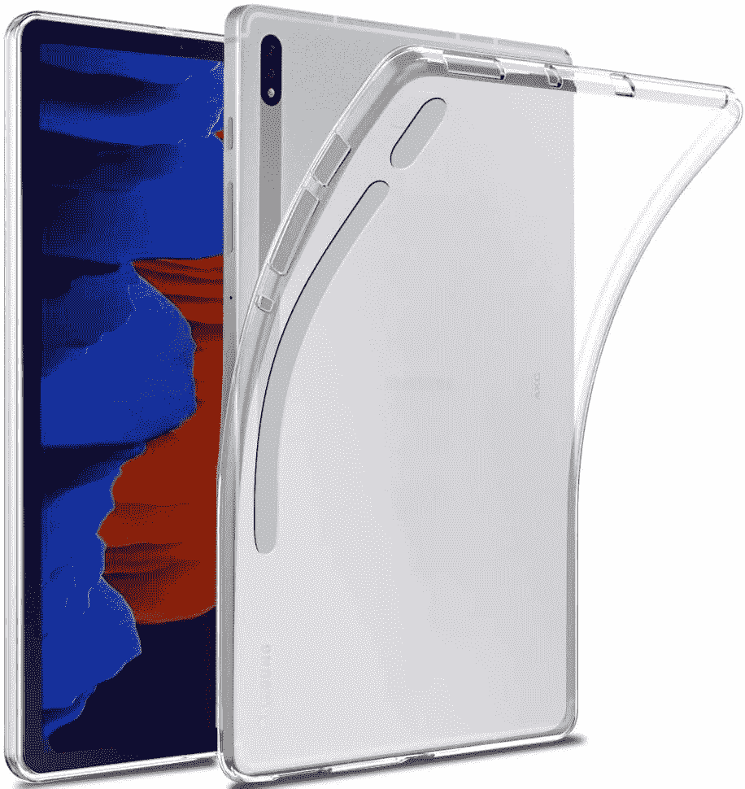
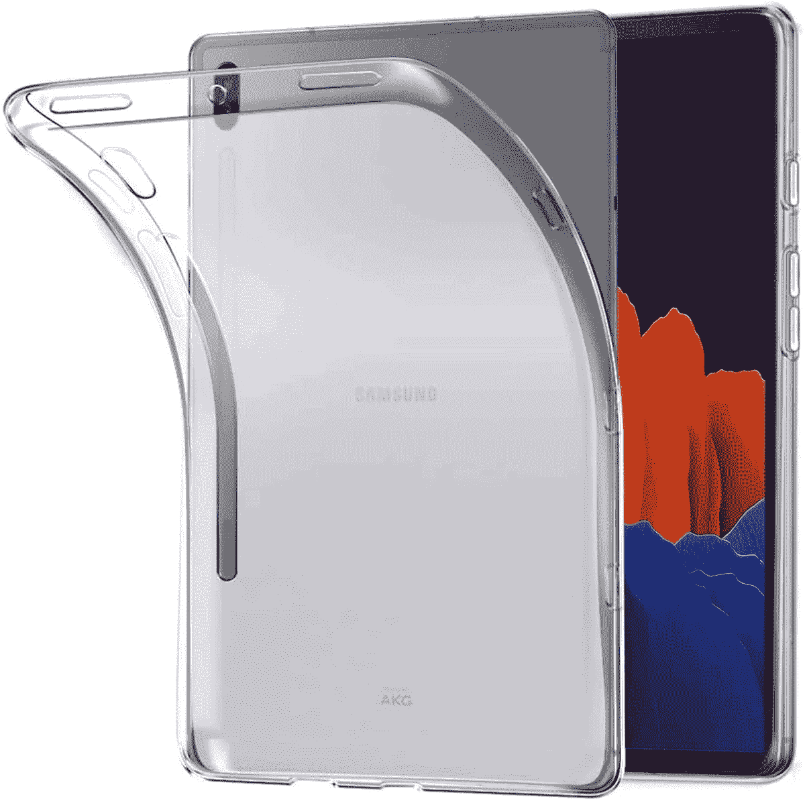
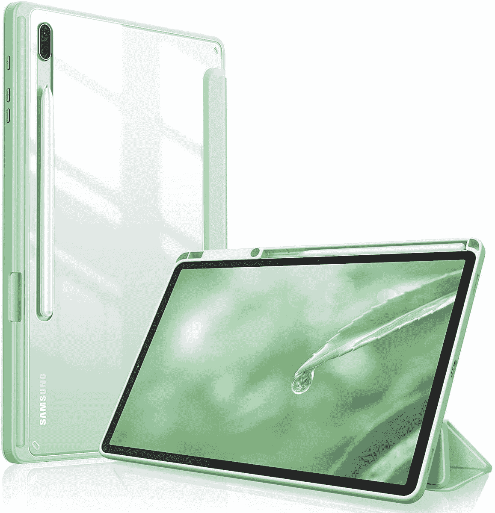
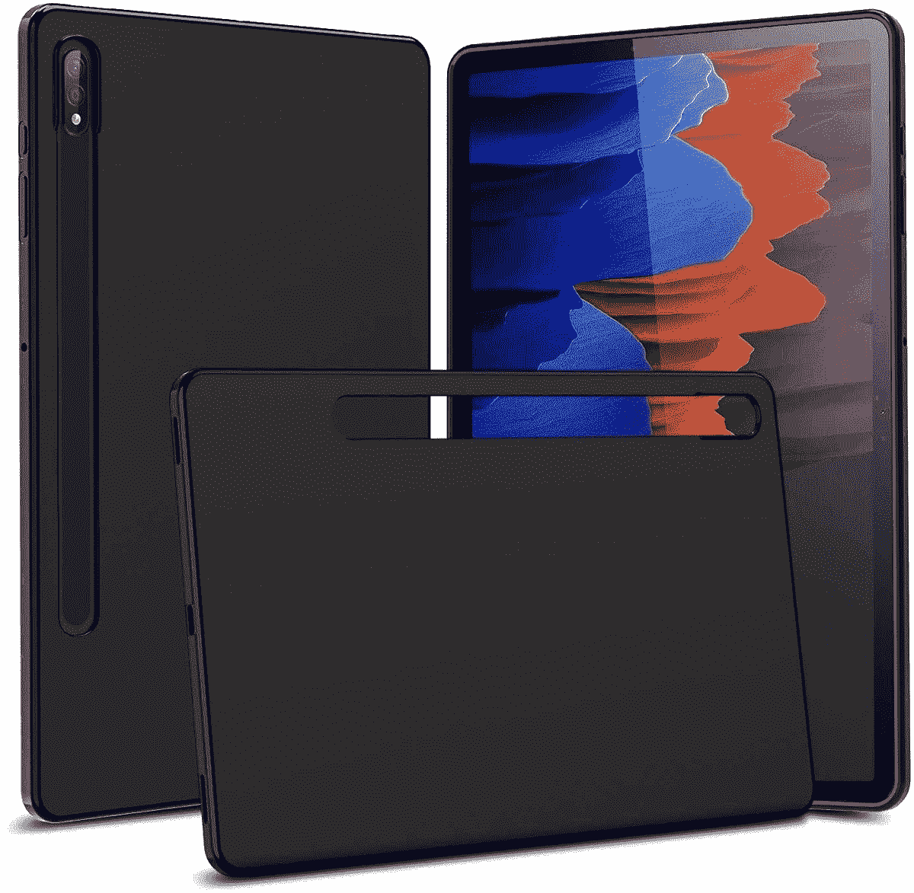
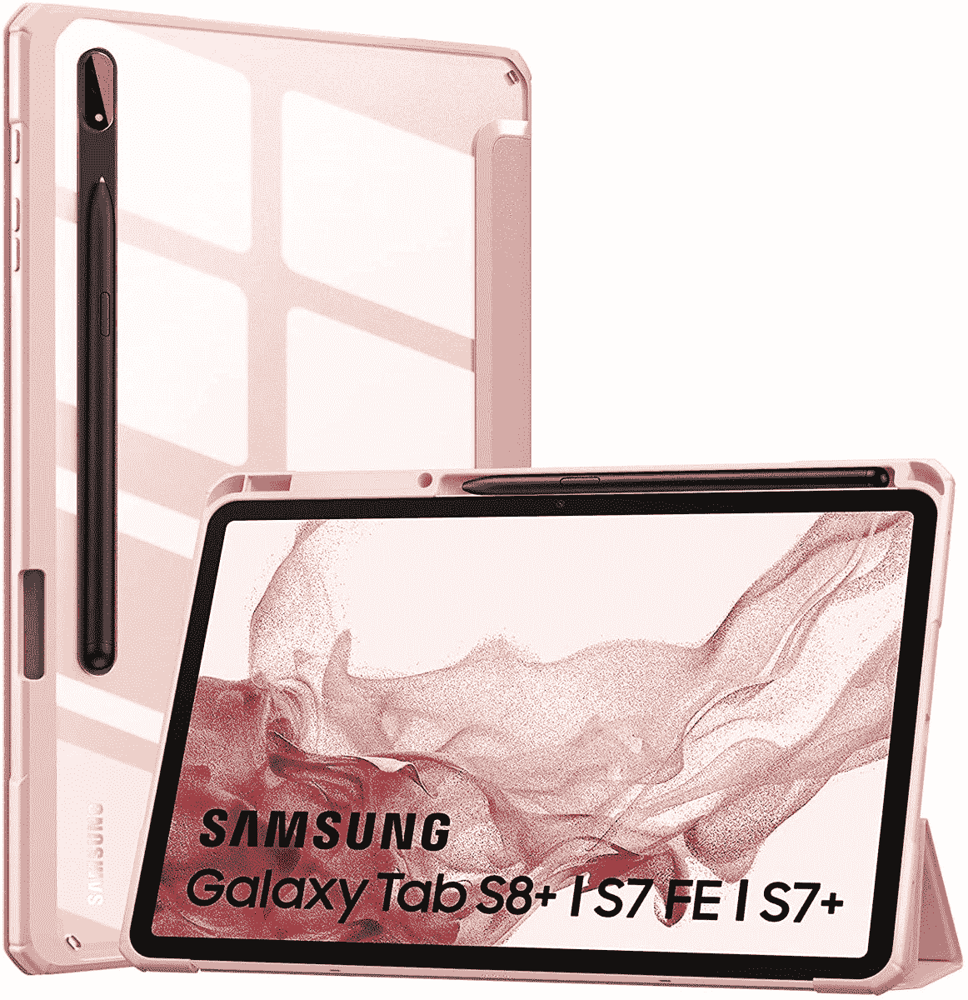

# 2023 年最佳三星 Galaxy Tab S8 Plus 轻薄外壳

> 原文：<https://www.xda-developers.com/best-samsung-galaxy-tab-s8-plus-thin-cases/>

# 2023 年最佳三星 Galaxy Tab S8 Plus 轻薄外壳

三星终于发布了 Galaxy Tab S8 Plus。以下是保护您全新平板电脑的最佳超薄保护套。

三星终于发布了最新的旗舰平板电脑系列——Galaxy Tab S8、Galaxy Tab S8 Plus 和 [Galaxy Tab S8 Ultra](https://www.xda-developers.com/samsung-galaxy-tab-s8-ultra-review/) 。如果你打算[买 Galaxy Tab S8 Plus](https://www.xda-developers.com/best-samsung-galaxy-tab-s8-deals/) ，也要考虑买一个[屏幕保护套](https://www.xda-developers.com/best-samsung-galaxy-tab-s8-plus-screen-protectors/)和一个[外壳](https://www.xda-developers.com/best-samsung-galaxy-tab-s8-plus-cases)。平板电脑是大屏幕的精致设备，三星最新系列的 Plus 型号也没有什么不同。屏幕上的一个划痕或裂缝都可能使它失去其最佳的外观和感觉。当你在一个设备上花费数百美元时，负责任的做法应该是多花一些钱来保护它。即使是一个很薄的箱子也足以将潜在的损害降至最低——你不必选择一个坚固的箱子。为了让您的选择过程更容易，我们为 Galaxy Tab S8 Plus 编制了一份最佳轻薄外壳列表。

 <picture></picture> 

Zeking Ultra Slim Case

##### 泽京超薄银河标签 S8 加案件

这种柔软的外壳带有凸起的边缘，提供额外的保护。它价格实惠，可保护您的平板电脑免受刮擦。

 <picture></picture> 

Ringke Fusion Clear Case

##### Ringke 融合银河标签 S8 Plus 盒

这种硬质外壳配有 S 笔筒，使用起来很方便。它有两种颜色可供选择。

 <picture></picture> 

iCoverCase Matte Case

##### iCoverCase 哑光 Galaxy Tab S8 Plus 表壳

这款基本款是透明的，带有哑光防滑涂层。它灵活、经济、简单。

 <picture></picture> 

Fintie Hybrid Slim Case

##### Fintie 混合超薄 Galaxy Tab S8 Plus 外壳

这款智能保护套提供 360°保护、S 笔筒和支架模式。它不仅能保护您的平板电脑，还能为其添加更多功能。

 <picture></picture> 

Cbus Wireless Flex-Gel

##### CBUS 无线 Flex-Gel Galaxy Tab S8 Plus 外壳

这个明喻的情况下，有两种颜色可供选择。得益于其凸起的边缘，它为显示屏和后置摄像头提供了一些保护。

 <picture></picture> 

MoKo Transparent Case

##### MoKi 清除银河标签 S8 加案例

这种情况下，有一个透明的背部和彩色框架。它提供了一个 S 笔筒，360°保护，和一个支架模式，用于风景观看。

* * *

如果我个人必须为我的三星 Galaxy Tab S8 Plus 选择一款轻薄的外壳，我会选择 [Zeking 超薄外壳](https://www.amazon.com/Samsung-Anti-Scratch-Silicone-Protective-Transparent/dp/B08DP1HXX3/?tag=xda-2dcljd5-20&ascsubtag=UUxdaUeUpU7462&asc_refurl=https%3A%2F%2Fwww.xda-developers.com%2Fbest-samsung-galaxy-tab-s8-plus-thin-cases%2F&asc_campaign=Short-Term)。它是透明的，简约的，并按预期完成工作。虽然轻薄的外壳在躲避更大事故造成的冲击方面不是最好的，但它们仍然是你的设备的一个不错的额外保护层。此外，你不必拘泥于一种情况。它们的伟大之处在于，你可以买几个型号，并根据你的需要、心情和服装在它们之间轻松切换。他们通常也负担得起，所以他们不会留给你一个哭泣的钱包。由于它们不同的风格和颜色，它们还会让几个月甚至几年看着同一个设备变得不那么乏味。

 <picture></picture> 

Samsung Galaxy Tab S8 Plus

##### 三星 Galaxy Tab S8 Plus

三星 Galaxy Tab S8 Plus 是该公司最新旗舰产品系列的中端平板电脑，配备 12.4 英寸屏幕。

*您打算为全新的三星 Galaxy Tab S8 Plus 购买以下哪一款轻薄外壳？请在下面的评论区告诉我们。*