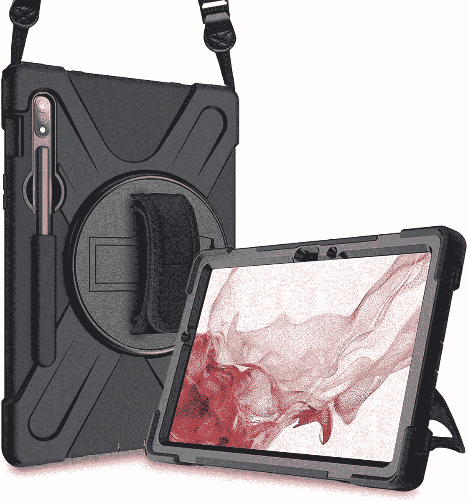
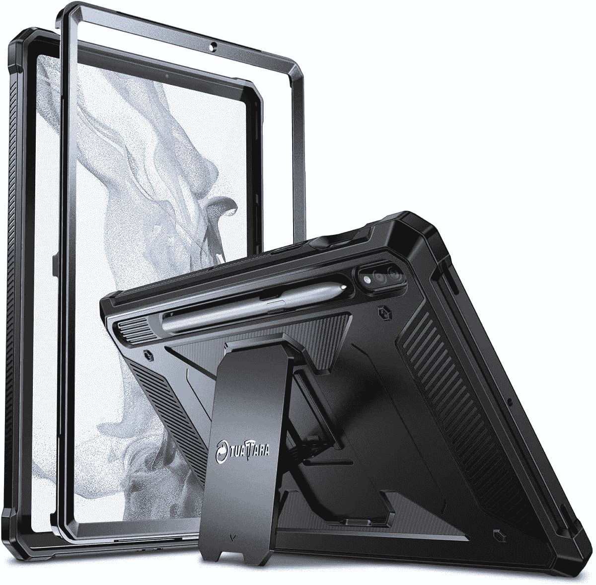

# 这些是 2022 年购买的最好的三星 Galaxy Tab S8 坚固外壳

> 原文：<https://www.xda-developers.com/best-samsung-galaxy-tab-s8-rugged-cases/>

# 2023 年最佳三星 Galaxy Tab S8 加固外壳

三星终于发布了最新的旗舰平板电脑阵容。这里列出了 Galaxy Tab S8 的最佳坚固外壳。

等待终于结束了——三星发布了其最新的旗舰平板电脑阵容——Galaxy Tab S8、Galaxy Tab S8 Plus 和 [Galaxy Tab S8 Ultra](https://www.xda-developers.com/samsung-galaxy-tab-s8-ultra-review/) 。它们是整洁的玻璃板，可以让您在旅途中高效工作。如果你打算[购买 Galaxy Tab S8](https://www.xda-developers.com/best-samsung-galaxy-tab-s8-deals/) ，考虑给它买个[屏幕保护套](https://www.xda-developers.com/best-samsung-galaxy-tab-s8-screen-protectors/)。平板电脑很容易被刮伤——无论你多么小心——因为它们的显示屏很大。另一个明智的想法是买一个[箱子](https://www.xda-developers.com/best-samsung-galaxy-tab-s8-cases)。一滴就可能打碎你的新设备，而且维修费用也不一定能负担得起。在这些事情上，安全比遗憾更好——损坏、刮伤或破裂的平板电脑将失去其最佳感觉，看起来也很破旧。为此，我们为您准备了一份 Galaxy Tab S8 的最佳加固外壳列表。

 <picture></picture> 

Spigen Rugged Armor Pro

##### 斯皮根坚固装甲专业银河标签 S8 盒

这款来自 Spigen 的优质外壳提供了支架和加固保护。还支持 S Pen，不用担心单独携带。

 <picture></picture> 

SUPCASE Unicorn Beetle Pro

##### SUPCASE UB Pro Galaxy Tab S8 外壳

这款坚固的外壳配有内置屏幕保护器，可为您的平板电脑提供 360°保护。

 <picture></picture> 

ProCase Rotating Cover

##### ProCase 加固型 Galaxy Tab S8 外壳

这个坚固的箱子配有一个旋转支架和一条肩带。它有两种颜色，并提供一个 S 笔筒，非常适合那些在旅途中使用平板电脑的人。

 <picture></picture> 

Fintie Tuatara Rugged Unibody

##### Fintie 大蜥蜴坚固的银河标签 S8 盒

这款保护套内置屏幕保护装置，可提供 360 度全方位保护。它还有一个 S 笔筒，所以你不用担心。

 <picture></picture> 

URBAN ARMOR GEAR Case

##### UAG 大都会银河标签 S8 案例

这款重型保护套配有支架，支持多角度观看。它还有一个 S 笔筒，方便使用。

 <picture></picture> 

Poetic Revolution Series Case

##### 诗意的革命银河标签 S8 加案例

这款坚固耐用的外壳有黑色、蓝色和粉色可选。它还有一个内置的屏幕保护器，非常适合恶劣的环境。

* * *

如果我必须为我的三星 Galaxy Tab S8 购买一个坚固的外壳，我肯定会选择 Spigen Rugged Armor Pro。它很坚固，抗冲击，不会在你的口袋里留下一个洞。这让我可以放心地把它带到户外，在旅途中完成任务。我通常不太喜欢坚固的箱子，因为它们往往很重——原因很明显。不过，谢天谢地，换壳真的很简单方便。这让我在室内时有一个简约、清晰的外壳，然后当我想出去时，我可以切换到坚固的外壳。一个坚固的外壳将提供更多的保护在*情况下*Galaxy Tab S8 在一次猛烈的冲浪中掉落。

 <picture></picture> 

Samsung Galaxy Tab S8

##### 三星 Galaxy Tab S8

三星 Galaxy Tab S8 是该公司最新旗舰产品系列的入门级平板电脑，采用 11 英寸屏幕。

*您会为您的三星 Galaxy Tab S8 购买哪一款坚固的保护套？请在下面的评论区告诉我们。*