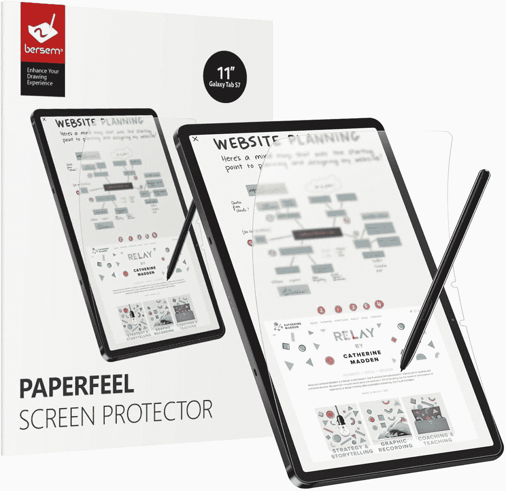
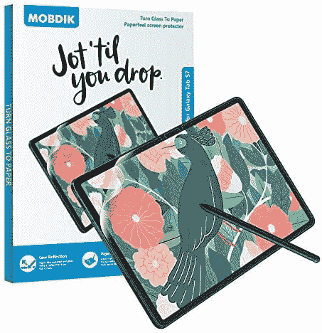
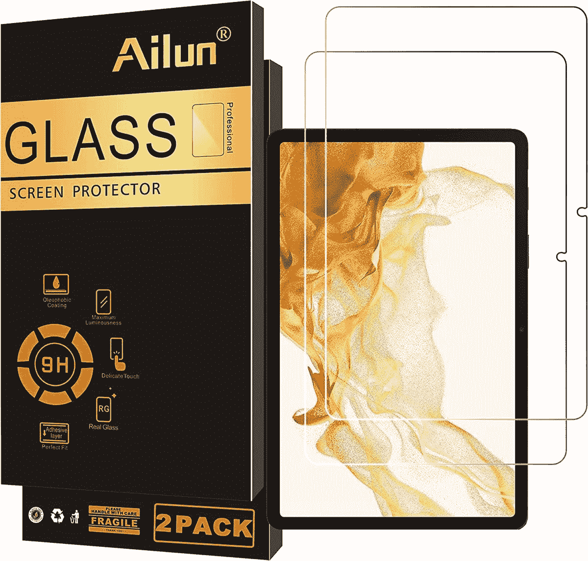
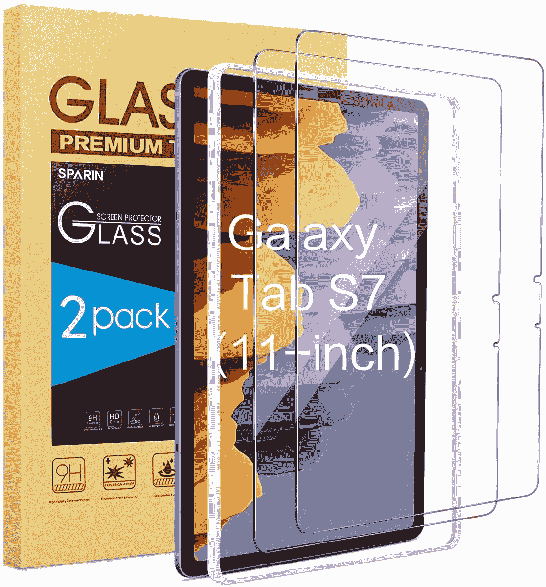
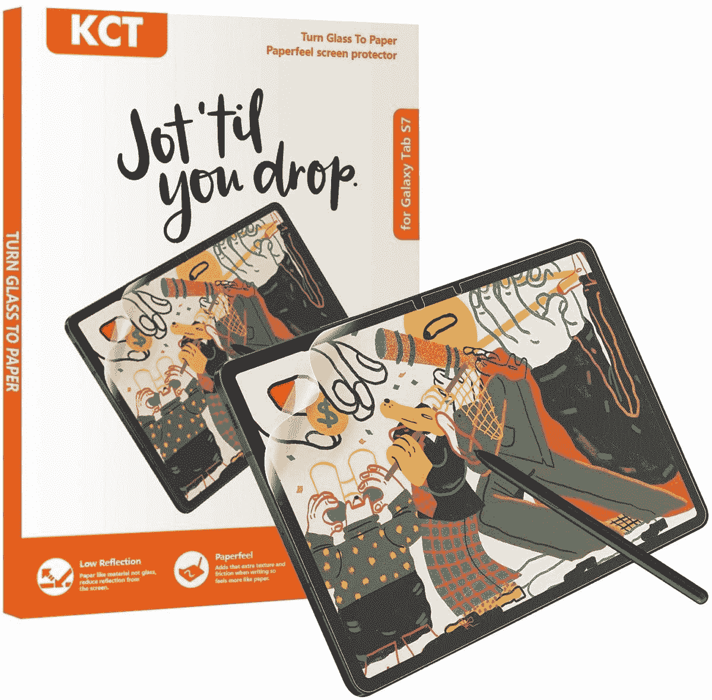
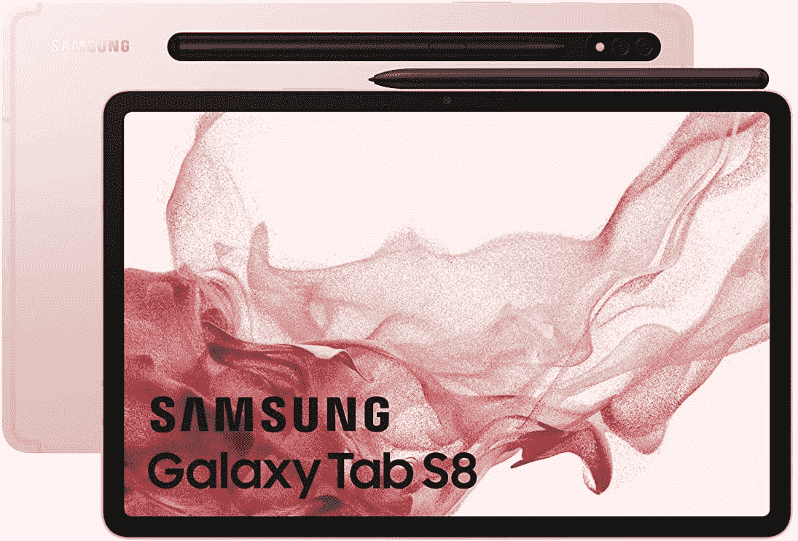

# 2023 年最佳三星 Galaxy Tab S8 屏幕保护器

> 原文：<https://www.xda-developers.com/best-samsung-galaxy-tab-s8-screen-protectors/>

# 2023 年最佳三星 Galaxy Tab S8 屏幕保护器

三星在 2022 年初发布了 Galaxy Tab S8。这里是目前最好的屏幕保护装置，可以让它更耐刮擦。

早在 2022 年初，三星就公布了一系列旗舰平板电脑——Galaxy Tab S8 T1、Galaxy Tab S8 Plus 和 T2 Galaxy Tab S8 Ultra T3。如果你打算[买一部三星 Galaxy Tab S8](https://www.xda-developers.com/best-samsung-galaxy-tab-s8-deals/) ，重要的是[为它准备一个外壳](https://www.xda-developers.com/best-samsung-galaxy-tab-s8-cases/)。如果发生事故，这有助于保护它免受潜在的损害。另一个建议是拿一个屏幕保护器。Galaxy Tab S8 的屏幕为 11 英寸，划痕会让它看起来不那么高端。屏幕保护器几乎看不见，但它们提供了保护和更高的抗划伤性。为了让这个过程更容易，我们为三星 Galaxy Tab S8 准备了一份最佳屏幕保护器列表。它们种类繁多，所以你可以选择最适合你的。

## 最佳 Galaxy Tab S8 屏幕保护器

*   <picture></picture>

    BERSEM Paperfeel 屏幕保护器

    ##### ber SEM paper feel Galaxy Tab S8 屏幕保护器

    这款来自 ber SEM 的套装附带了两个 paper feel 屏幕保护器。它非常适合那些经常使用 S Pen 的人。

*   <picture></picture>

    mob dik paper feel 屏幕保护套

    ##### mob dick paper feel Galaxy Tab S8 屏幕保护套

    此包装附送两个磨砂屏幕保护套，易于安装，防眩光，防指纹，极薄。

*   <picture></picture>

    艾伦钢化玻璃屏幕保护套

    ##### 艾伦 Galaxy Tab S8 屏幕保护套

    此包装包含两个钢化玻璃屏幕保护套，价格实惠。它非常适合预算有限的人。

*   <picture></picture>

    SPARIN 钢化玻璃屏幕保护器

    ##### SPARIN 钢化玻璃 Galaxy Tab S8 屏幕保护器

    SPARIN 的这款套装带有两个钢化玻璃屏幕保护器和一个对齐框架，安装起来非常方便。

*   <picture></picture>

    KCT Paperfeel 屏幕保护套

    ##### KCT paper feel Galaxy Tab S8 屏幕保护套

    这款来自 KCT 的包装附带了两种哑光 paper feel 屏幕保护套，分别是防眩光、防气泡和防刮擦的。

* * *

如果我必须为我的三星 Galaxy Tab S8 选择这些屏幕保护器中的一个，我会选择 [Spigen 钢化玻璃屏幕保护器](https://www.amazon.com/Spigen-Tempered-Protector-Designed-Case-Friendly/dp/B08H5TNQK4?tag=xda-7e1uccg-20&ascsubtag=UUxdaUeUpU170&asc_refurl=https%3A%2F%2Fwww.xda-developers.com%2Fbest-samsung-galaxy-tab-s8-screen-protectors%2F&asc_campaign=Affiliate)。它既坚硬又实惠，所以它提供了耐刮性，而无需支付大笔费用。一般来说，我的显示器很少被划伤，所以我不需要比这更硬或更厚的东西。对我来说，这更像是一种*万无一失的预防措施。*

考虑到三星 Galaxy Tab S8 的显示屏相对较大，它比较小的设备更容易被划伤。相信我，我见过很多碰伤的屏幕，它们只会偷走你平板电脑的旗舰外观和感觉。你不必选择钢化玻璃保护套，有几种更薄的保护套不会影响你的使用。此外，还有附加功能的保护器，如反间谍隐私保护器。

 <picture></picture> 

Samsung Galaxy Tab S8

##### 三星 Galaxy Tab S8

三星 Galaxy Tab S8 是该公司 2022 年旗舰平板电脑阵容的入门级设备，配备 S Pen 和 11 英寸显示屏。

*您会为您的三星 Galaxy Tab S8 购买哪种屏幕保护器，为什么？请在下面的评论区告诉我们。*