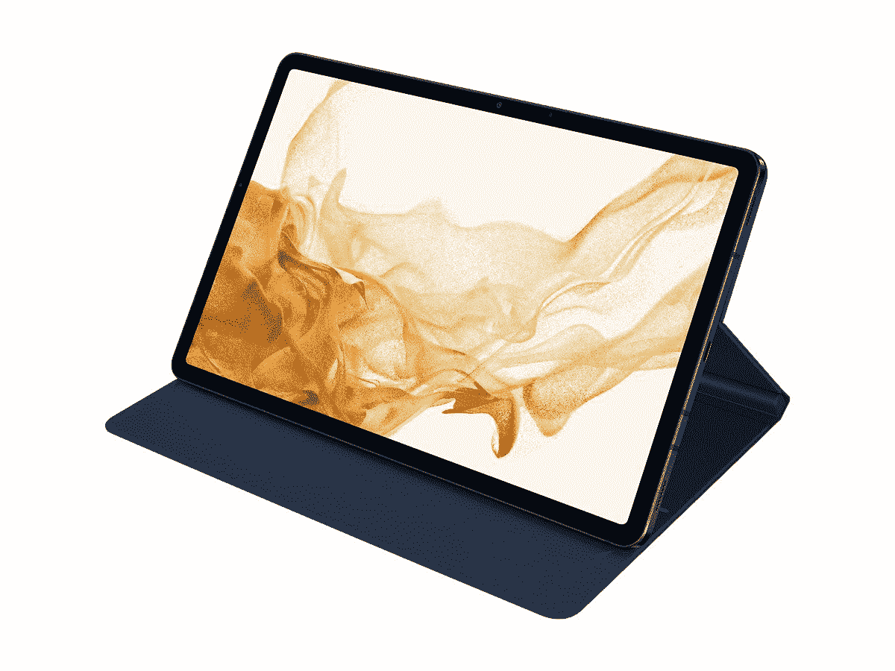
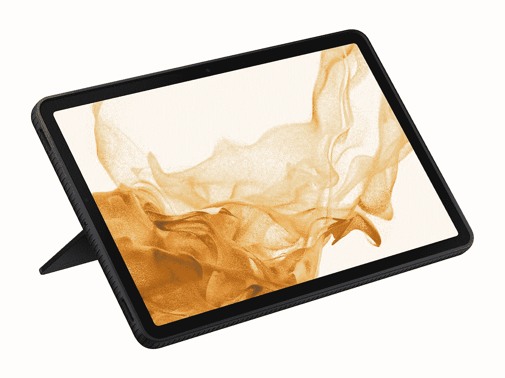
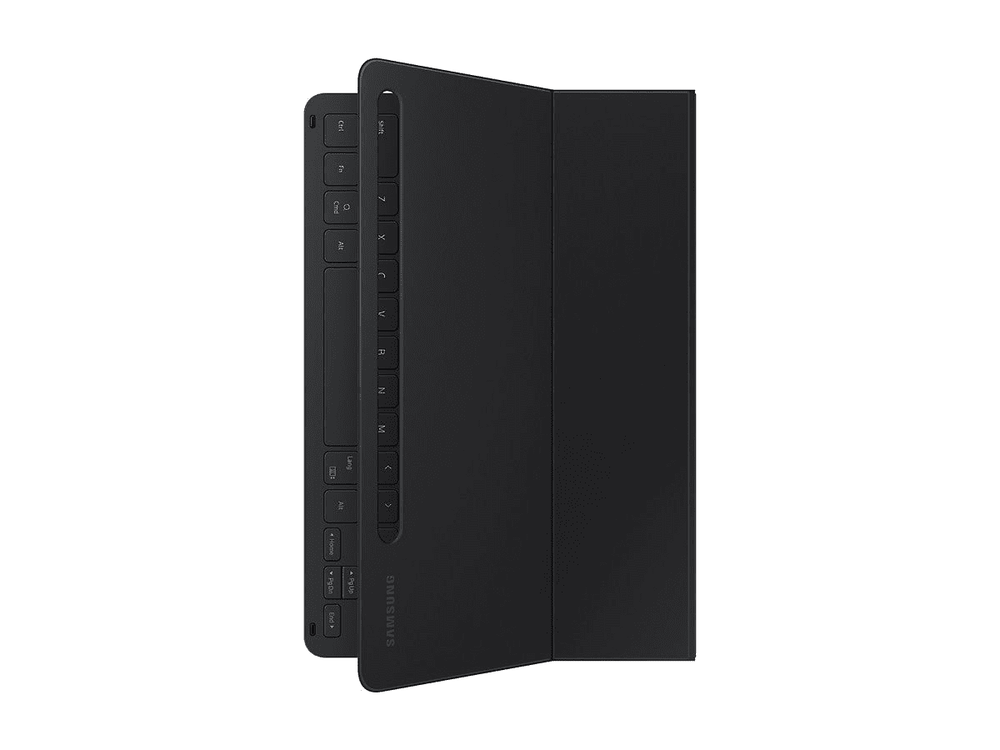
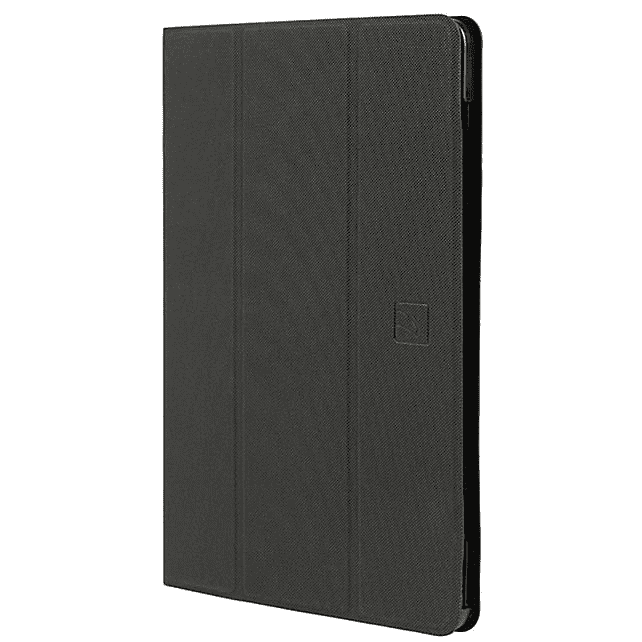
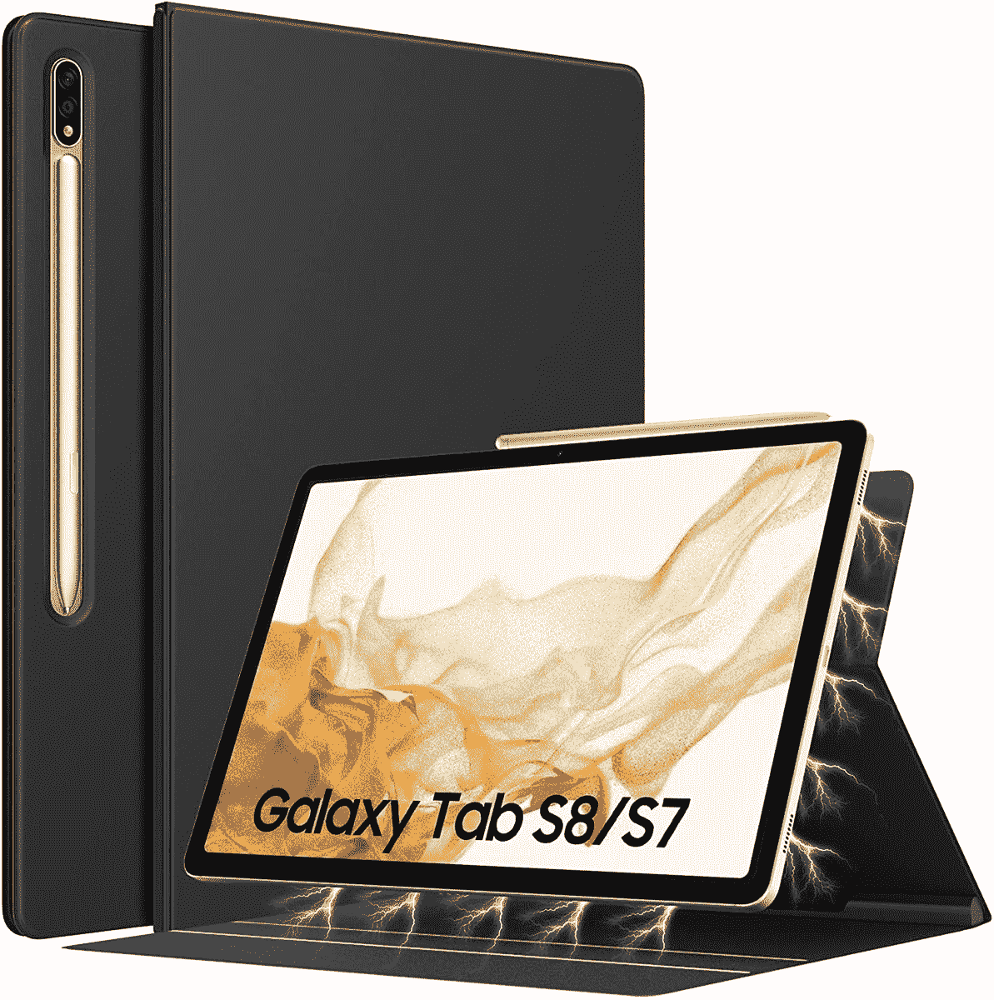
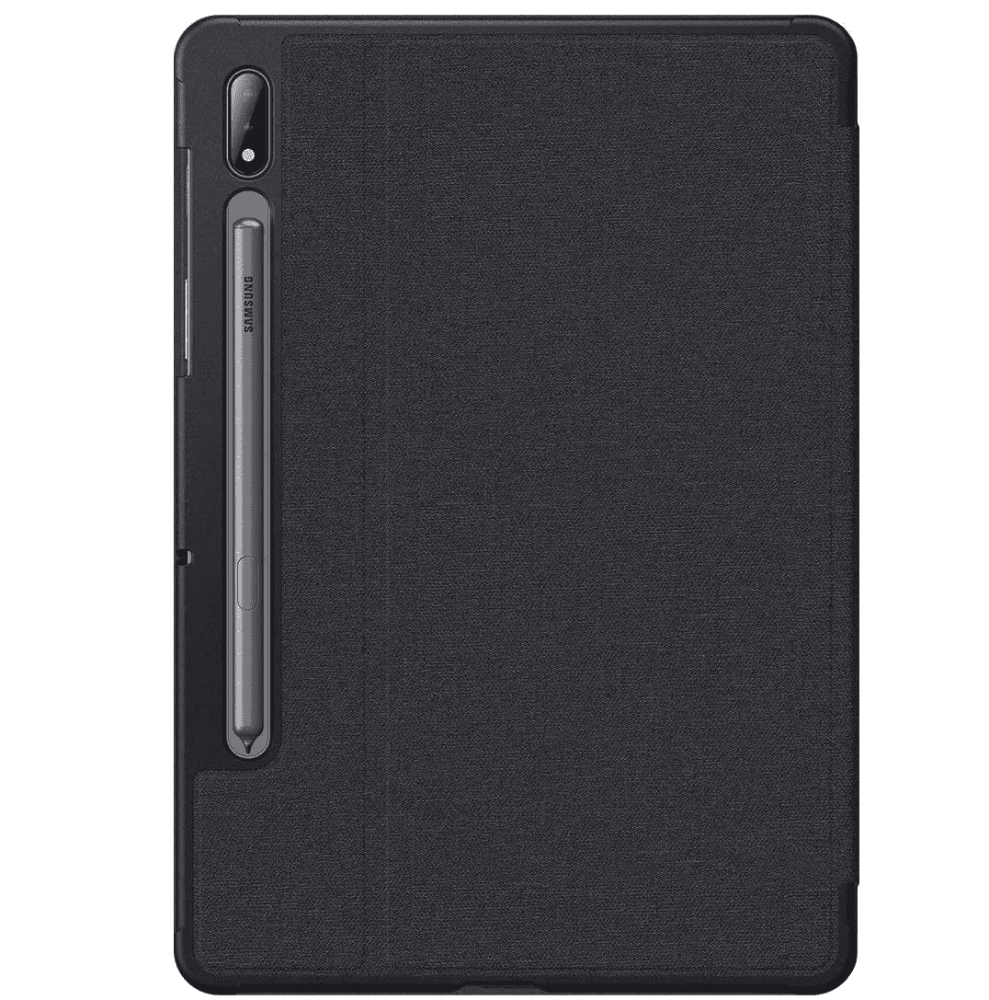

# 2023 年最佳三星 Galaxy Tab S8 轻薄外壳

> 原文：<https://www.xda-developers.com/best-samsung-galaxy-tab-s8-thin-cases/>

经过数月的传言和泄露，三星于 2 月 9 日正式发布了 Galaxy Tab S8 系列。总共有三种型号:最小的 Galaxy Tab S8，更大的 12.4 英寸 AMOLED 屏幕的 Galaxy Tab S8 Plus，以及最大的 14.6 英寸 AMOLED 屏幕的 [Galaxy Tab S8 Ultra](https://www.xda-developers.com/samsung-galaxy-tab-s8-ultra-review/) 。这一阵容显然超出了销售预期(或者说硅短缺正在抬头)，因为预购仅在发布后几天就暂停了。

如果你正在购买最小的 Tab S8，也许是从我们的 [best Galaxy Tab S8 deals](https://www.xda-developers.com/best-samsung-galaxy-tab-s8-deals/) 综合报道中购买，那也拿起一个盒子可能是个好主意。我们在此列表中列出了一些最佳的轻薄外壳选择，因此您可以选择一些既能保护您闪亮的新平板电脑又不会增加太多体积的东西。我们也有一份[最佳 Galaxy Tab S8 屏幕保护套](https://www.xda-developers.com/best-samsung-galaxy-tab-s8-screen-protectors/)的综述，如果你不一定需要一个*薄*的保护套，我们有一份[最佳 Galaxy Tab S8 保护套的清单](https://www.xda-developers.com/best-samsung-galaxy-tab-s8-cases/)。

 <picture></picture> 

Samsung Book Cover

##### 三星 Book Galaxy Tab S8 封面

这款 Tab S8 的官方书籍封面并没有提供太多保护，但它非常薄，可以让你支撑起你的平板电脑。

 <picture></picture> 

Infiland Case

##### 英飞凌多角度 Galaxy Tab S8case

这个封面包裹着你的标签 S8，给它一个优雅的外观。它可以方便地使用 S Pen 和支架(有两个角度)。

 <picture></picture> 

Samsung Protective Standing Cover

##### 三星保护性 Galaxy Tab S8 外壳

这款来自三星的官方保护套在 Tab S8 周围增加了一个保险杠，以防止碰撞和跌落，并且还有一个内置支架。

 <picture></picture> 

Samsung Book Cover Keyboard Slim

##### 三星 Book 键盘 Galaxy Tab S8 封面

这是三星官方为 Tab S8 准备的键盘盖。键盘增加了一点点体积，但盖子的其余部分却薄得令人难以置信。

 <picture></picture> 

Ringke Fusion Case

##### Ringke 融合银河标签 S8 盒

对于 Galaxy Tab S8 来说，这是一个薄而清晰的外壳。尽管它让 S Pen 插槽保持开放，但它也有一个可以关闭的 S Pen 侧装支架，确保 S Pen 不会轻易掉出。

 <picture></picture> 

Tucano Folio Case

##### 啄木鸟对开银河标签 S8 盒

这是另一个包裹在 Tab S8 周围的书皮，采用简单的黑色设计和多位置支架。

 <picture></picture> 

TiMOVO Case

##### TiMOVO 磁性银河标签 S8 盒

这是另一个黑色的书封面，有两个支架角度和进入 S Pen 插槽的选项。

 <picture></picture> 

Bokeer Folio Case

##### Bokeer 对开银河标签 S8 盒

这款对开包比列表中的大多数其他包多了一点保护，这要感谢边缘周围的塑料盖，同时仍然保持相对较薄。

 <picture></picture> 

Zeking Design

##### 泽金设计银河标签 S8 盒

这是一款简单的 TPU 包，触感柔软，两侧和摄像头周围有凸起的边框。

三星只销售入门级 Galaxy Tab S8 的三款官方保护套，至少目前是这样:书皮[书套](https://shop-links.co/1766265905011394766?u1=88e18cbf-4258-4662-b0f2-cc18743e2b89)、[保护套](https://shop-links.co/1766265906484739488?u1=eb45e618-a1eb-4b9c-81e6-e8a1fc980c2d)和[书皮键盘超薄](https://shop-links.co/1766265907021687176?u1=9a573aba-c5ca-450e-991f-232c18ad9675)。这三种设计应该涵盖了几乎所有可能的使用案例，从提供更好的电影观看体验到将 Tab S8 变成原型笔记本电脑，但如果有更多的颜色选择，那就更好了。只有书皮有多种颜色(海军蓝、黑色、粉色和白色)。

Galaxy Tab S8 还没有太多新的外壳，但谢天谢地，Galaxy Tab S8 与去年的基本 Galaxy Tab S7 有着相同的设计。这意味着为早期的 Tab S7 设计的任何外壳或盖子，比如上面链接的一些选项，都应该可以很好地与新平板电脑配合使用。这也意味着，如果您从 Tab S7 升级到 Tab S8，您可能根本不需要购买新的外壳或盖子。