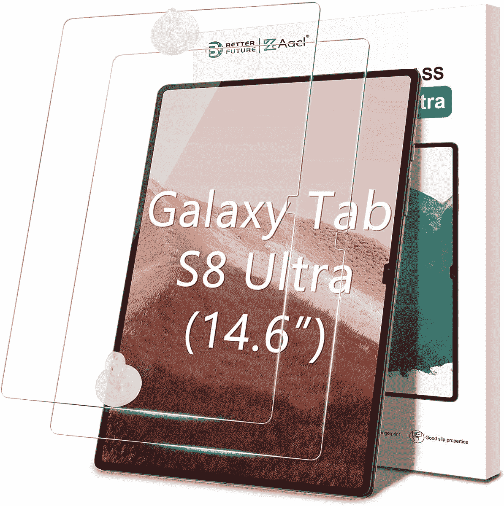
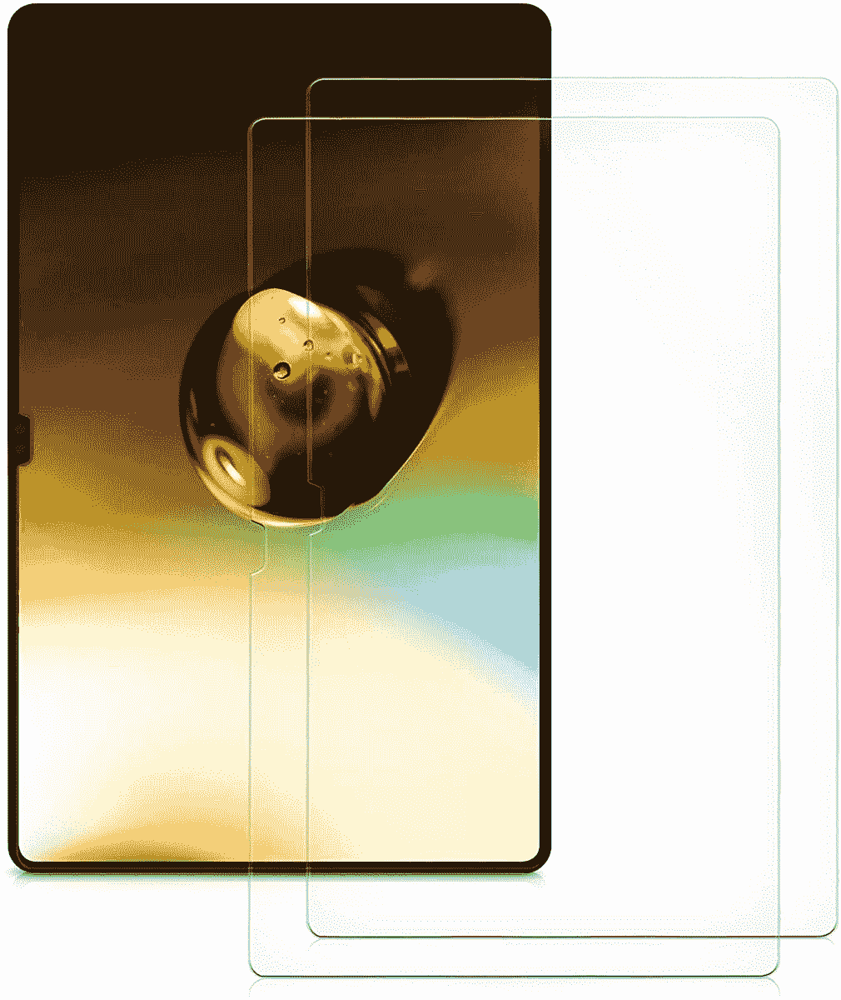
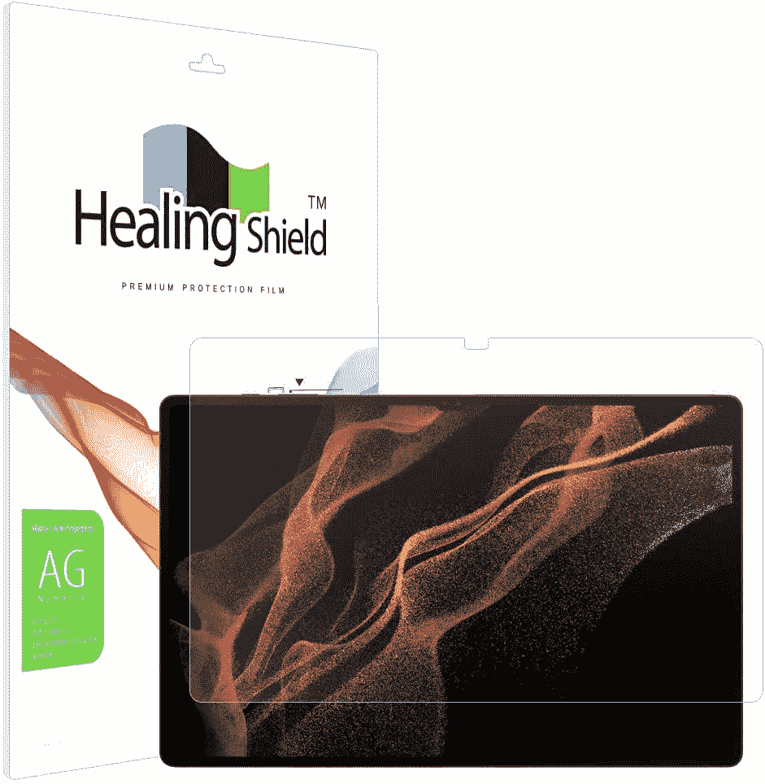

# 2023 年最佳 Galaxy Tab S8 超屏保护器

> 原文：<https://www.xda-developers.com/best-samsung-galaxy-tab-s8-ultra-screen-protectors/>

# 2023 年最佳 Galaxy Tab S8 超屏保护器

Galaxy Tab S8 Ultra 是三星 2022 年产品线中最高端的平板电脑。这里是最好的屏幕保护装置。

三星终于发布了最新的旗舰平板电脑阵容——Galaxy Tab S8、Galaxy Tab S8 Plus 和 [Galaxy Tab S8 Ultra](https://www.xda-developers.com/samsung-galaxy-tab-s8-plus-ultra-hands-on/) 。第三款是该公司最高端的型号，具有 14.6 英寸的惊人显示屏。如果你打算[买下它](https://www.xda-developers.com/best-samsung-galaxy-tab-s8-deals/)，一个非常明智的想法是[为它买一箱](https://www.xda-developers.com/best-samsung-galaxy-tab-s8-ultra-cases/)。考虑到它的价格是 1099 美元起，安全总比后悔好。修理费可能会很贵，但通常情况下是可以承受的。另一个聪明的主意是买一个屏幕保护器。这款旗舰平板电脑的屏幕很大，即使你很好地保护它，它也可能会被划伤。为了让您更容易选择，我们为三星 Galaxy Tab S8 Ultra 准备了一份最佳屏幕保护器列表。该汇编包括各种各样的质量和价格标签，所以你可能会找到一个合适的选择。

 <picture></picture> 

Spigen Tempered Glass Screen Protector

##### Spigen 钢化玻璃 Galaxy Tab S8 超屏保护器

Spigen 以其高质量的产品而闻名并受到信赖。该公司的这款钢化玻璃屏幕保护器便于携带，具有疏油涂层，可以抵御强光和指纹。

 <picture></picture> 

AACL Tempered Glass Screen Protector

##### AACL 钢化玻璃银河 Tab s8 超屏保护器

这个来自 AACL 的包装附带两个钢化玻璃屏幕保护器和两个清洁和安装套件。它非常适合那些通常第一次尝试就没做对的人。超薄，厚度 0.33 毫米。

 <picture></picture> 

kwmobile Anti-Glare Plastic Screen Protector

##### kwmobile 屏幕保护银河标签 S8 超屏幕保护

kwmobile 的这个产品包带有两个塑料屏幕保护器。它们防眩光，易于安装。最值得注意的是，它们的价格非常实惠，你可能不会经常遇到。

 <picture></picture> 

Olixar Tempered Glass Screen Protector

##### Olixar 玻璃银河标签 S8 超屏幕保护

Olixar 的这款钢化玻璃屏幕保护器附带两年保修。该公司相信其产品不会让你失望，并将提供你所期望的保护。它是隐形的，不会破坏你的平板电脑的任何功能。

 <picture></picture> 

Orzero Tempered Glass Screen Protector

##### 奥热罗钢化玻璃银河 Tab S8 超屏保护器

Orzero 的这个包装包括两个钢化玻璃屏幕保护器。该公司有终身更换政策，这暗示了它对产品质量的信心。由于其 9H 硬度，您的平板电脑将免受尖锐物体造成的划痕。

 <picture></picture> 

Muellery Healingshield Screen Protector

##### muellery healing shield Galaxy Tab S8 Ultra 屏幕保护器

这款 Muellery Healingshield 屏幕保护器采用哑光膜设计，既防眩光又防指纹。它易于安装，具有低反射性，并且在与尖锐物品接触时具有显著的抗划伤性。

* * *

如果我个人必须为我的三星 Galaxy Tab S8 Ultra 选择这些屏幕保护器中的一个，我会选择 [Spigen 钢化玻璃屏幕保护器](https://www.amazon.com/Spigen-Tempered-Protector-Designed-Case-Friendly/dp/B09P5NQH7Q?tag=xda-7lkuu6b-20&ascsubtag=UUxdaUeUpU168&asc_refurl=https%3A%2F%2Fwww.xda-developers.com%2Fbest-samsung-galaxy-tab-s8-ultra-screen-protectors%2F&asc_campaign=Short-Term)。它不会在口袋里留下一个洞，保护平板电脑的大显示屏免受轻微刮擦，看起来也不会太明显。我更喜欢我的设备的原始外观和感觉，但增加保护层是必不可少的。与基本物体的摩擦可能会留下非常明显的瘀伤，这只会窃取这种高端设备的优质感觉。相对而言，外壳和屏幕保护器的成本都很低，但它们提供的保护是无价的。

如果发生事故，箱子不仅可以躲避裂缝。它们还为一款可能会变得平淡无奇的设备增添了个性。你可以买几个箱子来搭配你不同的服装、场合和风格。可能性是无限的！

 <picture></picture> 

Samsung Galaxy Tab S8 Ultra

三星 Galaxy Tab S8 Ultra 是该公司今年旗舰平板电脑阵容中的最高端设备。它配有一支 S 笔，一个 14.6 英寸的 Super AMOLED 显示屏，和一个凹槽。

*您会为您的三星 Galaxy Tab S8 Ultra 购买哪些屏幕保护器，为什么？请在下面的评论区告诉我们。*