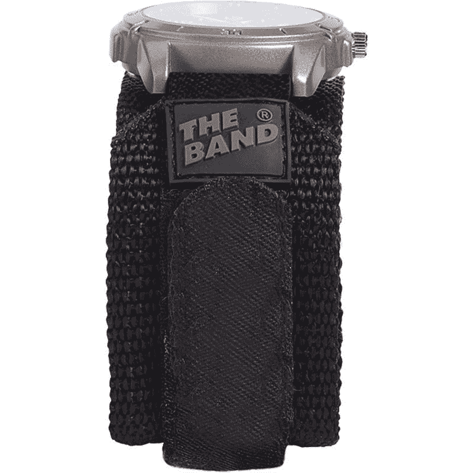
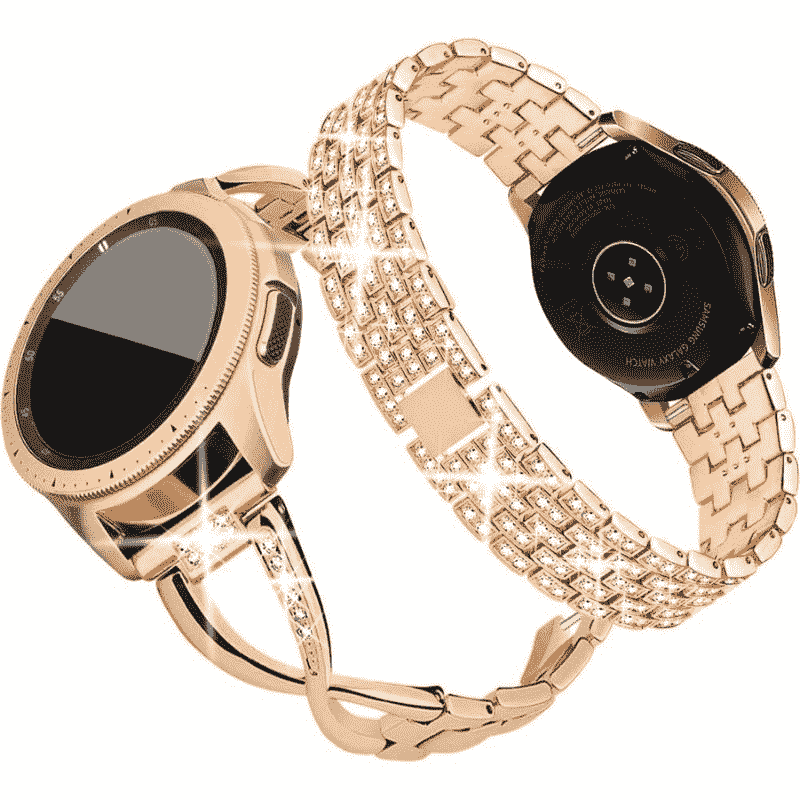
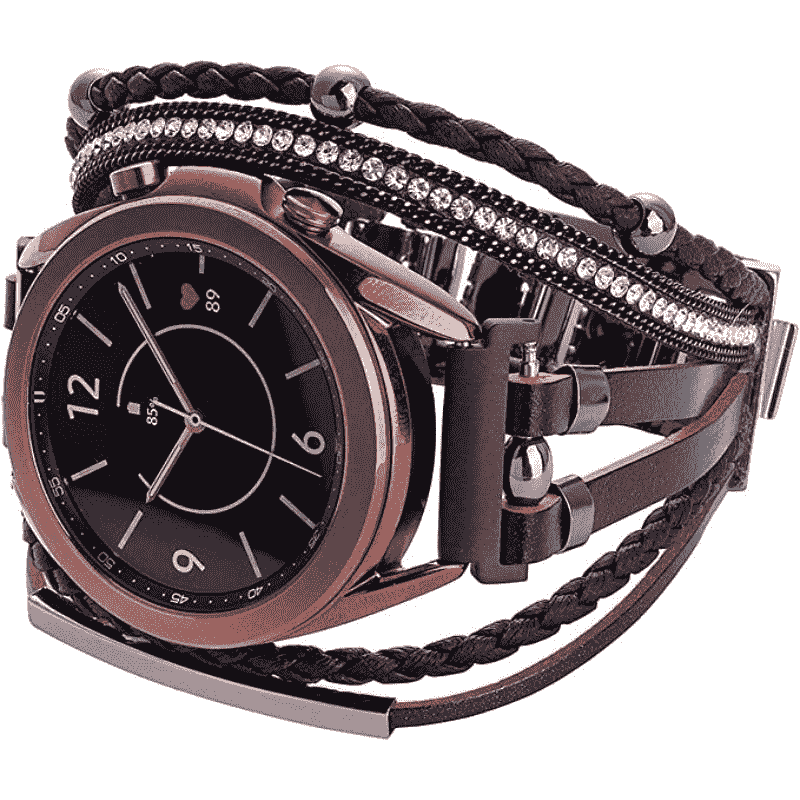
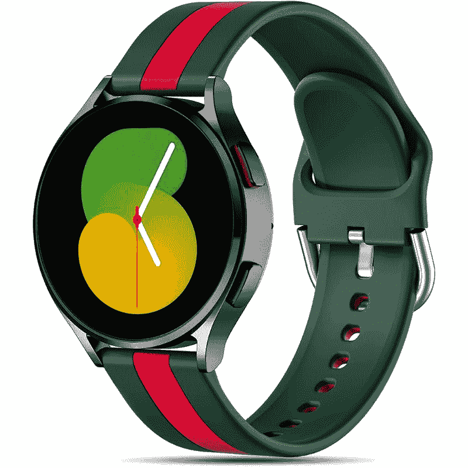
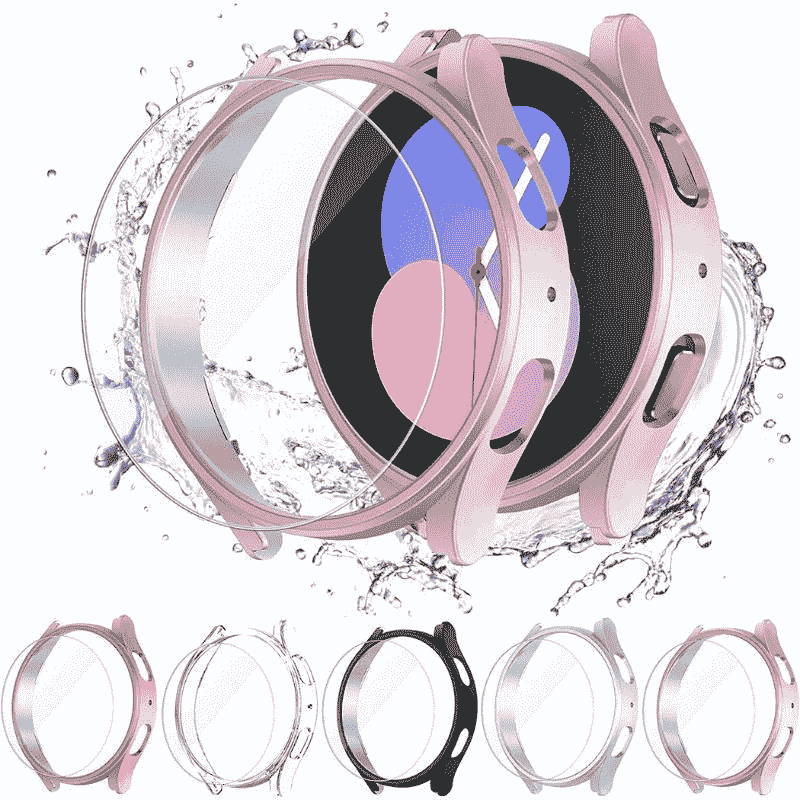

# 三星 Galaxy Watch 5 的最佳表带、表壳和屏幕保护器

> 原文：<https://www.xda-developers.com/best-samsung-galaxy-watch-5-bands/>

三星新的 [Galaxy Watch 5](https://www.xda-developers.com/samsung-galaxy-watch-5-review/) 系列在去年的机型上带来了很多改进，以改善整体用户体验。Galaxy Watch 5 检查了许多正确的选项，成为目前市场上可以说是最好的 Wear OS 智能手表。但是正如我们在 [Galaxy Watch 5 拆箱](https://www.xda-developers.com/samsung-galaxy-watch-5-unboxing/)中看到的，这款新的智能手表在零售包装盒内并没有很多好东西。事实上，三星甚至没有为它提供额外的表带，这就是为什么我们决定为你的 Galaxy Watch 5 收集一些最好的表带和一些其他配件。因此，这里是 2022 年你可以为三星 Galaxy Watch 5 购买的最好的表带，外壳和屏幕保护装置。

三星 Galaxy Watch 5 的两种型号都使用了 20 毫米的表带。所以本文提到的表带列表对 40mm 和 44mm 的 Galaxy Watch 5 机型都适用。值得注意的是，你可能为 Galaxy Watch 4 系列手表挑选的所有你最喜欢的表带也将适用于新款手表。

## 最佳三星 Galaxy 手表 5 款

我们根据材料和样式将表带分为不同类别，以便您更容易找到合适的表带。一定要四处看看，探索各种选择，找到最适合你的风格的乐队。

### 简单的硅胶和橡皮筋

让我们快速了解一下 Galaxy Watch 5 的一些简单的硅胶和橡胶表带。这些带非常适合日常使用和锻炼。

*   ##### 三星 Galaxy Watch 5 运动表带

    三星官方 Galaxy Watch 运动表带非常适合那些想要为自己的手表购买一个外观简单的表带作为备用选项的人。这是这个系列中提到的最贵的乐队之一，但考虑到它的整体质量，我们认为它非常值得这个要价。

*   <picture></picture>

    Galaxy Watch 极限运动表带

    ##### 三星 Galaxy Watch 极限运动表带

    Galaxy Watch 极限运动表带，如你所见，采用了双齿设计，佩戴更加安全。这对那些生活方式非常活跃的人来说是完美的。它有小号/中号和中号/大号两种尺寸，你还可以从一堆颜色中选择。

*   <picture></picture>

    Yeejok 硅胶表带

    ##### yee jok 硅胶表带

    Galaxy Watch 5 和 Galaxy Watch 5 Pro 的 yee jok 硅胶表带是一个很好的选择，如果你不想花很多钱买一个替换表带的话。这些有很多不同的颜色，评论表明它们以相对实惠的价格提供了舒适的穿着。

*   <picture></picture>

    Wristology 20 毫米橡皮筋

    ##### Wristology 20 毫米橡皮筋

    Wristology 橡皮筋非常适合日常使用。这种特殊的表带有多种不同的颜色。它看起来像传统的表带，非常容易使用。

*   <picture></picture>

    双色硅胶表带

    ##### Wivzuyt 硅胶表带

    这些表带为 Galaxy Watch 5，正如你所看到的，有一种时尚外观的双色饰面。每次购买你都会得到两条表带，其中一条看起来像你可以在 Apple Watch 上得到的 Nike band。这些带子有许多不同的颜色可供选择，所以一定要四处看看。

*   <picture></picture>

    20 毫米宽表带

    ##### Chums The Band 20 毫米表带

    如果你正在寻找为你的 Galaxy Watch 5 或 Galaxy Watch 5 Pro 购买一条表带，并带有一些额外的手腕支撑，那么这款就是为你准备的。如你所见，这款表带比平时更宽，也为你手腕上的腕表增添了独特的外观。

### 皮革带

皮革表带非常适合那些喜欢用手表打造精致外观的人。它们可能不是日常使用或锻炼的理想选择，但它们为专业用途提供了优雅的外观。

*   ##### Galaxy Watch 5 的皮质表带

    这款经典的棕色表带与经典的精致皮质表带完美契合。它的边缘也有白色的缝线，使它看起来比现在更好。

*   <picture></picture>

    黑色皮质表带

    ##### Geak 黑色皮质表带

    如果你想改变一下，换一种不同的外观，那么可以考虑选择这款黑色皮质表带和棕色表带。这款优雅的表带看起来干净而隐秘，搭配黑色缝线。

*   <picture></picture>

    GEAK 纤巧的表带

    ##### GEAK 纤巧的皮质表带

    如果你厌倦了戴笨重的皮质表带，想要挑选一些纤细的东西，那么 GEAK 纤巧的皮质表带值得考虑。正如你所看到的，这款表带比传统的要纤细得多，而且它还配有一个不锈钢带扣，看起来很优雅。

如果你喜欢将智能手表与金属表带搭配，我们为你提供了一些可靠的选择:

*   ##### 金属米兰环形乐队

    金属米兰环形乐队非常受欢迎，所以我们认为这些绝对值得为你的 Galaxy watch 5 挑选。除了给人一种优雅和正式的感觉，米兰环形乐队也很容易合作。

*   <picture></picture>

    斯皮根金属表带

    ##### 斯皮根金属表带

    如果你想要一条高级外观的表带，尤其是黑色的，那么斯皮根金属表带是一个不错的选择。如果黑色金属表带不适合你的风格，你也可以选择金色和银色。

*   <picture></picture>

    金属镶钻表带

    ##### SHGM Bling Cystal 不锈钢表链

    这款玫瑰金金属表带适用于 Galaxy Watch 5 和 Galaxy Watch 5 Pro，正如你所看到的，带有镶钻。你也可以选择黑色、银色和亮金色的金属表带。

### 时尚乐队

如果你正在为 Galaxy Watch 5 寻找一些时尚的表带，那么可以考虑看看我们在下面重点介绍的一些最酷和最好看的表带:

*   ##### Dniieo 手镯

    正如你所看到的，Dniieo 手镯是一款闪亮的手表，由优质金属制成，并带有闪亮的水钻，具有别致的外观和感觉。这款表带有几种不同的颜色，非常适合 5.5 到 8.1 英寸的手腕尺寸。

*   <picture></picture>

    科纳菲手镯

    ##### 科纳菲手镯

    这款皮质波西米亚风格手镯的珠宝表带非常适合那些寻找与众不同的表带的人。这款手工表带配有柔软舒适的编织绳，闪亮的水钻装饰等等。

*   <picture></picture>

    大秦硅胶表带

    ##### 大秦硅胶设计师表带

    这款硅胶设计师表带非常适合那些希望购买比手表捆绑的硅胶表带更好看的人与列表中提到的其他时尚腕带不同，你也可以使用这种硅胶进行锻炼。

* * *

## 最佳三星 Galaxy 手表 5 款

表壳非常适合增加一些保护，尤其是如果你想避免磨损金属机身，同时也改变手表的外观和感觉。可供选择的案例并不缺乏，但我们在下面为您的 Galaxy Watch 5 收集了一些最佳案例:

### 最佳 Galaxy 手表 5 款

**注:**下面提到的表壳有 40mm 和 44mm 两种尺寸，一定要挑选适合你手表尺寸的。

## 最佳三星 Galaxy Watch 5 屏幕保护器

尽管 Galaxy Watch 5 系列的显示屏上配有蓝宝石晶体(这应该会使它更难被意外划伤)，但它仍然可能被划伤。如果你想为你的智能手表添加完整的保护，购买屏幕保护是必须的，因为你可以在几个月后更换屏幕保护。很多制造商都为 Galaxy Watch 5 系列制作了屏幕保护器，但我们认为这些是值得考虑的:

### 三星 Galaxy Watch 5 屏幕保护器

**注意:**下面提到的屏幕保护装置适用于 40 毫米和 44 毫米尺寸的 Galaxy Watch 5，因此请确保通过点击相应的链接来选择正确的保护装置。

*   ##### Spigen Glas。TR EZ FIT

    sp igen 钢化玻璃屏幕保护器再次成为我们对 Galaxy Watch 5 的顶级推荐。这款手表有 40 毫米和 44 毫米两种型号，它们都配有安装套件，便于安装。

*   <picture></picture>

    Kimi lar 钢化玻璃屏幕保护器

    ##### Kimi lar 钢化玻璃 Galaxy Watch 5 屏幕保护器

    Kimi lar 屏幕保护器为您的 Galaxy Watch 5 提供良好的保护，价格还算公道。这款屏幕保护器最大的优点之一是，你可以用干湿巾和吸盘来安装钢化玻璃屏幕保护器。

*   <picture></picture>

    表壳和屏幕保护器组合

    ##### Kimilar Galaxy Watch 5 表壳

    这种实惠的表壳和屏幕保护器组合是以相对低廉的价格保护你的 Galaxy Watch 5 智能手表的绝佳方式。每个包都有五种不同颜色的盒子，所以你可以根据你当天的着装来更换。

好了，这让我们得出了这个特别系列的结论。从优质的表带到高端的保护套和屏幕保护套，我们已经添加了几乎所有您需要的东西来设计和保护您的 Galaxy Watch 5 智能手表。我们将继续关注市场，看看我们能否为这一系列增加更多选择。与此同时，请在下面的评论中留言，让我们知道你打算为三星 Galaxy Watch 5 购买哪种表带、外壳或屏幕保护装置。

 <picture></picture> 

Samsung Galaxy Watch 5

新的 Galaxy Watch 5 比去年的 Galaxy Watch 4 有了适度的改进，以改善整体用户体验。

三星还在 Galaxy Watch 5 系列智能手表旁边宣布了其新的可折叠设备。你可以阅读我们的 [Galaxy Z Fold 4 评测](https://www.xda-developers.com/samsung-galaxy-z-fold-4-review/)和 [Galaxy Z Flip 4 评测](https://www.xda-developers.com/samsung-galaxy-z-flip-4-review/)来详细了解这些智能手机。