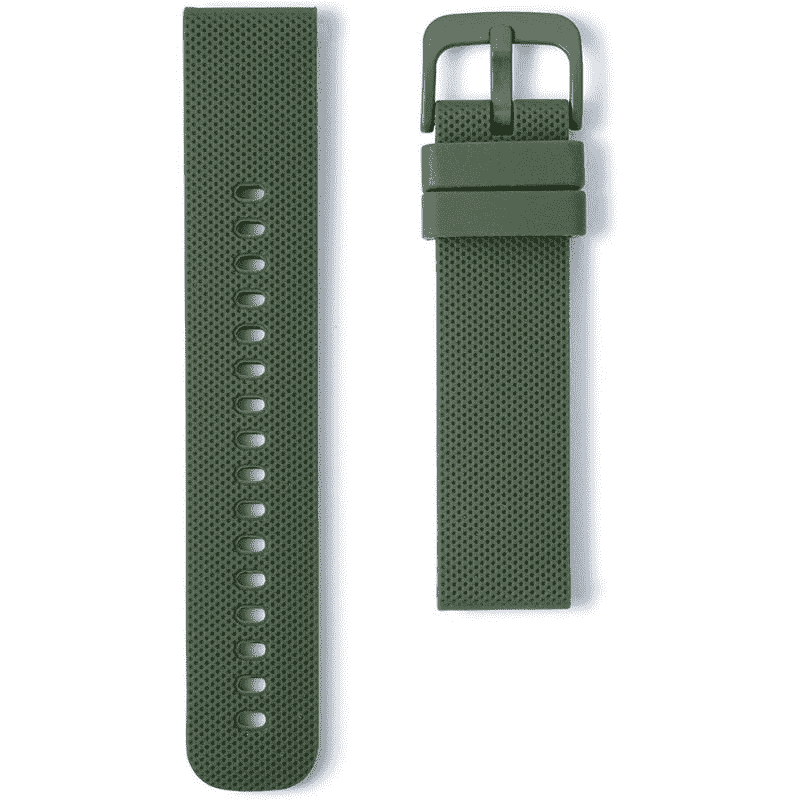
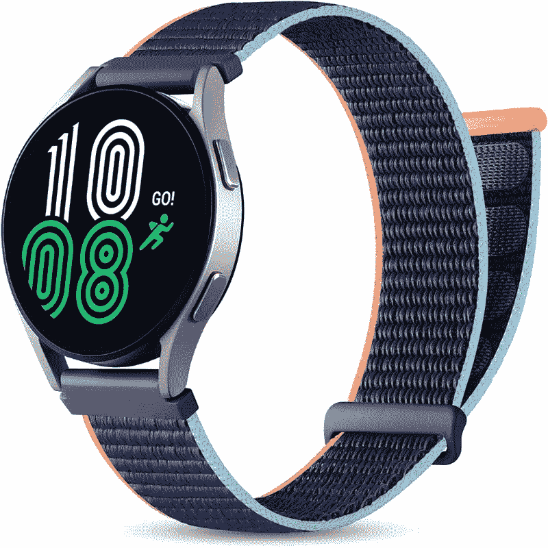
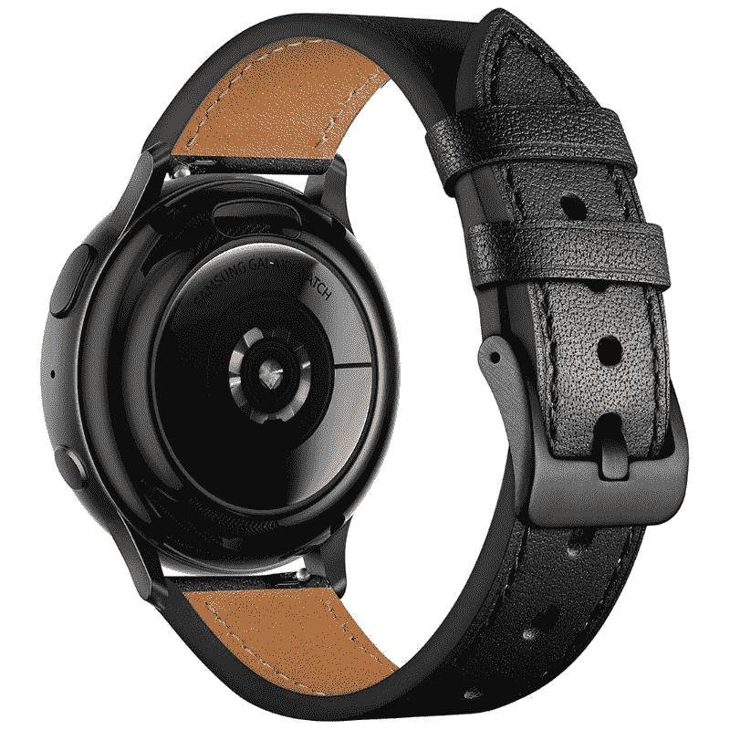
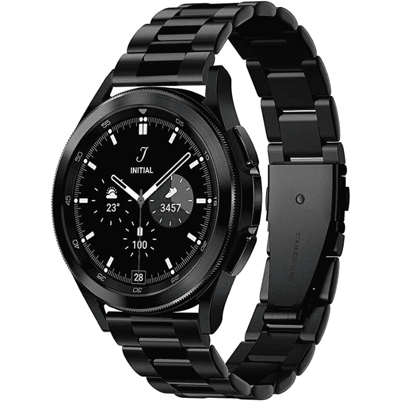
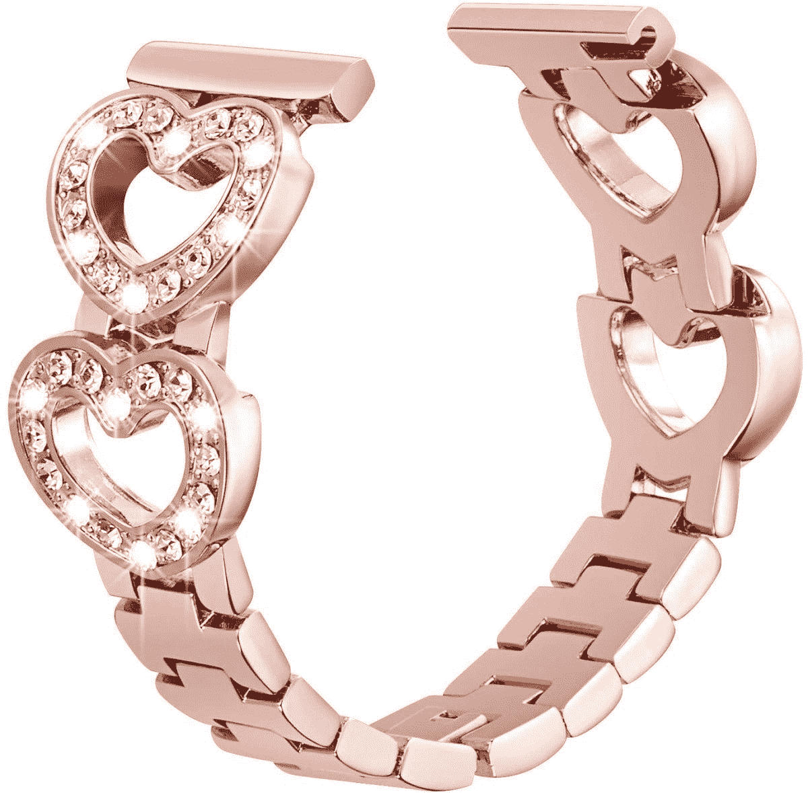
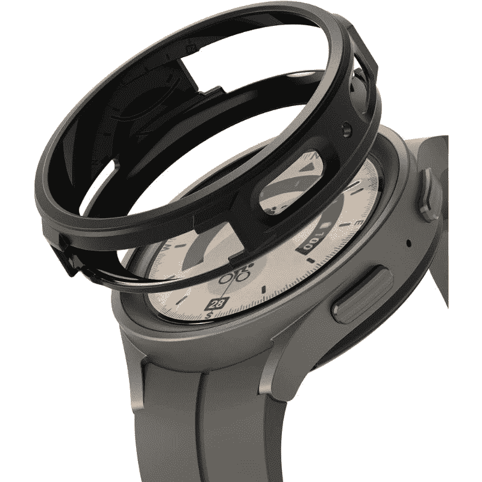
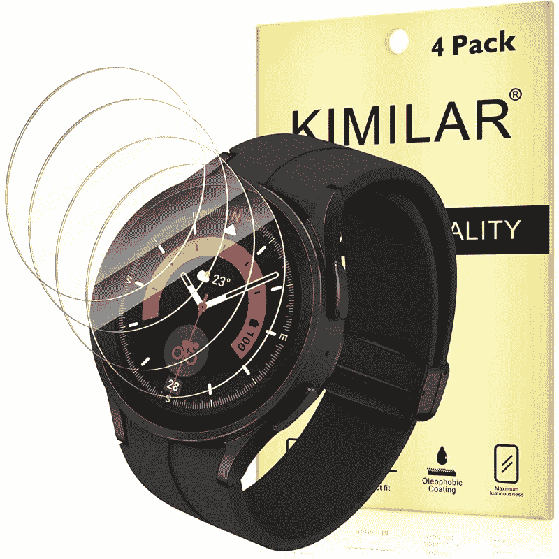
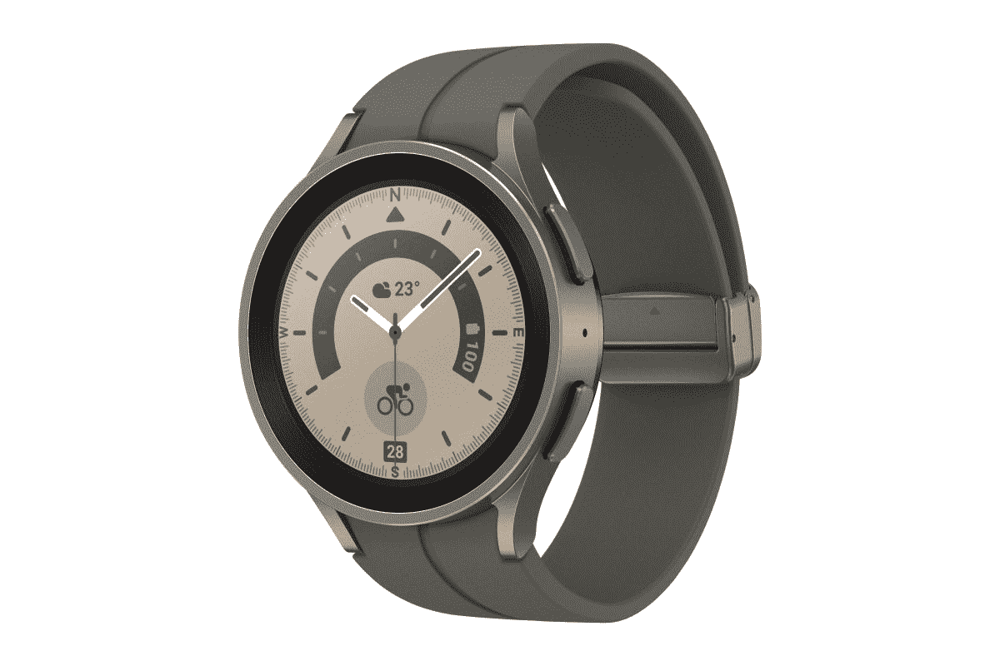

# 2023 年最佳 Galaxy Watch 5 Pro 表带、表壳和屏幕保护器

> 原文：<https://www.xda-developers.com/best-samsung-galaxy-watch-5-pro-bands/>

三星的 Galaxy Watch 5 系列是你可以通过对 Galaxy Watch 4 系列中已经非常优秀的智能手表进行微妙的改变和改进来购买的[最佳智能手表](https://www.xda-developers.com/best-smartwatches/)中的一些。由于采用了包括蓝宝石屏幕在内的一些改良材料，新款手表的外观和手感略有不同。新款智能手表有很多令人喜欢的地方，但令人遗憾的是，新款手表配备的表带充其量也只是过得去。如果你的手腕很小，它们甚至可能不适合你。谢天谢地，你不必坚持使用手表自带的表带。

[Galaxy Watch 5](https://www.xda-developers.com/samsung-galaxy-watch-5-review/) 和 [Galaxy Watch 5 Pro](https://www.xda-developers.com/samsung-galaxy-watch-5-pro-review/) 都支持**标准 20 毫米表带**。这些带在市场上很容易买到，很多带的价格都很实惠。如果你正在为你的 Galaxy Watch 5 Pro 挑选一些新的或备用的表带，那么你就来对了页面。让我们来看看现在市场上可以买到的一些最好的 Galaxy Watch 5 Pro 表带。我们还附上了一些手提袋和屏幕保护套，请务必查看:

## 最佳三星 Galaxy Watch 5 Pro 表带

从简单的硅胶表带到更复杂的金属选择，下面是 2022 年最好的 Galaxy Watch 5 Pro 表带:

*   ##### Galaxy Watch 运动表带

    三星的 Galaxy Watch 运动表带与其新推出的 Galaxy Watch 5 系列很搭配。这些简单的乐队是那些想买一个简单的乐队作为备用选择的伟大。它们往往比市场上的其他第三方产品要贵一些，但它们肯定能让你用很长时间。

*   <picture></picture>

    Galaxy Watch 极限运动表带

    ##### 三星 Galaxy Watch 极限运动表带

    这一款与简单的 Galaxy Watch 运动表带非常相似，但它采用了双齿设计，便于安全佩戴。如果你碰巧有积极的生活方式，我们建议你选择这些手表，而不是普通的 Galaxy Watch 运动表带。

*   <picture></picture>

    yee jok 硅胶表带

    ##### yee jok 硅胶表带

    如果你需要额外的表带作为替换，这些价格实惠的硅胶表带非常值得储备它们有许多不同的颜色可供选择，与三星销售的官方硅胶带相比，它们要便宜得多。

*   <picture></picture>

    Wristology 20 毫米橡皮筋

    ##### Wristology 20 毫米橡皮筋

    如你所见，Wristology 橡皮筋看起来很简单，非常适合日常使用。你可以挑选不同颜色的鞋子，并在日常生活中更换，因为它们非常容易使用。

*   <picture></picture>

    大秦尼龙表带

    ##### 大秦运动尼龙表带

    尼龙表带是智能手表硅胶表带的绝佳替代品，因为它们在日常使用中非常舒适。它们柔软透气，所以你可以穿着锻炼。为了使用方便，这些尼龙带还带有粘性 velcro。

*   <picture></picture>

    TRA 透气硅胶表带

    ##### TRA Sport 硅胶透气表带

    这些硅胶表带有多个穿孔，可以让空气通过表带流通。这使得它比普通硅胶带更透气，更适合锻炼。它们还有多种不同的颜色可供选择，所以你也可以每天更换。

*   ##### 经典棕色皮表带

    如果你想为你的 Galaxy Watch 5 Pro 买一条简单的皮表带，那么这款经典棕色皮表带就是不二之选。正如你所看到的，这条带子的边缘有白色的缝线，给了它独特的外观。

*   <picture></picture>

    GEAK 纤薄表带

    ##### GEAK 纤薄皮质表带

    那些想把自己又大又笨重的皮质表带换成看起来更优雅的东西的人可以看看 GEAK 纤薄表带。它比传统的表带要纤细得多，还配有不锈钢带扣，外观优雅。

*   <picture></picture>

    黑色皮质表带

    ##### Geak 黑色皮质表带

    经典的黑色皮质表带很难出错，所以我们认为这绝对值得你的 Galaxy Watch 5 Pro 挑选。它配有匹配的黑色缝线，整体看起来更整洁。

*   ##### 米兰环形乐队

    金属米兰环形乐队非常受欢迎，所以你过去可能听说过他们。我们认为它们值得为 Galaxy Watch 5 Pro 挑选，因为它们给人一种优雅和正式的外观。

*   <picture></picture>

    Spigen 金属表带

    ##### Spigen 金属表带

    如果你想在市场上买到黑色的高级金属表带，我们推荐你选择 Spigen 金属表带。这个特殊的乐队也有金色和银色，所以如果黑色不适合你的风格，一定要挑选那些。

    T34
*   <picture></picture>

    金属镶钻表带

    ##### SHGM Bling Cystal 不锈钢表链

    这款玫瑰金金属表带为 Galaxy Watch 5 Pro，正如你所看到的，带有镶钻。这款表带最棒的一点是，你还可以选择黑色、银色和亮金色。

## 最佳三星 Galaxy Watch 5 Pro 保护套

如果你想为你的手表增加一些保护，我们建议挑选一个质量好的表壳。有大量不同的 Galaxy Watch 5 Pro 外壳可供选择，但这些外壳值得一试:

### 最佳 Galaxy Watch 5 Pro 保护套

*   ##### sup case Unicorn Beetle Pro for Galaxy Watch 5 Pro

    sup case UB Pro case 为您的 Galaxy Watch 提供了出色的保护。它还极大地改变了手表的整体外观和感觉，使它看起来更像一个 G-Shock。它并不适合所有人，但我们认为它非常适合那些生活方式积极的人。

*   <picture></picture>

    case ology Vault

    ##### case ology Vault 三星 Galaxy Watch 5 Pro case

    case ology Vault 相对市面上很多其他 Galaxy Watch 5 Pro case 要厚一些。它提供了对意外跌落和碰撞的全面保护，同时为手表增添了现代感。它的所有按钮都有精确的切口，你甚至可以在表壳打开时给手表充电。

*   <picture></picture>

    林克空中运动

    ##### 林克空中运动表带

    林克空中运动适合那些只想为自己的手表增加一层基本保护的人。这种特殊的外壳有黑色和哑光透明两种颜色，这两种颜色都不会增加 Galaxy Watch 5 Pro 的体积。

## 最佳三星 Galaxy Watch 5 Pro 屏幕保护器

屏幕保护器还可以在表壳上为您的手表增加一层保护。以下是一些可以考虑的好选择:

### 最佳 Galaxy Watch 5 Pro 屏幕保护器

*   ##### Spigen GlasTR EZ FIT for Galaxy Watch 5 Pro

    Spigen 钢化玻璃屏幕保护器提供了强大的保护，让您的手表显示屏始终受到保护。这款屏幕保护器最大的优点之一就是它附带了一个安装套件，安装起来更加方便。

*   <picture></picture>

    Kimilar 钢化玻璃屏幕保护套

    ##### Kimilar 钢化玻璃 Galaxy Watch 5 Pro 屏幕保护套

    用此套装可以获得 Galaxy Watch 5 Pro 的四个钢化玻璃屏幕保护套，超值。你还可以得到四块干湿巾，以及一个便于安装的吸盘。

*   <picture></picture>

    屏幕保护套和表壳组合

    ##### sp guard Galaxy Watch 5 表壳

    如果你不想花很多钱为你的 Galaxy Watch 5 Pro 买一个表壳和一个屏幕保护套，那么这是一个可以考虑的稳固组合。每个包里都有一堆不同颜色的盒子，所以你可以很容易地根据自己的风格进行更换。

* * *

这让我们来到了这个特别系列的最后，在这个系列中，我们强调了一些你现在可以购买的最好的 Galaxy Watch 5 Pro 表带、外壳和屏幕保护器。我们将密切关注市场，看看 Galaxy Watch 5 Pro 是否会有新的配件出现。同时，请告诉我们您打算为您的智能手表购买哪种表带或表壳。

 <picture></picture> 

Samsung Galaxy Watch 5 Pro

Galaxy Watch 5 Pro 比普通 Galaxy Watch 5 带来了一些值得注意的改进，包括更大的屏幕、更好的制造质量和更长的电池寿命。

如果你最终购买了普通的 Galaxy Watch 5 智能手表，而不是专业版，那么一定要停下来看看我们收集的[最佳 Galaxy Watch 5 表带、外壳和屏幕保护器](https://www.xda-developers.com/best-samsung-galaxy-watch-5-bands/)。如果你在市场上购买新的智能手机，你也可以将这些手表作为新的 [Galaxy Z Flip 4](https://www.xda-developers.com/samsung-galaxy-z-flip-4-review/) 和 [Galaxy Z Fold 4](https://www.xda-developers.com/samsung-galaxy-z-fold-4-review/) 的一部分。