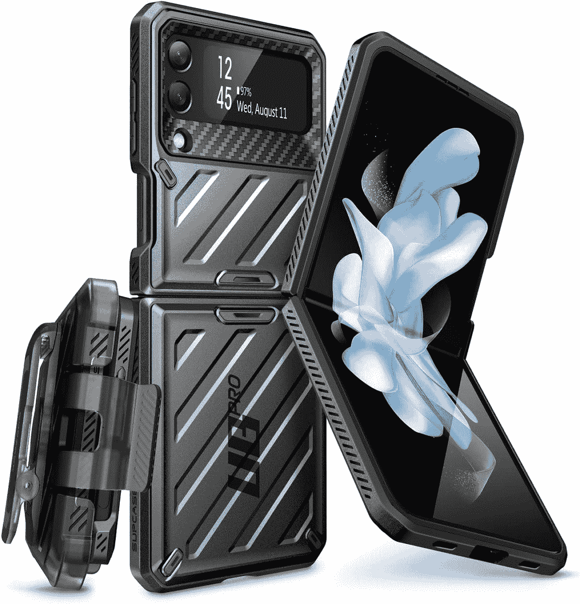
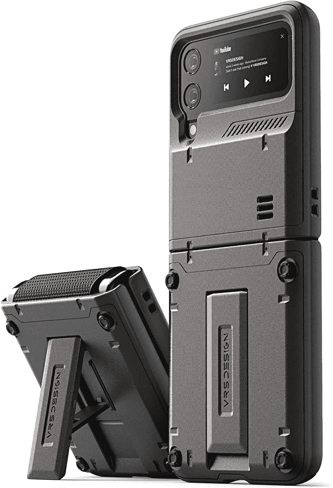
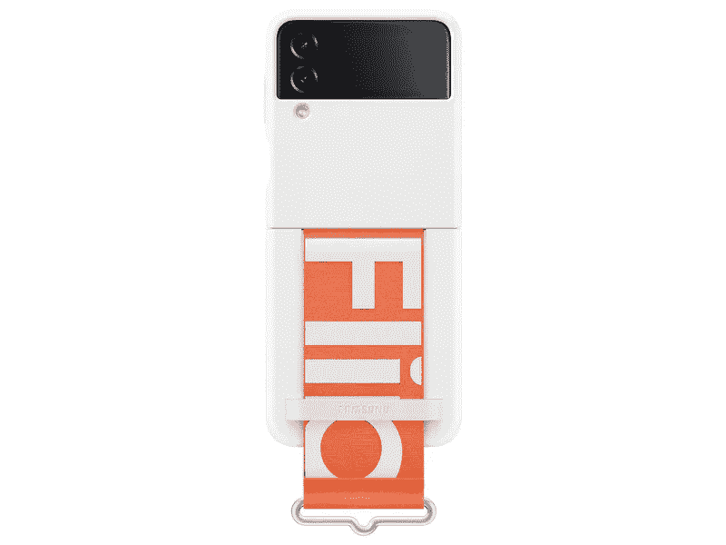

# 2023 年最佳三星 Galaxy Z Flip 4 保护套

> 原文：<https://www.xda-developers.com/best-samsung-galaxy-z-flip-4-cases/>

# 2023 年最佳三星 Galaxy Z Flip 4 保护套

我们已经收集了最好的 Galaxy Z Flip 4 外壳，以节省您的时间和精力。有很多选项可供选择。

三星 Galaxy Z Flip 4 是一款时尚有趣的安卓手机，非常适合用来表达时尚。虽然它与前代产品没有太大的不同，但它确实带来了几项关键的升级，使其成为迄今为止最精致的翻盖手机。新款比旧款更轻，框架更平，握起来更舒服。此外，Galaxy Z Flip 4 使用大猩猩玻璃 Victus Plus 和装甲铝框架，具有更好的耐用性。虽然新型号更坚固，但还是建议用外壳保护它。你最不希望的就是刮伤或损坏你价值 999 美元的可折叠手机。

为了帮助你挑选一个，我们在下面收集了最好的 Galaxy Z Flip 4 个案例。从官方选项到更时尚的第三方产品，我们的系列提供了涵盖不同需求和预算的广泛选项。

*   ##### Spigen 坚韧战甲 Galaxy Z Flip 4 外壳

    这款坚韧外壳采用 Spigen 特色泡沫技术，具有额外的抗冲击能力。它由耐用材料制成，提供军用级跌落保护。与两件式设计不同，这款还保护了转轴。

*   <picture></picture>

    case ology Parallax

    ##### case ology Parallax Galaxy Z Flip 4 case

    时尚且具有保护性，这款 Caseology case 得益于其符合人体工程学的设计，手感极佳。凸起的嘴唇保护相机和屏幕，而纹理侧提供了更好的握持。表壳有两种低调的颜色可供选择:哑光黑和午夜蓝。

*   <picture></picture>

    Otterbox Symmetry Flex

    ##### Otterbox Symmetry case for Galaxy Z Flip 4

    Otterbox 的 Symmetry 系列 Flex 是一款出色的加固型保护套，不仅外观时尚，还能保护您的可折叠手机免受跌落和刮擦的影响。它在相机和显示器周围有凸起的边缘，折叠时还可以保护铰链。它有黑色、蓝色和紫色三种颜色可供选择。

*   ##### Caseology Nano Pop Galaxy Z Flip 4 表壳

    Caseology 为 Galaxy Z 4 设计的 Nano Pop 表壳采用了醒目的双色调饰面和凸起的相机环设计，赋予其大胆时尚的外观。它拥有 TPU 和聚碳酸酯的双层保护，并提升了边缘以保护屏幕和摄像头。

*   <picture></picture>

    Galaxy Z Flip 翻盖皮套

    ##### 三星皮质 Galaxy Z Flip 保护套

    这是三星为 Galaxy Z Flip 4 销售的最贵的保护套。它由真正的小牛皮材料制成，摸起来很柔软。这款保护套背面还有一个奢华的皮革翻盖，为铰链提供额外的保护层。你可以挑选这款桃红色、淡雅紫色和黑色的皮套。

*   <picture></picture>

    I-Blason armor box

    ##### I-Blason armor box Galaxy Z Flip 4 case

    iBlason 的 Armorbox case 凭借其坚硬的聚碳酸酯外壳和减震的 TPU 内壳，提供了军用级的防摔、防碰和防刮擦保护。挡板被抬高，这样相机镜头和屏幕就不会刮伤表面。该保护套兼容无线充电，并配有一个方便的皮带夹皮套。

*   <picture></picture>

    Galaxy Z 翻盖硅胶带圈保护套

    ##### 三星硅胶 Galaxy Z 翻盖保护套

    这款圈保护套是硅胶带圈保护套的绝佳替代品。除了提供一个安全的地方来握你的手机，环握增加了一些风格和个性。表壳有五种美丽的颜色，包括宝来紫、北极蓝、卡其色、藏青色和粉色。

*   ##### Spigen Air Skin Galaxy Z Flip 4 保护套

    Spigen Air Skin 保护套是一款轻薄透明的保护套，可以让您的 Galaxy Z Flip 4 无划痕，而且不会增加额外的体积。该保护套兼容无线充电，不会像其他透明保护套那样随着时间的推移而变黄。

*   <picture></picture>

    sup case Unicorn Beetle Pro

    ##### sup case UB Pro Galaxy Z Flip 4 case

    sup case 的 Unicorn Beetle Pro 系列被评为 20 英尺跌落保护，并采用双层 TPU 和 PC 材料以提高耐用性。该保护套与无线充电器兼容，并配有高架挡板，以保护相机镜头和屏幕。

*   <picture></picture>

    VRS Design

    ##### VRS Design quick stand Active Galaxy Z Flip 4 外壳

    这款坚固的外壳提供坚固的跌落保护，并配有内置支架，允许您轻松地垂直或水平安装 Galaxy Z Flip 4。

*   <picture></picture>

    Galaxy Z Flip 4 硅胶保护套配有表带

    ##### 三星硅胶 Galaxy Z Flip 4 外壳

    这款硅胶保护套配有一条附加的表带，让您可以用手指环绕它，以获得额外的安全性。表壳采用哑光处理，表面柔软，有白色和黑色两种颜色。

一个保护套将大大有助于保护您的全新 Galaxy Z Flip 4 免受潜在的损坏和一般磨损。我们系列中的大多数保护套都采用双向设计，这意味着它们可以保护背板和侧面，但不能保护铰链。这没什么大不了的，但如果你想要额外的安心，可以考虑使用 Spigen Tough Armor 或 Otterbox Symmetry Flex，因为这两种情况都提供了铰链保护。如果钱不是问题，三星的官方翻盖皮套是最好的选择。它提供了很好的手感，也保护了铰链。与此同时，Spigen Air Skin 适合那些希望展示手机自然美，同时保护手机免受划痕和擦伤的人。

如果你还没有订购 Galaxy Z Flip 4，一定要看看最好的 [Galaxy Z Flip 4 交易](https://www.xda-developers.com/best-samsung-galaxy-z-flip-4-deals/)。我们还在另一篇文章中总结了[最佳 Galaxy Z Flip 4 充电器](https://www.xda-developers.com/best-samsung-galaxy-z-flip-4-chargers/)。