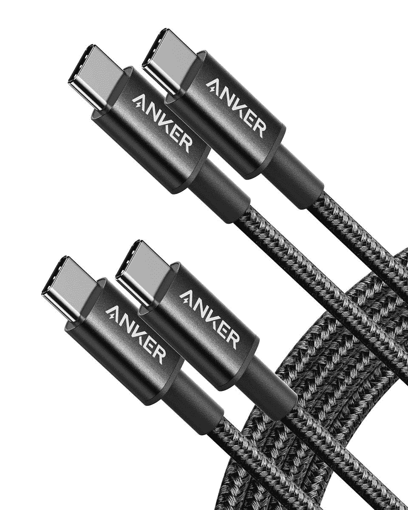
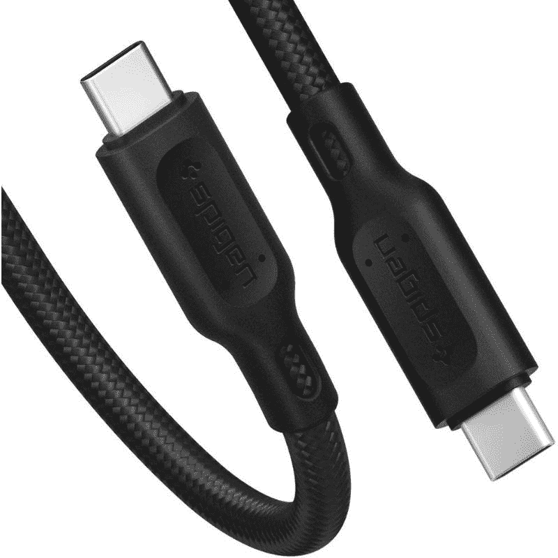

# 2023 年最佳三星 Galaxy Z Flip 4 充电器、电缆和其他配件

> 原文：<https://www.xda-developers.com/best-samsung-galaxy-z-flip-4-chargers/>

三星 Galaxy Z Flip 4 是目前你能在美国买到的最好的可折叠设备之一。这并没有彻底背离 Galaxy Z Flip 3，但在引擎盖下有一些不错的升级，改善了整体用户体验。然而，Galaxy Z Flip 4 还有一样东西没有:盒子里的充电器。没错，**三星新推出的可折叠盒子**中不包括充电器，这意味着你必须单独购买一个。我们强调了你在美国可以为这款手机购买的 Galaxy Z Flip 4 的最佳快速充电器。此外，我们还留下了一些最佳电缆和其他配件的建议，你应该考虑为 Galaxy Z Flip 4 挑选。

## Galaxy Z Flip 4 的最佳充电器

Galaxy Z Flip 4 现在通过快充 2.0 和自适应快充支持最高 25W 的有线充电。因此，我们本质上是在寻找一款支持这些标准的充电器，输出功率至少为 25W。值得注意的是，如果你正在寻找无线充电垫或支架，这款手机还支持 10W 无线充电。

Galaxy Z Flip 4 的盒子里有一根 USB-C 到 USB-C 的电缆，这意味着你应该寻找有 USB-C 端口的充电器。对于带有 USB-A 端口的充电器，请确保它也带有 USB-A 到 USB-C 电缆，或者你身边已经有一根。

*   ##### Anker 711 Nano II 30W 充电器

    Anker 711 是一款紧凑型充电器，可以非常快速地为 Galaxy Z Flip 4 的电池充电。它比三星的官方充电器要小，并且有黑色和白色两种颜色可供选择。它没有配备 USB-C 到 USC-C 充电电缆，所以请记住这一点。

*   <picture></picture>

    Nektech 快速充电器

    ##### Nekteck 18W USB-C 充电器

    NeckTeck USB 壁挂充电器是 Galaxy Z Flip 4 的稳健预算充电器。它支持快充 2.0 标准，并提供高达 18W 的快充，这对于它的要价来说是相当不错的。充电器配有 A 型端口，但你可以使用兼容的 C 型和 microUSB 电缆，所以没什么可担心的。

*   <picture></picture>

    带适配器的 15W 无线充电器

    ##### 带适配器的 15W 无线充电器

    三星的 15W 无线充电板非常适合那些希望为 Galaxy Z Flip 4 无线充电的人。这款充电器支持高达 15W 的输出，是新款可折叠手机的绝佳充电垫。它有深灰色和白色两种颜色可供选择，这款还配有旅行适配器。

*   <picture></picture>

    25W 超级快速充电器

    ##### 三星 25W USB-Charger

    三星还在卖它的 25W 快速充电器，用在 Galaxy Z Flip 4 上再合适不过了。支持 25W 输出，具有自适应快充和 USB-PD 充电标准。这款 USB-C 兼容充电适配器有黑白两种颜色可供选择，但盒子里没有电缆。

*   <picture></picture>

    三星 35W 适配器 Duo

    ##### 三星 35W 电源适配器 Duo

    三星的 35W 适配器 Duo 充电器非常适合那些想要同时为两台设备充电的人。这种特殊的充电器带有一个 USB-C 端口，最大输出功率为 35W，一个 USB-A 端口，最大输出功率为 15W，带 AFC 和 QC。充电器没有 USB 电缆，所以请记住这一点。

*   <picture></picture>

    Belkin boost charge 壁式充电器

    ##### Belkin boost charge 24W USB-C 充电器

    Belkin boost charge USB-C 充电器自带 USB-PD 和 PPS 支持。它可以为支持的设备提供高达 25W 的功率，这非常棒。另一方面，非 PPS 和 USB-PD 设备将获得高达 20W 的充电速度，这对大多数用户来说仍然很好。它只有一个 USB 端口，所以你一次只能给一个设备充电。

*   <picture></picture>

    15W 无线充电器 duo

    ##### 三星 15W 无线充电器 Duo

    三星的 15W 无线充电器 Duo 是那些想要将手机和配件一起无线充电的人的绝佳配件。你可以用它给你的手机充电，也可以同时给一双 TWS 充电，比如 Galaxy Buds Pro 或 Galaxy Watch。如果你不介意多花一点钱，你也可以选择这种无线充电器的变体，它配有旅行适配器。

*   <picture></picture>

    Baseus 车载充电器

    ##### Baseus 65W USB-C 车载充电器

    如果你想在开车时用快速充电器给手机充电，Baseus 车载充电器是个不错的选择。这种特殊的充电器支持多种快速充电技术，因此您应该能够使用它来为许多设备充电。它甚至可以提供 65W 的功率，并配有 USB-C 和 USB-A 端口。

*   <picture></picture>

    三星 25W 便携式电池组

    ##### 三星 25W 便携式电池

    三星的 25W 便携式充电器非常适合那些想要一个简单便携的充电器在外出时为他们的设备充电的人这种特殊的便携式电池组内部配有 10，000 毫安时的电池，这意味着它应该能够完全为 Galaxy Z Flip 4 充电两次以上，而不会出现任何问题。还支持 25W 快充，很棒。

## Galaxy Z Flip 4 的最佳线缆

Galaxy Z Flip 4 的盒子里有一根 USB-C 到 USB-C 的电缆，这对大多数用户来说应该足够了。但是，如果您需要一根额外的电缆来配合您的设备使用，可能是不同的颜色、长度或规格，那么请查看我们在下面提到的电缆:

*   <picture></picture>

    Anker 尼龙 USB-C 转 USB-C 编织电缆

    ##### Anker 尼龙 USB-C 转 USB-C 编织电缆

    这包 USB-C 转 USB-C 电缆包含两根 6 英尺编织电缆。它们支持高达 60W 的快速充电，并有三种颜色可供选择。你也可以得到一个更短的版本，所以挑一个你喜欢的。

*   <picture></picture>

    Spigen DuraSync 线缆

    ##### Spigen DuraSync USB-C 线缆

    Spigen DuraSync USB-C 转 USB-C 线缆具有 USB 2.0 数据传输速度和 60W 功率输出，这意味着它可以为您的设备快速充电。这款产品还配有一条用于线缆管理的皮带。

*   <picture></picture>

    三星 USB-C 转 USB-C 线

    ##### 三星 USB-C 转 USB-C 线

    这款三星官方 USB-C 转 USB-C 线长 1 米，有白色和黑色可选。这个不是编织的，但是在美国有一年的保修期。

## Galaxy Z Flip 4 的最佳无线耳塞

你可能已经知道，三星 Galaxy Z Flip 4 没有配备 3.5 毫米耳机插孔。所以除非你愿意拿起 USB-C 转 3.5 毫米的适配器，否则我们建议你买一副好的无线耳塞来搭配你的新手机。我们在下面重点介绍了最好的三星 TWS 耳塞，有了它们，您可以留在三星生态系统中，获得更好的集成和良好的整体体验。

*   Galaxy Buds 2 Pro 是三星最新推出的一对真正的无线耳塞，拥有你对高端耳塞的所有期待。它们的设计略有不同，比 Galaxy Buds Pro 小 15%。Galaxy Buds 2 Pro 可与三星设备无缝连接，并支持降噪、3D 音频等功能。

*   <picture>![If you're looking to buy a pair of Samsung wireless earbuds that offer the best value for money, then we think you should consider the Galaxy Buds 2\. Though not as feature-rich as the Galaxy Buds Pro, we think the Galaxy Buds 2 delivers a good set of features and impressive audio quality for the price. Features like active noise cancellation and Ambient Mode at $150 make it very easy for us to recommend the Galaxy Buds 2\. Hit the link below if you're looking for a reliable pair of wireless earbu](img/a8a82ea469b53773c665309832db5a5e.png)</picture>

    三星 Galaxy Buds 2

    ##### 三星 Galaxy Buds 2

    如果你不想花很多钱为你的 Galaxy Z Flip 4 买一副最新最棒的耳塞，那就考虑一下 Galaxy Buds 2 吧。这些三星耳塞提供了令人印象深刻的音频质量，现在最物有所值。您还可以获得一些整洁的功能，如噪音消除和环境模式，使它成为我们的一个简单推荐。

*   <picture></picture>

    三星 Galaxy Buds Live

    ##### 三星 Galaxy Buds Live

    这款 Galaxy Buds Live 耳塞也同样不错，如果你在市场上买一副相对实惠的 TWS 耳塞。这些耳塞，你可能已经知道，有一个独特的设计，使他们从其他耳塞中脱颖而出。Galaxy Buds Live 还提供其他功能，如主动噪音消除、令人印象深刻的音频质量等。

如果你不介意探索其他制造商生产的 TWS 耳塞，那么一定要看看我们收集的[最佳 TWS 耳塞](https://www.xda-developers.com/best-wireless-earbuds/)来寻找一些好的选择。

* * *

## 最佳智能手表和其他配件

让我们来看看最好的智能手表和一系列其他杂项配件，以帮助您充分利用 Galaxy Z Flip 4:

*   Galaxy Watch 5 是三星最新的智能手表，与 Galaxy Z Flip 4 一同亮相。它采用更强的蓝宝石水晶玻璃显示屏，更大的电池支持更快的充电，等等。Galaxy Watch 5 有 40 毫米和 44 毫米两种外壳尺寸，你可以在一系列有趣的配色中挑选它们。

*   <picture></picture>

    iOttie Easy One Touch 4

    ##### iOttie Easy One Touch 4

    iOttie 车载支架是一款简单的配件，可以可靠地将手机固定在车内。这种特殊的车载支架的最大优点之一是它带有一种独特的机制，让您可以用一只手轻松地安装和释放您的设备。

*   <picture></picture>

    Vicseed 手机支架

    ##### Vicseed 手机支架

    Vicseed 车载手机支架是一种基于吸盘的支架，可以在您驾驶时轻松将您的 Galaxy Z Flip 4 固定到位。这个支架最大的优点之一是它可以轻松地固定大型手机，甚至是厚外壳的手机。

这让我们来到了这个特别系列的最后，在这个系列中，我们强调了 Galaxy Z Flip 4 的最佳充电器以及一系列其他配件。如果我们要为手机选择一个充电器，那么它将是 Anker 711 Nano II 30W GaN 充电器。它比市面上大多数充电器都小，而且它也能为 Galaxy Z Flip 4 快速充电。如果你还没有购买 Galaxy Z Flip 4，那么一定要停下来看看我们收集的[最佳交易](https://www.xda-developers.com/best-samsung-galaxy-z-flip-4-deals/),看看你是否能抓住一个好交易，为你的购买节省一些钱。我们还在另一篇文章中总结了 Galaxy Z Flip 4 的[最佳案例，所以如果你想保护你的新手机，请务必查看一下。](https://www.xda-developers.com/best-samsung-galaxy-z-flip-4-cases/)