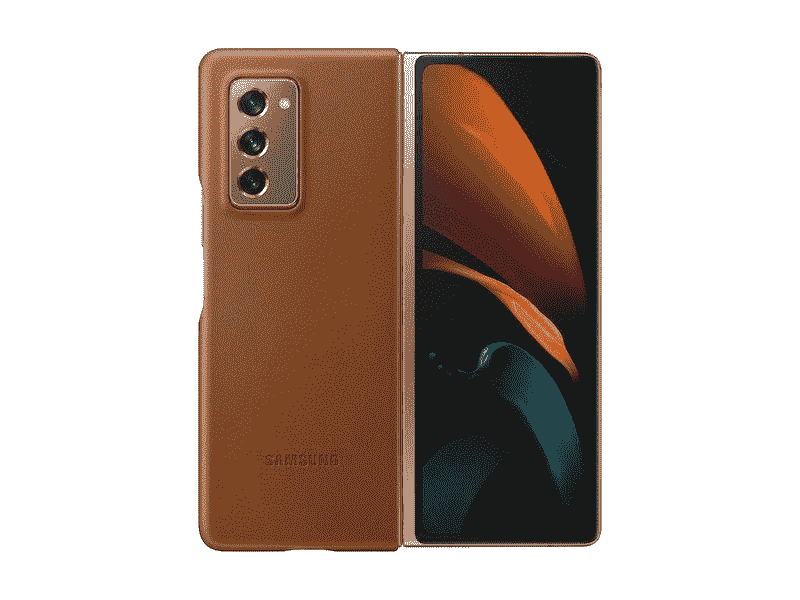
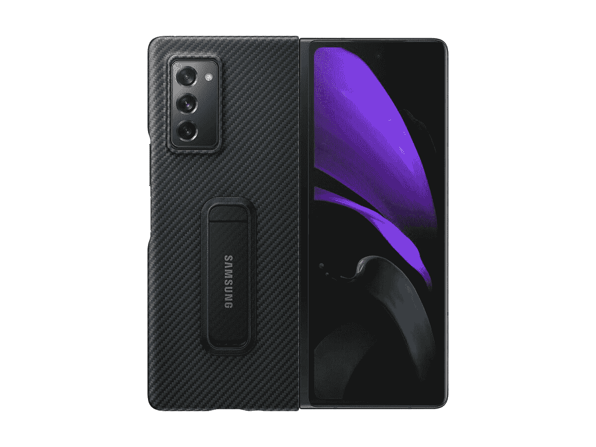
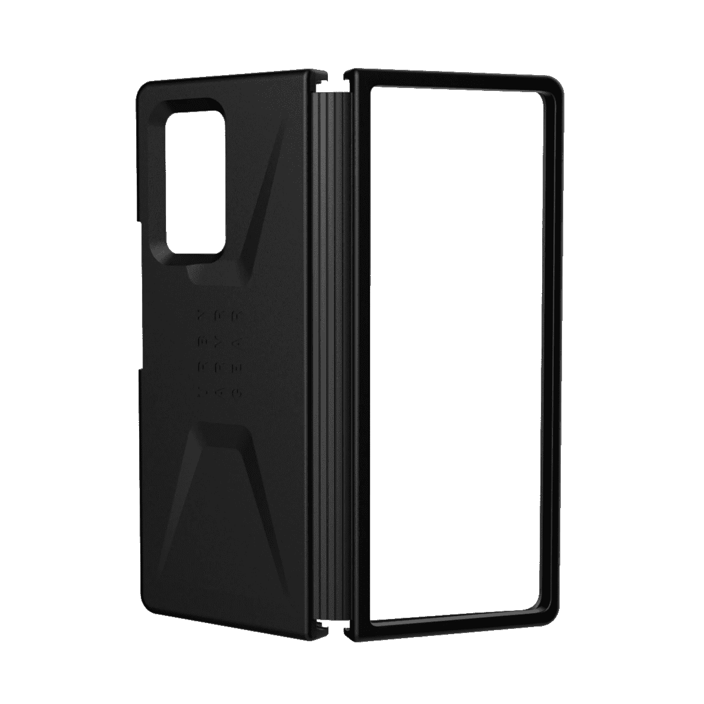
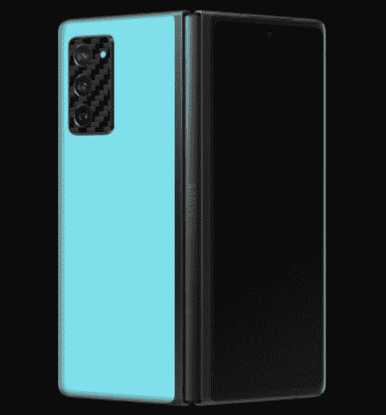
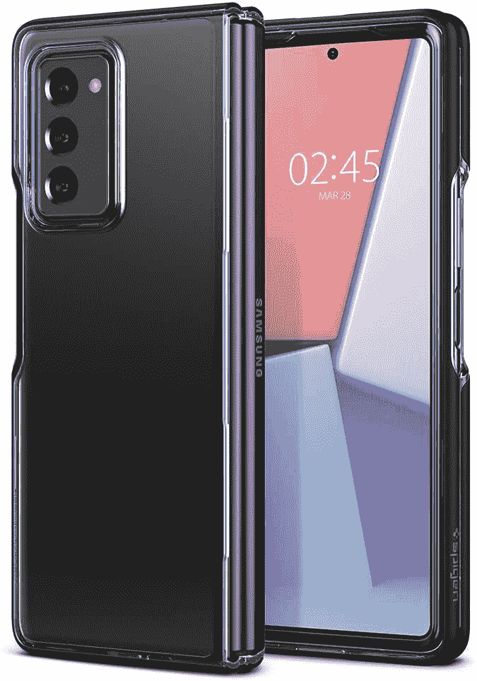

# 2020 年最佳三星 Galaxy Z Fold 2 保护套、保护盖、屏幕保护套

> 原文：<https://www.xda-developers.com/best-samsung-galaxy-z-fold-2-cases/>

# 这些是最好的 Galaxy Z Fold 2 外壳、外壳和皮肤

正在为您的新手机寻找合适的外壳？我们为您提供了最好的三星 Galaxy Z Fold 2 保护套、保护盖和保护套！

三星 Galaxy Z Fold 2 即将上市，发布日期为 9 月 18 日。高达 1999 美元的价格标签([虽然你可以通过以旧换新](https://shop-links.co/link/?exclusive=1&publisher_slug=xda&article_name=These+are+the+best+Galaxy+Z+Fold+2+Cases%2C+Covers+and+Skins&article_url=https%3A%2F%2Fwww.xda-developers.com%2Fbest-samsung-galaxy-z-fold-2-cases%2F&u1=UUxdaUeUpU29676&url=https%3A%2F%2Fwww.samsung.com%2Fus%2Fsmartphones%2Fgalaxy-z-fold2-5g%2Fbuy%2F)节省 800 美元)意味着你新买的东西也值得一些不错的保护！你最不想做的事情就是扔掉一些独特的东西，比如三星的可折叠手机，然后需要支付数百美元进行维修。我们已经收集了你现在可以买到的最好的 Galaxy Z Fold 2 保护套，并将不断更新这个列表！

 <picture></picture> 

Galaxy Z Fold 2 5G Leather Cover

##### 三星皮革银河 Z 折叠 2 封面

三星为 Galaxy Z Fold 2 设计的后盖由真皮制成，非常柔软，不会增加手机的体积。你为这部手机支付了额外费用，为什么不用超级时尚的东西包装它呢？

 <picture></picture> 

Galaxy Z Fold 2 5G Aramid Standing Cover

##### 三星芳纶银河 Z 折叠 2 站盖

三星的芳纶外壳和 Galaxy Fold Z 2 本身一样百搭！内置两个支架，您可以根据需要以任何方式支撑您的手机，以获得完美的视角，并且它应该适合您的手机。

 <picture></picture> 

Urban Armor Gear Civilian Series Case

##### UAG 民用银河 Z 折 2 盒

UAG 的 Galaxy Z Fold 2 外壳具有明显的优势，可以覆盖铰链和部分前屏幕。如果你担心你的设备真的会掉落，这款保护套可以提供一些保护。

 <picture></picture> 

DBrand Galaxy Z Fold 2 Custom Skins

##### dbrand Galaxy Z Fold 2 皮肤

如果你想要一些简单的东西，为你的 Galaxy Z Fold 2 提供额外的定制，只需看看 DBrand 的包装系列。它们价格实惠，有多种外壳可供选择，可防止小划痕！

 <picture></picture> 

Spigen Ultra Hybrid Designed Case

##### Spigen 超混合银河 Z 折叠 2 盒

占位符图像可能不是 Z Fold 2，也可能要到 11 月份才会推出，但 Spigen 是一个好品牌，你知道你会买到物美价廉的东西。超级混合动力车是他们最受欢迎的系列之一。

由于三星 Galaxy Z Fold 2 尚未上市，我们还没有大量不同的外壳，尤其是由于这款手机独特的结构。但是当它发布并有更多人得到这款有前途的设备时，应该会有很多选择！如果我们现在不得不挑选一款，[三星的芳纶立盖是我们选择的保护款式](https://shop-links.co/link/?exclusive=1&publisher_slug=xda&article_name=These+are+the+best+Galaxy+Z+Fold+2+Cases%2C+Covers+and+Skins&article_url=https%3A%2F%2Fwww.xda-developers.com%2Fbest-samsung-galaxy-z-fold-2-cases%2F&u1=UUxdaUeUpU29676&url=https%3A%2F%2Fwww.samsung.com%2Fus%2Fmobile%2Fmobile-accessories%2Fphones%2Fgalaxy-z-fold-5g-kevla-standing-cover-ef-xf916sbegus%2F)！