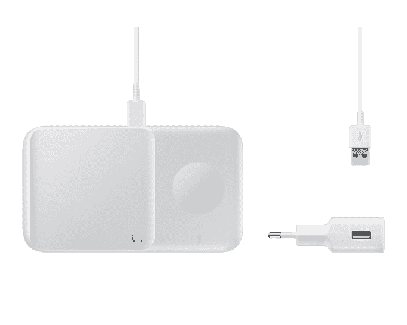

# 2023 年最佳三星 Galaxy Z Fold 4 充电器、电缆和其他配件

> 原文：<https://www.xda-developers.com/best-samsung-galaxy-z-fold-4-chargers/>

三星的 [Galaxy Z Fold 4](http://www.xda-developers.com/samsung-galaxy-z-fold-4-review/) 可以说是目前最好的可折叠手机。从 120Hz 的显示屏到众多的后置摄像头和自拍摄像头，再到 5G 支持——这款灵活的野兽包含了许多你可能在其他[旗舰智能手机](http://www.xda-developers.com/best-phones)上不一定能找到的技术。不过，普通的 Galaxy Z Fold 4 可能有些局限。配饰不仅能帮助你释放全部潜能，还能简化你的生活。虽然你通常会先[为你的手机买一个外壳](https://www.xda-developers.com/best-samsung-galaxy-z-fold-4-cases/)，但还有很多其他物品，如充电器、电缆、耳塞等，可以让你的智能手机体验更好。下面是[购买三星 Galaxy Z Fold 4](https://www.xda-developers.com/best-samsung-galaxy-z-fold-4-deals/) 时应该考虑的一些配件。

## Galaxy Z Fold 4 充电器

三星在 Galaxy Z Fold 4 设备的包装盒中不包括充电器。因此，如果你还没有充电砖，你需要单独购买一个来为你的新设备充电。以下是你能为这款可折叠智能手机找到的最好的充电器。

*   ##### 三星 35W 电源适配器 Duo

    编辑推荐

    这款充电器带有一个 USB-C 端口，最高输出 35W，底部有一个 USB-A 端口，最大输出 15W，带 AFC 和 QC。充电器没有 USB 电缆，所以请记住这一点。

*   ##### 三星超级快充块

    最超值

    这款官方充电器只有一个 USB-C 端口，但如果你宁愿要一个更小巧便携的砖块，也不愿意利用更多端口的话，它是完美的。它有黑色和白色两种。

    T35
*   ##### 三星 65W 3 口 USB-C 充电器

    三合一

    这款官方充电器非常适合那些有大量有线配件的人。您可以通过两个 USB-C 端口和一个 USB-A 端口同时为多达三个设备充电。

*   ##### Anker 537 Power Bank(Power core 26K)

    Premium Pick

    Anker 的巨大电池组可以输出 45 瓦的电量，让您的设备在路上使用许多小时都充满电。这非常适合您需要充电但没有墙壁插座的时候。

*   ##### Charmast 10400mAh 电源组

    预算友好

    这款来自 Charmast 的 10400mAh 电池组应该可以为你的 Galaxy Z Fold 4 充电不止一次。它提供 15W 的最大输出，有两个 USB-A 端口和一个 USB-C 端口，允许同时为最多三个设备充电。

*   ##### Anker 511 电源板

    紧凑型拨片

    这款电源板非常适合那些想要可以快速给 Galaxy 手机充电的便携设备的人。它没有其他充电器那么大或强大，但如果你想在伸手拿有线充电电源之前用它充电到一定程度，它仍然足够好。

## Galaxy Z Fold 4 线缆

三星 Galaxy Z Fold 4 包装盒包括一根充电线。然而，有时我们会丢失或弄坏它们，或者你可能只是想要一个备用的放在不同的房间。在这里，您可以找到适用于您的新三星 Galaxy 手机的最佳线缆。

*   ##### Ugreen 100W USB-C PD 线缆

    编辑推荐

    如果您正在寻找 Type-C 线缆两端的直角连接器，这款编织型线缆支持高达 100W 的功率传输和 USB 2.0 数据传输速度。

*   ##### Anker 尼龙 USB-C 转 USB-C 编织电缆

    性价比最高

    这款 10 英尺长的电缆采用编织设计，耐用性更好，有黑色、红色和银色可选。它还支持高达 60W 的快充。

*   ##### 亚马逊基本款 USB-C 转 USB-C 6 英尺线缆

    预算友好

    亚马逊基本款的这款线缆是一款价格实惠的选择，有白色和黑色两种颜色，价格在 10 美元左右。

*   ##### Belkin boost charge USB-C 转 USB-A 线

    编织线

    Belkin boost charge USB-C 转 USB-A 线由编织尼龙制成，增强了耐用性。它支持 USB 2.0 速度，能够进行 2.4A 充电。你可以买一两米长的。

*   ##### Spigen DuraSync USB-C 电缆

    高级精选

    如果您正在寻找编织电缆，这款 USB-C 到 USB-C 电缆也是一个不错的选择。它配有 USB 2.0 数据传输速度和 60W 功率输出，这意味着它可以为您的设备快速充电。这款产品还配有一条用于线缆管理的皮带。

    T13
*   ##### Ugreen USB-C 线

    直角

    Ugreen 解决充电线干扰智能手机游戏的方法略有不同。该公司提供 A 型到 C 型电缆，在 C 型端有一个 L 型连接器。它也应该有助于保持充电电缆的方式。

## Galaxy Z Fold 4 无线充电器

如果你不喜欢在 Galaxy Z Fold 4 上使用有线充电器，那么你可以使用 Qi 无线充电板。以下是适用于您的设备的一些最佳选项。

*   <picture></picture>

    三星无线充电器 Duo(第二代)

    ##### 三星无线充电器 Duo

    编辑推荐

    如果您只有一个手机配件或者通常一次只能充一个，您可以直接从三星购买这款无线充电器。它提供 15W 的最大充电速度，并内置风扇。

*   ##### 三星无线充电器三重奏

    高级精选

    这款充电器非常适合那些通常同时为手机、耳塞和手表充电的人。它提供 9W 最大功率输出，并配有 25W 电源适配器。

*   ##### 三星无线充电器单个

    单个设备

    如果你没有配件或者很少用手机充电，这款无线充电器非常适合你。它支持一次只为一个设备充电。

## Galaxy Z Fold 4 耳塞

可以理解的是，Galaxy Z Fold 4 错过了退役的 3.5 mm 耳机插孔。虽然您可以使用 USB Type-C 适配器来连接您最喜爱的有线耳机，但它仍然不太方便。你会想要一些无线耳塞来听你最喜欢的音乐。

*   ##### 三星 Galaxy Buds 2

    编辑推荐

    如果你不想在耳机上花很多钱，你可以得到 Galaxy Buds 2。它们可能没有 Galaxy Buds Pro 的所有功能，但它们的价格仍然很合理，具有主动噪音消除和良好的音频质量。

*   Galaxy Buds 2 Pro 是 TWS 最新上架的一对。与旧的 Buds Pro 相比，这些高端耳塞的设计略有不同，更小。它们还支持降噪、3D 音频等功能。

    T57
*   ##### 三星 Galaxy Buds Live

    最超值

    如果你正在寻找比以前型号更便宜的东西，这些 Buds 就是你要找的。他们有一个独特的豆形状，这有助于他们脱颖而出，但也有助于他们留在你的耳朵舒适适合。

## Galaxy Z Fold 4 S 笔

三星的 S Pen 很好地补充了 Galaxy Z Fold 4。如果你经常涂鸦或者做大量手写笔记，那就更是如此。

*   ##### 三星 S Pen 折叠版

    编辑推荐

    这款 S Pen 比其他选项更轻，不需要充电。它迎合了更多临时用户的需求，而且成本低得多。

*   ##### 三星 S Pen Pro

    Premium Pick

    S Pen Pro 是三星最高端的手写笔。它需要充电，但提供更高级的功能。

*   ##### 三星站立式 Galaxy Z Fold 4 外壳

    多功能拨片

    这款 Galaxy Z Fold 4 外壳带有支架和插槽，可以安全存放您的 S Pen，避免丢失。

* * *

Galaxy Z Fold 4 对于那些希望在口袋中存储大显示器的人来说是一款可靠的设备。凭借其多功能性和强大的功能，用户可以在旅途中进行创作和娱乐。配件只能帮助你释放它的全部潜力，充分利用它。使用没有配件的手机会让你的生活变得不必要的复杂。

Galaxy Z Fold 4 带回了 Fold 3 的所有优点，外加一个更好的相机系统，一个稍宽的外部屏幕和更智能的软件。