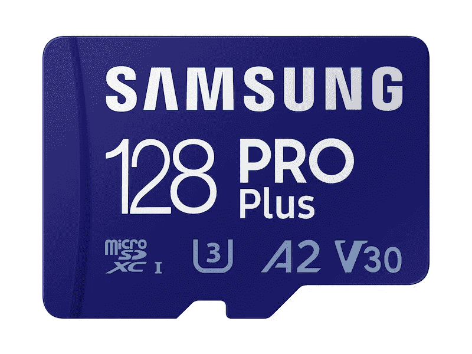
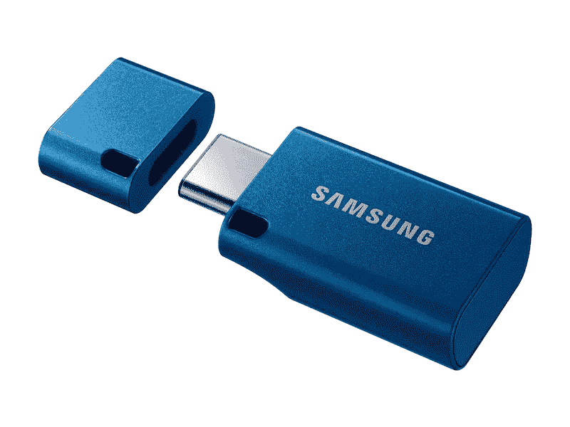
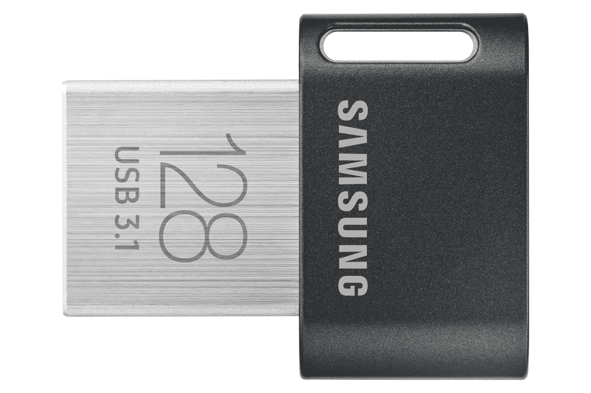

# 最佳三星固态硬盘、SD 卡和闪存驱动器

> 原文：<https://www.xda-developers.com/best-samsung-memory/>

三星是其许多产品的知名品牌，包括智能手机、电视和笔记本电脑。该公司还有一个重要业务领域是存储。从固态硬盘到闪存盘、microSD 卡，三星各种内存产品都有。如果你一直在寻求扩展笔记本电脑、智能手机或其他设备的存储空间，那么三星绝对不会错。

无论你是想升级你的笔记本电脑还是想随身携带更多的文件，都有一些很好的选择，我们在下面列出了它们。我们已经将它们分成不同的类别，这样你就可以更容易地找到你要找的东西。

## 内部固态硬盘

如果你想扩展笔记本电脑或台式机的内部存储，固态硬盘是最好的选择。三星制造了一些最受欢迎的 M.2 固态硬盘，但如果你有一个空缺的位置需要填补，或者你只是想要更便宜的大容量存储，也有一些 SATA 型号。

*   990 Pro 是三星最新最快的固态硬盘，读取速度高达 7450 MB/s，写入速度高达 6900 MB/s。这是市场上最快的固态硬盘之一。

*   ##### 带散热器的三星 990 Pro

    专为 PlayStation 5 等游戏机设计，带散热器的三星 990 Pro 提供了更好的持续性能，这归功于集成散热器，有助于它更长时间保持冷却。

    T17
*   ##### 三星 980 Pro

    三星 990 Pro 可能是最快的，但也更贵，最新一代的 980 Pro 价格更低，但性能几乎一样好。

*   ##### 三星 980

    如果你不需要 PCIe 4.0 的速度，又想省点钱，普通的三星 980 依然是一个梦幻般的选择，性能扎实。

*   ##### 三星 870 QVO SATA III 2.5 英寸固态硬盘

    如果你想要更大的存储空间，但不需要那么快，三星 870 QVO 是一款速度高达 560 MB/s 的 SATA 固态硬盘，容量高达 8TB。

    T17
*   ##### 三星 870 EVO SSD

    三星 870 EVO 与之前的型号非常相似，但它的容量更小，低至 250GB，所以如果你想要尽可能便宜的东西，它可能是更好的选择。

## 三星便携式固态硬盘

如果您需要可以随身携带的快速储物空间，该怎么办？三星还制造了一些很棒的便携式固态硬盘，以迎合不同类型的用户。无论您是想要方便安全地访问文件，还是想要能够在恶劣环境中生存的东西，三星都有适合您的。

*   ##### 三星 T7 Touch 便携式固态硬盘

    当您随身携带敏感数据时，三星 T7 Touch 是保护这些数据的最佳方式。这是一款带有指纹识别器的便携式固态硬盘，可以更轻松地保护您的文件安全。

    T37
*   ##### 三星 T7 便携式固态硬盘

    如果你想要更实惠或更有个性的东西，标准的三星 T7 更便宜，它有黑色、红色或蓝色可供选择。

*   ##### 三星 T7 Shield 便携 SSD

    三星 T7 Shield 是一款微型便携 SSD；但是它有一个坚固的设计，可以承受跌落，灰尘和水，所以你不必担心在旅行时打破它。

    T17

## 三星 MicroSD 存储卡

无论是智能手机、平板电脑、相机还是任天堂 Switch，microSD 卡都是增加存储容量的快捷方式。三星提供了相当多的存储卡，适合不同类型的使用案例。以下是目前可用的最佳选择。

*   <picture></picture>

    三星 Pro Plus microSDXC 卡

    ##### 三星 Pro Plus microSD 卡

    Pro Plus 是三星性能最好的 microSD 卡之一，有望达到 160MB/s 的读取速度，并获得 U3、A2 和 V30 认证。它有高达 512GB 的大小，应该足以满足您的几乎所有需求。

*   ##### 三星 Pro Endurance microSD 卡

    如果耐用性是你的第一要务，三星 PRO Endurance microSD 卡就能做到。它的速度较慢，但其长达 140，160 小时的寿命使其成为经常使用的任务的理想选择，如视频监控摄像机。

*   ##### 三星 EVO Select microSD

    三星 EVO Select microSDXC 卡提供了您可以获得的最佳价值，它的大小高达 512GB，速度高达 130 MB/s，具有 U1、A1 和 V10 认证，但它也非常实惠。

    

## 闪存驱动器

最后，还有一些闪存驱动器，当您需要紧凑的存储时，您可以轻松连接到任何 PC。这些没有固态硬盘快，但它们的小尺寸使它们成为学校项目和文件的理想选择，同时非常容易带到任何地方。三星没有生产大量的闪存驱动器，但这并不意味着没有好的选择。

*   <picture></picture>

    三星 USB Type-C 闪存盘

    ##### 三星 USB Type-C 闪存盘

    想要一个可用于所有 USB-C 端口的现代闪存盘吗？这是适合您的驱动器，容量高达 256GB。在 bue 看起来也很美。

*   <picture></picture>

    三星 DUO Plus 闪存盘

    ##### 三星 DUO 闪存盘

    想使用你电脑和手机上的文件吗？有了 Samsung DUO Plus，您可以连接到 USB Type-A 或 Type-C 端口，在几乎任何没有任何适配器的设备上访问您的文件。

*   <picture></picture>

    三星飞度加优盘

    ##### 三星飞度加优盘

    即使你的电脑太旧，不适合 USB-C，你也不用带着又大又笨重的优盘。这个小型号的容量高达 256GB，插上电源后几乎看不到。

* * *

这些是你今天能买到的最好的三星内存产品。这些产品中的许多经常上市，也可能发生一些容量售罄的情况，但它们都是很好的选择。这些不同的类别都是针对不同的用例，所以推荐一个特定的产品是复杂的。但如果你正在建造一台新的 PC 或升级它，三星 990 PRO SSD 肯定是最好的选择之一，其顶级速度接近 PCIe 4.0 的极限。关于 PC 制造的话题，一定要看看我们今天列出的[最佳主板](https://www.xda-developers.com/best-motherboard/)和[最佳 CPU](https://www.xda-developers.com/best-cpus/)。