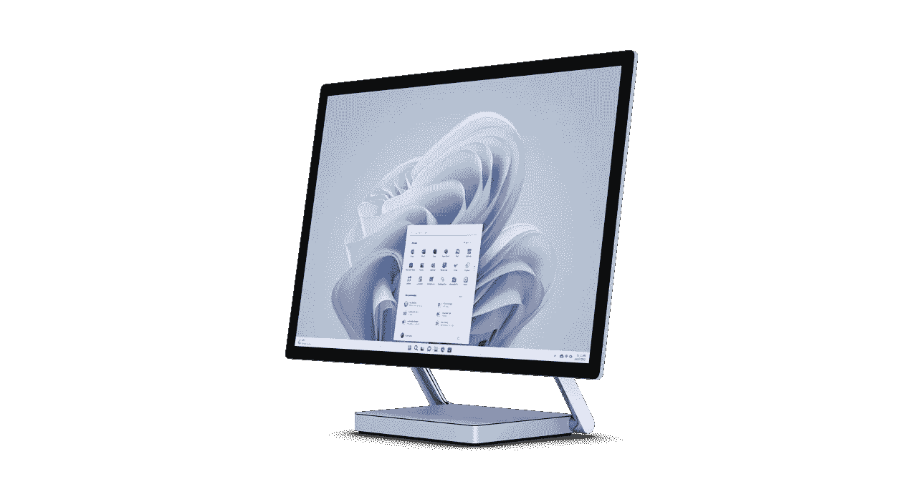
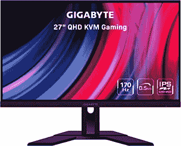

# 2023 年 Surface Studio 2 Plus 最佳辅助显示器

> 原文：<https://www.xda-developers.com/best-secondary-monitors-for-surface-studio-2-plus/>

# 2023 年 Surface Studio 2 Plus 最佳辅助显示器

Surface Studio 2 Plus 已经有了一个很棒的显示器，但是为什么不再买一个显示器来提高你的工作效率呢？

 <picture></picture> 

Surface Studio 2 Plus

有很多很棒的[微软 Surface PC](https://www.xda-developers.com/best-microsoft-surface-pcs/)，但你在 2022 年能买到的独一无二的一款是新的 Surface Studio 2 Plus。由于 4000 美元的价格，它并不完全适合所有人，但它的设计不同于你在市场上看到的任何其他东西。这是一台一体化电脑，有一个小底座、一个铰链和一个屏幕，你可以把它拉向你的桌子进行绘图。如果这不适合你，还有最近刚刚发布的 [Surface Pro 9](https://www.xda-developers.com/surface-pro-9/) 。

今年的 [Surface Studio 2 Plus](https://www.xda-developers.com/surface-studio-2-plus/) 的变化之一是增加了 Thunderbolt 4。虽然内置的 28 英寸 4500 x 3000 分辨率屏幕本身就非常令人身临其境，但现在您可以本机连接多达三个 4K 高分辨率外部显示器，提高您的工作效率。如果这听起来不错，这些是我们发现的一些最好的辅助显示器。

*   ##### 戴尔 U2723QE UltraSharp 4K USB-C 集线器显示器

    这是戴尔的一款高端 27 英寸 USB-C 显示器。与我们列表中的其他产品不同，它有一个专用的 sRGB 模式，可以给你带来惊人的色彩准确度。还有额外的 USB-C 端口可用于为设备充电。

    T13
*   <picture></picture>

    吉字节 M27Q 27

    ##### 吉字节 M27Q 27

    这是我们能找到的最便宜的 USB-C 显示器之一。当与 Surface Studio 2 Plus 搭配时，它仍然相当不错，因为它有 170Hz 的刷新率。1440p 的分辨率对于额外的生产力来说也是不错的。

*   ##### 联想 ThinkVision P27h-20

    这款联想显示器凭借其 27 英寸的尺寸和 QHD 分辨率，可以与您的设备完美搭配。它甚至有一个内置的手机支架。

    T36
*   ##### LG UltraGear 27gn 950-B 4K 显示器

    打算在你的 Surface Studio 2 Plus 上玩游戏？这是 LG 的一款高端 27 英寸 USB-C 显示器，由于其 G-Sync 支持、FreeSync 和超快的 1 毫秒响应速度，它的工作效果非常好。色彩准确度也很好，达到了 DCI-P3 色域的 98%。

*   ##### 宏碁 Predator X34

    你的桌面空间可能不允许，但这对于 Surface Studio 来说是一款很棒的宽屏显示器。这是一款 34 英寸的曲面显示器，刷新率为 180 赫兹。它还通过了 HDR 400 内容认证，这只是一个额外的奖励。

    T17
*   ##### LG 超细显示器 Ergo UHD 4K IPS 显示器

    这款 32 英寸 LG 超细 4K 分辨率显示器将非常适合与您的设备一起使用。它有一个超薄的符合人体工程学的立场和文件，也涵盖了 95%的 DCI P3 色彩范围。

*   ##### 三星智能显示器 M8

    这款 32 英寸的显示器是 Surface Studio 2 Plus 的绝佳选择。它通过 USB-C 连接，但它也提供智能功能，如无需连接到您的 PC 即可访问网飞。

    T37
*   ##### 华硕 ProArt PA279CV 27 英寸 4K UHD 显示器

    这是 Surface Studio 2 Plus 的又一款坚固的 27 英寸显示器。它具有防眩光表面，达到 4K 分辨率，并具有非常宽的视角。更不用说，它还覆盖了 100%的 SRGB 色域，以实现色彩的准确性。

*   <picture></picture>

    宏碁 SB220Q

    ##### 宏碁 SB220Q

    宏碁 sb 220 q 是我们能找到的最便宜的 21 英寸显示器之一。这只是 FHD 分辨率，但非常适合为 Surface Studio 2 Plus 添加快速显示屏。

    T34

这些是 Surface Studio 2 Plus 的最佳辅助显示器。如果你正在寻找最好的，你会想看看戴尔 U2727QE，因为它具有良好的色彩准确性和额外的 USB-C 端口为您的设备充电。如果你想要更好的刷新率，那么 Gigabyte M27 或联想 ThinkVision P27h-20 也不错。谈到宽屏显示器，LG UltraGear 或 Acer Predator 将适合您的工作站。一些更好的选择包括 LG 超细，三星智能显示器和华硕 Pro Art PA279CV。而如果你把所有的钱都花在 Surface Studio 2 Plus 本身上，宏碁 SB220Q 是最便宜的 USB-C 选择。

##### Surface Studio 2 Plus

Surface Studio 2 Plus 是一款一体化电脑，采用第 11 代英特尔处理器和 Nvidia GeForce RTX 3060 显卡。