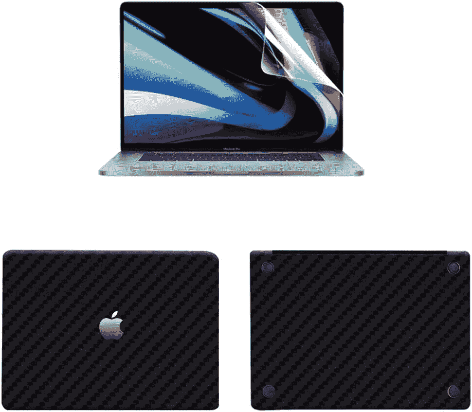
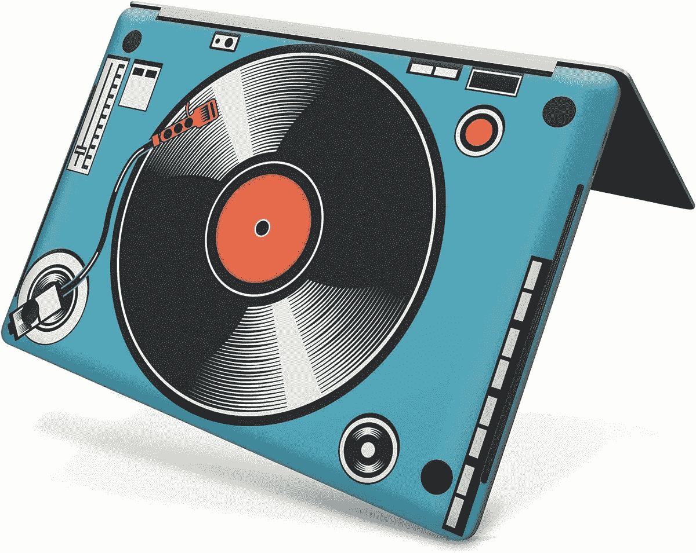
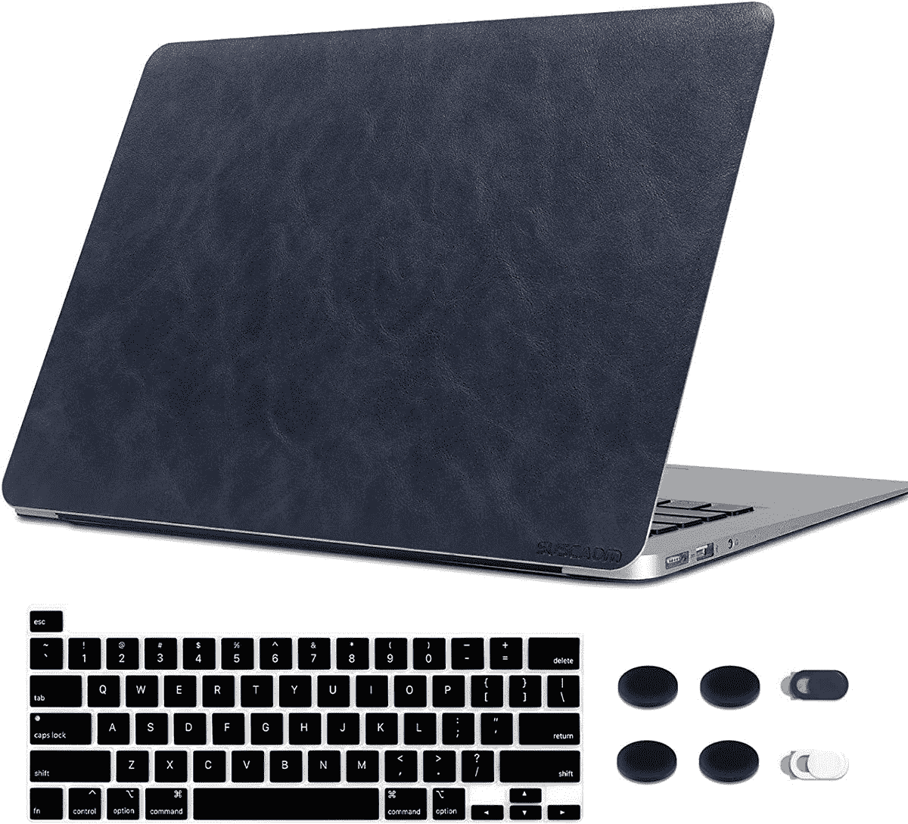
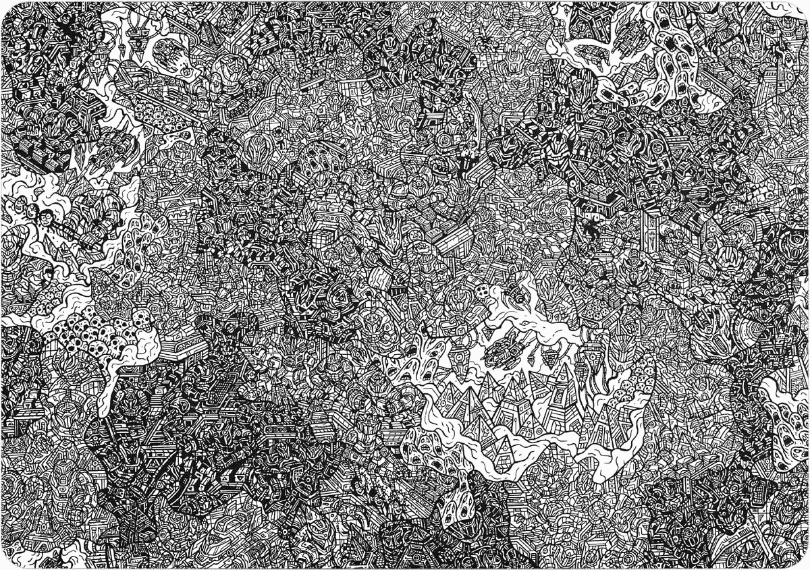

# 最佳苹果 MacBook Pro 13 (2022)皮肤

> 原文：<https://www.xda-developers.com/best-skins-macbook-pro-13-2022/>

# 最佳苹果 MacBook Pro 13 (2022)皮肤

皮肤可以为你枯燥的电脑增添活力和个性。以下是你能找到的苹果 MacBook Pro 13 的最佳皮肤选项。

[MacBook Pro 13 (2022)](http://www.xda-developers.com/apple-macbook-pro-13-inch-m2-2022-review/) 是目前上市的[最好的 MAC 电脑](http://www.xda-developers.com/best-macs/)之一。它装有苹果 M2 芯片，节能，设计紧凑。尽管如此，它提供了一个过时的底盘，不完全符合我们当前的时代。幸运的是，你可以依靠皮肤来掩盖这一切。对于那些不熟悉的人来说，皮肤就是那种可以贴在 MacBook Pro 机身上的薄贴纸。它们通常经久耐用，可使用数年，提供焕然一新的设备外观。如果你对它们感到厌烦，你也可以很容易地删除它们。下面你可以找到 MacBook Pro 13 (2022)目前可用的最佳皮肤列表。

*   ##### Digi-Tatoo 贴花 MacBook Pro 13 皮肤

    这款来自 Digi-Tatoo 的皮肤提供了一种逼真的纹理木质图案，覆盖在 MacBook Pro 13 的外壳上。也有其他图案，比如大理石和外太空。

*   <picture></picture>

    Devia 贴花皮肤

    ##### Devia 贴花 MacBook Pro 皮肤

    有拉丝红和碳纤维黑两种颜色可选，这种皮肤带有透明屏幕保护套。

*   <picture></picture>

    Mertak Vinyl Skin

    ##### Mertak Vinyl MacBook Pro Skin

    这款皮肤有十种插图图案可供选择，让你的 MacBook Pro 变成一款更有活力的设备。

*   <picture></picture>

    sus cadm 皮质贴纸

    ##### sus cadm 皮质 MacBook Pro 贴纸

    这款皮质贴纸配有键盘和隐私摄像头外壳，提供物理和在线保护。不过，它有时会缺货。

*   <picture></picture>

    MUELOSY Vinyl Skin

    ##### MUELOSY MacBook Pro Vinyl Skin

    有透明、黑色或白色大理石图案可供选择，这款包括 MacBook Pro 的底部贴纸。

*   <picture></picture>

    dBrand 皮肤

    ##### dBrand MacBook Pro 皮肤

    dBrand 提供了无数的高端皮肤，其独特的创意图案将使您的 MacBook 脱颖而出。

* * *

MacBook Pro 13 (2022)对于那些仍然使用英特尔架构 Mac 的人来说是一个可靠的升级。虽然与 2020 年的 M1 MacBook Pro 相比，这是一个微小的更新，但对于第一次尝试苹果芯片的人来说，这是值得注意的。许多用户更喜欢过时的设计，尽管它缺乏我们在开槽的 MacBook Pro 型号上看到的新端口种类。毕竟，它仍然是最近一款装有苹果 Touch Bar 的笔记本电脑。

如果我个人必须为我的 MacBook Pro 选择其中一种皮肤，我肯定会选择 [dBrand 皮肤](https://www.anrdoezrs.net/links/100122946/type/dlg/sid/UUxdaUeUpU42635/https://dbrand.com/shop/apple-macbook-pro-13-skins-2022-m2)。它们来自一家声誉良好的公司，以其精密和新颖的设计而闻名。你可以在大量的创意图案中进行选择，这些图案几乎可以保证为你的 MacBook Pro 沉闷的表面增添更多的活力。更不用说它们显著的抗刮性了。

 <picture></picture> 

Apple MacBook Pro M2

##### 苹果 MacBook Pro 13 英寸(2022)

2022 年的 MacBook Pro 13 英寸提供了经典的设计，重新引入了 Touch Bar，并封装了 M2 芯片。

*你会购买哪一款 MacBook Pro 13 皮肤，为什么？请在下面的评论区告诉我们。*