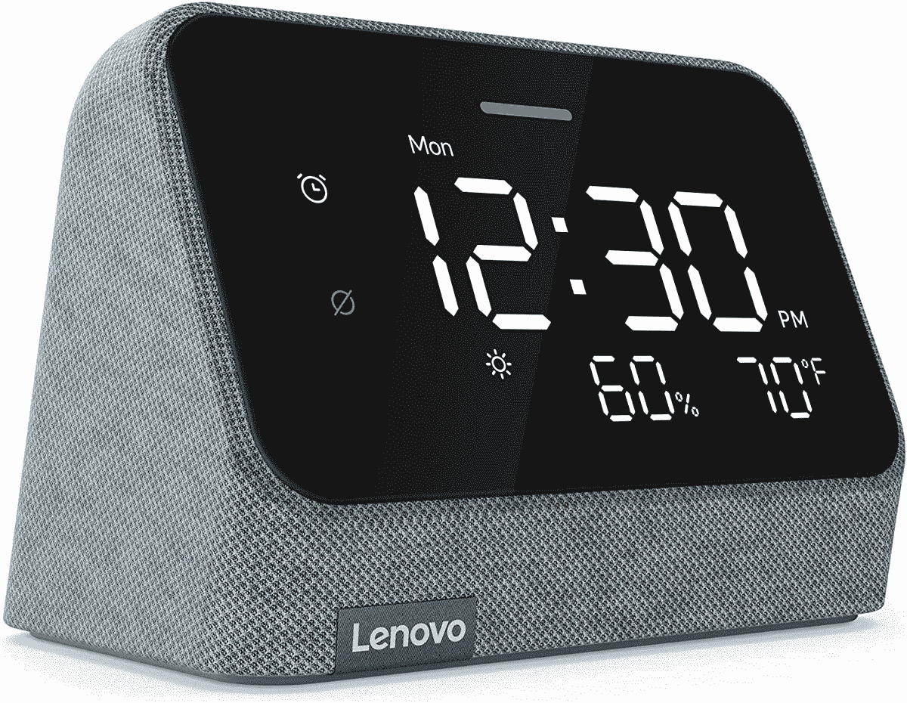
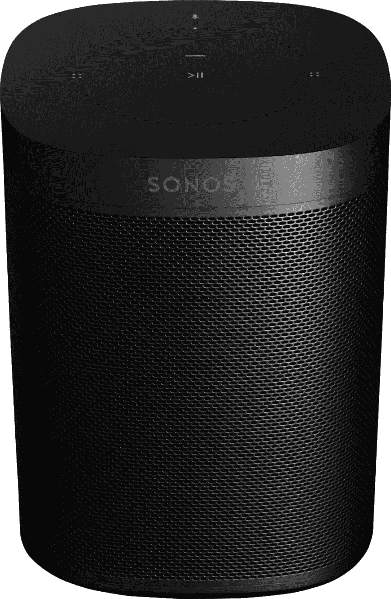
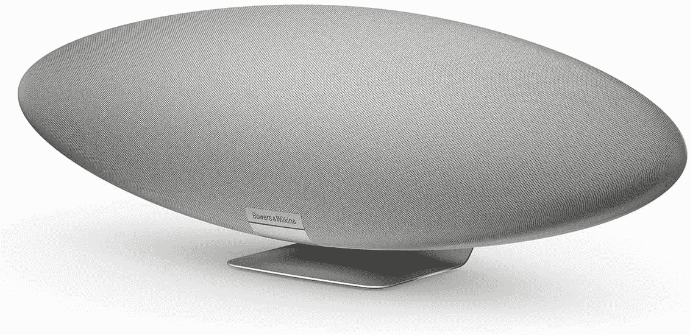
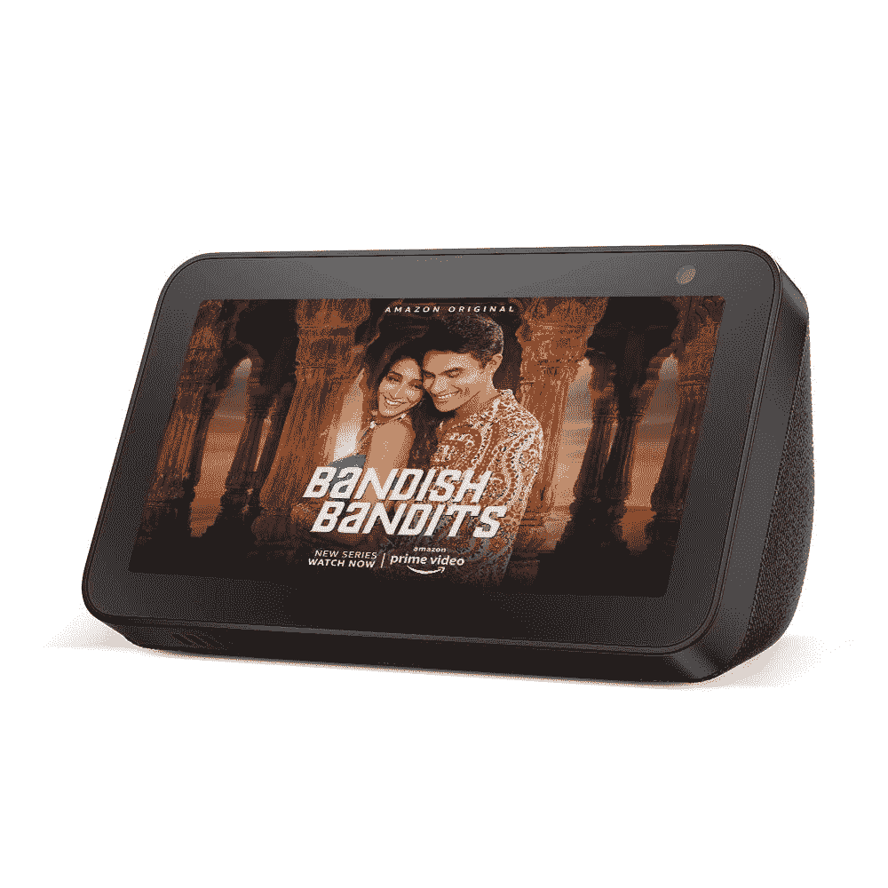
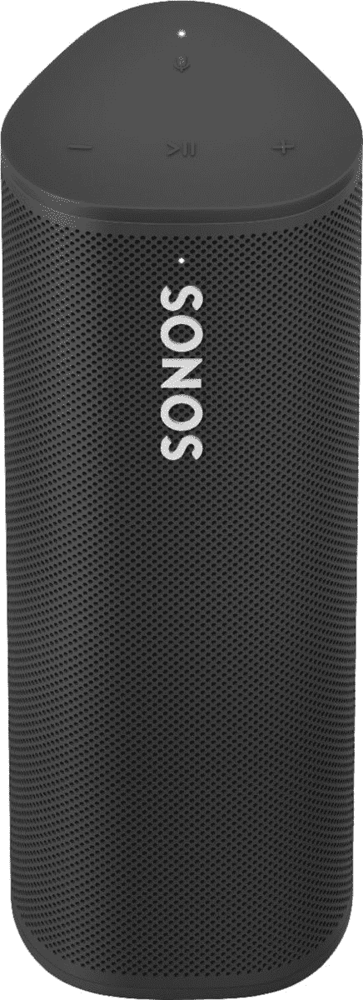

# 2023 年最佳智能音箱

> 原文：<https://www.xda-developers.com/best-smart-speakers/>

互联智能家居产品的世界令人无比兴奋，并且在不断发展。但对许多人来说，他们通过智能扬声器进入这个空间。这是有充分理由的，尤其是今天最好的智能扬声器是最容易使用和用户友好的智能家居设备。它们被设计成易于使用，技术不碍事，所以你可以用你能想象到的最自然的方式接触产品；用你的声音。

最好的智能音箱，比如最好的手机，发现自己几乎只被两个平台覆盖。在一个角落里，你有亚马逊 Alexa，在另一个角落里，你有谷歌助手。苹果的 Siri 也有一个出口，这是我们接触到的第一个真正的人工智能语音助手。其他人已经尝试过了，微软的 Cortana，三星的 bix by——但如果你进入智能家居，你真的要与亚马逊或谷歌打交道。好消息是，大多数服务和设备都支持这两个平台，所以当你选择智能扬声器时，这至少不需要成为一个问题。

考虑到这些，这些是你现在能买到的最好的智能音箱。

## 最佳综合:亚马逊回声

亚马逊的[Echo](https://www.xda-developers.com/amazon-echo-4th-gen-review/)是真正开启这个领域的智能音箱。直到今天，由于各种原因，它仍然是一个类的领导者。其中之一是亚马逊的强大实力以及为构建 Alexa 生态系统所付出的努力。与竞争对手相比，它能够向其合作伙伴提供独特的主张，拥有世界上最大的店面。

愤世嫉俗者可以说，Echo 只是亚马逊在亚马逊上销售更多东西的一种方式，这很容易就有一些道理。但是 Echo 不仅仅是亚马逊商店的喉舌，即使你可以用它为自己订购一把新牙刷、一些卫生纸或一部 iPhone。但是你也可以从大多数流行的流媒体服务上听音乐。它只需要在配套应用程序中链接它，并要求 Alexa 播放你想播放的任何内容，其余的由它处理。

在音频方面，全尺寸回声一直很强，最新一代也不例外。在其球形机身内有一对 0.8 英寸的高音扬声器和一个 3 英寸的低音扬声器。它旨在向各个方向传播音频，除非你在一个特别大的房间里，否则它真的会产生充满房间的声音。而且声音也很好听，尤其是考虑到要价的时候。当然，如果你有一个 Prime 订阅，你可以免费获得一个基本的音乐库。亚马逊 Echo 还拥有一个 3.5 毫米的输入和输出连接器以及蓝牙，因此可以轻松地集成到您现有的音乐设置中。

从以前的塔楼转移到球形设计也使它在你家时看起来更好。你有一系列的颜色可以选择，灯光现在在底部，那里更加微妙，如果你需要物理控制，它们就在顶部。它们是实际的按钮，上面有实际的图标，所以你可以准确地知道哪个是哪个(看着你，谷歌)。其中一个也是麦克风静音按钮，因为总会有你不想让它听你说话的时候。

激活亚马逊 Echo 就像说出“Alexa ”,然后说出你的请求一样简单。这可能是播放亚马逊、苹果音乐或 Spotify 的音乐，也许是播放 Audible 的有声读物，向你简要介绍新闻或当前天气，或者打开你的灯。还有许许多多其他的命令。一切都以“Alexa”开始，尽管如果你愿意，你还可以有一些额外的选择。

不可能列出所有钩入 Alexa 的服务和硬件设备，简直太长了。但像飞利浦 Hue，Nanoleaf，Ring，甚至 Xbox 这样的大玩家都在。在购买之前，你可以在任何网络浏览器中浏览完整的目录，以检查与你最喜欢的产品的兼容性，但它很有可能就在那里。亚马逊 Echo 还内置了 Zigbee 智能家居中枢，允许您直接集成许多智能家居产品，而不必使用云。最新的亚马逊 Echo 内置了如此多的东西，以至于很难推荐其他东西。

 <picture></picture> 

Amazon Echo (4th Gen)

##### 亚马逊 Echo(第四代)

最新一代的原始智能扬声器继续以漂亮的设计、出色的声音和 Alexa 生态系统的巨大可能性树立标杆。

## 最适合谷歌助手:谷歌巢音频

谷歌助手是对面角落里的重量级人物，而 [Nest Audio](https://www.xda-developers.com/google-nest-audio-review/) 无疑是谷歌有史以来发布的最好的全方位智能扬声器。它的价格和亚马逊 Echo 差不多，而且从它自己的角度来看，它也是一款外观时尚的设备。谷歌智能音箱一直拥有令人愉悦的设计，这一点对于一个你将放入家中的产品来说，可能比一个大部分时间都放在口袋里的产品更重要。

Nest Audio 也是一个很好的扬声器，适合那些首先需要无线音频的人，他们并不真正隶属于任何平台。它支持所有主要的音乐流媒体服务，包括 Apple Music，一旦设置为默认，你需要做的就是触发扬声器并要求你的歌曲。谷歌的特别之处在于整合了 Chromecast 协议。这使得从您的移动设备向 Nest Audio 发送音频变得特别容易，尤其是如果您还使用 Android 手机的话。

在 Nest Audio 内部，你会发现一个 75 毫米(2.95 英寸)的低音扬声器和一个 19 毫米(0.74 英寸)的高音扬声器。结果是一个伟大的声音，在整个频谱的良好表现，包括人声。对于一个相当小的扬声器来说，声音很大，很悦耳，即使实际上扬声器比亚马逊 Echo 中的扬声器少。谷歌还为 Nest Audio 配备了智能设备，如 Ambient IQ，它可以适应你家中的背景噪音，以确保你的音频听起来总是很好。

为了保持简约风格，Nest Audio 没有太多的物理控制，只有一个麦克风静音开关，通过触摸点来调节音量。当然，音量也可以用你的声音来调节，这比希望你触摸扬声器的正确部分要好。毕竟，Nest Audio 的设计完全是声控的。

如果你已经使用其他谷歌硬件，Nest Audio 可以无缝集成到你的谷歌主页设置中。您使用相同的应用程序，与其他 Nest 扬声器建立群组轻而易举。谷歌的硬件生态系统的优势之一是它很容易协同工作。

最后一部分是谷歌助手。像 Alexa 一样，它受到大量第三方智能家居产品的支持。像飞利浦 Hue，Nanoleaf，TP-Link 等等知名人群都是官方合作伙伴。通过用“嘿谷歌”触发扬声器，你可以打开你的灯或启动你的暖气或完成任何数量的其他任务。与 Alexa 相比，Google Assistant 的设置可能不太用户友好，但语音交互同样不错。享受 Nest Audio 并不一定要在谷歌生态系统中扎根，但它肯定会有所帮助，如果你喜欢谷歌助手，它肯定是一个值得购买的产品。

 <picture></picture> 

Google Nest Audio

##### 谷歌巢音频

使用谷歌有史以来最好的智能扬声器控制您的智能家居并获得美妙的音乐。它是家中任何地方的谷歌助手的完美伴侣。

## 床头柜最佳智能音箱:配备 Alexa 的联想智能时钟

联想对智能时钟 Essential 的第一次尝试是在谷歌助手的支持下进行的，但最新的尝试是搭载亚马逊 Alexa。硬件在第一代产品的基础上有所改进，但核心思想保持不变。它本质上是一个闹钟，几十年来床头柜上常见的那种东西，但它是一个智能闹钟。这个“显示器”只是一个时钟，就像你在一个普通的老式液晶闹钟上看到的一样，但被装在一个支持 Alexa 的扬声器里。

它非常紧凑，非常适合放在床头柜上，虽然显示屏上没有太多东西，但它仍然会在晚上自动变暗。所以你不必担心在你试图入睡时会失明。它的高对比度 LED 采用简单的黑底白字配色方案，无论白天还是晚上，一眼就能看清时间。它没有触摸支持，但也不需要它，因为本质上这只是一个普通的智能扬声器，只是前面有一个时钟。不过，顶部有物理控制，当你只需要翻身并关闭它时。如果你想通过 Alexa 应用程序，也可以自由地让显示屏一起消失。

联想智能时钟 Essential 支持蓝牙 5.1 和 Wi-Fi 5，因此您可以将其用作任何移动设备的目标。它运行一个基于 Linux 的定制操作系统，甚至有 4GB 的内存，所以它足够快，足以满足您的每一个需求。麦克风静音按钮存在且正确，但遗憾的是在背面而不是顶部。对于那些绝对不希望卧室里有摄像头的人来说，好消息是:根本就没有摄像头。

就声音而言，你应该控制期望。毕竟这是一款小巧、价格实惠的设备。然而，声音是坚实的，有足够的音量和清晰度，对于床头柜上的东西来说已经足够好了。它还有两种颜色，蓝色和红色，虽然它没有前代产品的内置夜灯，但联想在设计时考虑到了模块化，未来应该会有这种插件，甚至会有无线充电板。

当然，关键的功能是 Alexa 支持，这使得联想智能时钟变得非常重要，就像亚马逊自己的扬声器一样有用。它支持相同的音乐服务，它可以控制相同的智能家居硬件，它可以将相同的东西添加到您的购物清单中。你甚至可以使用相同的 Alexa 应用程序从移动设备上控制它。亚马逊有自己的时钟 Echo，但作为床头柜设备，这肯定有优势。时钟要好得多，价格也不相上下，而且在智能功能方面不会有任何损失。

 <picture></picture> 

Lenovo Smart Clock Essential with Alexa

##### 联想智能时钟必备

联想的智能时钟本质上是一个传统的闹钟，增加了一个 Alexa 驱动的智能扬声器，你的床头柜上没有摄像头可以担心。

## 多房间音频最佳智能扬声器:Sonos One

Sonos 可能是联网、多房间音频领域最著名的品牌，虽然它花了一些时间来接受语音助手的想法，但它现在已经坚定地参与其中。Sonos 不是用 Alexa 或谷歌助手获得多房间音频的唯一方式，但它是最好的。Sonos One 相当紧凑，但声音巨大，价格合理，这使它更有吸引力，可以抓起一把放在家里的任何地方。

它真正设计用于任何房间，甚至是浴室。Sonos 设计了一个防潮的，所以它可以很容易地生活在厨房里，或者在你洗澡的时候为你唱小夜曲。音频硬件由一对数字放大器、一个高音扬声器和一个中低音扬声器组成，既能最大限度地提高低音输出，又能忠实再现中频。如果你也有 iOS 设备，你可以启用 Trueplay，它会测量房间的声学效果，然后微调扬声器输出以匹配。

Sonos One 基本上兼容 Sonos 制造的所有其他产品，包括同一款扬声器的前几代产品，并且在家庭娱乐中心设置中，您可以将两个扬声器结合起来创建一个立体声对。鉴于 Sonos One 的强大功能，这是一种提升家庭影院音频游戏的有效方式。

Sonos 为那些对人工智能语音助手不感兴趣的人保留了自己的扬声器配套应用，但 Sonos One 因不偏袒任何一方而获得额外加分。它支持亚马逊 Alexa 和谷歌助手，所以无论你喜欢哪个，你都可以将 Sonos One 添加到你的生活中。它有必要的硬件控制，无需语音即可进行交互，但与任何其他 Alexa 或谷歌助理扬声器一样，只需一个命令，你就可以与扬声器进行对话。

这意味着直接从你选择的语音助手平台支持的所有音乐服务进行流媒体播放，包括 Apple Music，不过如果你有 iPhone，你也可以利用 AirPlay 2。这也意味着，如果你正在寻找额外的音频，它可以成为苹果电视的可靠伴侣，但 Siri 和 HomeKit 不太适合你在智能家居方面的应用。

除了高质量的音频，Sonos One 最大的优势是它覆盖面广。这是多房间音频设置的最佳选择，但无论你喜欢亚马逊还是谷歌、苹果，或者可能根本没有涉足智能家居，每个人都可以使用它。如果音乐是最重要的，你会买这个，但是从那以后，世界就是你的了。

 <picture></picture> 

Sonos One

##### Sonos One

索诺斯人不偏袒任何一方。它可以将 Alexa 和谷歌助手都添加到您的多房间音频设置中。

## 苹果用户的最佳选择:苹果 HomePod 迷你

那些扎根于苹果生态系统的人无论决定购买什么都得到了很好的支持，所有主要平台都支持 Apple Music。但是如果你喜欢苹果，并且你不想使用 Alexa 或谷歌助手，你有这个，HomePod 迷你。目前，它是苹果销售的唯一一款支持 Siri 的智能扬声器，但幸运的是，它很棒。与苹果完全不同的是，它也很实惠，尤其是当你考虑产品的质量时。

HomePod 迷你车非常小巧，是家中任何房间的完美伴侣。你可以选择五种颜色，包括黄色、橙色和蓝色，所有颜色都加入了传统的白色和灰色。只有 3.3 英寸高，它可以放在任何地方，但提供了丰富的，充满房间的 36 度声音，老实说，对于这么小的东西来说是惊人的好。硬件令人印象深刻，但真正让 HomePod Mini 脱颖而出的是苹果对它的使用方式。

它内部使用苹果 S5 芯片，使计算音频能够与定制驱动程序配对。力抵消无源辐射器提供惊人的低音，一切配合起来，在任何音量下都能产生完美平衡的声音。这绝对不只是营销，你真的要听到 HomePod 迷你相信它。音乐迷绝对会喜欢它。音频由四个降噪麦克风完成，即使当你以你喜欢的音量听你最喜欢的歌曲时，它们也可以隔离你的声音。

HomePod Mini 的缺点是，它不能像 Alexa 或谷歌助手的竞争产品那样使用 Siri，但它与其他苹果设备的紧密集成意味着，如果你的家里已经充满了苹果和 HomeKit 兼容的设备，它可能会更有用。例如，您可以将两台 HomePod mini 与客厅中的 Apple TV 配对，拥有一个非常强大、时尚和紧凑的音频系统，为您的媒体添加额外的维度。

同样的整合也适用于苹果的整个产品系列。只需轻轻一点，HomePod 迷你就会成为 iPhone、iPad 和 Mac 音频的目标。你可以接听电话，并将音频直接发送到 HomePod Mini，通过在房子里传播多个，你可以在多个房间播放音乐，或者只需通过 Siri 将音乐发送到特定的一个房间。它还支持一个内部通话系统，再次与其他苹果设备集成，用于快速通信，甚至从你在房子外面的 iOS 设备。iPhone 和 HomePod Mini 之间的切换棒极了。如果你在一个设备上听音频，并想将其传输到另一个设备上，你只需将手机接触扬声器的顶部，它就会像魔法一样切换。

苹果最近也放松了对可以通过 HomePod 迷你播放的音乐服务的控制，现在支持 iHeartRadio、Deezer 和 Pandora。不幸的是，大热门 Spotify 和 YouTube Music 仍然缺席，这是一个遗憾，但也再次凸显了 HomePod Mini 最适合谁。如果你生活和呼吸苹果，那么它是一个得到。

 <picture></picture> 

Apple HomePod Mini

##### 苹果 HomePod 迷你

对于那些投资于苹果生态系统的人来说，苹果唯一的扬声器仍然是一个很好的选择，它的声音很棒，可以与你的其他设备无缝使用。

## 最佳预算智能音箱:亚马逊 Echo Dot

亚马逊 Echo Dot 的美妙之处在于，它基本上拥有普通亚马逊 Echo 的所有优点，只是更小、更实惠。在最新的迭代中，甚至设计也基本相同，用球形形状因子取代了旧的冰球。旧的 Echo Dot 设计本身没有什么问题，但最新的设计要好得多，这意味着它放在家里看起来更好。

正如你可能预料的那样，尺寸的缩小确实伴随着对全尺寸模型硬件的妥协。音频硬件缩小到一个 1.6 英寸的扬声器，听起来仍然很好，但它不是获得最佳音乐播放质量的扬声器。不过，它的后部有一个 3.5 毫米的插孔，所以你可以轻松地将它集成到现有的音频设置中，以一种经济的方式添加一些智能。

Echo Dot 没有较大型号的内置 Zigbee 集线器，这可能是你所期望的，但这对其 Alexa 智能家居功能没有影响。你连接到 Alexa 的所有东西都像任何其他 Echo 设备一样受到 Echo Dot 的支持。Alexa 生态系统和价格的结合使 Echo Dot 成为智能家居的完美切入点。当你想连接智能手机时，蓝牙支持是内置的，虽然它不像 iPhone 和 HomePod Mini 的组合那样无缝，但你可以使用 Echo Dot 来打电话，甚至在支持的设备上使用基本的语音控制。

在外面，所有你想要的控件都可以在顶部轻松操作，包括方便操作的麦克风静音按钮。与全尺寸的亚马逊 Echo 一样，环形灯位于底座周围，因此比以前的版本更微妙。亚马逊还为 Echo Dot 提供了三种颜色，以帮助你更好地搭配你的家，传统的木炭和白色饰面加入了一个相当迷人的蓝色模型。

不过，最新版本首次带来的是一个内置的 Eero mesh Wi-Fi 路由器。这意味着您现在可以只拥有一个路由器，而不是在同一个房间里同时拥有 Eero 路由器和 Echo。Dot 肯定比任何 Eero 都便宜。

##### 亚马逊回声点(第五代)

新的 Echo Dot 扬声器稍微升级了扬声器以获得更好的音频质量，新的温度传感器，加速度计和内置 Eero 以增加兼容网络的覆盖范围。

## 最佳高级音频智能扬声器:鲍尔斯&威尔金斯齐柏林

对于那些从智能扬声器中寻找绝对最佳质量音频和设计的人来说，Bowers & Wilkins Zeppelin 是难以击败的。Zeppelin 在十多年前作为一个集成 iPhone 基座的扬声器诞生，允许所有者以无与伦比的性能播放他们的数字音乐。和音量。音量很大。基本的设计从那时起就没有改变过，从外表上看还是一样的，但它肯定经历了一些变化以跟上时代。

前面的集成电话坞站不见了，因为我们不再需要它们了。相反，最新的 Zeppelin 完全是无线的，内置 AirPlay 2 和亚马逊 Alexa。与苹果设备的集成没有你在 HomePod 迷你上看到的那么紧密，但 AirPlay 2 是退而求其次的东西，至少开辟了将这种糟糕的扬声器用作苹果电视等设备的输出的可能性。

对于大多数智能扬声器，普通买家不会太关心扬声器系统的组成，只要它听起来价格合理。但齐柏林飞艇不像其他智能音箱，如果你对一个感兴趣，那么你几乎肯定会对里面的东西感兴趣。对于鲍尔斯&威尔金斯律师事务所来说，它不会让人失望。凭借 130W 的总功率，Zeppelin 包含一对 1 英寸的双圆顶高音扬声器，一对 3.5 英寸的中音扬声器和一个巨大的 6 英寸低音扬声器。尽管它比大多数智能扬声器都要大，但它设法插入了数量惊人的音频硬件。

这意味着音质不同于列表中的其他任何东西。体积也是如此。老实说，没有比这更好看的了。流媒体音频也不是齐柏林飞艇的唯一玩法。Bowers & Wilkins 有自己的音乐应用程序来播放本地存储的音乐，它支持 Spotify Connect 和蓝牙 aptX Adaptive，你可以通过 Alexa 下载任何东西。Zeppelin 也是这里唯一真正配备了最高质量音频的扬声器。它支持来自兼容来源的 24 位高分辨率质量音频，为您在智能扬声器上获得绝对最佳的质量。

但多亏了 Alexa，你还可以用 Zeppelin 打开你的灯，查看新闻，或者你的购物清单上有什么。作为一个纯粹的智能扬声器，鲍尔斯&威尔金斯齐柏林飞艇是矫枉过正。但作为一个高级音频解决方案，加上你从 Alexa 平台获得的额外智能，它更有意义。这是一个音乐爱好者第一，方便控制您的互联生活锦上添花。

 <picture></picture> 

Bowers & Wilkins Zeppelin

##### 鲍尔斯&威尔金斯齐柏林飞艇公司

这是一个无与伦比的音频体验，来自支持 Alexa 和苹果 AirPlay 2 协议的智能扬声器，你不会找到另一个这样的

## 最佳带显示屏智能音箱:亚马逊 Echo Show 5

带显示屏的智能音箱？亚马逊 Echo Show 5 正是如此。它取代了 Echo Spot，这是一种圆形屏幕的智能扬声器，由于其尺寸和形状，它永远无法真正发挥显示器的全部潜力。Echo Show 5 的设计有点缺乏想象力，正面看起来基本上像一个小平板电脑。它不是平板电脑，所以你不能安装任何东西，但显示屏确实为亚马逊 Alexa 的整体体验增加了一个额外的维度。

首先，它将回声扬声器的用途扩展到了与亚马逊拥有的戒指设备的集成。如果你家有门铃或该公司的任何其他 Wi-Fi 连接的安全摄像头，Echo Show 5 可以向你显示实时视频。如果有人按门铃，Echo Show 5 会通知你，你可以使用内置显示器看到谁，并与谁说话。Echo Show 5 也能够进行视频和语音通话，但支持有限。拥有 Echo Show 设备的朋友和家人是主要联系人，但也支持使用 Skype 进行视频通话。Zoom 等其他服务支持更大的 Echo Show，但不是这个，WhatsApp video 之类的东西也不见踪影。相机也可以被禁用，只需关闭快门。

不过，视频通话不太可能是你购买这款手机的主要原因，观看视频内容也不太可能。挤在一起看大旅行的最新一集有点小，但你完全可以，如果你把它放在办公室或厨房，只是想启动一个视频，这是一个很好的触摸。该显示器通过为许多 Alexa 技能提供触摸界面真正发挥了作用，特别是控制智能家居设备。随着越来越多的设备连接到 Alexa，滑动和点击可能比试图通过语音做任何事情都更容易。

音质与 Echo Dot 相当，所以它不会赢得发烧友的奖项，但就其尺寸(和价格)而言，它听起来不错，而且音量很大。麦克风通常也很灵敏，即使在嘈杂的房间里也能解析“Alexa”的叫声。通过增加显示屏，您可以获得更多音乐播放控制，包括屏幕播放/暂停、跳过，甚至拇指向上和拇指向下。

从本质上讲，Echo Show 5 是一款完美的智能扬声器，带有用于大多数用途的显示屏。如果你想要更多一点或者想在办公室使用它进行交流，有更大的版本，但对大多数人来说，最小的最有意义。它几乎拥有大型电脑的所有功能，而且价格更具吸引力。

 <picture></picture> 

Amazon Echo Show 5

##### 亚马逊回声秀 5

一款紧凑型智能扬声器，内置显示屏，为 Alexa 和智能家居体验增添了新的维度

## 最佳儿童智能音箱:亚马逊 Echo Dot 儿童版

智能音箱非常容易使用，因此对儿童也很友好，亚马逊甚至制作了专门的儿童版 [Echo Dot](https://www.xda-developers.com/amazon-echo-dot-4th-gen-review/) 。像 Kindle 和 Fire 平板电脑的其他儿童版一样，硬件基本相同，价格略高，但内置了额外的儿童和父母友好服务。有了这个，它看起来就像一只老虎或一只熊猫，比一个无聊的炭灰色球体更让小家伙们兴奋。

Echo Dot 儿童版预装了一年的 Amazon Kids+，这是一个为年轻观众提供专业内容的策划内容平台。这包括教育技能、合适的有声读物和互动游戏，通过家长仪表板，您可以完全控制。不仅要控制孩子可以访问的内容，还要确保过滤掉不良歌曲，并对其使用进行时间限制。就寝时间毕竟是就寝时间。同一个仪表盘还能让您全面了解孩子对 Echo Dot 儿童版的使用情况。

这些控制也延伸到语音通话。通过建立一个经批准的联系人列表，您的孩子可以通过自己的扬声器与拥有 Echo 的朋友或家人聊天。这个难题的最后一块，也许是让儿童版超过普通 Echo Dot 的更重要的原因之一，是保修。亚马逊对 Echo Dot 儿童版实行两年无问题保修。如果它坏了，只需寄回，亚马逊将完全免费更换。因此，虽然它比普通的 Echo Dot 贵 10 美元，但你会因此得到更多。它看起来像老虎或熊猫。记住这一点至关重要，如果你有孩子，你就会明白为什么。

否则，所有相同的硬件都适用，前置扬声器，背面的 3.5 毫米插孔，麦克风静音和硬件控制，以及底座周围的环形灯。从本质上来说，它是一个有一些额外好处的 Echo Dot，对于孩子来说，这些好处是值得的。

 <picture></picture> 

Amazon Echo Dot Kids Edition

##### 亚马逊回声点儿童(第四代)

这是一个设计有趣的 Echo Dot，包括适合儿童的内容和适合父母的保修

## 最佳便携式智能音箱:Sonos Roam

Sonos Roam 是一款有趣的产品，乍一看你可能会喜欢。这不仅仅是一个便携式蓝牙扬声器，尽管看起来确实如此。这是一个真正的无线智能扬声器，因为它有内置电池，所以你可以带着它去任何地方。在花园、海滩或野营时享受音乐或有声读物。唯一的要求是 Wi-Fi 连接，所以如果你能提供这一点，Sonos Roam 可以去你想去的任何地方。与其他 Sonos 扬声器一样，它也支持 AirPlay 2，适用于 iPhone 和 iPad 用户。

里面的电池也可以播放长达 10 小时，考虑到它的大小，这真的令人印象深刻。因为里面塞满了多少扬声器，一对数字放大器，一个高音扬声器和一个中低音扬声器在这么小的东西里提供了几乎闻所未闻的音质。Sonos Roam 也是多功能的。它可以直立或水平放置，前者与可选的无线充电器配对，以获得无尽的电力。

尽管是便携式扬声器，Sonos Roam 完全是“合适的”Sonos 扬声器，甚至拥有 Sonos One 所没有的一个关键功能。与 One 一样，Roam 支持 Trueplay，这是 Sonos 的一项技术，用于监控声学环境并调整音频以与之匹配。然而，在 Roam 上，这是一个自动功能，而在 Sonos One 上，它目前需要 iOS 设备才能启用。

为了保持其便携性，Sonos Roam 具有防震功能，可以防止碰撞和跌落，并具有 IP67 的防尘和防水等级。你不会站在任何瀑布下，但它肯定可以处理意想不到的阵雨或被溅到泳池边。令人欣慰的是，你的投资不会在走出家门的那一刻就土崩瓦解。

它远离任何联网智能家居设备的用例是有限的，但 Alexa 和谷歌助手不仅仅是控制这些设备。无论您身在何处，Roam 都能为您提供流式音频、购物清单、有声读物、播客、新闻简报等。如果你在花园里，当你走进室内时，喜欢上了 Xbox，你可以命令任一平台的 Xbox 技能打开你的主机，准备好等你回来。Sonos 也有自己的 Handoff 功能，当你进出家门时，你可以在 Roam 上来回传递音频。

 <picture></picture> 

Sonos Roam

##### Sonos 漫游

你可以在一个便携式扬声器中获得 Sonos One 的所有功能，该扬声器旨在承受户外的虐待

当你在寻找最好的智能扬声器时，现在真的有一个特别的选择。核心是亚马逊和谷歌，它们都提供了一个前端带有语音助手的广阔平台。最终，你将决定哪一个最适合你，但是除非你已经有了一个忠实的追随者，否则亚马逊 Echo 是最好的选择。它是一个伟大的音乐扬声器，由 Alexa 的力量支持，甚至是一个本地 Zigbee 中心，用于无云智能家居设备连接。

谷歌有一些同样神奇的设备，或者你可以走 Sonos One 的路线，它支持这两种设备。甚至还有 Sonos Roam，它可以让你把谷歌助手和 Alexa 都带离家，带到户外。

事实上，有如此多的选择也证明了智能音箱真的可以为每个人。如果你没有完全投资于苹果的产品和服务，那么 HomePod Mini 背后的苹果平台是有限的，但对于那些投资了的人来说，它是如此无缝的集成，很有意义。如果你想要有视觉元素的东西，你可以，同样，如果你想买一个适合儿童的智能音箱。这是一个购买智能扬声器的激动人心的时刻，而且只会越来越好。