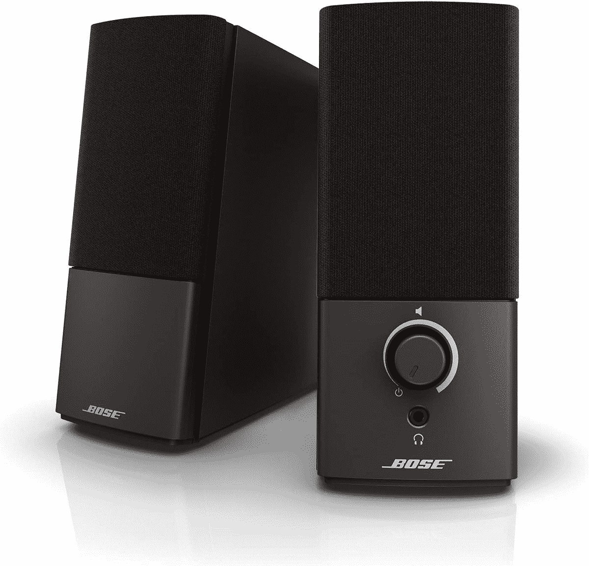
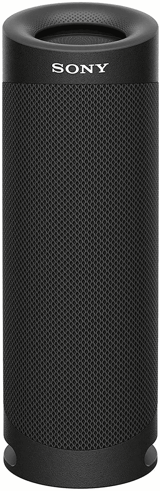
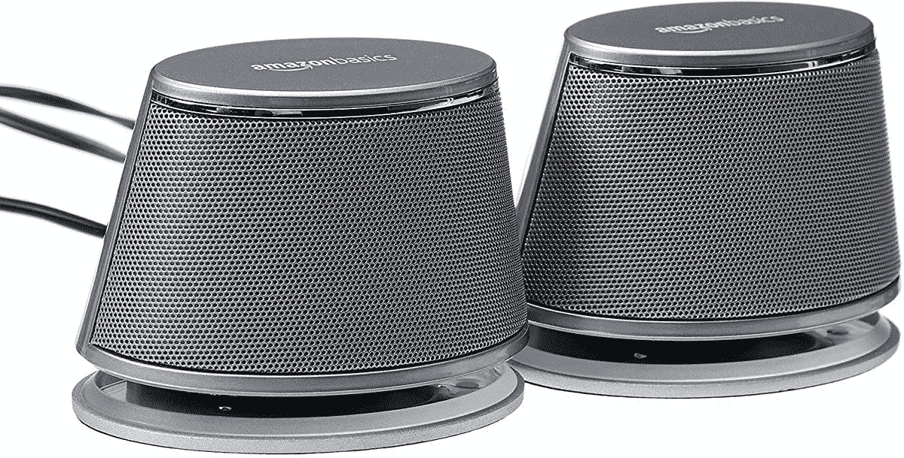
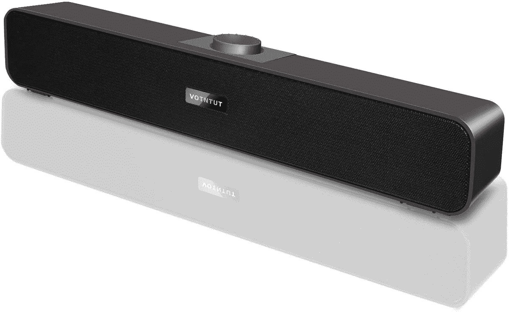
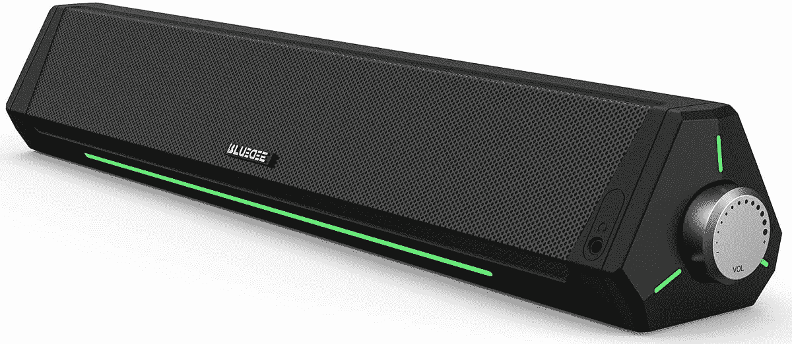

# Mac 工作室的最佳扬声器

> 原文：<https://www.xda-developers.com/best-speakers-mac-studio/>

# Mac 工作室的最佳扬声器

苹果终于发布了全新的 Mac Studio。这里是你能为你的新台式电脑买到的最好的扬声器。

如今，当你买一台 Mac 电脑时，它通常会有一个 M1 芯片。这是因为苹果已经在大多数 Mac 产品系列中从英特尔芯片过渡到自己的 SoC。一些开发者也认真对待这个问题，并为苹果芯片优化他们的[应用程序，以提供更好的体验。除了生产新的芯片，该公司还一直在开发新的 Mac 机型。](https://www.xda-developers.com/best-apps-apple-silicon/) [Mac Studio](https://www.xda-developers.com/apple-mac-studio-m1-ultra-review/) 是该公司迄今为止发布的最新、最强大的台式机。它装有一个 M1 超芯片，这在任何其他电脑上都是不可用的，它运行 macOS Monterey。尽管 Mac Studio 没有内置显示器、鼠标或键盘，但它包括一个内置扬声器。但是，有些人喜欢连接自己的外部。这里是最好的扬声器，可以购买并与您全新的 Mac Studio 配合使用。

*   <picture></picture>

    Bose Companion 2 系列 III 多媒体扬声器

    ##### Bose Companion 2 系列 III 多媒体扬声器

    这些有线扬声器采用极简设计，将适合 Mac Studio 的设计。他们来自一家声誉良好的公司，将为您提供卓越的声音体验。

*   <picture></picture>

    索尼 SRS-XB23 超低音无线便携音箱

    ##### 索尼 SRS-XB23 超低音

    这款索尼无线音箱自带 IP67 防水。它不会在你的桌子上堆满电线，而且很可能在液体溅出时也不会损坏。它的电池一次充电可持续 12 小时。

*   <picture></picture>

    亚马逊基本款 USB 即插即用音箱

    ##### 亚马逊基本款 USB 即插即用音箱

    这款价格实惠的亚马逊基本款有黑色和银色两种颜色可选它将通过有线 USB 连接连接到您的 Mac Studio。

*   <picture></picture>

    VOTNTUT 立体声 USB 供电迷你条形音箱

    ##### VOTNTUT 立体声 USB 条形音箱

    该条形音箱将通过 USB 和 3.5 毫米耳机插孔连接到您的 Mac Studio。它有 6 个月的无忧更换政策。

*   <picture></picture>

    蓝迪动态 RGB 电脑音棒

    ##### 蓝迪动态 RGB 电脑音棒

    这款音棒自带动态 RGB 闪电。它非常适合那些想要为他们的工作或游戏桌面增添独特风格的人。

* * *

尽管 Mac Studio 有内置扬声器，但出于各种原因，一些用户仍然喜欢使用外置扬声器。幸运的是，有扬声器可以满足几乎所有的预算和需求。因此，无论你是想花小钱还是一大笔钱，你都有可能找到一两个符合你期望的。

Mac Studio 重新定义了紧凑型电脑的功能。尽管外形小巧，但它是目前最强大的商用台式机之一。显然，它针对的是需要非凡计算能力的 Pro 用户——而不是有基本需求的一般用户。Mac Studio 银色版在美国的起价为 1999 美元。你可以买一个由 M1 Max 或 M1 Ultra 芯片驱动的。不过，后一种芯片的起价为 3999 美元。

 <picture></picture> 

Apple Mac Studio

##### 苹果 Mac 工作室

Mac Studio 由苹果 M1 Max 或全新的 M1 Ultra 芯片驱动。它只有银色可选，起价 1999 美元。

您会为您的 Mac 工作室购买以下哪一款扬声器？请在下面的评论区告诉我们。