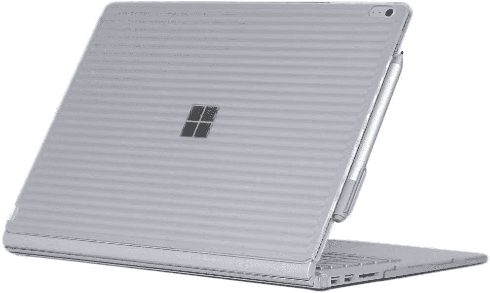
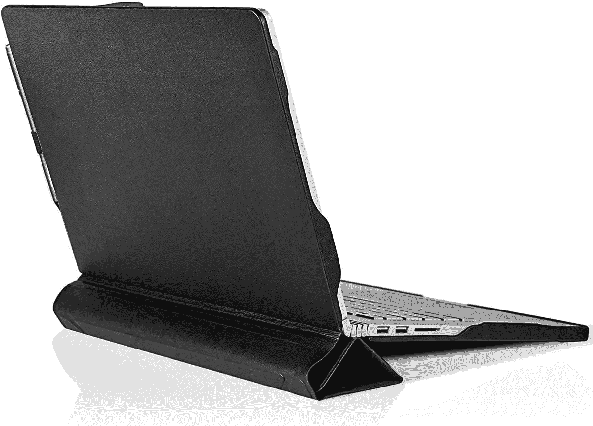

# 2023 年最佳 Surface Book 3 案

> 原文：<https://www.xda-developers.com/best-surface-book-3-cases/>

# 2023 年最佳 Surface Book 3 案

使用这些适用于 13 英寸和 15 英寸机型的保护套和外壳，为您的 Surface Book 3 增加额外的保护。

Surface Book 3 曾经是微软最强大的笔记本电脑。新的 [Surface Laptop 工作室](https://www.xda-developers.com/surface-laptop-studio-review/)接替了它。当它还是新事物的时候，它是开创性的。它采用了高级设计语言和可拆卸的外形，有 13.5 英寸和 15 英寸两种尺寸。虽然由于旧的第 10 代英特尔酷睿处理器和旧的 NVIDIA GeForce GTX 1660 Ti Max-Q 显卡，我们不建议再购买它，但比起 Surface Laptop Studio 的笔记本电脑因素，你可能仍然更介意可拆卸的外形因素。

这使您可以在平板电脑和翻盖外形之间轻松切换。此外，得益于硬件，它可以用于高端任务，如轻度内容创作和轻度游戏。因此，如果你想为你的 Surface Book 3 增加一些额外的保护，这里有一些最好的选择。请注意，下面几乎所有的选项也应该适合 13.5 英寸和 15 英寸版本的 Surface Book 2。

*   <picture></picture>

    UAG 等离子加固保护套

    ##### UAG 等离子 Surface Book 3 保护套

    UAG 等离子加固保护套为 Surface Book 3 13.5 英寸的主平板和键盘面板提供保护。该公司还声称，这种情况下符合军用跌落测试标准(MIL-STD 810G 516.6)。

*   <picture></picture>

    iPearl MC over 硬壳保护套

    ##### iPearl MC over 硬壳 Surface Book 3 保护套

    这种保护套由聚碳酸酯材料制成，充当你的 Surface Book 3 的外壳。它有多种颜色可供 13.5 英寸和 15 英寸型号选择，并为所有端口和连接 Surface Pen 提供了适当的切口。

*   <picture></picture>

    弘毅迅 2 合 1 支架书套

    ##### 弘毅迅书套支架书套 3 套

    一个对开风格的书套，外面采用高品质 PU 皮饰面，里面采用柔软的超细纤维。当你只使用平板电脑时，它还自带支架。值得注意的是，这款保护套仅适用于 13.5 英寸的 Surface Book 3。

*   ##### hey case for Surface Book 3

    这个 case for Surface Book 3 简单高效。它由高质量的合成革制成，内部是柔软的超细纤维。甚至还有一个集成支架，可以帮助您按预期使用您的设备。

*   <picture></picture>

    Forubar 翻盖保护套

    ##### Forubar 翻盖保护套

    这是另一款 PU 皮革保护套，可以保护你的 Surface Book 3，保护套的平板部分带有一个可折叠的折纸风格支架，可以用来提升键盘或用作支架

*   <picture></picture>

    wal new 笔记本电脑保护套

    ##### wal new 保护软套保护套

    这款纤薄的保护套不仅可以在您随身携带时保护您的笔记本电脑。开口处的翻盖非常大，所以你也可以把它当作鼠标垫使用。对于那些从不在旅行时不带外接鼠标的人来说，这太棒了。

*   ##### Tomtoc 360 保护套

    这款适用于 Surface Book 3 的基本保护套有 13 英寸和 15 英寸两种尺寸，并有多种颜色，在旅行期间为您的设备提供衬垫保护。

    T34
*   ##### Megoo 皮套案

    这款皮套用于 Surface Book 3 可以保护你的设备，具有奢华的风格。它有一个很好的皮革外观和防水。里面还有一层超细纤维涂层，可以保护你的设备。

*   <picture></picture>

    塔古斯地层笔记本袖套

    ##### 塔古斯地层笔记本袖套

    这款塔古斯地层笔记本袖套很适合面书 3。它质量上乘，配有肩带和提手，还有额外的口袋，可放置充电器和其他配件。

这是 Surface Book 3 的一些最佳案例。如前所述，其中一些也将与较旧的 Surface Book 2 型号兼容。不过买之前最好检查确认一下。不过，我们还是建议买一个特别设计的箱子。UAG 等离子和 iPearl 麦克弗是最好的两个。但如果你想要更便宜的东西，一个基本的袖子也可以在你外出时保护你的设备。

请务必查看我们关于 2022 年你应该购买的[最佳笔记本电脑](https://www.xda-developers.com/best-laptops/)的综述，我们还专门列出了[最佳微软 Surface PCs。](https://www.xda-developers.com/best-microsoft-surface-pcs/)