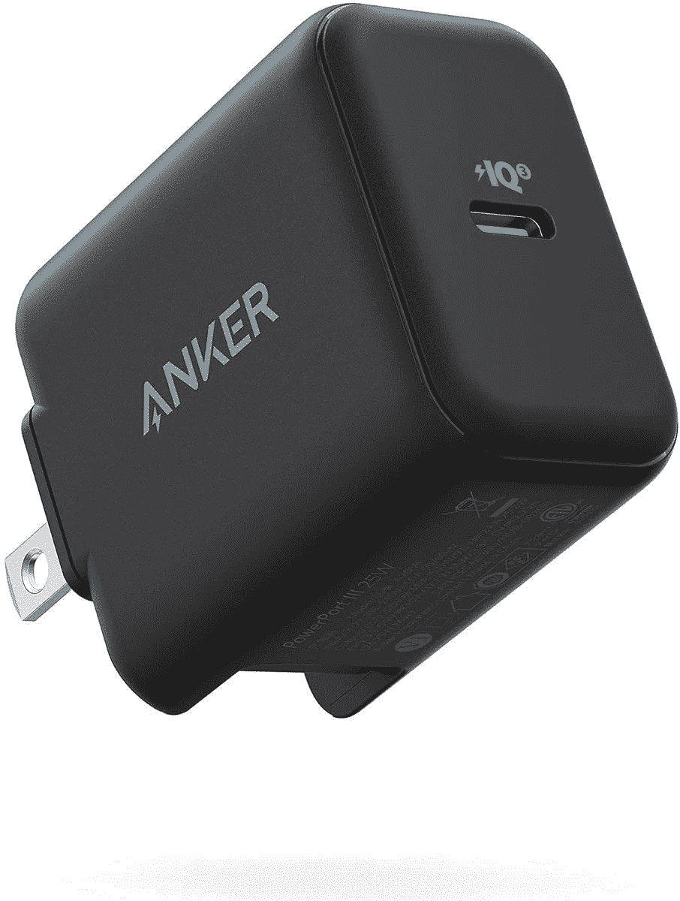
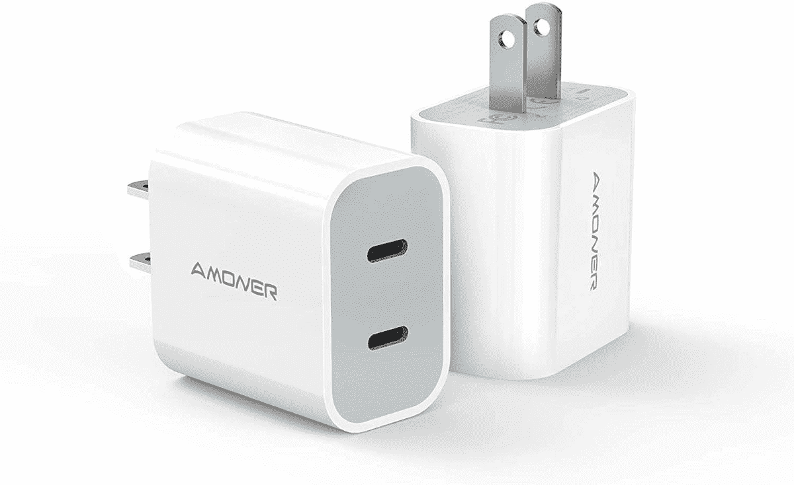
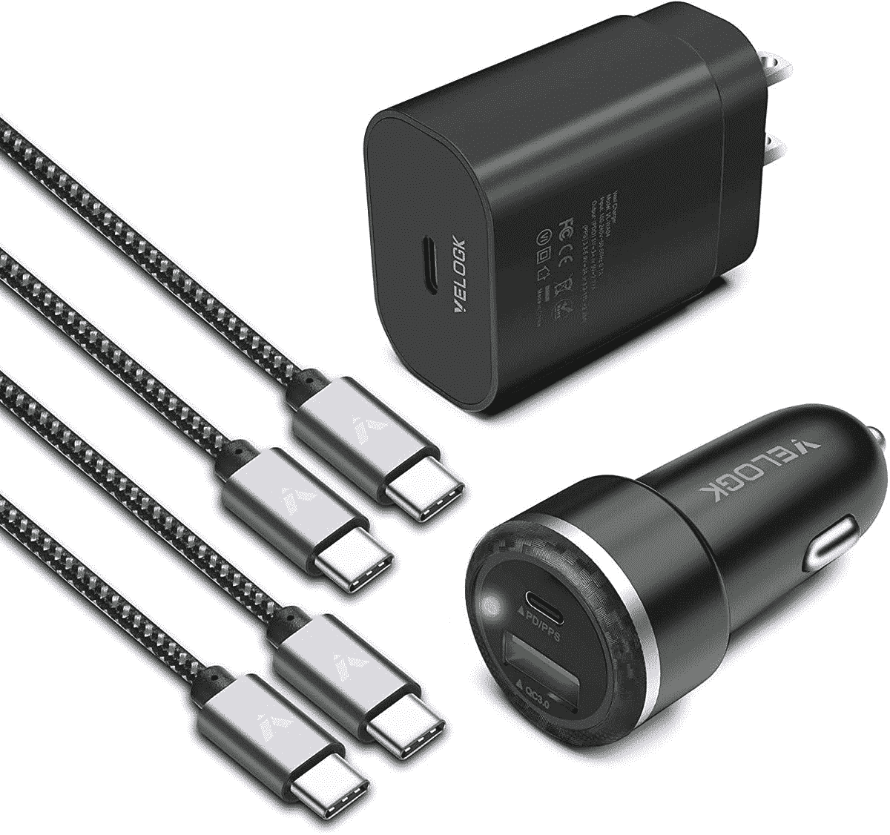

# 2023 年微软 Surface Duo 2 最佳充电器

> 原文：<https://www.xda-developers.com/best-surface-duo-2-chargers/>

# 2023 年微软 Surface Duo 2 最佳充电器

微软的 Surface Duo 2 盒子里没有充电器，所以下面是 2023 年你能买到的最好的。

微软 Surface Duo 2 是对其前身的巨大改进，因为它进行了一系列升级，包括更好的摄像头和软件等。它还包含一些强大的内部功能，因此这款双屏智能手机有很多值得喜欢的地方。但就像目前市场上的大多数其他旗舰产品一样，微软 Surface Duo 2 的盒子里没有充电器。

没错。微软 Surface Duo 2 的包装盒中缺少一个充电器，这意味着你必须单独购买一个充电器，除非你已经有一个较旧的设备。如果你没有这部手机的备用充电器，而你现在想买一个新的，那么你来对地方了。微软 Surface Duo 2 支持 23W 有线充电，使用 USB-C 端口。我们建议至少购买一个支持 USB-PD 的 25W 充电器，以获得最快的充电速度。以下是一些适合您的设备的选项:

*   <picture></picture>

    Anker power port III

    ##### Anker 25W USB-PD 充电器

    编辑推荐

    这款来自 Anker 的简易充电器拥有 25W 输出，支持 USB-PD。它只有一个单一的，它没有一个电缆，所以记住这一点。

*   <picture></picture>

    阿蒙纳 USB-C 充电器

    ##### 阿蒙纳双端口 25W USB-C 充电器

    最超值

    这款来自阿蒙纳的 USB-C 充电器带有两个 USB-C 端口，可以同时为多个设备充电。您还可以在一个包中获得两个充电器，因此它非常超值。

*   ##### Anker 715 充电器(Nano II 65W)

    优质 Pick

    这是 Anker 的一款微型充电器，可以实现高达 65W 的输出。你也可以用这个给你的笔记本电脑充电。

    T44
*   ##### 贝尔金 25W 大功率送 USB-C 充电器

    这款贝尔金 USB-C 充电器支持 25W 输出和 USB-PD 快充。它只有白色，但你可以购买带或不带 USB-C 线的产品。

*   <picture></picture>

    u green 快速充电器

    ##### u green 65W 4 点 USB-C 充电器

    如果你正在寻找一款具有两个以上端口的充电器，那么这款 u green w USB-C 充电器再合适不过了它有三个 C 型端口和 A 型端口，可以同时为多达四个设备充电。

*   <picture></picture>

    快速充电套件

    ##### velo GK 快速充电套件

    此套件包括一个 25W 壁式适配器、一个为您的汽车准备的快速充电器，以及一套两根 USB-C 编织电缆来为您的设备充电。

* * *

这些是你现在可以买到的最好的 Surface Duo 2 充电器。在这个特殊的集合中提到的所有选项都同样好，所以请根据您的需求随意选择一个。如果你只是想给 Surface Duo 2 充电，那么我们建议购买 Anker 25W 充电器。那些想要一次为多个设备充电的人可以看看 Amoner 双端口充电器或 UGREEN 多端口充电器。

 <picture></picture> 

Microsoft Surface Duo 2

##### 微软 Surface Duo 2

Surface Duo 2 对其前身进行了一些急需的改进，现在就可以购买。

那么你打算给你的 Surface Duo 2 买哪个充电器呢？请在下面的评论中留言告诉我们。如果你仍然对购买 Surface Duo 2 犹豫不决，那么你可能想看看我们收集的[最佳可折叠产品](https://www.xda-developers.com/best-foldable-phones/)，看看你是否喜欢其他产品。或者，我们也有一个最好的 Surface 设备的汇总，其中你会发现来自微软的其他 [Surface 设备](https://www.xda-developers.com/best-microsoft-surface-pcs/)。