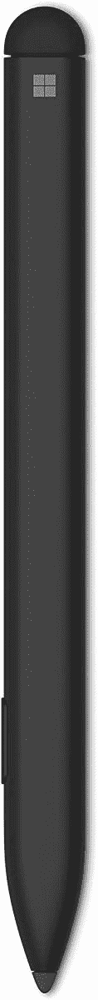
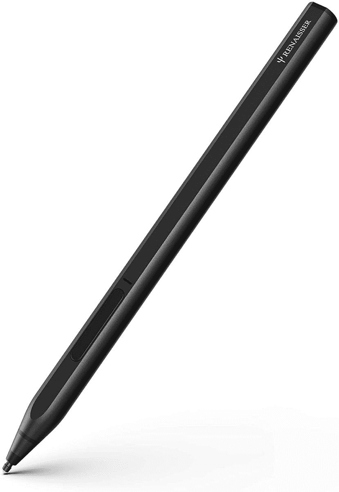
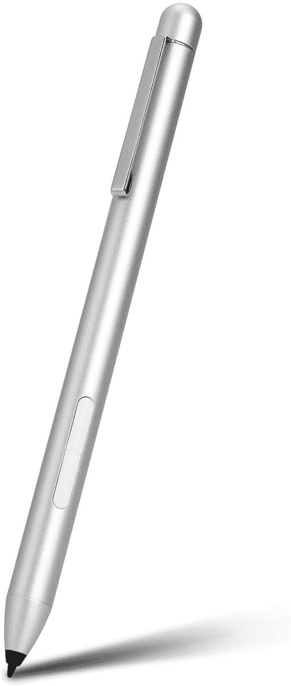
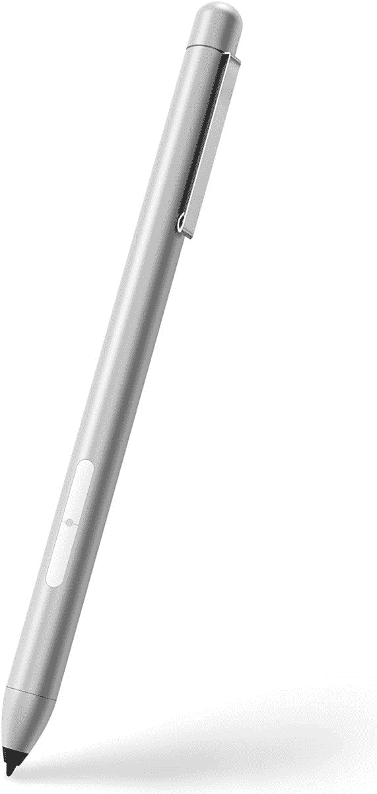
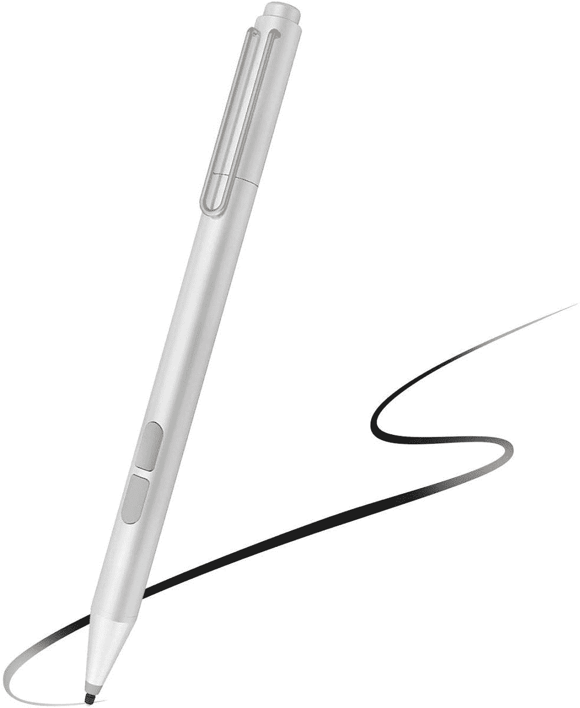
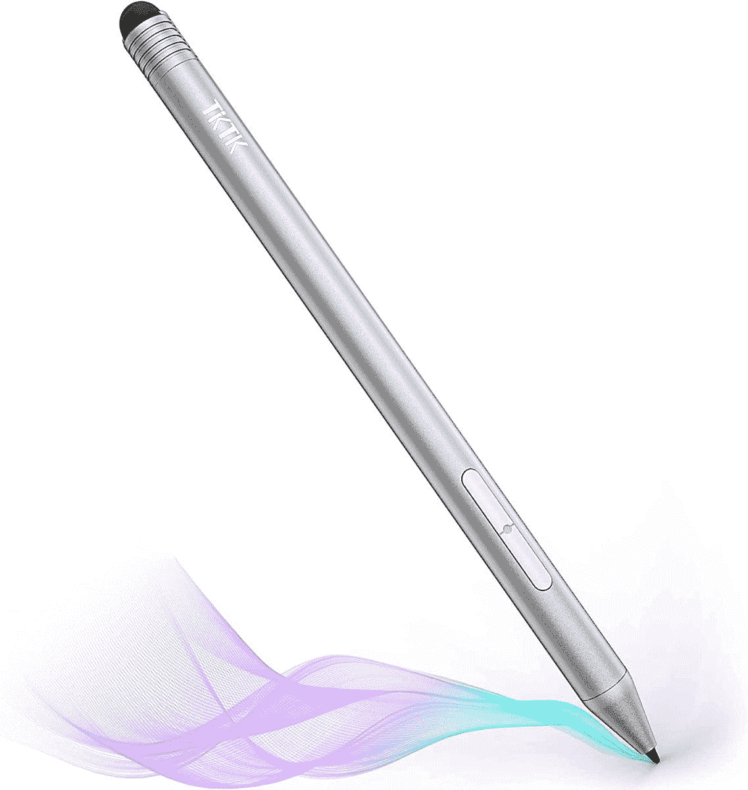
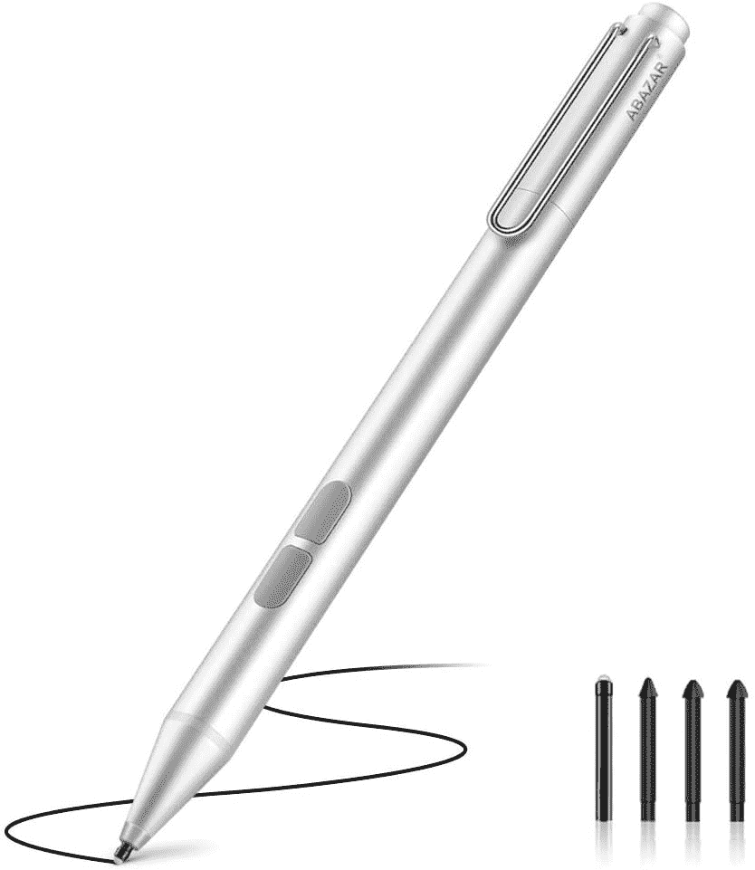
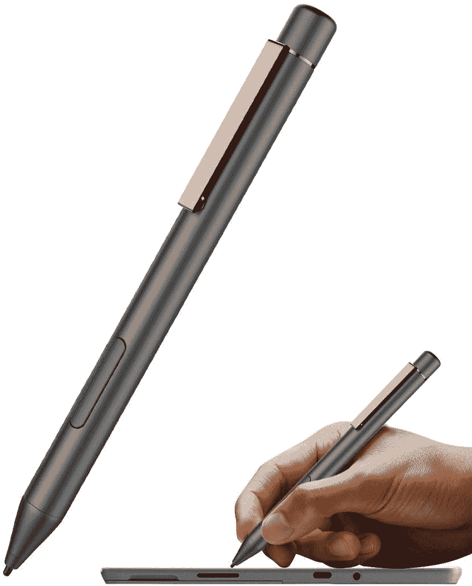

# 2023 年 Surface Duo 2 最佳钢笔

> 原文：<https://www.xda-developers.com/best-surface-duo-2-pens/>

# 2023 年 Surface Duo 2 最佳钢笔

这里有一些最好的 Surface Duo 2 笔和触控笔，你可以买下来在设备的两个大显示屏上做笔记或涂鸦。

除了一些 Surface 电脑外，微软刚刚发布了 T2 Surface Duo 2 T3，这是去年旗舰折叠手机的继任者。Surface Duo 是一款独特的手机，因为它有两个用铰链连接的显示屏。这是微软在整个 Windows Mobile 惨败后首次尝试制造智能手机，结果对他们来说并不太好。虽然 Surface Duo 的硬件非常出色，但它却被半生不熟的软件所辜负。事实上，在它被宣布一年多之后，人们还是可以买到它，但这并没有让事情变得更好。

这一次，Surface Duo 2 带来了一些急需的改进，比如最新的规格和专用的摄像头阵列，以与市场上的[最佳可折叠产品](https://www.xda-developers.com/best-foldable-phones/)竞争。它还保留了最初 Surface Duo - stylus 输入的最佳功能之一。Surface Duo 2 支持笔输入，可以改善设备的使用体验。它还可以帮助您在旅途中进行多任务处理和记笔记。

这里有一些最好的 Surface Duo 2 笔，你可以配合设备使用。我们包括了官方和非官方的选择，你可以根据你真正想花多少钱来挑选。不用说，官方配件总是效果最好的。

 <picture></picture> 

Surface Slim Pen 2

##### 微软 Surface 超薄笔 2

这支笔是微软直接做的，和 Surface Duo 2 配合很好。它带有 4096 个压力点，也易于携带。

 <picture></picture> 

Surface Pen

##### 微软 Surface Pen

这支笔也是微软做的，应该是你的第二选择。虽然它略旧，但它相当便宜，也有 4096 个压力点。

 <picture></picture> 

Renaisser Stylus

##### 雷纳塞拉斐尔 520

这是一款第三方手写笔，同样号称有 4096 个压力点。它有一个 D 形的身体，如果你有一个 Surface Book，它可以磁性附着。

 <picture></picture> 

Ankace Stylus

##### 安卡塞唱针

如果你正在为你的 Surface Duo 2 寻找一支既便宜又能完成工作的笔，这是你应该考虑的一个选择。

 <picture></picture> 

Kimwood Pen

##### 金伍德半岛

这是一支非常便宜的笔，有一些很好的功能，包括 1024 个压力点。它配有一个 1 毫米的精确笔尖。

 <picture></picture> 

Uogic Stylus

##### Uogic 墨水 581 笔

这里有另一个负担得起的手写笔，具有良好的功能。它有 1，024 个压力点，并带有两种不同的笔尖，适用于不同的使用情况。

 <picture></picture> 

TKTK Stylus Pen

##### TKTK 手写笔

这款手写笔也有 1024 个压力点和 1 毫米的笔尖。它有几个额外的按钮，后面还有一块橡皮擦，可能会有用。

 <picture></picture> 

Abazar Active Pen

##### Abazar 活动笔

这款手写笔在功能和按压点上和上一款差不多。这里的主要区别是它带有四个可互换的笔尖。

 <picture></picture> 

JDiction Stylus Pen

##### JDiction 手写笔

虽然这支笔的功能也和这个列表中的其他笔一样，但它看起来比其他笔更时尚。它还有 1024 个压力点。

如果你想在 Surface Duo 2 上记笔记，或者甚至想画些草图，你可以买一些最好的笔。如果预算不是问题，我们建议购买微软的官方 Surface Pen Slim 2，因为它的工作性能最好，压力敏感度也最好。

更便宜的话，你也可以买到功能相似的老款 Surface Pen。如果你不想在触控笔上花这么多钱，我们建议你买一支 Renaisser 触控笔，因为它有 4096 个压力点，就像微软的原装触控笔一样，而且也不是很贵。

 <picture></picture> 

Microsoft Surface Duo 2

##### 微软 Surface Duo 2

Surface Duo 2 是微软最新的可折叠产品，带有一些急需的改进，如更新的内部结构和专用的摄像头模块。