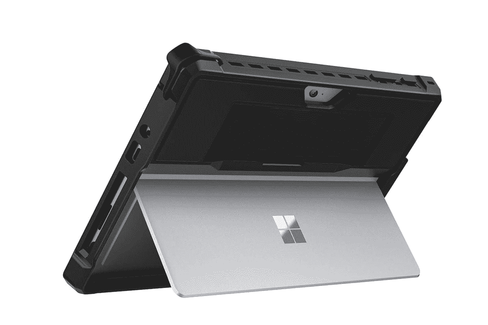
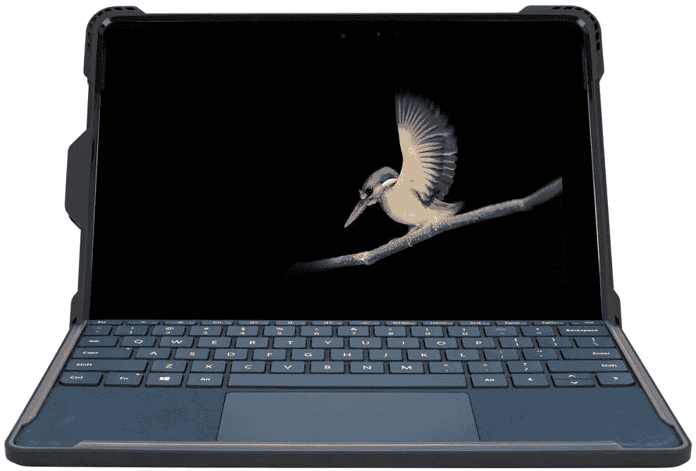
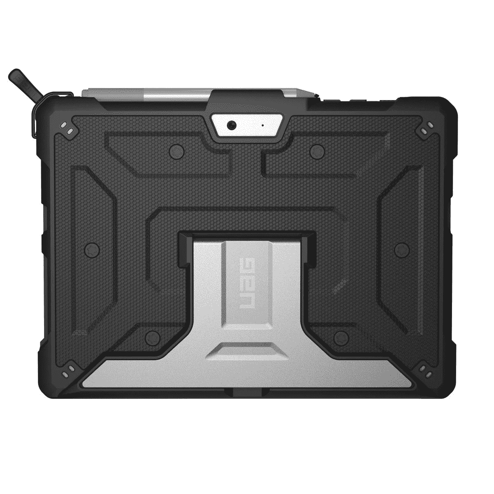
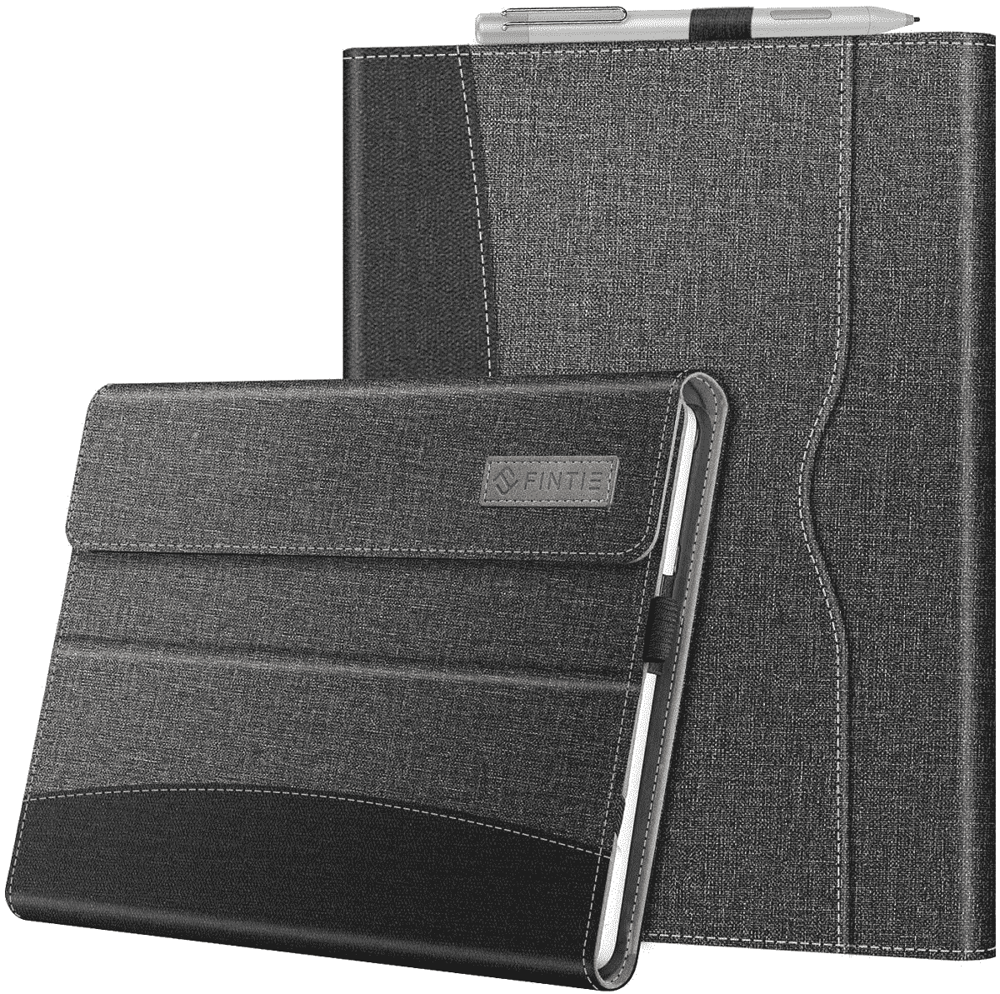
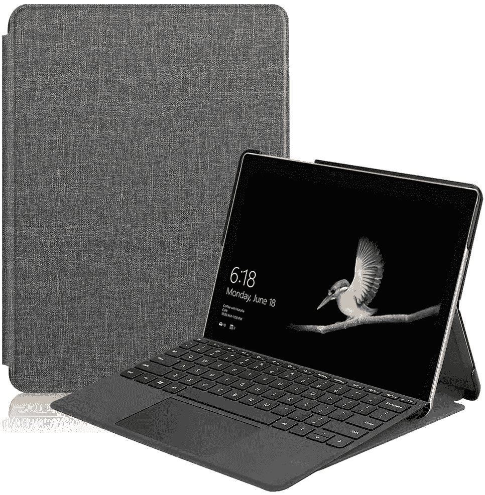

# 2023 年最佳微软 Surface Go 2 案

> 原文：<https://www.xda-developers.com/best-surface-go-2-cases/>

# 2023 年最佳微软 Surface Go 2 案

以下是一些你可以购买来保护你的 Surface Go 或 Surface Go 2 平板电脑的最佳案例。看看他们！

Surface Go 系列是微软提供的最实惠的 Windows 平板电脑。它是为寻找更小版本的 Surface Pro 的客户而设计的，他们可以随身携带，并可以选择连接 Surface Type Cover 键盘来完成生产任务，尽管它不能提供与 Pro 型号相同的性能。

Surface Go 采用 10 英寸显示屏，由英特尔奔腾黄金 4415Y 驱动，搭配高达 8GB 的内存，并可选择 64GB eMMC 或 128GB 固态硬盘。另一方面，Surface Go 2 提供了更大的 10.5 英寸显示屏，可以选择英特尔奔腾黄金 4425Y 处理器或英特尔酷睿 m3-8100Y 处理器。它可以配置 4GB 或 8GB RAM 以及高达 128GB 的 SSD(如果您是商业用户，则为 256GB)。然而，设备本身大小相同，因此适合一个设备的外壳也适合另一个设备。事实上，这同样适用于新的 [Surface Go 3](https://www.xda-developers.com/microsoft-surface-go-3-review/) ，因此这些选项也应该适用于该型号。

这样一来，这里有一些你可以为 Surface Go 2 以及该系列其他产品购买的最佳案例。

*   <picture></picture>

    MoKo 外壳

    ##### MoKo 保护面 Go 2 外壳

    外壳配有优质柔软的 TPU 和坚固的聚碳酸酯表面，可防止碰撞和跌落。它还提供了内置的手带，便于与 Surface Pen holder 一起携带。

*   <picture></picture>

    伊布莱森 Cosmo 表壳-大理石粉色

    ##### 伊布莱森 Cosmo Surface Go 2 表壳

    表壳背面采用独特的大理石饰面，坚固的 TPU 饰面给予全方位保护。它还提供了对设备内置支架的访问，该公司声称，外壳是耐刮擦的，不会随着时间的推移而褪色或变色。

*   <picture></picture>

    Spigen 支架对开本

    ##### Spigen 支架对开本 Surface Go 2 Case

    Spigen 支架对开本适合 Surface Go 2 和 Surface Go 两种表面类型键盘。对开风格的保护套可以让你整齐地折叠和保护你的 Surface，旁边还有一个 Surface Pen 插槽和一个用于存放电缆的大口袋。

*   <picture></picture>

    Targus SafePort 坚固外壳

    ##### Targus SafePort 坚固外壳 Surface Go 2 外壳

    Surface Go 系列最独特的外壳之一，为主要平板电脑和 Surface Type 键盘提供全方位的军用级保护。它还自带内置支架和一个存储 Surface Pen 的插槽。

*   <picture></picture>

    UAG Metropolis Case

    ##### UAG Metropolis Surface Go 2 Case

    UAG 以制作精良的表壳而闻名，Metropolis Case for Surface Go 采用了轻量化设计，提供了军用级别的保护。它配有一个铝制支架，并为连接表面型键盘做好了准备。

*   <picture></picture>

    sup case 独角兽甲虫 PRO

    ##### sup case UB PRO Surface Go 2 case

    独角兽甲虫 PRO 由聚碳酸酯和减震 TPU 制成，并带有内置支架。凸起的挡板为显示屏和背面的摄像头提供保护，而专用的 Surface Pen holder 可确保您不会丢失触控笔。

*   <picture></picture>

    fin tie 保护套

    ##### fin tie Portfolio Surface Go 2 Case

    这款对开风格的保护套保护您的 Surface Go 和 Type Cover 键盘，并为支架提供空间，以便您可以以各种角度调整平板电脑。该案件也有多种颜色可供选择，并具有人造革完成。

*   <picture></picture>

    肯辛顿黑带

    ##### 肯辛顿黑带 Surface Go 2 外壳

    肯辛顿黑带外壳以其符合 MIL-STD-810G 测试协议的坚固耐用的机身设计提供军用级保护。它还在底部提供了快速连接和拆卸键盘的空间，并且不会牺牲平板电脑的内置支架。

*   <picture></picture>

    Ratesell Slim Folio 封面

    ##### Ratesell Slim Folio Surface Go 2 case

    这是一款物美价廉的超薄开本式封面保护 Surface Go 2。这是 Surface Go 系列最纤薄的外壳解决方案之一，有多种颜色和图案可供选择。

这是 Surface Go 和 Surface Go 2 的一些最佳案例。我们的选择是 Targus SafePort 加固型外壳，因为它可以为您的 Surface Go 平板电脑和 Surface Type Cover 键盘提供保护。它还自带支架，提供与平板电脑类似的体验。

如果你打算购买一台新的笔记本电脑，Surface Go 2 不再是我们可以推荐的产品，因为现在有很多更新的选择。如果你需要一台新设备，你可以查看我们推荐的[最佳笔记本电脑，因为现在有很多很好的选择。如果你不想花太多钱，我们也有一份](https://www.xda-developers.com/best-laptops/)[最佳预算笔记本电脑](https://www.xda-developers.com/best-cheap-laptops/)的专门列表。对于那些寻求提供移动连接的人来说，你可以看看[最好的 4G/LTE 笔记本电脑](https://www.xda-developers.com/best-4g-lte-laptops/)。