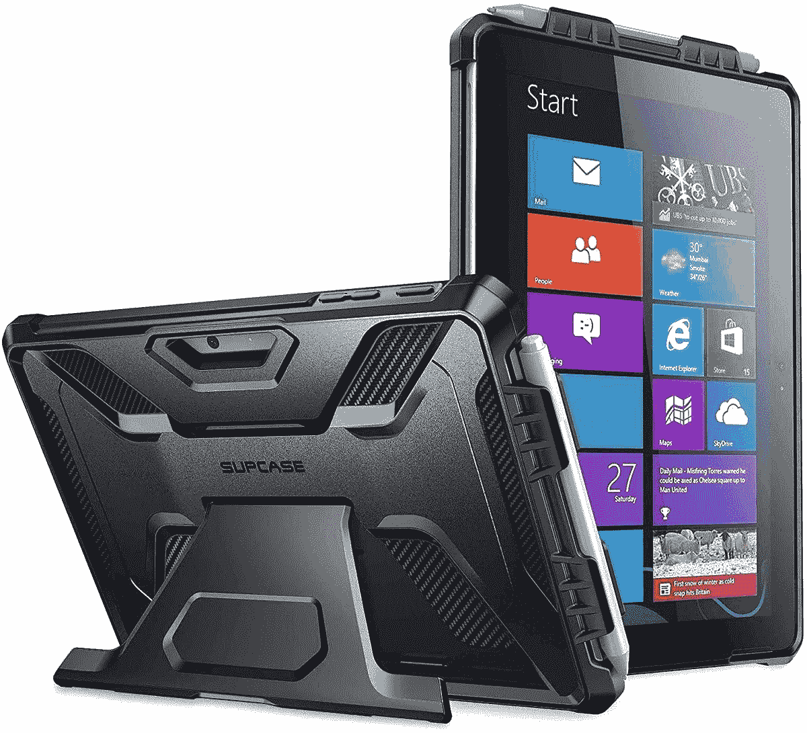

# 微软 Surface Go 3 的最佳案例

> 原文：<https://www.xda-developers.com/best-surface-go-3-cases/>

# 微软 Surface Go 3 的最佳案例

Surface Go 3 来了！爱你的设备的一个秘密是让它保持闪亮。这就是案件的救援之处！

[Surface Go 3](https://www.xda-developers.com/microsoft-surface-go-3-review/) 终于来了！微软在其在线举办的虚拟活动中公布了 2021 年的 Surface 设备系列。最新系列包括几乎所有使用案例的设备。从价格适中的混合型[平板电脑](https://www.xda-developers.com/best-windows-tablets/)，到高端[电脑](https://www.xda-developers.com/best-microsoft-surface-pcs/)，每个人都有一款 Surface 设备。现在，保持喜欢你崭新的、闪亮的玩具的秘密很简单——让它保持闪亮和崭新的外观。这就是 Surface Go 3 cases 来救援的地方！

相比平板电脑或笔记本电脑，人们更倾向于放下智能手机。但是，安全总比后悔好。外壳不仅可以为您的设备增加一层额外的物理保护，还可以使它们更加时尚。后者在 Surface Go 3 上尤其如此——它只有一种颜色。如果你真的想买这款设备，但你碰巧不喜欢铂金表面，那么 case 可能是你(和它)的救星。

声明:下面列出的一些案例是为微软 Surface Go 2 设计的，但它们也可以很好地用于 Surface Go 3。这是因为两种器件的外部尺寸完全相同。

*   <picture></picture>

    sup Case UB Pro 系列全机身支架加固保护壳

    ##### sup Case UB Pro Surface Go 3 Case

    这是一款高级双层保护壳，前盖带有凸起的边框，可以保护您的屏幕免受刮擦和损坏。更值得注意的是，它配有一个功能性支架，因此您的表面仍然保持同样的功能。

*   <picture></picture>

    鳍铁坚硬防震对开本，保护坚固外壳

    ##### 鳍铁坚硬表面 Go 3 案例

    这个案例看起来比其他坚固案例简单。它提供了体面的保护，同时保持您的 Microsoft Surface 的整洁和时尚外观。它有三种颜色可供选择——透明、蓝色和灰色。因此，你是想展示表面的铂金饰面，还是把它全部遮盖起来，完全是你的选择。

*   <picture></picture>

    fin tie 防护型多角度公事包业务封面带口袋

    ##### fin tie 公事包表面走 3 案

    此案从有限提供了一个专业的看，是其他案件无法比拟的它由皮革和亚麻制成，因此看起来和摸起来都非常棒。还支持微软 Type Cover，不会真的碍事。这个箱子有九种不同的颜色和图案供你选择。

*   <picture></picture>

    I-Blason 超薄闪光保护保险杠外壳

    ##### I-Blason Cosmo Surface Go 3 外壳

    该外壳提供可靠的保护，其特点是具有减震的 TPU 保险杠框架和防刮擦的合成革背板。它具有时尚的闪光细节和闪耀的背景，展示了你的设备的外观。与其他类似的箱子相比，它的价格也更低。

*   <picture></picture>

    比格 PU 皮 2-折叠立盖

    ##### 比格皮面走 3 格

    这款皮套从比格的承受力和风格上进行权衡。它有一个非常干净，专业，但相对休闲的外观，所以你可以放心地在正式会议上使用它。与这里的其他特色案例相比，它的价格最低。它有四种不同的颜色和图案供您选择——深蓝色、黑色、红色和爱心树色。

我们希望你能从这个系列中找到至少一个符合你品味和需求的案例。就我个人而言，我会选择大皮套，因为我喜欢它看起来简单又不复杂。它也可以适合正式和非正式的场合，所以它是非常多才多艺的，从外表来看。不过，人们有各种不同的品味和风格，所以我们包括了一些非常多样化的选择，以确保我们迎合不同的用户。最终，即使你不太喜欢箱子，放上一个也会有助于保护你的投资安全。

 <picture></picture> 

Surface Go 3

##### 微软 Surface Go 3

Surface Go 3 用新的第 10 代处理器刷新了其前身。

*你决定**去**处理这些案子中的哪一个？请在下面的评论区告诉我们！*