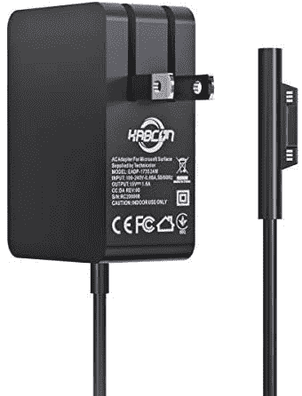
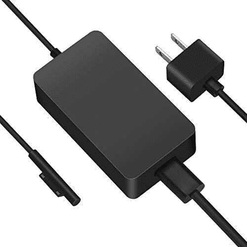

# Surface Go 3 的最佳替代充电器

> 原文：<https://www.xda-developers.com/best-surface-go-3-chargers/>

# Surface Go 3 的最佳替代充电器

如果你的 Surface Go 3 充电器放错了地方或损坏了，有很多替代选项可以让你在家或在旅途中使用。

微软最近推出了其最新入门级平板电脑 [Surface Go 3](https://www.xda-developers.com/microsoft-surface-go-3-review/) 。如果你预算紧张，Surface Go 3 可以为各种任务提供非常好的体验，非常适合基本的网络浏览和编写一些文档或电子邮件。像任何其他 [Surface 设备](https://www.xda-developers.com/best-microsoft-surface-pcs/)一样，Surface Go 3 在盒子里包括一个充电器，但有时会发生意外，你可能会不小心放错或弄坏你的充电器。

如果那发生在你身上，没有必要烦恼。我们已经收集了一系列可以为 Surface Go 3 购买的替换充电器，因此你可以尽快恢复运行。Surface Go 3 在包装盒中配有 24W 充电器，这意味着你可以很容易地找到同样强大的替代品，如果不是更强大的话。奇怪的是，微软似乎没有制造自己的 24W 充电器单独销售(至少我们找不到)，但有很多选择。

*   <picture></picture>

    KABCON Surface Go 充电器

    ##### KABCON Surface Go 充电器

    虽然微软没有提供自己的 24W 充电器，但这款 KABCON 替代品非常适合 Surface Go 3 及其前辈。这是一个简单实惠的基于 Surface Connect 的充电器，没有任何额外的功能，如额外的 A 型端口。

*   <picture></picture>

    家用泡芙 44W 充电器

    ##### 家用泡芙 44W 充电器

    这款来自家用泡芙的充电器共有 44W 的功率，因此可以处理更多耗电的 Surface 设备，但对于 Surface Go 3 来说也很棒。此外，它还有一个 USB 端口，可以为你的手机充电(尽管速度很慢)。这也是一个非常便宜的选择。

*   <picture></picture>

    TOMSENN 65W 充电器适用于 Surface

    ##### TOMSENN 65W PD 充电器

    如果你想给你的 Surface Go 3 等设备充电，这款来自 TOMSENN 的 65W 充电器是一个很棒的选择。它有标准的 USB 端口，但包括一根 Surface Connect 电缆，所以你可以通过磁力为 Surface Go 3 充电，并插入其他 USB 充电器。

*   <picture></picture>

    BatPower ProE 2 电源组和充电器

    ##### bat Power ProE 2 ES7B 电源组

    无论你是在家还是在旅途中，这款 bat Power 套装都包括一个壁式充电器和一个电源组，都能为你的 Surface Go 3 和其他 Surface 设备全速充电。它包括一根 Surface Connect 电缆，但也有 USB 端口为其他设备充电。

*   <picture></picture>

    BIZNET Surface 车载充电器

    ##### biz net Surface 车载充电器

    当您只需要在旅途中保持笔记本电脑的供电时，这款 biz net 车载充电器包括一根 Surface Connect 线缆，可为 Surface 设备充电，最高功率为 30W。这对于 Surface Go 3 来说绰绰有余，因此您可以在旅途中随身携带您的娱乐。

*   <picture></picture>

    Hyphen-X 100W 4 口 USB 充电器

    ##### Hyphen-X 100 w 4 口 PD GaN 充电器

    如果你只是想使用 USB 充电器，这款 Hyphen-X 型号是一个很棒的选择，总输出功率为 100 w。它可以为您的 Surface 和其他三个设备充电，由于使用了氮化镓材料，所有设备都具有紧凑的外形。但是不包括电缆。

*   <picture></picture>

    Anker power port III Pod Lite

    ##### Anker power port III 65W Pod Lite

    想要一个可以轻松滑到任何地方的东西？Anker 的这款 65W USB-C 充电器足够小，可以放在任何包或口袋中，但它仍然可以为 Surface Go 3 充电。不过，你需要买一根 USB Type-C 电缆。

*   <picture></picture>

    Anker 737 电源组

    ##### Anker 737 Power core 26K

    如果你想在家和在旅途中充电，Anker 将其 PowerPort III Pod 墙充电器与 PowerCore III Elite 电源组捆绑在一起，两者都具有 60W 左右的功率输送。

如果你正在为你的 Surface Go 3 寻找新的充电器，这些是我们推荐的选项。无论您想要便宜的东西还是额外的端口和移动充电等额外功能，都有大量选项可供选择。你也可以选择 USB Type-C 充电器，它可以用于更多设备，而不仅仅是 Surface。就我个人而言，我觉得 TOMSENN 65W 充电器最有趣，因为它包括一根 Surface Connect 电缆以及用于其他设备的额外 USB 端口，而且它相当紧凑。

如果你还没有，你可以使用下面的链接购买 Surface Go 3。如果你想完成 Surface 体验，你还可以购买 [Surface Pen](https://www.amazon.com/Microsoft-Surface-Pen-Ice-Blue/dp/B07YNKW95N?tag=xda-6a2slel-20&ascsubtag=UUxdaUeUpU5401&asc_refurl=https%3A%2F%2Fwww.xda-developers.com%2Fbest-surface-go-3-chargers%2F&asc_campaign=Affiliate) 和 [Surface Go Type Cover](https://www.amazon.com/Microsoft-Surface-Signature-Type-Cover/dp/B086Q9WX89?tag=xda-6a2slel-20&ascsubtag=UUxdaUeUpU5401&asc_refurl=https%3A%2F%2Fwww.xda-developers.com%2Fbest-surface-go-3-chargers%2F&asc_campaign=Affiliate) 。否则，看看其他的 [Windows 平板电脑](https://www.xda-developers.com/best-windows-tablets/)，看看它们是否对你更有吸引力。

 <picture></picture> 

Surface Go 3

##### 微软 Surface Go 3

Surface Go 3 采用了来自英特尔的更新处理器，性能显著提高。这是一款重量轻的平板电脑，以实惠的价格提供可靠的体验。