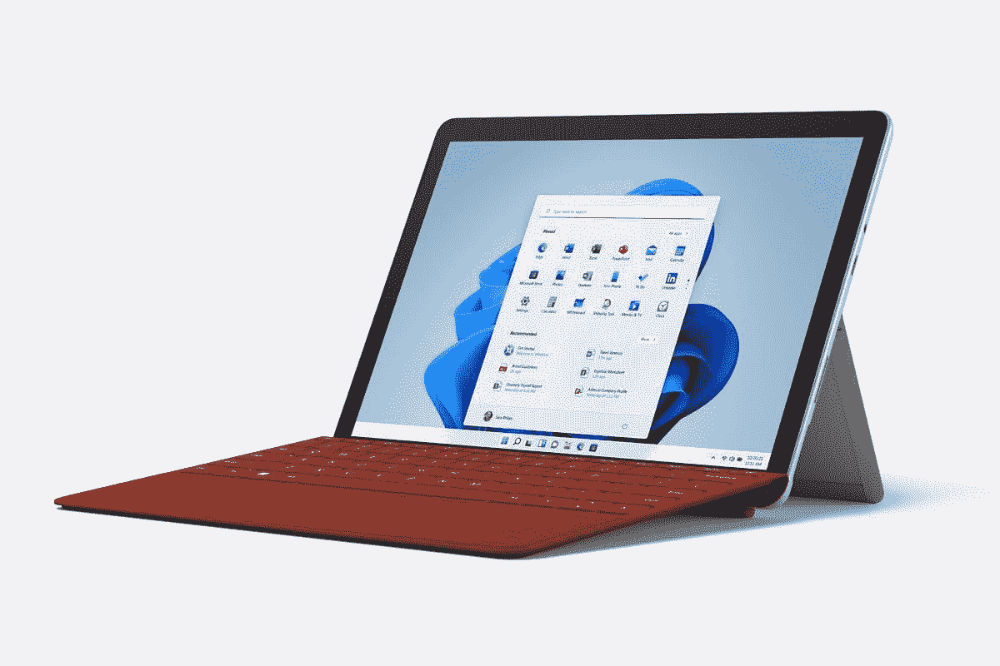
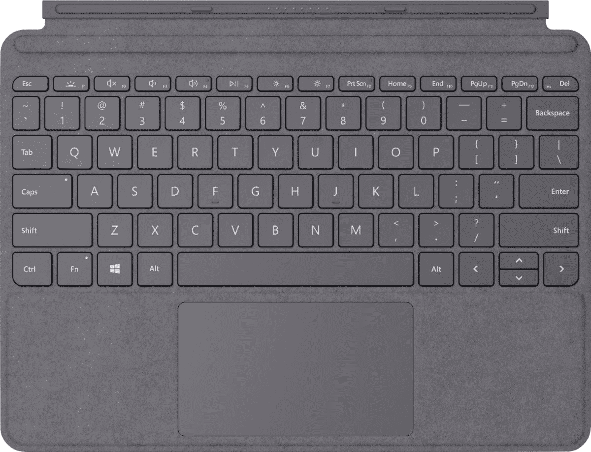
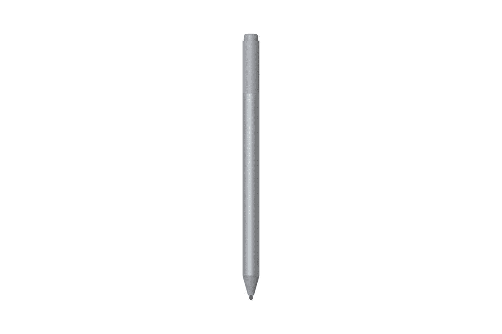
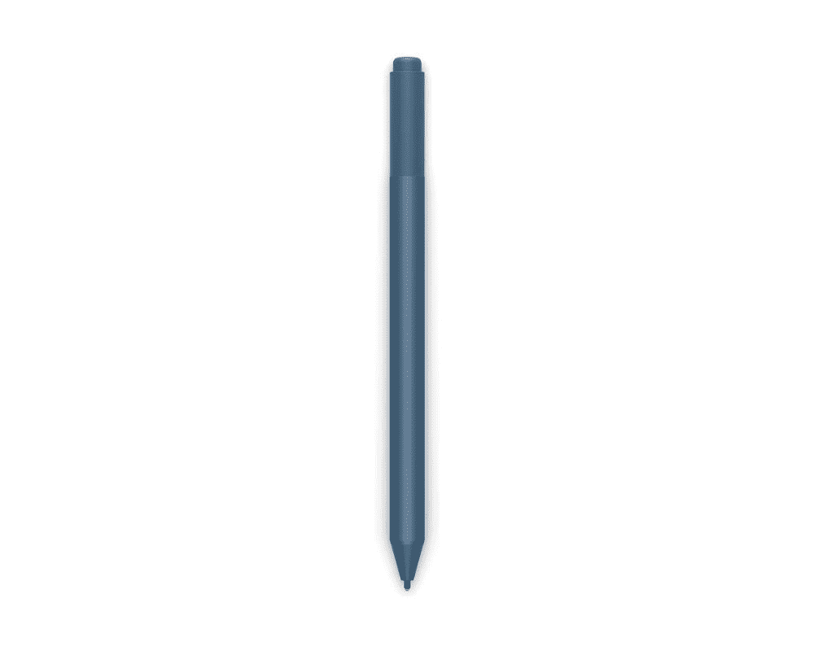

# 这些是你能在 Surface Go 3 上得到的最好的交易

> 原文：<https://www.xda-developers.com/best-surface-go-3-deals/>

Surface Go 系列可能并不处于技术前沿，但对于许多用户来说，它是一款非常棒的小型平板电脑/笔记本电脑。它体积小，重量轻，即使与其他 [Surface 型号](https://www.xda-developers.com/best-microsoft-surface-pcs/)相比也是如此，它仍然可以为各种日常任务提供足够的电力。微软最近推出了 [Surface Go 3](https://www.xda-developers.com/surface-go-3/) ，这是产品线的一大进步，如果你正在寻找最划算的交易，你来对地方了。

需要明确的是，Surface Go 3 的升级并没有真正令人兴奋，但它们肯定是受欢迎的。它现在配备了英特尔奔腾黄金 6500Y 或酷睿 i3-10100Y 处理器，自然比它们的前辈更快。根据基准测试分数，如果您使用 Pentium Gold 型号，您会注意到一个特别大的改进。虽然性能升级总是可以预期的，但它在像这样的价格适中的设备上尤其受欢迎，这些设备本来就不是非常快。你可以在我们的 [Surface Go 3 评测](https://www.xda-developers.com/microsoft-surface-go-3-review/)中了解更多我们的感受。

除了处理器升级之外，新的 Surface Go 3 与以前的型号非常相似。它配有 4GB 或 8GB 内存，您可以选择 64GB eMMC 存储或 128GB 固态硬盘。这都是意料之中的事情，但对于在 Windows 11 上的一次可靠体验来说，这已经足够了。最近，微软还推出了新的[哑光黑色版 Surface Go 3](https://www.xda-developers.com/surface-go-3-matte-black-available/) ，这是 Surface Go 首次有不同的颜色。

外形也是一样的。它配备了 10.5 英寸的 PixelSense 显示屏，分辨率为 1920 x 1280。这意味着它的长宽比为 3:2，这在这么便宜的设备上仍然很少见。不仅如此，你还可以得到像全高清网络摄像头这样的东西，这在像这样的平价电脑上也非常罕见。如果你是一个偶尔寻找轻量级用例的可靠体验的用户，这仍然是很棒的。如果你对 Surface Go 3 感兴趣，这里有你可以在上面买到的最好的交易。

## 亚马孙

作为世界上最大的零售商之一，亚马逊自然是购买各种东西的热门场所，Surface Go 3 也不例外。您可以使用下面的链接找到所有现有的配置。白金型号目前正在打折，配备英特尔奔腾黄金、8GB 内存和 128GB 固态硬盘的中端型号便宜 80 美元，仅售 469.99 美元。其他型号打折 60 美元，不包括仍为全价的 LTE 版本。哑光黑色版本也不打折。

 <picture></picture> 

Surface Go 3

##### 微软 Surface Go 3

Surface Go 3 是一款运行 Windows 11 的轻量级便携平板电脑。该型号配备英特尔奔腾处理器、4GB 内存和 64GB eMMC 存储。

当然，你可以用 Surface Go 类型的盖子和 Surface Pen 来完成你的设置，亚马逊几乎总是有这些 Surface Go 3 配件的交易。在撰写本文时，你可以以低至 62 美元(优惠 38 美元)的价格购买 Surface Go 类型的封面，或者支付 80 美元购买签名款(优惠 50 美元)。Surface Pen 也降价 45 美元，使其价格低于 55 美元。

 <picture></picture> 

Surface Go Type Cover

##### 微软 Surface Go USB 盖

由于增加了键盘和触控板，Surface Go 类型的外壳允许您像使用典型的笔记本电脑一样使用 Surface Go。它还可以在您不使用时盖住屏幕，帮助防止刮伤。

 <picture></picture> 

Surface Pen

##### 微软 Surface Pen

Surface Pen 是微软官方为 Surface 设备推出的主动笔，包括 Surface Go 3。它有 4096 级的压力和倾斜支持。它通过磁力附着在平板电脑的侧面，有四种不同的颜色。

## Adorama

Adorama 也是各种电子产品的热门零售商，Surface Go 3 也可以在那里找到。奇怪的是，基本型号比微软的 MSRP 贵，但中端型号便宜 20 美元，所以就这样了。

 <picture></picture> 

Surface Go 3

##### 微软 Surface Go 3

Adorama 正在销售 Surface Go 3 的所有配置，它们在大多数型号上都符合微软的官方定价。

如果你想让 Surface Go 3 感觉更像一台笔记本电脑，你也可以用 Surface Go Signature 类型的外壳来扩展它，这种外壳目前从其通常的 130 美元的价格打折到不到 109 美元。还有 Surface Pen，目前售价 89.99 美元(优惠 10 美元)。可以在下面买。

 <picture></picture> 

Surface Go Type Cover

##### 微软 Surface Go 签名 USB 盖

Surface Go 类型的外壳是 Surface Go 3 的一个很好的补充，可以将其变成一台笔记本电脑。它目前减价 21 美元。

 <picture></picture> 

Surface Pen

##### 微软 Surface Pen

Surface Pen 可以让你在 Surface Go 3 和其他支持 MPP 的设备上更自然地记笔记。冰蓝色版本目前优惠 10 美元。

## 百思买集团

百思买是购买各种电子产品的最佳场所之一。它不仅是一家声誉良好的零售商，如果你喜欢，你还可以订购店内提货的商品，并且你可以获得商店的价格匹配保证。你可以使用下面的链接在百思买购买 Surface Go 3，有几款机型打折。8GB 内存的 Pentium Gold 型号降价 55 美元，仅售 495 美元。百思买也是少数几个已经有新的哑光黑色版本的地方之一，你可以在这里找到，尽管我们应该注意到这些型号没有打折。

 <picture></picture> 

Surface Go 3

##### 微软 Surface Go 3

Surface Go 3 是一款运行 Windows 11 的轻量级便携平板电脑。与前代产品相比，它也升级了处理器。

如果你想要完整的笔记本电脑体验，获得 Surface Go Signature 类型外壳(或[标准型外壳](https://shop-links.co/1763535183797976255?u1=98a8439f-176a-463e-a00c-dd386bdc0302))和 Surface Pen 也是一个好主意。你可以使用下面的链接购买它们，根据颜色的不同，Surface Go 类型的外壳售价仅为 85 美元，便宜 45 美元。

 <picture></picture> 

Surface Go Type Cover

##### 微软 Surface Go 签名 USB 盖

Surface Go 类型的外壳允许您像使用典型的笔记本电脑一样使用 Surface Go，增加了键盘和触控板。它还可以在您不使用屏幕时保护屏幕。

 <picture></picture> 

Surface Pen

##### 微软 Surface Pen

Surface Pen 是微软官方为 Surface 设备推出的数字笔。它有 4096 级的压力和倾斜支持。另外，它有四种不同的颜色。

## B&H 照片

另一个受欢迎的电子产品零售商，特别是那些面向创意专业人士的零售商，是 B&H 照片。这里也有 Surface 设备，当然，这也包括 Surface Go 3。B&H 四种配置都有，有些比平时便宜一点。配备 8GB 0f 内存的奔腾金色型号售价 519 美元，而顶级酷睿 i3 版本(仅 Wi-Fi)为 599.99 美元——两者都比 MSRP 低 30 美元左右。

 <picture></picture> 

Surface Go 3

##### 微软 Surface Go 3

Surface Go 3 是一款运行 Windows 11 的轻量级便携平板电脑。您可以获得高达 8GB 的内存和 128GB 的固态硬盘，外加第 10 代英特尔酷睿 i3。

为了获得完整的体验，你可以添加一个 Surface Go 类型的外壳，B&H 的售价比微软的 MSRP 还要低。标准黑色款为 79.99 美元(优惠 20 美元)，而签名款根据你选择的颜色低至 89.99 美元(优惠 40 美元)。Surface Pen 也降价 30 美元，售价为 69.99 美元。通过这种方式，加上前面提到的 Surface Go 3 本身的交易，你可以节省多达 70 美元。

 <picture></picture> 

Surface Go Type Cover

##### 微软 Surface Go USB 盖

Surface Go 类型的外壳允许您像使用带键盘和触摸板的典型笔记本电脑一样使用 Surface Go。目前在 B&H 也降价 30 美元。

 <picture></picture> 

Surface Pen

##### 微软 Surface Pen

Surface Pen 支持 4096 级压力和倾斜，让您可以做笔记和画画。现在，你可以花 30 美元买到它，甚至免费得到一个微软移动鼠标！

## 微软

微软也是购买 Surface Go 3 的一个很好的选择。所有的配置都可以买到——尽管它们通常也可以在其他零售商那里买到——而且你是从一个有信誉的来源买到的。你可以选择你的配置，添加 Type Cover 或 Surface Pen，等等，一气呵成，所以这可能是最无缝的购买体验。

如果你不是白金版的粉丝，你也可以购买新的哑光黑色版 Surface Go 3。8GB 内存的奔腾和酷睿 i3 型号都在打折，低端版本比通常价格低 80 美元。亚马逊等其他零售商也有类似的折扣，但在这里，它也适用于哑光黑色版本，这是你唯一能买到它的地方。

 <picture></picture> 

Surface Go 3

##### 微软 Surface Go 3

Surface Go 3 是一款价格实惠、超便携的平板电脑。最新一代具有更高的性能，可以开箱即用地运行 Windows 11。

## 新蛋

最后，Newegg 也是一家非常受欢迎的电子产品零售商，它也是购买 Surface Go 3 的一个不错的选择。不过，在撰写本文时，这些型号没有任何值得注意的折扣，所以你将支付全价。

 <picture></picture> 

Surface Go 3

##### 微软 Surface Go 3

Surface Go 3 是一款运行 Windows 11 的轻量级便携平板电脑。基本配置有英特尔奔腾处理器、4GB 内存和 64GB eMMC 存储，价格为 399.99 美元。

 <picture></picture> 

Surface Go 3

##### 微软 Surface Go 3

Surface Go 3 是一款运行 Windows 11 的轻量级便携平板电脑。该型号配备英特尔奔腾处理器、8GB 内存和 128GB 固态硬盘存储。

 <picture></picture> 

Surface Go 3

##### 微软 Surface Go 3

Surface Go 3 是一款运行 Windows 11 的轻量级便携平板电脑。该型号配备英特尔酷睿 i3-10100Y 处理器、8GB 内存和 128GB 固态硬盘存储。

你也可以在 Newegg 购买 Surface Go 类型的盖子和 Surface Pen，尽管你可能会在 Newegg 本身之前看到第三方卖家。目前，Surface Go 类型的封面价格低至 74.99 美元。Surface Pen 在第三方卖家那里也有折扣，根据你想要的颜色低至 55 美元。

 <picture></picture> 

Surface Go Type Cover

##### 微软 Surface Go USB 盖

Surface Go 类型的外壳允许您像使用带键盘和触摸板的典型笔记本电脑一样使用 Surface Go。

 <picture></picture> 

Surface Pen

##### 微软 Surface Pen

Surface Pen 支持 4096 级压力和倾斜，让您可以做笔记和画画。