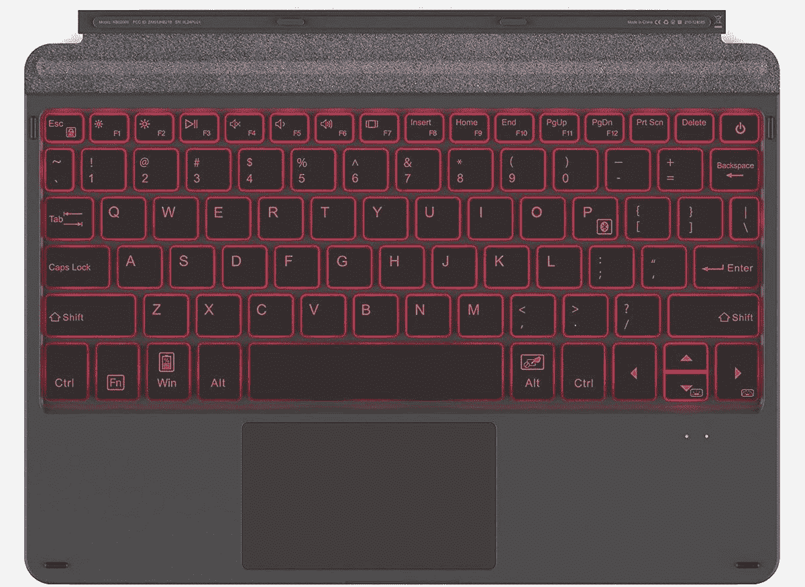
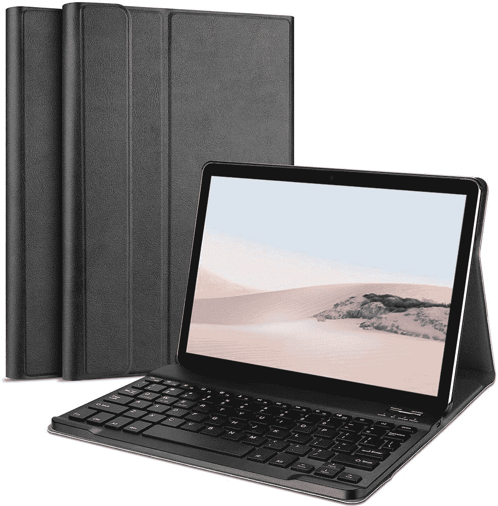
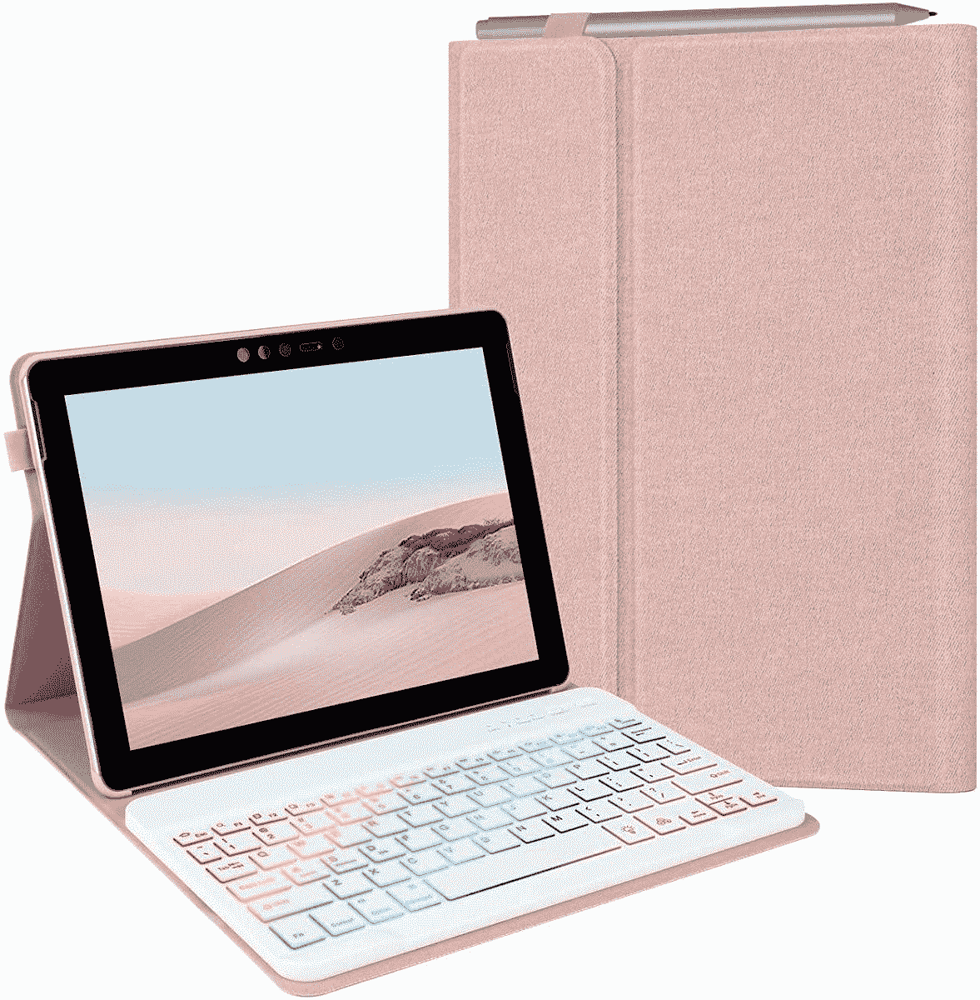
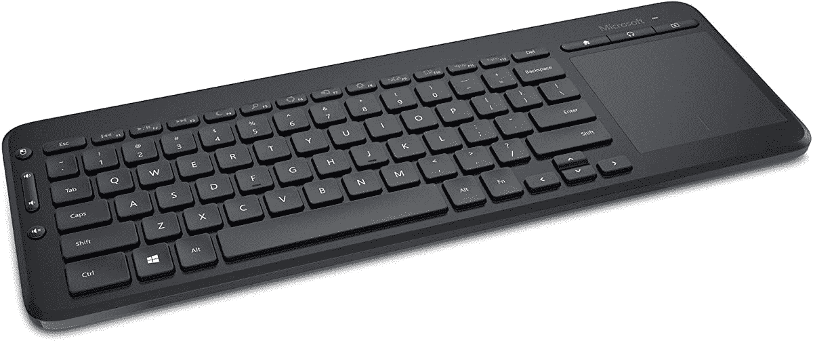

# 2023 年 Surface Go 3 最佳键盘

> 原文：<https://www.xda-developers.com/best-surface-go-3-keyboards/>

# 2023 年 Surface Go 3 最佳键盘

寻找一个键盘来补充你的 Surface Go 3？从键盘盖到办公室键盘，以下是您的最佳选择。

微软的 [Surface Go 3](https://www.xda-developers.com/microsoft-surface-go-3-review/) 是一款坚固的入门级平板电脑，性能更好，体验也和上一代一样棒。就价格而言，它有一些很好的品质，比如高质量的网络摄像头和显示屏。另外，它非常轻巧便携，总体来说是你能买到的[最好的 Windows 平板电脑](https://www.xda-developers.com/best-windows-tablets/)之一。但是平板本身只是体验的一半，那么如果你想像笔记本电脑一样使用它呢？Surface Go 3 配备键盘更好，因此我们为您收集了最佳选项。

当然，既然是平板电脑，你大概是想要一个可以方便随身携带的东西吧。在很多情况下，键盘还可以兼作 Surface Go 3 的保护。不管你在找什么，我们都有很多选择。

*   <picture></picture>

    Inateck Surface Go 键盘

    ##### Inateck Surface Go 键盘外壳

    如果你想要更实惠和可定制的东西，这款 Inateck 键盘提供了七种不同颜色的键盘背光选项。它仍然是磁性连接，但它通过蓝牙连接，所以即使它没有连接，你也可以使用它。

*   <picture></picture>

    Brydge 10.5 Go+

    ##### Brydge 10.5 Go+

    Brydge 让帮助 Surface Go 3 的超级炫酷键盘感觉像真的笔记本电脑。它通过蓝牙连接，并包括一个精密的触摸板和背光键盘，所有这些都具有优质的构建质量，可以像普通笔记本电脑一样轻松输入和使用。

*   <picture></picture>

    罗技 MX Mechanical

    ##### 罗技 MX Mechanical

    那些花很多时间在电脑上写东西的人都知道机械键盘有多棒，罗技的这款非常适合完成工作。它具有紧凑的设计和低矮的开关，此外，它还允许您在线性、点击和触觉选项之间进行选择。

*   <picture></picture>

    ProCase 键盘套对于 Surface Go 2

    ##### ProCase Surface Go 键盘套

    不在乎触控板？ProCase 的这款包裹式外壳只为您提供带有磁性附件的键盘，用于 Surface Go。键盘通过蓝牙连接，外壳从各个角度保护你的 Surface Go 3。

*   <picture></picture>

    首席运营官 Surface Go 键盘套

    ##### Coo Surface Go 键盘套

    这是另一款仅支持键盘的型号，采用环绕式设计保护您的 Surface Go 3。不过，这款还有一个笔环，所以你可以比使用磁性附件更安全地存放你的 Surface Pen(或其他型号)。

*   <picture></picture>

    微软无线多功能一体媒体键盘

    ##### 微软无线多功能一体媒体键盘

    如果你正在使用 Surface Go 3 为你的媒体中心供电，或者你只是想要一个小巧的键盘和鼠标解决方案，这款微软品牌的键盘是一个绝佳的选择。它包括一个触控板来控制你的鼠标光标。

*   <picture></picture>

    Surface 人体工学键盘

    ##### Surface 人体工学键盘

    你可能没有注意到，但是当你长时间坐在办公桌前时，你的姿势可能会开始对你不利。Surface 人体工程学键盘有助于缓解这一问题，其设计让您的手腕更加自然地休息，并让所有按键都触手可及。这可能看起来很奇怪，但感觉很棒。

*   <picture></picture>

    Arteck 超薄蓝牙键盘

    ##### Arteck 超薄蓝牙键盘

    如果你只是需要一个便宜的键盘在紧要关头使用，这可能是你理想的选择。它的设计很紧凑，可以与几乎任何蓝牙设备配合使用，因此不仅仅适用于 Surface Go 3。它也非常实惠，有两种颜色可供选择。

这些是你能为 Surface Go 3 找到的最好的键盘选项。取决于你最看重什么，每一个都有自己的价值。如果你想要一个可靠的连接，官方的 [Surface Go 类型外壳](https://www.amazon.com/NEW-Microsoft-Surface-Type-Cover/dp/B086Q9WX89?tag=xda-3dkrqq4-20&ascsubtag=UUxdaUeUpU5373&asc_refurl=https%3A%2F%2Fwww.xda-developers.com%2Fbest-surface-go-3-keyboards%2F&asc_campaign=Affiliate)是最好的，因为它是唯一一个使用专有 Surface 键盘连接器而不是蓝牙的外壳。另一方面，像 [Brydge 10.5 Go+](https://www.amazon.com/Brydge-Wireless-Precision-Compatible-Microsoft/dp/B08CWLKWK6?tag=xda-3dkrqq4-20&ascsubtag=UUxdaUeUpU5373&asc_refurl=https%3A%2F%2Fwww.xda-developers.com%2Fbest-surface-go-3-keyboards%2F&asc_campaign=Affiliate) 这样的东西非常酷，因为它真正让 Surface Go 3 感觉像一台真正的笔记本电脑。此外，对于办公室设置，像罗技 MX 机械是真正的地方。机械键盘非常棒，由于这款键盘设计简洁，非常适合工作。

如果你还没有，你可以使用下面的链接购买 Surface Go 3。或者，如果你想要更强大或不同的东西，你可以看看今天可以买到的[最好的 Surface PC](https://www.xda-developers.com/best-microsoft-surface-pcs/)。