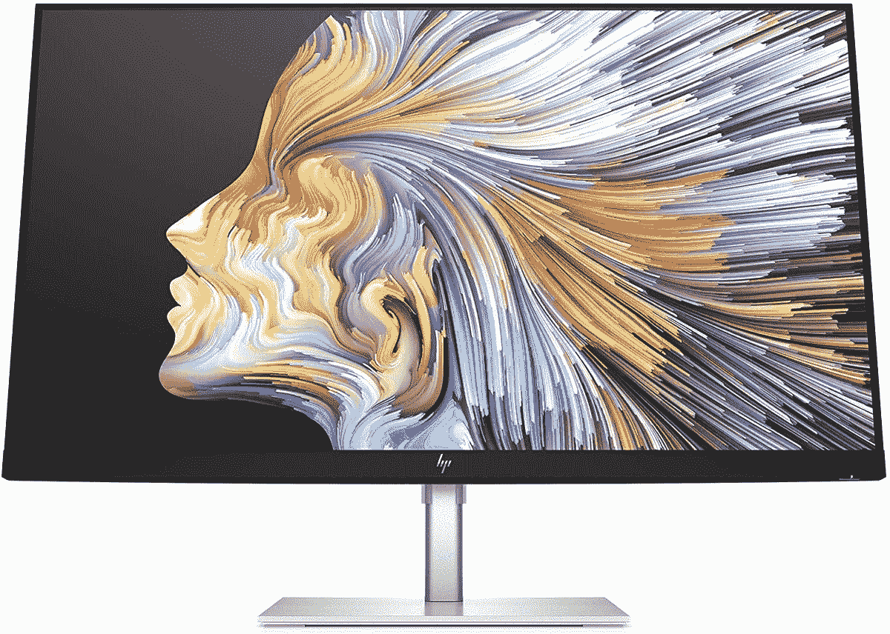
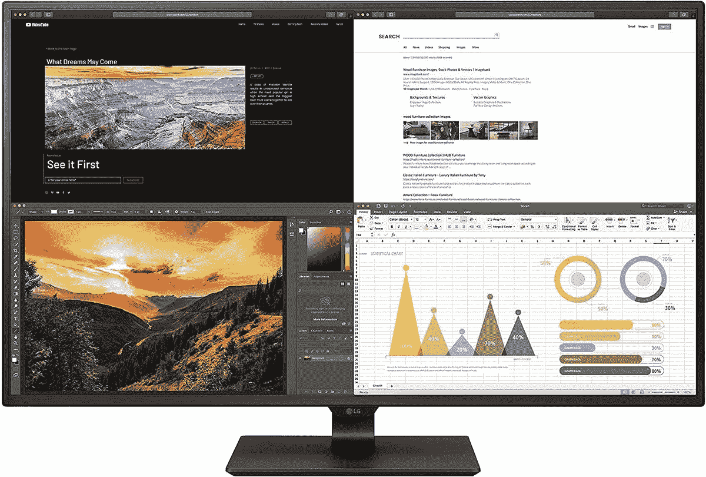

# Surface Go 3 的最佳显示器

> 原文：<https://www.xda-developers.com/best-surface-go-3-monitors/>

# Surface Go 3 的最佳显示器

想在 Surface Go 3 上使用外接显示器吗？以下是你在家或旅行时可以使用的最佳选择。

[Surface Go 3](https://www.xda-developers.com/microsoft-surface-go-3-review/) 是微软最新的平价平板电脑，也是[微软 Surface 家族](https://www.xda-developers.com/best-microsoft-surface-pcs/)的重要组成部分。虽然它可能不会像 Surface Pro 8 或 Laptop Studio 那样令人兴奋，但拥有一个可靠的入门级产品非常重要。Surface Go 3 以实惠的价格提供了全方位的可靠体验，现在它明显比它的前代产品更强大。然而，它相对较小，所以如果你想要第二个屏幕——或者只是一个更大的屏幕——我们已经收集了一些最好的显示器来配合 Surface Go 3 使用。

这款平板电脑需要记住的一点是，它没有典型的显示输出，因此您的选择有些有限。你可以找到一个 USB Type-C 显示器，或者使用 Surface Dock 来使用更传统的输出，如 HDMI。在我们的综述中，几乎所有的显示器都有 USB Type-C 输入，所以你不需要经历购买坞站或适配器的麻烦。

*   <picture></picture>

    LG UltraWide 35 wn 75 cn-B

    ##### LG ultra wide 35 wn 75 cn-B

    如果您需要更多空间来执行多任务，这款 LG ultra wide 显示器可为您提供四路高清 21:9 显示屏，让您可以随心所欲地拍摄任意多种应用。此外，它支持 HDR10 和高达 100 赫兹的刷新率，如果你有另一台电脑来利用它。

*   <picture></picture>

    惠普 U28 4K HDR

    ##### 惠普 U28 4K HDR 显示器

    如果你想要出色的观看体验，惠普 U28 显示器是媒体消费的绝佳选择。这是一款支持 DisplayHDR 400 的 4K 显示器，采用 IPS 显示屏。它也是用回收材料制成的，而且相对于它所提供的东西来说相当便宜。

*   <picture></picture>

    惠普 M22f

    ##### 惠普 M22f 显示器

    如果你正在寻找更便宜的产品，惠普 M22f 是一个很好的选择。它采用时尚现代的设计，提供全高清分辨率和 75Hz 刷新率。这相当便宜，尤其是如果你能找到折扣的话。

*   <picture></picture>

    华硕 ProArt 显示器 pa 279 cv

    ##### 华硕 ProArt PA279CV 27 英寸 4K UHD 显示器

    如果您正在进行色彩敏感的工作，并且需要最准确的色彩显示，华硕 ProArt PA279CV 是您可以获得的最佳选择之一。它有一个 Delta E < 2，所以颜色看起来很逼真。这也是一个 4K IPS 显示器，所以一切看起来都很棒。

*   <picture></picture>

    LG 43un 700-B

    ##### LG 43un 700-B

    对于普通显示器不够用的时候，LG 的这款 43 英寸显示器可以满足您的任何需求。这是一个 4K 面板，另外它支持 HDR10 和 10W 扬声器，以获得身临其境的声音。它还内置了四向分屏功能。

*   <picture></picture>

    LG 24 qp 500-B

    ##### LG 24 qp 500-B

    如果您想要一款价格实惠、功能齐全的显示器，这款显示器是一个绝佳的起点。它有一个 24 英寸的四高清 IPS 面板，这对于它的价格来说是非常棒的，加上 75Hz 的刷新率。然而，你需要一个 HDMI 或显示端口适配器。

*   <picture></picture>

    联想 ThinkVision M14

    ##### 联想 ThinkVision M14

    有时候即使不在办公室，你也需要一个额外的屏幕。联想 ThinkVision M14 可以通过 USB Type-C 连接在任何地方为您提供 14 英寸的全高清显示屏，并且它非常薄，因此您可以轻松地将它带到 Surface Go 3 的任何地方。

*   <picture></picture>

    华硕 Zen screen MB 16 AHP

    ##### 华硕 ZenSCreen MB16AHP

    如果你担心第二台显示器会耗尽你 Surface Go 3 上的电池，这款显示器内置了电池，所以它有自己的电源，可以持续长达四个小时。如果你喜欢额外的空间，加上内置扬声器，这是一个更大的 15.6 英寸显示器。

所有这些都是 Surface Go 3 的绝佳选择，因为它们中的大多数都可以使用开箱即用的 USB Type-C 电缆。我们还试图在很大程度上专注于更实惠的显示器，因为 Surface Go 3 也是一款实惠的设备。尽管如此，这些仍然涵盖了广泛的使用案例和价位，因此您可以找到真正适合您需求的产品。

如果你还没有，你可以使用下面的链接预购 Surface Go 3，选择你喜欢的配置。如果你打算使用多个屏幕进行多任务处理，我们肯定会推荐 8GB 内存的型号，因为只有 4GB 的体验不会很好。如果你需要一个 HDMI 适配器，你可以看看 Anker 的这款[高级 USB-C 转 HDMI 适配器。如果你想探索替代产品，我们也有一个](https://www.amazon.com/Anker-Aluminum-Pixelbook-Compatible-Thunderbolt/dp/B07THJGZ9Z?tag=xda-advi2r1-20&ascsubtag=UUxdaUeUpU5408&asc_refurl=https%3A%2F%2Fwww.xda-developers.com%2Fbest-surface-go-3-monitors%2F&asc_campaign=Affiliate)[最佳 Windows 平板电脑](https://www.xda-developers.com/best-windows-tablets/)的列表。