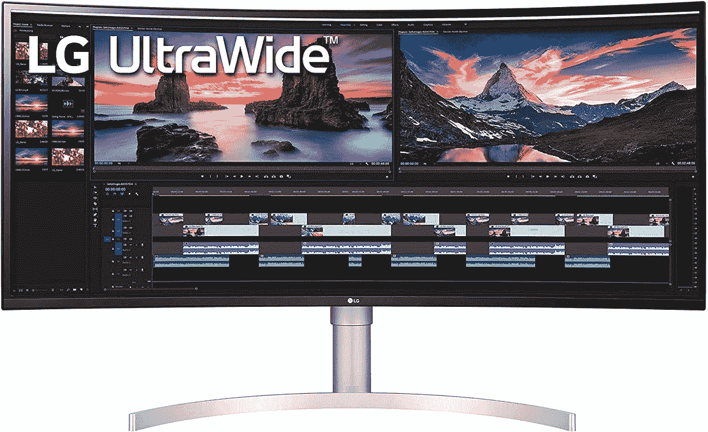
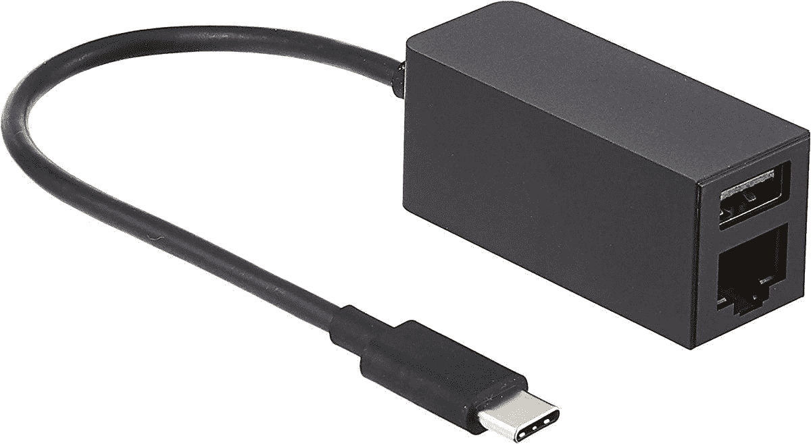
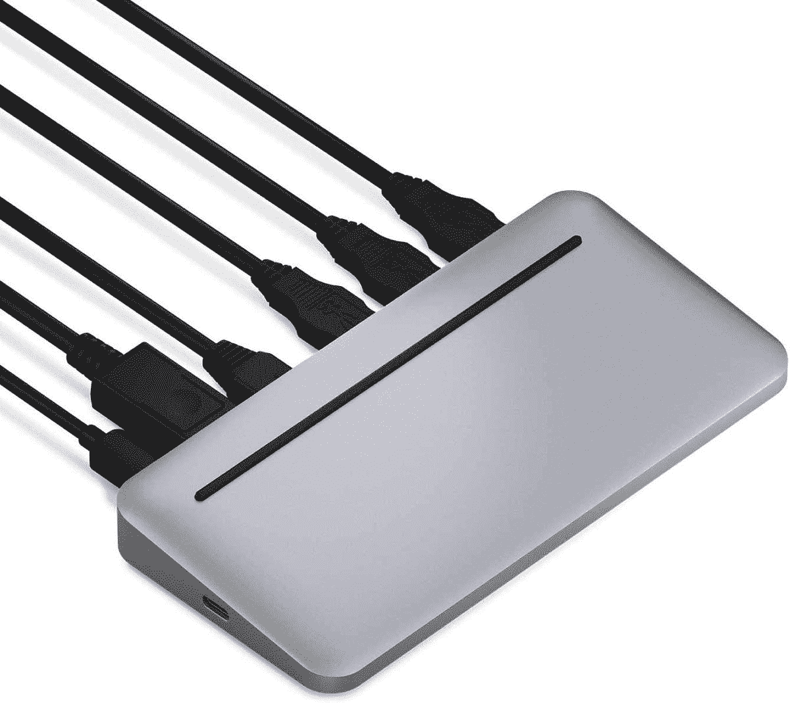
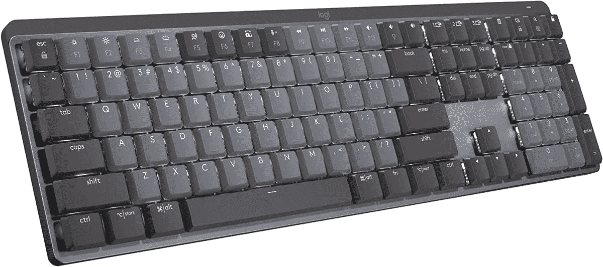

# 2023 年最佳 Surface 笔记本电脑 5 款配件

> 原文：<https://www.xda-developers.com/best-surface-laptop-5-accessories/>

Surface Laptop 5 是微软一款非常棒的旗舰笔记本电脑。我们[对它](https://www.xda-developers.com/surface-laptop-5-review/)进行了评测，发现它提供了更多的功能，采用了最新的英特尔 CPU 和一些全新的颜色选项。但就像你购买任何一款[最佳笔记本电脑](https://www.xda-developers.com/best-laptops/)一样，没有配件的 Surface Laptop 5 购买是不完整的，这就是为什么我们为该设备的最佳配件整理了这个指南。

我们查看了显示器、GPU 外壳、坞站、鼠标等等，以确定我们的最佳选择，您可以在本文中查看。和往常一样，你可以使用上面的链接跳转到任何类别。

## 监视器

Surface Laptop 5 上的 13 英寸或 15 英寸屏幕对于生产力来说是很好的，但有时你可能想超越一个屏幕。这就是为什么你可能要考虑下面的显示器之一。这些显示器将有助于在应用程序之间切换，并排堆叠窗口，并提高工作效率。

*   ##### 戴尔 UltraSharp U2723QE

    戴尔 UltraSharp U2723QE 的对比度非常高。4K 面板还覆盖了 DCI-P3 98%的区域，并通过了 DisplayHDR 400 认证。它还可以用一根 USB-C 电缆连接，所以你不必在你的 Surface Laptop 5 的桌子上放一堆电缆。

    T13
*   <picture></picture>

    LG ultra wide 38wn 95 c-W

    ##### LG ultra wide 38wn 95 c-W

    这是 2022 年 Surface Laptop 5 最好的超宽显示器之一，得益于优质的设计和超高的 QHD+分辨率。

*   <picture></picture>

    外星人 34QD-有机发光二极管 aw 3423 dw

    ##### 外星人 AW3423DW

    这款超大的 34 英寸显示器提供了出色的亮度、对比度和惊人的画质。它专为游戏而生，但这款显示器的活力无与伦比。

*   ##### 惠普 24MH FHD 显示器

    这是 Surface 笔记本电脑 5 块钱能买到的最便宜的显示器之一。它可能很便宜，但仍然有很高的 FHD 分辨率，甚至有内置扬声器，所以你不必担心外部电缆或设备。

    T34
*   <picture></picture>

    戴尔 S3222DGM 游戏显示器

    ##### 戴尔 s 3222 dgm

    Surface Laptop 5 并不是一款游戏笔记本电脑，但如果你有一台游戏主机，并且需要一台可以与 Surface 和控制台配合工作的显示器，那么这是一个不错的选择。这是一个大的 32 英寸曲面显示器，可以达到 QHD 的分辨率。

*   <picture></picture>

    Arzopa 便携式显示器

    ##### Arzopa 便携式显示器

    这是一款 13 英寸便携式显示器，适合那些桌面空间不大或经常出差的人。它具有基本的 FHD 分辨率，但纵横比为 16:10。

## 外部 GPU 外壳

Surface Laptop 5 只有一个 Thunderbolt 4 端口。通过该端口，您可以使用外部 GPU 外壳来帮助提升新笔记本电脑的性能，从而无忧地进行游戏或视频编辑。这里有一些我们最喜欢的。

*   ##### Razer Core X Chroma

    这款 GPU 外壳配备了 RGB 灯以及一些额外的端口，使其成为您所能找到的最好的 GPU 外壳之一。它还可以为您的笔记本电脑提供 100 瓦的功率。

*   ##### 十四行诗分离盒 750

    十四行诗分离盒 750 是看起来更光滑的 GPU 外壳。它有一个 750 瓦的电源，可以为您的 GPU 提供 375 瓦的持续电力。

    T17
*   ##### 阿基提欧节点泰坦雷电 3 eGPU 机箱

    虽然你可能没听说过这个品牌，但这是一款很棒的 GPU 机箱。它没有 RGB 照明，但它有一个更宽敞的大两倍宽度的设计，使它能够与更广泛的显卡配合工作。

## 坞站和适配器

即使 Surface Laptop 5 有 USB-A 和 Thunderbolt 4 端口，也可能不足以满足你的需求。如果你想扩展并享受以太网端口、VGA、HDMI，甚至 microSD 或 SD 读卡器，你需要一个坞站。我们建议以下其中之一。

*   ##### 微软 Surface Dock 2

    Surface Dock 2 是你 Surface 笔记本电脑 5 的最佳 Dock。它使用 Surface Connect 端口进行连接，并将为您的 Surface 充电，并为您提供额外的 USB-A 端口。

    T37
*   <picture></picture>

    微软 USB-C 旅行集线器

    ##### 微软 USB-C 旅行集线器

    微软 USB-C 旅行集线器非常适合使用 Surface 笔记本电脑 5 进行移动计算。它为您提供额外的 USB 端口，以及 HDMI、VGA 和以太网连接。

*   <picture></picture>

    微软 Surface USB-C 转以太网和 USB 3.0 适配器

    ##### 微软 Surface USB-C 转以太网和 USB 3.0 适配器

    这是一个基本的坞站，可以给你的 Surface 笔记本电脑 5 增加一个 USB-A 和以太网端口。如果这就是你所需要的，那么你可以在这里节省一些钱。

*   <picture></picture>

    肯辛顿 Thunderbolt 4 扩展坞

    ##### 肯辛顿 Thunderbolt 4 扩展坞

    这款肯辛顿 Thunderbolt 扩展坞是 Surface Laptop 5 较为昂贵的扩展坞之一，但它增加了 USB 端口和一个 SD 读卡器。它甚至可以为您的 Surface Laptop 5 供电，并支持菊花链。

*   ##### Tobenone USB-C 扩展坞

    这不是 Surface Laptop 5 的 Thunderbolt 扩展坞，但它增加了大量 USB-A 端口、以太网和显示输出。

*   <picture></picture>

    Anker 777 Thunderbolt 4 Dock

    ##### Anker 777 Thunderbolt 4 Dock

    这是我们能想到的最高档的一款 Dock 来搭配你的全新 Surface。它拥有坚固的外壳和众多的端口。它甚至可能与你的 Surface Laptop 5 的颜色相匹配。

*   <picture></picture>

    Brydge Stone II USB-C 通用坞站

    ##### Brydge Stone II USB-C 通用坞站

    Brydge Stone II USB-C 通用坞站拥有大量端口，不会超出预算，并且会帮助您使用配件完成基本工作。

*   <picture></picture>

    CalDigit 元素 Hub

    ##### CalDigit 元素 Hub

    CalDigit 元素 Hub 只有几个端口，但它是我们能找到的最小的支持 Thunderbolt 的坞站之一。

*   <picture></picture>

    戴尔双充电坞站

    ##### 戴尔双充电坞站

    此坞站可以连接您的显示器，也有空间让您给手机充电。侧面和背面也有额外的 USB 端口。

## 鼠标和键盘

Surface Laptop 5 的键盘和触控板与 Surface Laptop 4 类似。我们已经很喜欢它们了，但是对于长时间的打字和点击，你可能需要一个专用的键盘和鼠标。专用键盘有更大的移动空间，特别是如果你在办公桌前工作，专用鼠标可以帮助缓解手腕疼痛。以下是 Surface Laptop 5 的一些选择。

*   <picture></picture>

    罗技 Ergo K860

    ##### 罗技 Ergo K860

    这是一款为整天打字的人准备的键盘。它配有一个掌托，可以以一个舒适的角度向上移动双手，以减少打字时的疼痛。

*   <picture></picture>

    罗技 K380

    ##### 罗技 K380

    这是罗技最小的键盘之一，它甚至在侧面附带了一个触控板，因此当你将 Surface 连接到外部显示器或电视时，可以使用它。

*   <picture></picture>

    罗技 MX 机械

    ##### 罗技 MX 机械

    罗技 MX 机械键盘是罗技最新的机械键盘之一它具有游戏键盘的功能，如多模式灯，但更像是一种生产力，与您的表面外观和感觉相匹配。

*   <picture></picture>

    雷蛇黑寡妇 V3

    ##### 雷蛇黑寡妇 V3

    Surface Type Cover 不提供全尺寸键盘，所以如果你想要一个优质的全尺寸无线键盘体验，雷蛇黑寡妇 V3 Pro 应该是你的选择。

*   ##### 罗技 MX 键

    罗技 MX 键是花钱能买到的最好的键盘之一。它不仅可以与 Surface Laptop 5 配合使用，还可以连接多达三种不同的设备，如 iPad 或 Mac。它还有背光按键。

    T34
*   <picture></picture>

    罗技 MX Master 3S

    ##### 罗技 MX Master 3S

    这是被很多人评为 2022 年最好的鼠标之一。这也是有充分理由的。该鼠标有一个快速的 8,000 DPI 传感器和一个金属滚轮。它可以在几乎任何表面上工作，玻璃和超级舒适。

*   <picture></picture>

    罗技 M355

    ##### 罗技 M355

    罗技 M355 对左撇子和右撇子都很友好。这款鼠标采用超薄扁平设计，点击声音非常安静。

*   <picture></picture>

    微软蓝牙人体工学鼠标

    ##### 微软蓝牙人体工学鼠标

    由于 Surface Laptop 5 有一些有趣的颜色，如果你想要更丰富多彩的东西，这款鼠标可以给你一些选择。它仍然有一个优质的人体工程学设计，所以你不会为了外观而牺牲可用性，而且它相对实惠。

*   <picture></picture>

    罗技 M570

    ##### 罗技 M570

    罗技的 M570 有一个轨迹球，这对于那些可能需要进行大量滚动工作的平面设计师或作家来说非常有用，并且在长时间的工作中可以找到一个舒适的轨迹球。

## 耳机和耳塞

Surface Laptop 5 需要个性化音频吗？毕竟不是每个人都想听你的会议或者音乐。从微软自己的，到更多的优质品牌，这里有一些很棒的音频配件，你可以为你的 Surface Laptop 5 购买。

*   <picture></picture>

    索尼 WH-1000 xm5

    ##### 索尼 WH-1000XM5

    这些都是超贵的耳机，但是音质和续航会是无人能比的。

*   <picture></picture>

    Soundcore 续航 Q30

    ##### Soundcore 续航 Q30

    需要带噪音取消和超长续航的耳机但又不想花太多钱？这就是这些耳机的用途。

*   ##### 微软 Surface 耳塞

    这些是微软官方提供的用于 Surface 设备的耳塞。它有一个光滑的触摸表面，耳塞支持微软 365 应用程序中的语音识别。

    T36

## 网络摄像机

Surface Laptop 5 只有一个 720p 的网络摄像头，这在 2022 年是相当可怕的，当你考虑到其他笔记本电脑都有 1080p 的网络摄像头。这就是为什么我们建议选择下面这些第三方网络摄像头中的一个，以帮助您在会议中保持最佳状态。我们已经从各种不同的预算中包括了不少类型的网络摄像头。

*   <picture></picture>

    XPCAM 4K 网络摄像机

    ##### XPCAM 4K 网络摄像机

    想要在你的 Surface 笔记本电脑上进行更高质量的通话 5？这是一个 4K 网络摄像头，不会打破银行。它还配有三脚架。

*   <picture></picture>

    Anker PowerConf C200 2K 网络摄像头

    ##### Anker PowerConf C200 2K 网络摄像头

    这款网络摄像头拥有先进的传感器，还拥有宽广的视野，因此您的同事可以看到您周围房间的更多情况。

*   <picture></picture>

    微软现代网络摄像头

    ##### 微软现代网络摄像头

    这款 1080p 网络摄像头直接来自微软，是为那些喜欢将其表面与微软官方产品相匹配的人准备的。它也有 HDR 的支持。

*   <picture></picture>

    雷蛇 Kiyo

    ##### 雷蛇 Kiyo

    雷蛇 Kiyo 是一个用于飘带的网络摄像头。您可以调节铃声强度，照亮您的脸，让您在玩游戏或打电话时看起来更漂亮..

*   <picture></picture>

    罗技 stream cam

    ##### 罗技 StreamCam

    这款网络摄像头直接插入你表面的 USB-C 端口，不需要加密狗。它也非常适合流媒体。

*   ##### Nexigo N60 网络摄像头

    Nexigo N60 网络摄像头是你能买到的最好的廉价网络摄像头，配有 2MP 传感器、隐私快门和内置麦克风

## 案例

当然，你会想要在旅途中保护你的 Surface Laptop 5。为此，我们建议使用袖子、箱子或袋子。你会发现很多这样的东西出售，但是我们从下面挑选了六个最好的给你。其中大多数应该适合 13 英寸和 15 英寸的型号。

*   <picture></picture>

    表壳逻辑便携包

    ##### 表壳逻辑便携包 13/14

    如果您需要在随身携带时为您的表面提供额外的保护，这款袖套上的硬壳可以提供帮助。

*   <picture></picture>

    SMA tree 15-16 英寸硬壳笔记本电脑套

    ##### SMA tree 15-16 英寸硬壳笔记本电脑套

    这款笔记本电脑套采用坚硬外壳

    ，可提供顶级的防泼溅和防碰撞保护
*   <picture></picture>

    Lymmax 防震套

    ##### 最佳防震套

    这款套有多种颜色可供选择，可以同时适合 13 英寸和 15 英寸的 Surface 笔记本电脑 5。

*   <picture></picture>

    iCozzier 15 寸手提袋

    ##### iCozzier 15 寸手提袋

    这款手提袋有很大的空间让你存放笔记本电脑以及你的装备。

*   ##### UAG 大号笔记本电脑套

    这款笔记本电脑套为 Surface Laptop 5 提供了很多保护。它有衬垫，防水，可以承受跌落。

    T34
*   ##### Rainyear 笔记本电脑软套

    这是一款适用于 Surface Laptop 5 的较软套，有不同的尺寸和颜色。

    T44

## 外部存储器

即使 Surface Laptop 5 有可更换的 SSD，我们仍然建议为您的新笔记本电脑投资外部存储。这将帮助您将文件从一个地方带到另一个地方，并为您提供一个备份重要文件的地方。

*   ##### Fantom Drives Extreme

    这款 Fantom Drives 型号承诺读取速度高达 2800 MB/s，写入速度高达 2300 MB/s，并且采用简洁的设计。它对任何现代文件传输都非常有用

*   <picture></picture>

    可插拔的雷电 3 SSD

    ##### 可插拔的雷电 3 SSD

    这款硬盘内置了 USB 线，所以线永远不会过时。速度也是迅雷不及掩耳，所以你可以快速传输文件。

*   <picture></picture>

    三星 T7 神盾局

    觉得你会在紧张的条件下旅行吗？这个 SSD 是给你的。它构造坚固，可以承受跌落和碰撞而不会损坏。

*   <picture></picture>

    希捷扩展硬盘

    ##### 希捷扩展硬盘

    这是一款速度较慢的硬盘，但与普通硬盘相比，你会以更低的价格获得更多的存储空间。

*   <picture></picture>

    SanDisk Ultra Dual Drive Luxe

    ##### SanDisk Ultra Dual Drive Luxe

    这是一款可以通过 USB-C 和 USB-A 轻松与几乎任何设备配合使用的固态硬盘，非常适合那些想要避免加密狗的人。

*   <picture></picture>

    SanDisk 1TB 极致便携固态硬盘

    ##### SanDisk 1TB 极致便携固态硬盘

    这是一款小巧的固态硬盘，可以系上夹子或其他物体随身携带它还非常坚固，可以承受跌落。

## 电光队

这最后一节看看 Surface Laptop 5 的一些最好的充电器。请记住，Surface Laptop 5 同时具有 Surface Connect 和 USB-C 端口，这意味着即使您不在插座附近，也可以在旅途中轻松为笔记本电脑充电。

*   <picture></picture>

    微软 Surface 127W 电源

    ##### 微软 Surface 127W 电源

    这款微软品牌的充电器提供的电量远远超过你的 Surface 笔记本电脑 5 所需，并且还内置了 USB-A 端口。

*   ##### Anker Nano II

    这是一款流行的充电器，可以与你的 Surface 笔记本电脑 5 配合使用。它有两个 USB-C 端口和一个 USB-A 端口，用于为其他喜爱的设备充电。

    T34
*   ##### Ukor 65W 通用笔记本充电器

    这是一款通用 USB-C 充电器。它有一根 2.6 英尺长的电缆，不仅可以为你的 Surface 笔记本电脑 5 充电，还可以为任何其他具有 USB-C 端口的设备充电。

现在你知道了。这些都是我们能想到的 Surface Laptop 5 最好的配件。有很多东西需要消化，但是我们包括了所有我们能想到的东西。我们还想提一下，这些配件中的一些也可以在其他 Surface 设备和个人电脑上很好地工作。所以，它们是很好的投资。但是，如果你还没有购买 Surface Laptop 5，请查看下面的内容。

 <picture></picture> 

Microsoft Surface Laptop 5

##### 微软 Surface Laptop 5

Surface Laptop 5 是微软最新的旗舰笔记本电脑，采用第 12 代英特尔 CPU，并有新的颜色选择。