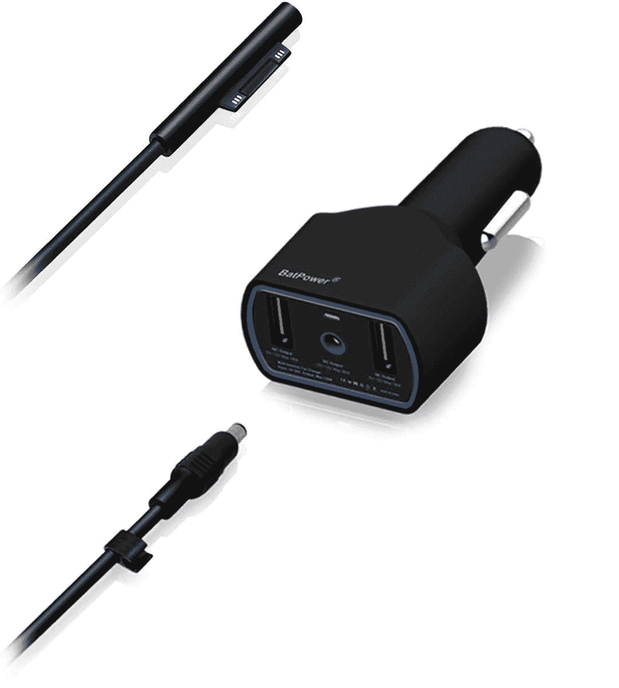

# 2023 年 Surface Laptop Studio 的最佳替代充电器

> 原文：<https://www.xda-developers.com/best-surface-laptop-studio-chargers/>

# 2023 年 Surface Laptop Studio 的最佳替代充电器

无论你是放错了 Surface Laptop Studio 充电器，还是仅仅需要一个额外的充电器，我们都为你收集了最佳选择。

Surface Laptop Studio T1 是微软有史以来最强大的 T2 Surface Laptop T3。它采用英特尔 H35 系列处理器和专用显卡(在某些型号上)，必将在几乎所有方面超越其前辈。此外，它还具有高刷新率显示屏、杜比视觉支持和四声道立体声扬声器，所有这些都有助于提供优质的整体体验。由于其强大的规格，Surface Laptop Studio 还配备了强大的充电器。但是如果你碰巧弄丢了或者弄坏了呢？

如果你需要为 Surface Laptop Studio 更换充电器，我们为你收集了一些最佳选择。盒子里的充电器提供 95W 的功率(对于 Core i7 型号)，所以你最好想要至少与之匹配的东西。然而，一些较慢的选择也是可行的，特别是像电源组和便携式充电器这样的东西。以下是你的最佳选择。

*   <picture></picture>

    Surface Dock 2

    ##### 微软 Surface Dock 2

    如果你想给你的 Surface 笔记本电脑工作室充电，也给你的桌面设置供电，Surface Dock 2 正好可以做到这一点。它不仅可以为你的 Surface Laptop Studio 充电，还可以驱动两个 60Hz 的 4K 显示器，它有额外的 USB 端口，并添加了以太网。

*   <picture></picture>

    BatPower ProE 2 电源组和充电器

    ##### bat Power ProE 2 ES7B 电源组

    这款 bat Power 充电器不仅具有表面连接电缆，还包括一个电源组，可以随时随地充电。壁式充电器最高可提供 90W 的功率，电源组最高可达 95W。如果你需要给其他设备充电，还有额外的 USB 端口。

*   <picture></picture>

    BatPower CCS 2 Surface 车载充电器

    ##### bat power CCS 2 Surface 车载充电器

    如果你想在车内保持充电，这款 bat power 车载适配器可能就能做到这一点。它可以为您的笔记本电脑提供高达 95 瓦的功率，因此它可能正是您所需要的。

*   <picture></picture>

    奈克 100W USB-C 充电器

    ##### 奈克 100W GaN USB-C 充电器

    对一个 Surface Connect 端口不感兴趣？这款 Nekteck 充电器非常简单，但它可以提供 100 瓦的功率，这是你为高端 Surface Laptop Studio 供电所需的全部功率。

*   <picture></picture>

    Hyphen-X 100W 4 端口 USB 充电器

    ##### Hyphen-X 100 w 4 端口 PD GaN 充电器

    这款 Hyphen-X 充电器有四个 USB 端口，可以为多个设备充电，端口之间分配 100 w 的功率，这意味着如果插入其他设备，充电速度会变慢。

*   <picture></picture>

    Anker 737 电源板

    ##### Anker 737 电源板

    这一套不会为 Core i7 Surface Laptop Studio 提供推荐的电量，但如果你有 Core i5 型号，无论你是在家还是在旅途中，它都可以保持充电。

*   <picture></picture>

    Omni 20c+

    ##### Omni charge Omni 20C+

    如果您确实需要所有的充电电源，Omni 20C+电源组带有一个 USB Type-C 端口，能够提供高达 100W 的功率。它甚至可以兼作笔记本电脑的 USB 集线器，此外它还有一个显示实时充电和电池信息的屏幕。

*   <picture></picture>

    可插拔雷电 3 坞站

    ##### 可插拔 14 合 1 雷电 3 坞站

    该坞站可以作为桌面设置的中央集线器，具有多个显示器输出、USB 端口和以太网，因此您可以将更多外围设备连接到您的 Surface Laptop Studio。它还提供高达 100 瓦的功率，因此您可以在一个紧凑的包装中拥有您需要的一切。

如果你的 Surface Laptop Studio 需要一个新的充电器，这些是你现在可以得到的最佳选择。从官方的替代品到更实惠的产品，甚至是全坞站，这里都有适合每个人的东西。其中一些甚至可以让您随时随地充电。您也可以选择使用 Surface Connect 端口充电或 USB Type-C，因为两者都受支持。

如果你还没有，你可以使用下面的链接购买 Surface Laptop Studio，如果你对写笔记或数字艺术感兴趣，也许可以看看 [Surface Slim Pen 2](https://www.amazon.com/Microsoft-Surface-Slim-Pen-Matte/dp/B09DK2YSH2/?tag=xda-ldjcg4s-20&ascsubtag=UUxdaUeUpU5364&asc_refurl=https%3A%2F%2Fwww.xda-developers.com%2Fbest-surface-laptop-studio-chargers%2F&asc_campaign=Affiliate) 。如果你宁愿寻找替代品，我们有一份你现在可以购买的[最佳笔记本电脑](https://www.xda-developers.com/best-laptops/)的列表。