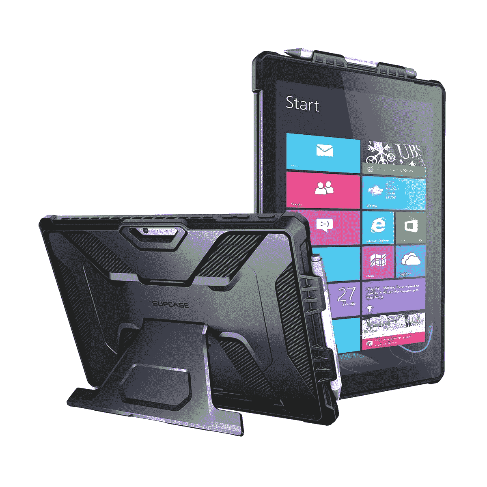
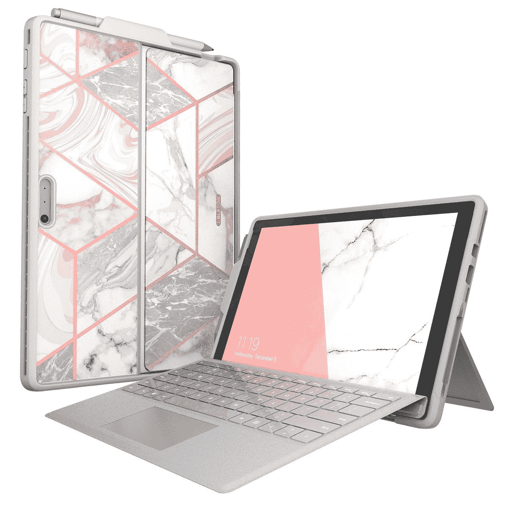
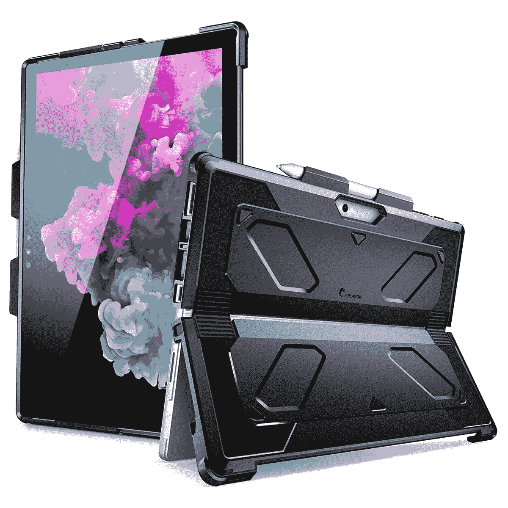

# 2023 年最佳 Surface Pro 7 案例

> 原文：<https://www.xda-developers.com/best-surface-pro-7-cases/>

# 2023 年最佳 Surface Pro 7 案例

需要保证你的 Surface Pro 7 的安全？以下是你今天能买到的微软平板电脑的最佳案例综述。

Surface Pro 7 是目前最好的 Windows 平板电脑之一，尤其是在 2020 年底推出的时候。Surface Pro 7 由高端第十代英特尔处理器驱动，可能不是我们今天的首选，但它曾经是[最好的笔记本电脑](https://www.xda-developers.com/best-laptops/)之一，而且它仍然是一台非常强大的机器。如果你已经有一个了，那绝对值得保护它，这样你就可以再用几年。

作为一款平板电脑，Surface Pro 7 非常纤薄方便，让你几乎可以随身携带。但与此同时，它容易受到撞击和掉落，这可能会从外部甚至内部损坏你的设备。保护套对保护你的设备安全大有帮助，如果你想让你的 Surface Pro 7 尽可能长时间地使用，我们为你收集了一些很好的选择。让我们开始吧。

*   <picture></picture>

    sup Case 独角兽甲壳虫 Pro 坚固外壳

    ##### sup Case UB Pro Surface Pro 7 外壳

    这款坚固外壳由坚固的聚碳酸酯和减震 TPU 材料制成。它还配有内置支架和凸起的挡板，以保护相机镜头和显示器。

*   <picture></picture>

    Fintie Folio Folio

    ##### Fintie Folio Surface Pro 7 外壳

    一款超薄的 Folio 风格外壳，有多种颜色可供选择，它可以让您方便地将 Surface Pro 与 Type Cover 一起使用，同时保护它免受刮擦。它还自带支架，因此您可以在 Surface Pro 上调整视角。

*   <picture></picture>

    I-blas on Cosmo 表壳-大理石粉色

    ##### I-blas on Cosmo Surface Pro 7 表壳

    这款独特的表壳采用耐冲击的 TPU 表面处理，可保护 Surface Pro 7 免受刮擦、碰撞和跌落的影响。它还允许访问设备的内置支架，并具有光滑的大理石饰面，外观时尚。

*   <picture></picture>

    UAG 大都会案例

    ##### UAG 大都会 Surface Pro 7 案例

    UAG 或者城市装甲装备是一个通俗的名称说到崎岖不平的案例。Surface Pro 7 的 Metropolis 外壳具有抗冲击的构造，而外壳本身提供了一个很好的手柄和一个铝制支架，可以在不使用时折叠回外壳中。

*   <picture></picture>

    Infiland 外壳

    ##### Infiland Surface Pro 7 外壳

    对于那些想要更优雅和专业外观的人来说，Infiland 外壳是另一种对开风格的外壳，由优质 PU 皮革制成，并有多种颜色选择。它提供了使用 Surface Pro 的灵活性，无论是否有键盘，还提供了一个用于 Surface Pen 的插槽。

*   <picture></picture>

    I-Blason armour box 机箱

    ##### I-Blason armour box Surface Pro 7 机箱

    最坚固的机箱之一，可提供跌落、碰撞和跌落的全面保护。它由坚固的 TPU 和塑料材料制成，甚至有用于端口和 CPU 冷却器通风的切口。

*   <picture></picture>

    fin tie 笔记本保护套

    ##### fin tie 笔记本 Surface Pro 7 保护套

    如果你想把自己的电脑伪装成一台标准笔记本，这是再合适不过的保护套了。它实际上看起来就像一本作文书，并给 Surface Pro 7 带来了独特的外观。它甚至配有一个插槽，可以容纳 Surface Pen 或任何触控笔。完美，如果你把你的电脑带到学校！

*   ##### MoKo Case Fit for Surface Pro 7

    MoKo Case Fit 是一款加固型的保护壳，对 Surface Pro 7 和其他相同设计的机型都有很大的保护作用。它包括一个内置支架，甚至有几种不同的颜色可供选择。

*   ##### Sahara Case Surface Pro 7 键盘对开保护套

    Sahara Case 的这款保护套是一款时尚的对开保护套，可以保护 Surface Pro 7 的正面和背面。然而，它还包括一个内置在外壳中的键盘，使其更容易在旅途中完成工作。然而，没有触摸板。

    T17

这些是微软 Surface Pro 7 的一些最佳案例，值得注意的是，其中许多将在许多 Surface 设备上工作。如果你有面向商务的 Surface Pro 7+，所有这些都应该可以工作，但其中一些也可能适用于 Surface Pro 6 甚至 Surface Pro 4 等旧款机型。你只需要注意端口的位置，确保不会阻塞它们。

如果你想买一台新的平板电脑，Surface Pro 7 现在很难推荐，因为它已经上市两年了。如果你想看看微软的最新产品，我们建议你看看[最佳 Surface 电脑](https://www.xda-developers.com/best-microsoft-surface-pcs/)。我们现在来看一下 Surface Pro 9，它有了新的设计，更大的屏幕，第一次有了颜色选择，还有许多其他的改进。