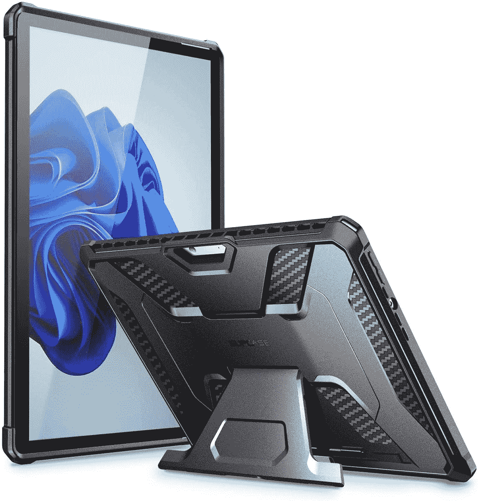
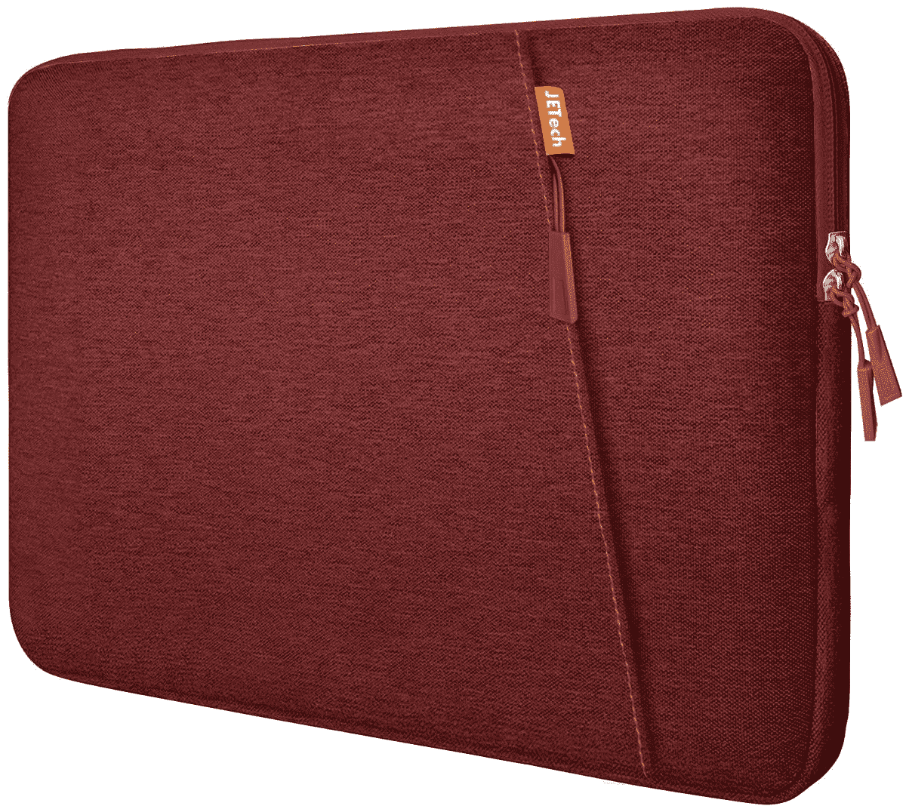

# 2023 年最佳微软 Surface Pro 8 案例

> 原文：<https://www.xda-developers.com/best-surface-pro-8-cases/>

# 2023 年最佳微软 Surface Pro 8 案例

购买新产品后要做的一件负责任的事情就是保护它。所以我们整理了一份微软 Surface Pro 8 的最佳案例清单。

微软在 2021 年在线举办的一次活动中展示了 Surface Pro 8。这款设备与其他 Surface [平板](https://www.xda-developers.com/best-windows-tablets/)和[电脑](http://www.xda-developers.com/best-microsoft-surface-pcs/)一同发布，旨在满足各种需求和品味。Surface Pro 8 是一款运行 Windows 11 的高端多功能平板电脑。买了优质产品后要做的一件负责任的事情就是买些东西保护它。因此，我们为您整理了一份微软 Surface Pro 8 的最佳案例列表。

声明:下面列出的一些案例是为其他微软 Surface 设备设计的，但它们在 Surface Pro 8 上也能正常工作。这是因为这些设备共享完全相同或几乎相同的外部尺寸。

*   <picture></picture>

    Tomtoc 笔记本电脑单肩包

    ##### Tomtoc 14 英寸笔记本电脑包

    对于那些喜欢旅行而不仅仅是携带笔记本电脑的人来说，这是一款绝佳的选择。里面很柔软，并配有加固的边角，而外面有很大的口袋，可以放线缆、充电器、鼠标或任何你喜欢的东西。

*   ##### 卡斯帕梵克雅宝皮套

    一款时尚的笔记本电脑套，采用真皮制成，给您一种高级的感觉和质感。它带有一个额外的侧袋，有多种颜色可供选择。

*   ##### 用于 Surface Pro 的 Fintie 袖套

    这款来自 Fintie 的 Surface Pro 8 袖套酷似信封的设计，材质为合成革材质。它有一个垂下来保持袖子关闭的口盖。甚至还有一个内置的 Surface Pen 支架。

    T17
*   ##### Lacdo 360 笔记本电脑保护套

    这款简单的保护套有多种颜色可供选择，包括大量用于存放配件和物品的口袋。

*   <picture></picture>

    SUPCASE 独角兽甲虫 Pro

    ##### sup case UB Pro Surface Pro 8 case

    这款来自 sup case 的坚固外壳可以让你像平常一样使用 Surface 8。它支持 Type Cover 键盘，并有一个支架。

*   ##### Kinmac 360 保护套

    许多保护套都有几种不同的颜色，但很少有像 Kinmac 的这款保护套提供这么多选择。有超过 20 种图案可供选择，袖子本身提供了大量的软缓冲，防水和钢化框架，以防止更严重的跌落。

    T34
*   <picture></picture>

    JETech 防水防震笔记本电脑保护套

    ##### JETech 防水坚固的 Surface Pro 8 保护套

    这款防水防震保护套由 JETech 保护您的 Surface Pro 8 意外溅落和磕碰。它有九种不同的颜色可供选择，设计简单朴素。

*   ##### Inateck 笔记本电脑套

    如果你正在寻找一种更苗条和不同外观的东西，这款 Inateck 套是一个很好的选择。它有一个小侧袋，用于存放额外物品，还有一个双色设计，放在哪里都好看。它还有很多填充物，而且防水。

*   它有各种颜色，有侧袋。T17

如果我不得不从列出的六个案例中选择一个，我会选择彩色的 [Kinmac 360 保护防水笔记本电脑套](https://www.amazon.com/Kinmac-Protective-inch-13-5-Waterproof-MacBook/dp/B07L65RRR9?tag=xda-5nkmdfe-20&ascsubtag=UUxdaUeUpU6250&asc_refurl=https%3A%2F%2Fwww.xda-developers.com%2Fbest-surface-pro-8-cases%2F&asc_campaign=Commerce)。它有一个手柄，便于随身携带，防水防震，并包括一个侧袋，用于存放配件。它恰到好处，提供了我需要它做的一切，并且它的一些模式赋予了它自己的个性。太华丽了！

 <picture></picture> 

Surface Pro 8

##### 微软 Surface Pro 8

Surface Pro 8 是微软的旗舰平板电脑，它采用了全新的设计，120Hz 的显示屏，Thunderbolt 4 等等。

Surface Pro 8 是一款强大的专业平板电脑，与其他制造商的类似设备竞争，如苹果 iPad Pro M1。它很轻，便携，运行桌面操作系统。这使得它成为那些经常出差的人工作或学习的完美设备。然而，要随身携带它，你需要一个箱子。我们不是爱冒险的人，尤其是在我们珍贵的设备上。

*你已经买过微软 Surface Pro 8 了吗？如果是的话，你已经决定去找哪一个列出的案例？请在下面的评论区告诉我们。*