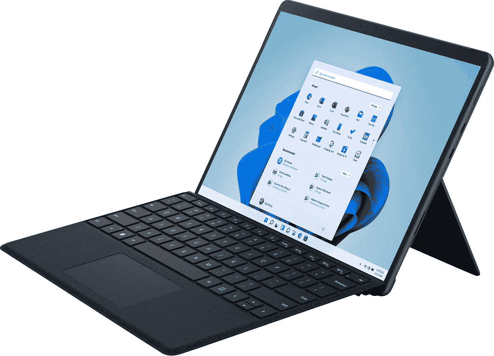
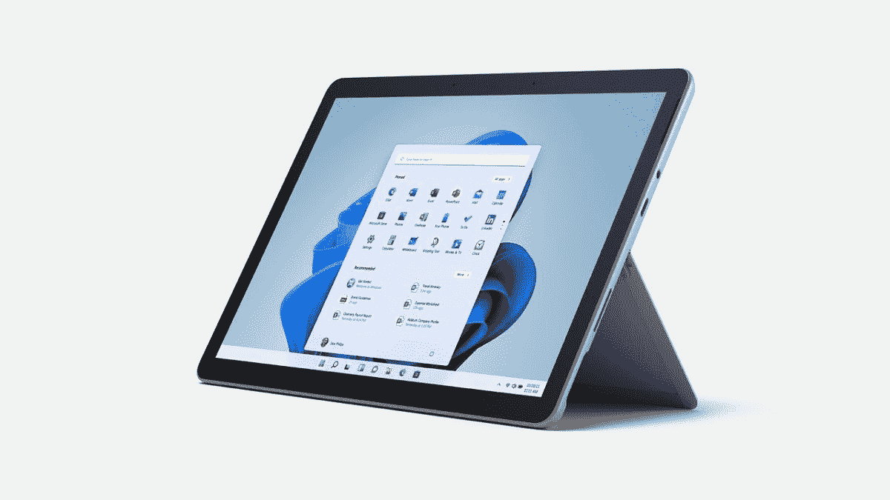

# 2023 年 Surface Pro 8 最划算

> 原文：<https://www.xda-developers.com/best-surface-pro-8-deals/>

微软可能最近推出了 [Surface Pro 9](https://www.xda-developers.com/surface-pro-9-5g-review/) ，但 Surface Pro 8 仍然是一款非常引人注目的平板电脑。与它的前辈相比，它给桌面带来了很多变化，这是一款非常令人兴奋的设备，如果你能得到很好的折扣，今天仍然值得购买。

有几件事情使新的 Surface Pro 8 成为其前辈的重大升级。首先，它有一个 13 英寸的显示屏，与以前型号的 12.3 英寸相比有了明显的进步。不仅更大，这个 13 英寸的显示器现在的刷新率高达 120 赫兹，这使得动画和过渡看起来更加流畅。由于可变刷新率，它还可以在屏幕空闲时节省电池。另外，它的分辨率更高，也更亮。这一部分在 Surface Pro 9 中几乎完全相同，所以你可以使用旧的 rmodel。

最重要的是，它有两个 Thunderbolt 端口，这是在微软一贯拒绝采用 Thunderbolt 而支持 Surface Connect 端口之后，第一个用于 Surface 设备的端口。这意味着在 Surface Pro 8 上扩展端口比以往任何时候都更容易，而且你不必担心 Thunderbolt docks 与其他设备不兼容。如果你已经有了一个 Surface Dock，Surface Connect 端口仍然在这里。

当然，也有预期的升级，如第 11 代英特尔酷睿处理器和可移动存储，这些都出现在面向商业的 Surface Pro 7+中。这确实是 Surface Pro 8 中唯一老化的部分，但这些仍然是非常强大的处理器，这仍然是微软制造的[最好的 Surface PC](https://www.xda-developers.com/best-microsoft-surface-pcs/)之一。如果你正在寻找一款 Surface Pro 设备，并且不想全押在更贵的最新型号上，下面是如何在 Surface Pro 8 上达成交易的方法。

## 亚马孙

对于我们许多人来说，亚马逊是各种产品的首选零售商，当然，Surface Pro 8 也可以在那里买到，有时会有一些可靠的交易。目前，您可以获得英特尔酷睿 i7、16GB 内存和 256GB 固态硬盘的配置，并享受 200 美元的优惠，仅售 1399.99 美元。

 <picture></picture> 

Surface Pro 8 With Black Type Cover

##### 微软 Surface Pro 8

Surface Pro 8 是一款梦幻般的 Windows 平板电脑。它采用了英特尔的第 11 代酷睿 i7 以及其他高端规格，加上 120 赫兹的显示屏，使其成为目前最好的 Windows 平板电脑之一。

您还可以使用 Surface Pro Signature 键盘和 Surface Slim Pen 2 来完成设置，您可以在下面的套装中找到它们，也可以单独购买。目前，如果你单独购买，[签名键盘](https://www.amazon.com/Microsoft-Surface-Pro-Signature-Keyboard/dp/B09DK6MG8R?tag=xda-2amgdnh-20&ascsubtag=UUxdaUeUpU6891&asc_refurl=https%3A%2F%2Fwww.xda-developers.com%2Fbest-surface-pro-8-deals%2F&asc_campaign=Commerce)比原价便宜 60 美元， [Surface Slim Pen 2](https://www.amazon.com/Microsoft-Surface-Slim-Pen-Matte/dp/B09DK2YSH2?tag=xda-2amgdnh-20&ascsubtag=UUxdaUeUpU6891&asc_refurl=https%3A%2F%2Fwww.xda-developers.com%2Fbest-surface-pro-8-deals%2F&asc_campaign=Commerce) 仅售 93 美元，几乎便宜了 30 美元。

##### 微软 Surface Pro 签名键盘，带细笔 2

Surface Pro Signature 键盘补充了 Surface Pro 8，增加了键盘和触控板，带来类似笔记本电脑的体验。

## Adorama

Adorama 也是购买 Surface Pro 8 的好地方，目前大多数配置都有 300 美元的折扣，这使得这款设备更具吸引力。在撰写本文时，基本型号的起价为 799 美元，但折扣也适用于高端配置。

 <picture></picture> 

Surface Pro 8

##### 微软 Surface Pro 8

Surface Pro 8 是一款出色的 Windows 平板电脑，拥有高端规格和出色的显示屏，Adorama 是购买它的绝佳地点。

如果你想在 Surface Pro 8 上获得更像笔记本电脑的体验，你也可以购买带有超薄笔 2 的 Surface Pro 签名键盘:

##### 微软 Surface Pro 签名键盘，带细笔 2

Surface Pro Signature 键盘是 Surface Pro 8 的完美补充，它还包括 Surface Slim Pen 2，因此您可以获得完整的体验。

[Surface Pro 签名键盘](https://adorama.rfvk.net/c/2233363/51926/1036?subId1=UUxdaUeUpU6891&subId2=exda&u=https%3A%2F%2Fwww.adorama.com%2Fmi8xa00061.html)和 [Surface Slim Pen 2](https://adorama.rfvk.net/c/2233363/51926/1036?subId1=UUxdaUeUpU6891&subId2=exda&u=https%3A%2F%2Fwww.adorama.com%2Fmi8wv00001.html) 也可以单独购买，现在这样购买实际上稍微便宜一些。

## 百思买集团

百思买是我们很多人购买电子产品的地方。不幸的是，看起来百思买不再库存新状态的 Surface Pro 8，所以找到它可能会很困难。不过，你可以随时查看下面的产品页面，并尝试在开箱或二手条件下找到它。

 <picture></picture> 

Surface Pro 8 With Black Type Cover

##### 微软 Surface Pro 8

Surface Pro 8 是 Surface 家族的巨大进步，是一款梦幻般的 Windows 平板电脑。不过，在百思买很难找到。

如果你想完成这一体验，你还可以通过 Surface Slim Pen 2 获得 Surface Pro 签名键盘，尽管在写作时它没有折扣。 [Surface Pro 签名键盘](https://shop-links.co/link/?exclusive=1&publisher_slug=xda&article_name=Best+deals+on+Surface+Pro+8+in+2023&article_url=https%3A%2F%2Fwww.xda-developers.com%2Fbest-surface-pro-8-deals%2F&u1=UUxdaUeUpU6891&url=https%3A%2F%2Fwww.bestbuy.com%2Fsite%2Fmicrosoft-surface-pro-signature-keyboard-for-pro-x-pro-8-and-pro-9-black-alcantara-material%2F6478005.p)和 [Surface Slim Pen 2](https://shop-links.co/link/?exclusive=1&publisher_slug=xda&article_name=Best+deals+on+Surface+Pro+8+in+2023&article_url=https%3A%2F%2Fwww.xda-developers.com%2Fbest-surface-pro-8-deals%2F&u1=UUxdaUeUpU6891&url=https%3A%2F%2Fwww.bestbuy.com%2Fsite%2Fmicrosoft-surface-slim-pen-2-matte-black%2F6477996.p) 也可自行购买。

##### 微软 Surface Pro 签名键盘，带细笔 2

使用这款键盘和笔套装来完善您的 Surface Pro 8 体验，为您提供充分利用微软旗舰平板电脑所需的一切。

## B&H

B&H 照片是一个购买电子产品和相机的热门地方，你也可以在那里找到 Surface Pro 8，尽管由于设备的年龄，库存变得相当有限。现在，你可以找到 899 美元捆绑黑色键盘的平板电脑，这表明节省了 100 美元。但考虑到不带键盘的平板电脑本身的售价为 1099 美元，与上市价格相比，你省下的钱还多一点。

##### Surface Pro 8(带黑色外壳)

B&H 正在销售带键盘的 Surface Pro 8，如果你想在不花太多钱的情况下获得更像笔记本电脑的体验，这是一个很好的选择。

如果你想买 Surface Pro 签名键盘和 Surface Slim Pen 2，B&H 照片也有。你可以购买下面的套装，根据你选择的颜色，它目前最多可以优惠 66 美元。你也可以单独购买 [Surface Pro 签名键盘](https://www.bhphotovideo.com/c/product/1664797-REG/microsoft_8xa_00001_surface_pro_sig_kb.html/BI/21019/KBID/17612/SID/UUxdaUeUpU6891)和 [Surface Slim Pen 2](https://www.bhphotovideo.com/c/product/1664791-REG/microsoft_8wv_00001_surface_slim_pen_2.html/BI/21019/KBID/17612/SID/UUxdaUeUpU6891) ，它们每一个都有坚实的折扣。

##### 微软 Surface Pro 签名键盘，带细笔 2

如果你想要最好的体验，你可以在 B&H 买到 Surface Signature 键盘，包括一支用于绘图和记笔记的细长笔 2。

## 微软

自然，微软商店也是购买微软产品的好地方。Surface Pro 8 目前已经上市，不过配置已经售罄。但是那些仍然可以买到的正在打折，从 300 美元到 500 美元不等。例如，一款配备酷睿 i5、8GB 内存和 512GB 固态硬盘的机型售价仅为 899.99 美元。微软还可以让您轻松购买键盘和超薄笔 2。

 <picture></picture> 

Surface Pro 8 With Black Type Cover

##### 微软 Surface Pro 8

微软自然是购买 Surface Pro 8 的最佳地点之一，你可以用键盘和笔一气呵成地轻松配置。

## 新蛋

Newegg 还直接销售 Surface Pro 8，并通过第三方卖家销售，这些卖家经常可以找到一些不错的交易，尽管它们差异很大。Newegg 本身正在销售一款配备 8GB 内存和 256GB 固态硬盘的 Core i5 型号，售价为 999.99 美元，这是 200 美元的折扣。其他配置可从第三方获得，并有各种节省。

 <picture></picture> 

Surface Pro 8 With Black Type Cover

##### 微软 Surface Pro 8

你可以在 Newegg 找到许多不同卖家的 Surface Pro 8，有不同的折扣。

Surface Pro Signature 键盘套装和 Slim Pen 2 也在 Newegg 上提供，尽管在编写时没有折扣。不过，如果你从第三方卖家那里购买，这些产品只能自己购买。

##### 微软 Surface Pro 签名键盘，带细笔 2

新蛋还捆绑销售 Surface Pro 签名键盘和 Slim Pen 2，给你完整的 Surface Pro 8 体验。