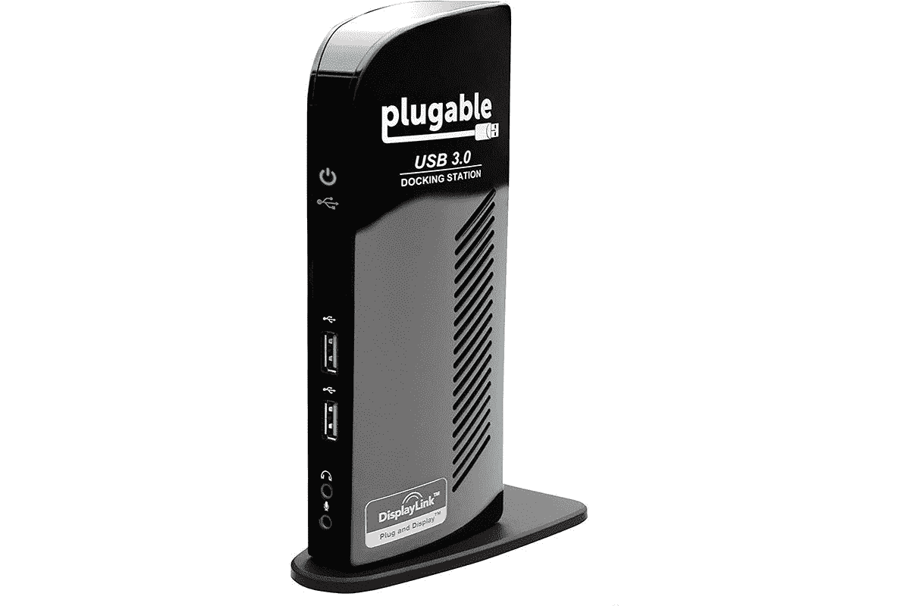
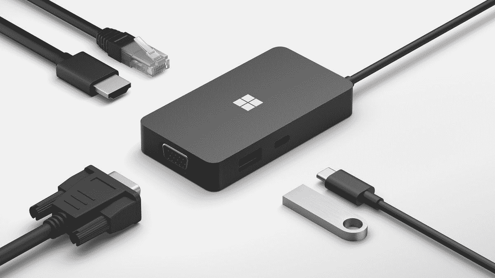

# Surface Pro 8 的最佳坞站

> 原文：<https://www.xda-developers.com/best-surface-pro-8-docks/>

# Surface Pro 8 的最佳坞站

想要将大量外围设备连接到您的 PC？以下是 Surface Pro 8 的最佳坞站，让您可以扩展您的桌面或移动设置。

[Surface Pro 8](https://www.xda-developers.com/surface-pro-8-review/) 是多年来最令人兴奋的 Surface Pro 设备之一。它终于有了一个新的设计，更小的挡板，更大的显示屏，120 赫兹的刷新率，和英特尔老虎湖处理器。然而，这款新设备最大的新增功能之一是在其两个 USB Type-C 端口中支持 Thunderbolt 4。这为对接提供了新的可能性，因为 Thunderbolt 坞站更常见。因此，我们为 Surface Pro 8 收集了一些最好的坞站。

除了 Thunderbolt，Surface Pro 8 还有 Surface Connect 端口，所以如果你更喜欢磁性连接器，你也可以使用 Surface Dock。我们在这个列表中包括了这两种类型，如果你不需要 Thunderbolt 的全部功能，还可以加上一些实惠的 USB 坞站。

*   <picture></picture>

    肯辛顿迅雷 4 扩展坞

    ##### 肯辛顿 SD5700T 迅雷 4 扩展坞

    这款肯辛顿迅雷扩展坞增加了 USB 端口、SD 读卡器、以太网和迅雷菊花链。它还能为您的笔记本电脑提供 90W 的功率，无论您将它连接到什么设备。

*   <picture></picture>

    Razer Thunderbolt 4 坞站

    ##### Razer Thunderbolt 4 坞站

    Razer Thunderbolt 4 坞站为您提供了所有您期望的端口，包括 USB、以太网和菊花链支持。这款水星白在任何设置下看起来都很棒，但也有一款带有 RGB 的黑色版本。

*   <picture></picture>

    可插拔的雷电 3 坞站

    ##### 可插拔的 14 合 1 雷电 3 坞站

    这款可插拔的 Thunderbolt 坞站在为 Surface Pro 8 添加大量不同端口方面做得非常好，包括 USB-A、USB-C、DisplayPort、HDMI 和千兆以太网。

*   <picture></picture>

    亚马逊基本型 10 合 1 雷电 3 坞站

    ##### 亚马逊基本型 10 合 1 雷电 3 坞站

    如果你无法承受其他 Thunderbolt 坞站的价格，这款替代产品可以以更低的价格为你提供大量扩展选项，包括 DisplayPort 和菊花链支持。

*   <picture></picture>

    可插拔 USB 3.0 通用扩展坞

    ##### 可插拔 USB 3.0 通用笔记本扩展坞

    如果你不需要 Thunderbolt，这款可插拔 USB 扩展坞是一个很好的替代选择。它以合理的价格添加了六个 USB 端口、以太网和显示输出。

*   <picture></picture>

    微软 USB-C 旅行集线器

    ##### 微软 USB-C 旅行集线器

    如果您想在旅途中携带更多端口，微软 USB-C 旅行集线器会在您需要时为您提供几个 USB 端口、HDMI、VGA 和以太网连接。

*   <picture></picture>

    Anker power expand 11-in-1

    ##### Anker power expand 11-in-1 USB-C Hub

    与微软旅行 Hub 价格相同，Anker 的替代产品为您提供了更多端口，包括三个 USB-A 端口、USB-C、显示输出、以太网、SD

*   <picture></picture>

    WAVLINK USB-C Hub

    ##### wav link 12 合 1 USB-C Hub

    这份清单上最小的一项，wav link USB-C Hub 为您提供了额外的 USB 端口、以太网和 HDMI，您可以轻松地滑动到任何地方。这也是清单上最实惠的项目。

Thunderbolt 支持的增加真正使这款电脑成为 Surface Laptop Studio 之外，在对接方面最通用的 Surface PC。Thunderbolt 坞站和外设的生态系统远比 Surface Connect 端口更广阔，因此现在拥有所有这些选项非常好。Surface Connect 端口仍然是一个选项，这也很好，所以如果你已经有一个 Surface Dock 或者你喜欢磁性连接器，你可以走这条路。

如果你还没有，你可以使用下面的链接购买 Surface Pro 8。正如我们已经提到的，这是有史以来最令人兴奋的 Surface Pro 设备之一，如果你一直持有旧型号，这是升级的最佳时机之一。如果你想要完整的 Surface 体验，还可以使用 Surface Slim Pen 2 的签名键盘。否则，看看外面最好的 Windows 平板电脑,看看是否还有其他适合你的东西。或者，你可能想等待 Surface Pro 9，我们预计它将于 10 月份推出。当它发布时，这些码头也应该与它一起工作。

*   <picture></picture>

    Surface Pro Signature 键盘搭配 Surface Slim Pen 2

    ##### 微软 Surface Pro Signature 键盘

    Surface Pro Signature 键盘搭配键盘和触控板使其感觉更像笔记本电脑。这个套装还包括 Surface Slim Pen 2，它包括触觉反馈，让你感觉像在纸上写字。