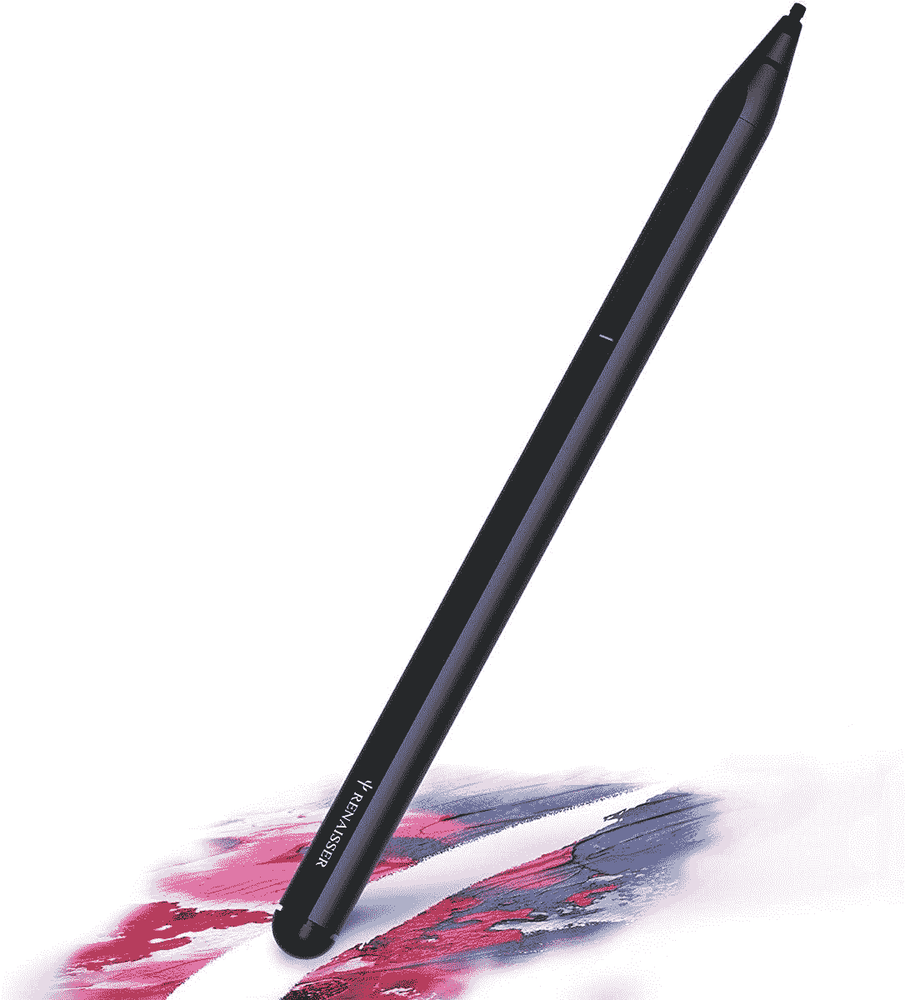
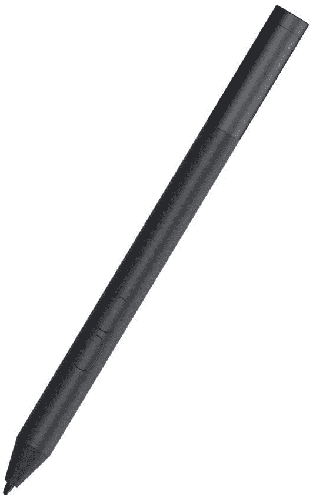
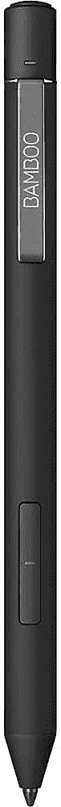

# 2023 年 Surface Pro 8 最佳钢笔

> 原文：<https://www.xda-developers.com/best-surface-pro-8-pens/>

# 2023 年 Surface Pro 8 最佳钢笔

Surface Pro 8 是一款非常好看的平板电脑，但你会想用一支笔来补充它。以下是绘画和写作的最佳选择。

出于各种原因，最近宣布的 Surface Pro 8 有望成为一款非常令人兴奋的设备。这是 Surface Pro 系列多年来首次大规模重新设计，它增加了 120Hz 刷新率显示屏，并最终为 [Surface 系列](https://www.xda-developers.com/best-microsoft-surface-pcs/)带来了 Thunderbolt 支持。另一个大的新功能是 Surface Slim Pen 2，它将为你提供触觉反馈，让你感觉像是在用 Surface Pro 8 在纸上写字。

这是一个只有这款新笔才能使用的功能，所以这可能是你在 Surface Pro 8 上获得的最好的笔体验。但是如果这个价格对你来说太高了，而你又不在乎这个特性，那该怎么办呢？或者觉得设计不舒服怎么办？Surface Pro 8 和大多数 [Windows 平板电脑](https://www.xda-developers.com/best-windows-tablets/)都支持微软笔协议，因此虽然 Surface Slim Pen 2 是最自然的选择，但实际上有很多笔可以用它来使用。我们收集了一些可用的最佳选项，因此您可以选择符合您预算的产品。

*   <picture></picture>

    Surface Pen

    ##### 微软 Surface Pen

    经典的 Surface Pen 对于 Surface Pro 8 来说依然是梦幻般的用笔体验。它有 4，096 级压力，倾斜支撑，以及您可能喜欢的更圆的设计。

*   <picture></picture>

    Renaisser Raphael 530

    ##### Renaisser Raphael 530

    Renaisser 的最新款带有双面橡皮擦，所以你可以使用侧面的按钮或者笔尖来擦除。此外，它有 4，096 级压力和倾斜支持。

*   <picture></picture>

    戴尔活动笔 pn 350m

    ##### 戴尔活动笔

    戴尔活动笔是一款更实惠的笔款选择，具有 1024 级压力。它使用 Microsoft Pen 协议，但不支持蓝牙进行自定义操作。

*   <picture></picture>

    RENAISSER 中缝 520 Bt

    ##### RENAISSER 拉斐尔 520BT

    这款 RENAISSER 手写笔拥有你所期望的所有高级功能，包括蓝牙 5.1、4096 级压力，以及以实惠的价格提供倾斜支持。

*   <picture></picture>

    用于微软 Surface 的 u gic 笔

    ##### 用于 Surface 的 u gic 笔

    如果你正在寻找一款基本的活动笔，那么用于 Surface 设备的 u gic 笔是最便宜的替代品之一。它有 1024 级压力和可更换的笔尖。

*   <picture></picture>

    Wacom Bamboo Ink Plus

    ##### Wacom Bamboo Ink Plus

    Wacom Bamboo Ink Plus 是一款支持 Microsoft Pen 协议和 AES 输入的高级笔，这意味着您可以在更多设备上使用它。

*   <picture></picture>

    Wacom 竹墨

    ##### Wacom 竹墨

    标准的 Wacom 竹墨仍然支持 MPP 和 AES 协议，并具有 4，096 级压力，因此它仍然是一种很好的体验，但更实惠。

*   <picture></picture>

    Digiroot 通用手写笔

    ##### digi root 通用手写笔

    如果你不需要活动笔或任何花哨的功能，如果你不想花很多钱，digi root 手写笔可以为你提供更精确的绘图和书写。

这些是你现在能为 Surface Pro 8 买到的最好的笔。那里有各种价位、功能和品牌，所以你可以找到适合你风格的东西。正如我们所提到的，Surface Slim Pen 2 将在 Surface Pro 8 上给你最完整的体验，但你可以通过使用类似于 [RENAISSER Stylus Pen](https://www.amazon.com/dp/B08M3JSSMQ?tag=xda-129a03f-20&ascsubtag=UUxdaUeUpU5509&asc_refurl=https%3A%2F%2Fwww.xda-developers.com%2Fbest-surface-pro-8-pens%2F&asc_campaign=Affiliate) 的东西来节省一些钱，它仍然是功能齐全的。

如果你还没有，你可以购买下面的 Surface Pro 8，成为首批获得它的人之一。此外，您还可以获得 Surface Pro 签名键盘，其中包括 Surface Slim Pen 2，因此您可以获得完整的笔记本电脑和笔体验。值得注意的是，笔是在键盘里无线充电的。

*   <picture></picture>

    Surface Pro Signature 键盘搭配 Surface Slim Pen 2

    ##### 微软 Surface Pro Signature 键盘

    Surface Pro Signature 键盘搭配键盘和触控板使其感觉更像笔记本电脑。该套装还包括 Surface Slim Pen 2。