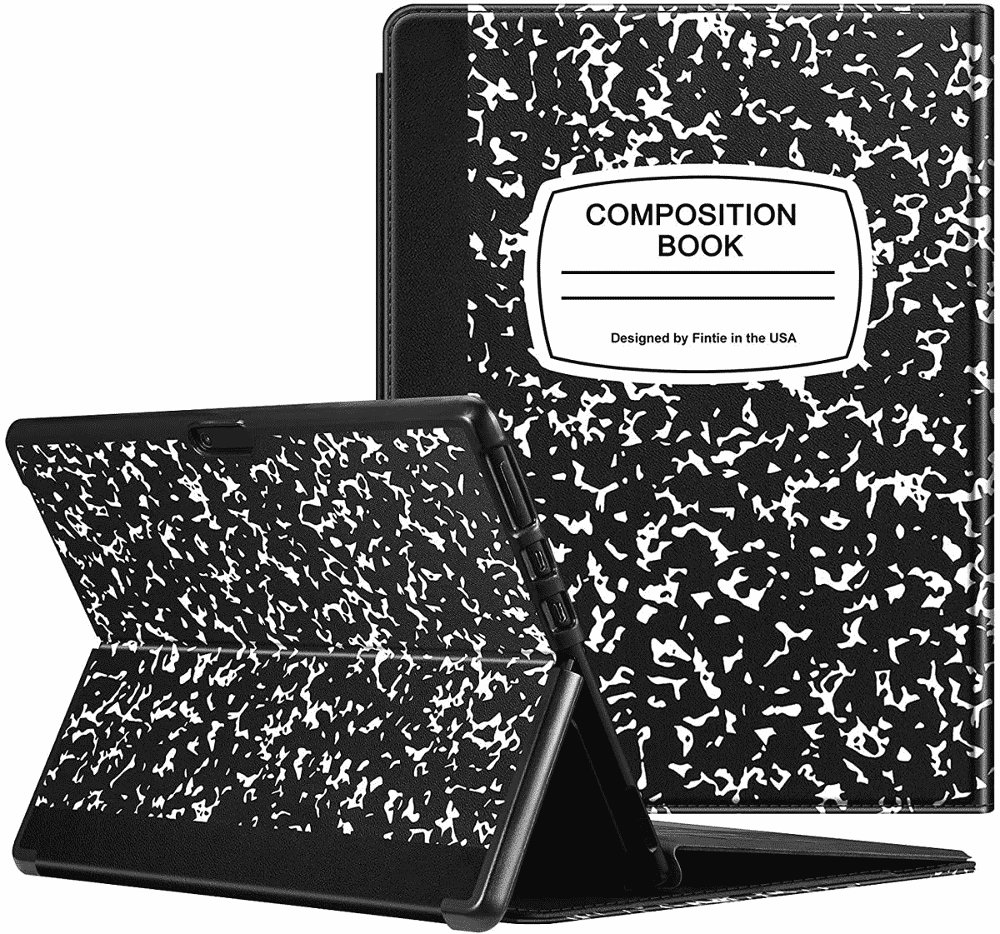

# 2023 年 Surface Pro X 的最佳案例

> 原文：<https://www.xda-developers.com/best-surface-pro-x-cases/>

Surface Pro X 是微软制造的最有趣的设备之一，尤其是在 2019 年首次公布的时候。它过去是，现在仍然是有史以来最薄的 Surface 设备，它包括一个更大的 13 英寸显示屏，也许最值得注意的是，它是第一个采用 Arm 处理器的 Surface 设备，即微软 SQ1。从那以后，Surface Pro X 用微软 SQ2 处理器进行了更新，然后被带 5G 的 [Surface Pro 9 取代，但它仍然有轻薄的设计。](https://www.xda-developers.com/surface-pro-9-5g-review/)

当然，与大多数 Surface 设备一样，Surface Pro X 相当昂贵(尽管最近你可以在它身上获得一些大折扣)。这意味着当你使用 Surface Pro X 时，你完全有理由想要保护它，谢天谢地，这样做相当容易。微软生产的设备数量有限，因此它得到了配件制造商的大量支持，如果你想要一个 Surface Pro X 的外壳，很容易找到。我们收集了以下一些很好的选项来帮助你。

*   <picture></picture>

    ProCase Surface Pro X 外壳

    ##### ProCase 键盘 Surface Pro X 外壳

    这款对开风格的外壳外部采用了漂亮的 PU 皮革表面，内部采用了柔软的超细纤维触感，以保护您的 Surface Pro X 的安全您可以将它与 Type Cover 一起使用，它有针对所有端口和相机的切口，因此一切正常工作。

*   <picture></picture>

    AC dream 微软 Surface Pro X 外壳

    ##### AC dream Surface Pro X 外壳

    这是另一个包裹在 Surface Pro X 周围的对开型外壳，外部是织物，它有用于端口和摄像头的切口，外加一个用于 Surface Pen 的环。你可以选择几种不同的颜色，如果你想要更个性化的颜色，这很好。

*   <picture></picture>

    STM Dux 外壳

    ##### STM Dux Surface Pro X 外壳

    这种外壳实际上可以让你把 Surface Pro X 当成平板使用，并且提供了强悍的防摔保护。它有自己的 180 度铰链，所以你仍然可以像使用笔记本电脑一样使用它，并为你需要的所有端口提供切口。此外，它让平板电脑的设计在某种程度上熠熠生辉。

*   <picture></picture>

    微软 Surface Pro X 的 Fintie 保护套

    ##### fin tie Composition Book Surface Pro X 保护套

    这是另一个包裹 Surface Pro X 的硬壳对开本，它有你需要的一切的剪裁和 Surface Pen 的支架。它也有几种不同的设计来满足你的口味，包括笔记本风格的外观。

*   <picture></picture>

    Londo 真皮袖套

    ##### Londo 真皮袖套

    如果你想要更独特的风格，这款公寓包其实很好看。它使用真皮，但前面结合了不同的图案，这有助于它更加突出。它也有不同的颜色和图案，因此你可以选择最适合你的风格。

*   ##### Hyzuo 笔记本电脑套

    如果你想要更简单实惠的东西，这款 Hyzuo 套也是很棒的选择。它有很多单色选择，所以你可以找到适合你风格而又不太花哨的东西。此外，它还包括一个单独的配件袋。

*   <picture></picture>

    Kensington black belt 2 度加固保护套

    ##### Kensington black belt 2 度加固保护套 Pro X 保护套

    我们中的一些人在更危险的环境中使用我们的电脑，如果您需要额外的保护，这款 Kensington 保护套就是为您准备的。这是一个厚而坚固的外壳，可以保护你的平板电脑免受最严重的跌落，它包括一个手带，使平板电脑更容易握持，甚至还有一个小带子，当你不使用它时，可以将官方键盘固定在屏幕上，为你提供额外的保护。

*   <picture></picture>

    Urban Armor Gear Plasma for Surface Pro X

    ##### UAG Plasma Surface Pro X case

    Urban Armor Gear，以坚固耐用的外壳著称，而 Surface Pro X 的等离子系列也没有让人失望。它很大，体积庞大，非常坚固，但仍然很实用。它有自己的支架、笔筒、手带和肩带，所以当你四处走动时，你可以很容易地把它带在身边。

*   ##### Kinmac 360 保护套

    个人的最爱，Kinmac 笔记本电脑保护套可能不是为这么轻薄的平板电脑设计的，但还是这么容易推荐。它提供了大量的缓冲和柔软的面料来保护您的设备安全，此外，它还有多种图案可供您选择，以满足您的个人喜好。

所有这些案例都迎合了不同类型的用户，所以你一定会在这里找到你喜欢的东西。有些产品，如 ProCase 键盘套，现在即使在使用时也可以放在平板电脑上，因此它总是受到保护。但你可能还需要一个袖子来放 Surface Pro X，这样它在旅行时可以得到保护，但在使用时你可以充分享受它的轻薄。你甚至可以同时使用一个箱子和一个袖子(当然这取决于箱子有多大)。

正如我们所提到的，Surface Pro X 已经被 Surface Pro 9 的 5G 产品取代，但如果你想要一个更便宜更薄的选择，你仍然可以使用下面的链接购买 Surface Pro X。否则，你可以看看我们今天能买到的[最佳笔记本电脑](https://www.xda-developers.com/best-laptops/)列表，看看有没有其他选择。如果你特别想要基于这种架构的东西，你可能还想看看[最佳 Windows Arm 电脑](https://www.xda-developers.com/best-windows-on-arm/)。

 <picture></picture> 

Surface Pro X

##### 微软 Surface Pro X

Surface Pro X 拥有轻便现代的设计，13 英寸的高分辨率显示屏，并由微软 SQ2 芯片组提供支持。它支持移动连接的 LTE，并且由于其基于 ARM 的芯片组，它提供了 15 小时的电池续航时间。