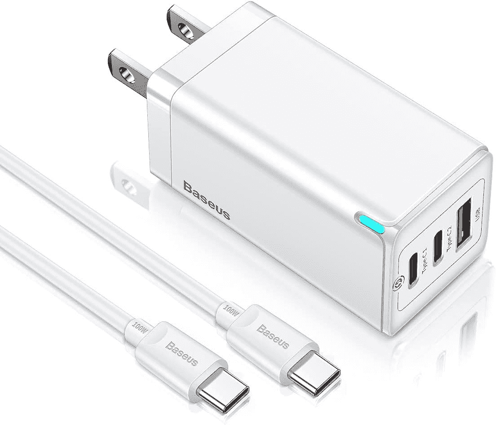

# 2023 年 Surface Pro X 最佳充电器

> 原文：<https://www.xda-developers.com/best-surface-pro-x-chargers/>

# 2023 年 Surface Pro X 最佳充电器

正在为 Surface Pro X 寻找替换充电器？我们挑选了市面上最好的 Surface Pro X 充电器。

[Surface Pro X](https://www.xda-developers.com/surface-pro-x/) 支持 65W 快充，微软在插入 Surface Connect 端口的盒子中捆绑了兼容电源。但如果你需要更换充电器，有很多选择，因为平板电脑还支持通过板载 USB Type-C 端口充电。所以你可以选择 Surface Connect 充电器或者 USB Type-C PD 充电器。我们已经为 Surface Pro X 挑选了市场上最好的充电器，你现在就可以订购。

如前所述，Surface Pro X 支持 65W 快充，但你也可以用 45W 充电器充电。后者不会让你的充电速度很快，但仍然可以完成工作。因此，如果你有一个 45W 的 USB PD 或 45W 的 Surface Connect 充电器，你也可以使用它，而不是购买一个新的。

## Surface Pro X 的最佳充电器

 <picture></picture> 

Surface Wall Charger

##### 微软 Surface 壁式充电器

尽管这款充电器是为旧款 Surface 机型出售的，但它与 Surface Pro X 配合使用也非常好。它支持 65W 的功率传输，并通过 Surface Connect 端口连接。充电器上还有一个 USB Type-A 端口，可以用来给其他设备充电。

 <picture></picture> 

Surface 127W power supply

##### 微软 Surface 127W 电源

Surface 127W 电源对于 Surface Pro X 来说有些大材小用，但如果你只是在寻找微软设计的充电器，这是仅有的两种选择之一。如果你想要一个充电器用于多个 Surface 设备，包括 Surface Book，这也很有帮助。与 65W 电源一样，它也封装了一个 USB Type-A 端口。

 <picture></picture> 

Ugreen Dual USB C charger

##### Ugreen 66W 双 USB-C 充电器

Ugreen 双 USB C 充电器是官方 Surface 电源的绝佳替代品。由于支持 65W 的功率传输，它可以为 Pro X 快速充电。但如果你使用两个端口，它会以 45W 的功率为 Surface Pro X 缓慢充电，并为另一台设备提供 20W 的功率。

 <picture></picture> 

Nekteck 107W USB C Charger

##### Nekteck 107W GaN 4 端口 USB 充电器

Nektech 107W USB C 充电器是同时为多个设备充电的好选择。它带有两个 C 型和两个 A 型端口。虽然其中一个端口提供 65W 的功率传输，这对于 Surface Pro X 来说是完美的，但另一个 Type-C 端口可以提供 30W 的功率。此外，它还配有一根捆绑式 C 型到 C 型电缆。

 <picture></picture> 

Baseus 65W Wall charger

##### Baseus 65W GaN 3 端口充电器

Baseus 壁式充电器是另一款出色的多端口充电器。当仅使用该端口时，您可以获得两个能够提供 65W 功率的 C 型端口。然而，如果你使用两个 C 型端口，你只能在 C1 端口获得 45W 的功率。

 <picture></picture> 

UGREEN 65W Charger

##### Ugreen 65W 4 点 USB-C 充电器

除了它伟大的双端口充电器，Ugreen 还提供这款四端口充电器。它带有三个 C 类端口和一个 A 类端口。当您只使用一个 Type-C 端口时，您将获得 65W 的全部功率，但如果您开始使用多个端口，Type-C 端口的功率会下降。

这些都是市面上 Surface Pro X 最好的快速充电器。值得注意的是，Surface 平板电脑的包装盒中没有 Type-C 电缆，所以如果你要购买 Type-C 充电器，请确保配备一根电缆。我们挑选了一些市场上最好的 USB Type-C 电缆。你可以选择任何支持 65W 或更高的功率输出。

你打算买哪个充电器？请在评论区告诉我们。如果你仍然不确定 Surface Pro X，我们还选出了市场上[最好的 Windows 平板电脑](https://www.xda-developers.com/best-windows-tablets/)和[最好的 Surface PC](https://www.xda-developers.com/best-microsoft-surface-pcs/)

 <picture></picture> 

Microsoft Surface Pro X

##### 微软 Surface Pro X

Surface Pro X 拥有现代的设计和 13 英寸的高分辨率显示屏。此外，由于其基于 ARM 的芯片组，它支持 LTE(可选)以实现移动连接，并提供 15 小时的电池续航时间。