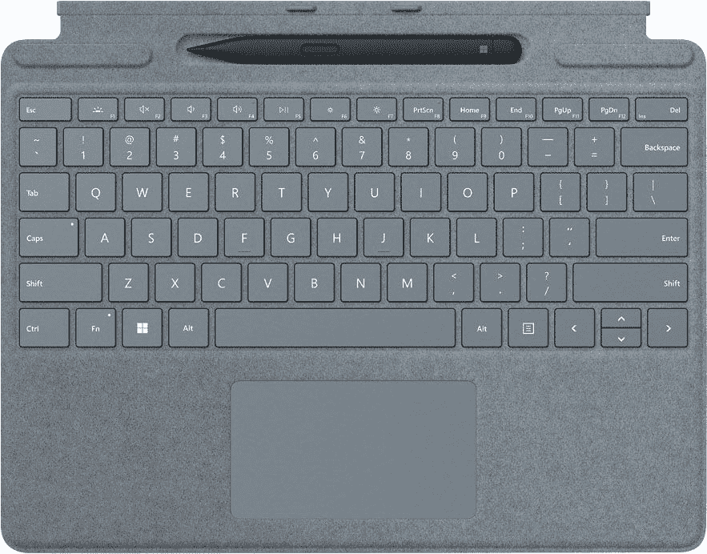
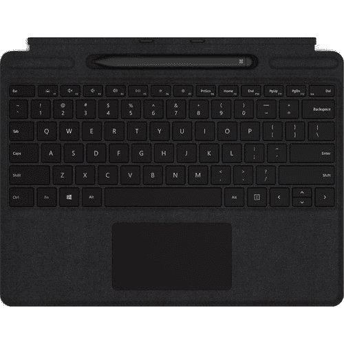

# 这些是你在 Surface Pro X 上能买到的最好的交易

> 原文：<https://www.xda-developers.com/best-surface-pro-x-deals/>

Surface Pro X 是微软的高端 ARM 平板电脑，也是最好的 ARM Windows 平板电脑之一。这是 ARM 笔记本电脑上最强大的窗口之一，它具有轻薄的设计和出色的显示屏。想要 Surface Pro X 有很多很好的理由，所以如果你正在寻找一台，我们已经收集了一些你可以在它身上找到的最好的交易。

Surface Pro X 由高通 SQ1 或 SQ2 处理器提供支持，整体性能稳定，并有其他高端规格，包括高达 16GB 的 RAM 和 512GB 的 SSD 存储。它还配备了超高清 2880 x 1920 显示屏、5MP 前置摄像头和 10MP 后置摄像头，这使它成为浏览网页和与朋友保持联系的绝佳设备。

Surface Pro X 也大大受益于 Windows 11 的升级。使用 ARM 上的 Windows 10，Surface Pro X 可以通过仿真运行基于 x86 的(32 位)应用程序，但 64 位应用程序(x64)无法使用。这将包括像 Photoshop 这样的东西，以及现在只支持 64 位架构的许多应用程序。现在，Windows 11 增加了对 64 位应用程序仿真的支持，因此所有类型的应用程序现在都可以与 Surface Pro X 一起工作。此外，微软正在让部分应用程序更容易在 ARM 上原生运行，从而简化开发人员的过渡，并提高用户的性能。

虽然自 2020 年以来一直没有更新新的内部部件，但微软最近推出了一款不支持 LTE 的 Surface Pro X，将基础价格降至 899 美元。这种新型号与 LTE 版本一起出售，在大多数零售商处都有售。如果你一直想要一个更便宜的 Surface Pro X 版本，这可能是一个绝佳的机会。那么你在 Surface Pro X 上能买到的最划算的交易有哪些呢？

## 亚马孙

亚马逊是最受欢迎的购买任何东西的地方之一，当然，它也是购买新电脑的好地方。Surface Pro X 的大多数型号目前只能通过第三方卖家购买，但与微软官方定价相比，你确实可以获得一些交易。拥有 16GB 内存和 512GB 存储空间的顶级型号在编写时便宜了 350 美元，因此它的价格仅为 1149 美元。但是，请记住，这款机型没有 LTE 功能。

 <picture></picture> 

Surface Pro X

##### 微软 Surface Pro X

Surface Pro X 是一款超薄轻便的 Windows 平板电脑，搭载高端 ARM 处理器。它拥有顶级规格，包括清晰的显示屏和 LTE 支持。

如果想给 Surface Pro X 配键盘和 Surface Slim Pen 2，可以在下面买。也可以单独购买 [Surface Slim Pen 2](https://www.amazon.com/dp/B09DK2YSH2?tag=xda-2j4nptd-20&ascsubtag=UUxdaUeUpU31690&asc_refurl=https%3A%2F%2Fwww.xda-developers.com%2Fbest-surface-pro-x-deals%2F&asc_campaign=Short-Term) ，或者单独购买 [Surface Pro 签名键盘](https://www.amazon.com/dp/B09DJV9RPD?tag=xda-2j4nptd-20&ascsubtag=UUxdaUeUpU31690&asc_refurl=https%3A%2F%2Fwww.xda-developers.com%2Fbest-surface-pro-x-deals%2F&asc_campaign=Short-Term)。罂粟红版本的键盘现在便宜了 30 多美元，价格不到 150 美元。

 <picture></picture> 

Surface Pro Signature Keyboard with Surface Slim Pen 2

##### 微软 Surface Pro 签名键盘

Surface Pro Signature 键盘将您的 Surface Pro X 变成了一台更传统的笔记本电脑，Surface Slim Pen 2 是一款非常棒的手绘和笔记工具。

## Adorama

另一个购买 Surface Pro X 的好地方是 Adorama。这家零售商目前拥有大多数型号，包括仅支持 Wi-Fi 的版本和 LTE 型号。大多数型号都符合微软的建议零售价，但它是一个声誉良好的卖家，有很多配置可供选择。

 <picture></picture> 

Surface Pro X

##### 微软 Surface Pro X

Adorama 有大多数型号的 Surface Pro X，与 MSRP 相比，你可以在其中一些型号上找到很好的交易。

如果你想把 Surface Pro X 变成更多的笔记本电脑体验，你可以在 Surface Pro Signature+Slim Pen bundle 上获得 7 美元的大折扣，使整个套餐不到 200 美元。Surface Slim Pen 2 也有相同的捆绑[，但它更贵，而且 Surface Pro X 不支持新笔中的触觉信号。](https://adorama.rfvk.net/c/2233363/51926/1036?subId1=UUxdaUeUpU31690&subId2=exda&u=https%3A%2F%2Fwww.adorama.com%2Fmi8x600001.html)

 <picture></picture> 

Surface Pro Signature Keyboard with Slim Pen

##### 微软 Surface Pro 签名键盘

Surface Pro Signature 键盘补充了 Surface Pro X，增加了键盘和触摸板，带来类似笔记本电脑的体验。如果你想记笔记，它还包括一只 Surface Slim 笔。

## 百思买集团

购买各种电子产品的最佳地点之一无疑是百思买。该网站通常有各种各样的产品可供选择，如果你想的话，你甚至可以在零售店挑选商品。百思买(Best Buy)在销售 LTE 版本的同时，也在销售仅支持 Wi-Fi 的型号，所以你必须注意你买到的是什么。然而，目前 Surface Pro X 上有一些不错的交易，特别是那些采用微软 SQ1 处理器的产品，基本型号的起价仅为 699 美元(200 美元)。

 <picture></picture> 

Surface Pro X

##### 微软 Surface Pro X

Surface Pro X 采用高端 ARM 处理器、顶级配置和顶级轻量级设计，是一款出色的 Windows 平板电脑。该型号包括微软 SQ1 处理器。

为了完善体验，您可以添加 Surface Pro 签名键盘和 Surface Slim Pen 2。这给你一个传统的笔记本电脑的体验，加上笔，这是一个伟大的笔记和数字艺术家。如果你喜欢的话，你也可以单独购买 [Surface Slim Pen 2](https://shop-links.co/1752705482057535331?u1=052f292d-e6f8-4671-830d-a6cbd7f9f0d8) 或[签名键盘](https://shop-links.co/1757151487936386912?u1=3b7e8922-7943-4968-9459-b6938945eebd)。您可以通过以下两种方式获得捆绑包:

 <picture></picture> 

Surface Pro Signature Keyboard with Surface Slim Pen 2

##### 微软 Surface Pro 签名键盘

Surface Pro Signature 键盘补充了 Surface Pro X，增加了键盘和触控板，带来类似笔记本电脑的体验。还包括 Surface Slim Pen 2。

## B&H 照片

另一个受欢迎的购买电子产品的地方是 B&H 照相馆。该商店专注于媒体创作和消费，这是表面线非常受欢迎的。同样，Surface Pro X 已经有多种配置可供选择。LTE 和 Wi-Fi 型号单独提供，因此您可以更轻松地选择您想要的产品。所有只有 Wi-Fi 的型号目前都降价 200 美元，尽管并非所有配置都在这里提供。

 <picture></picture> 

Surface Pro X

##### 微软 Surface Pro X

对于不需要蜂窝支持的用户来说，Surface Pro X 的 Wi-Fi 版要便宜 100 美元。

 <picture></picture> 

Surface Pro X

##### 微软 Surface Pro X

这一版本的 Surface Pro X 由微软 SQ1 或 SQ2 处理器提供支持，内存高达 16GB，存储容量为 512GB。它还支持 LTE。

最新的 Surface Pro Signature 键盘和 Slim Pen 2 套装也可通过以下链接获得。你可以单独购买 [Surface Pro 签名键盘](https://bhpho.to/3FNmNXX)，根据你选择的颜色，它目前打折 30 多美元。 [Surface Slim Pen 2 也在 MSRP 上单独](https://bhpho.to/3futbIP)提供。

 <picture></picture> 

Surface Pro Signature Keyboard with Slim Pen

##### 微软 Surface Pro 签名键盘

Surface Pro Signature 键盘补充了 Surface Pro X，增加了键盘和触控板，带来类似笔记本电脑的体验。它还包括一个 Surface Slim Pen 2，用于更直观的笔记。

## 微软

你可以直接从微软购买，这通常是购买 Surface 产品的最佳地点之一。从微软购买通常意味着您可以获得最多的配置选项，尽管最受欢迎的配置通常也在其他零售商那里。尽管如此，如果你在其他任何地方都找不到你想要的，这里就是你要去的地方。

目前，许多只有 Wi-Fi 的型号降价 200 美元，尽管这不适用于基本型号。你可以轻松添加 Surface Pro 签名键盘和 Surface Slim Pen 2，但目前这些产品没有折扣。

 <picture></picture> 

Surface Pro X

##### 微软 Surface Pro X

Surface Pro X 采用微软的半定制 ARM 处理器、现代化的轻量级设计和高端规格，是一款非常棒的优质平板电脑。微软有大部分可用的配置。

## 新蛋

Newegg 以销售电脑和零部件而闻名，你也可以在那里找到 Surface Pro X。目前，你只能通过第三方卖家找到它，但这也意味着你可以获得一些好的交易。你目前可以找到顶级型号，有 16GB 的内存，512GB 的固态硬盘，支持 LTE，售价仅为 1，199 美元，低于其官方建议零售价 1，649.99 美元。

 <picture></picture> 

Surface Pro X

##### 微软 Surface Pro X

Surface Pro X 是一款超薄轻巧的 Windows 平板电脑，采用高端 ARM 处理器，具有带触摸和笔支持的出色显示屏。

Newegg 不直接出售 Surface Pro 签名键盘和 Slim Pen bundle，但你可以从第三方获得。这比底价低了 10 美元，虽然不是很大的折扣，但肯定是受欢迎的。Surface Pro 签名键盘的售价比建议零售价低 20 美元，但 [Surface Slim Pen 2](https://redirect.viglink.com/?key=f246be432ee335db8d1b13f098db73cc&cuid=UUxdaUeUpU31690&u=https%3A%2F%2Fwww.newegg.com%2Fmicrosoft-8wv-00001-surface-slim-pen-2%2Fp%2FN82E16834968176) 要贵 6 美元左右。

 <picture></picture> 

Surface Pro Signature Keyboard with Slim Pen

##### 微软 Surface Pro 签名键盘

Surface Pro Signature 键盘补充了 Surface Pro X，增加了键盘和触控板，带来类似笔记本电脑的体验。它还包括一个 Surface Slim Pen 2，用于更直观的笔记。

## 主要产物

史泰博是另一家知名零售商，主要专注于办公用品。这包括笔记本电脑，所以 Surface Pro X 当然也在其中。目前，一些型号降价 200 美元，特别是不支持 LTE 的型号。你可以看看下面，或浏览找到其他型号。

不幸的是，新的 [Surface Pro Signature 键盘套装和细长笔 2](https://shop-links.co/1763538479309653442?u1=ae1675ab-f31d-4a83-885d-18891428ce9f) 目前在 Staples 不可用，但你可以在下面购买带有原始 Surface Pen 的套装。它将与 Surface Pro X 一样工作。[签名键盘](https://shop-links.co/1770051419968578089?u1=4e8e7900-0561-4983-8c51-f6a442ea77f1)单独可用，但 [Surface Slim Pen 2](https://shop-links.co/1763538479446240463?u1=02423c91-8406-4863-992f-cfbcddfc3bcb) 目前缺货。

 <picture></picture> 

Surface Pro Signature Keyboard with Surface Slim Pen 2

##### 微软 Surface Pro 签名键盘

Surface Pro Signature 键盘补充了 Surface Pro X，增加了键盘和触控板，带来类似笔记本电脑的体验。它还包括用于绘图和记笔记的 Surface Slim Pen。

## Tiger Direct

另一个你可能感兴趣的零售商是 Tiger Direct。这家零售商更适合商业客户，但你也可以在那里找到 Surface Pro X。因为是针对企业的，所以这个版本的笔记本电脑运行的是 Windows 10 Pro(自然支持升级到 Windows 11)。这使得它有点贵，但它和微软对 Surface Pro X 商业版的收费差不多。您可以使用以下链接购买:

目前 Tiger Direct 上既没有 Surface Signature 键盘，也没有 Surface Slim Pen。