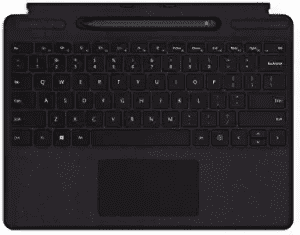
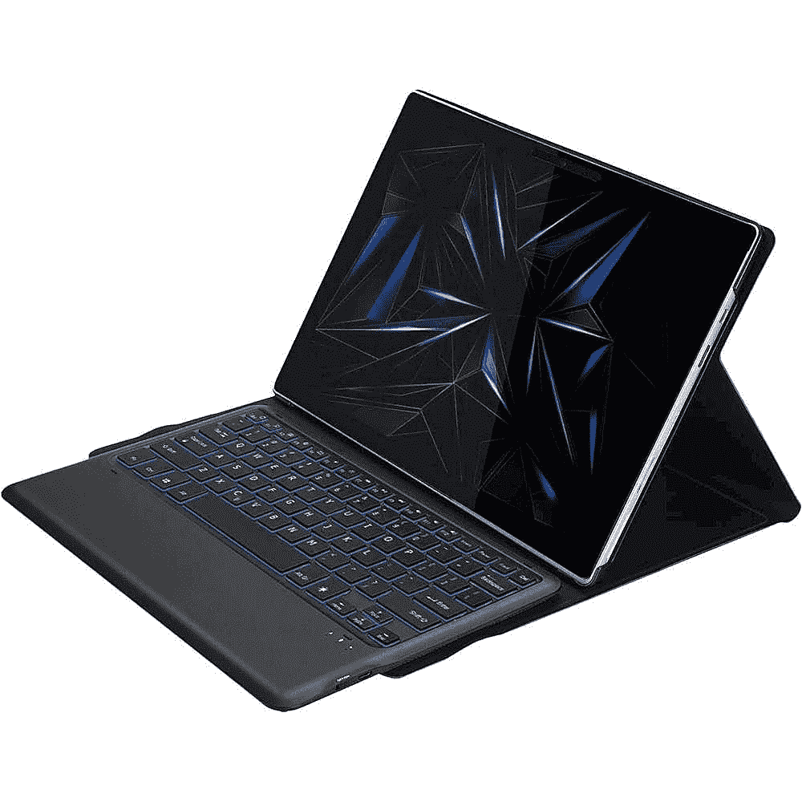
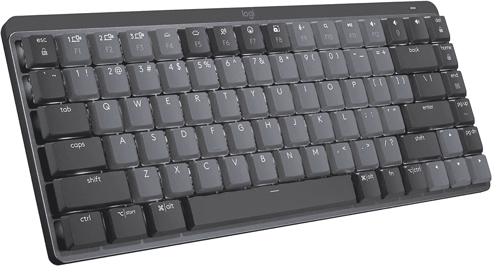

# Surface Pro X 的最佳键盘

> 原文：<https://www.xda-developers.com/best-surface-pro-x-keyboards/>

# Surface Pro X 的最佳键盘

您可以使用这些键盘改善 Surface Pro X 的打字体验。

Surface Pro X 的盒子里没有键盘。如果你想要一个，你必须选择微软的官方类型覆盖附件或检查第三方选项。不过，你肯定会想买一个键盘。它将帮助您在 Microsoft Word 中键入文档，轻松浏览网页，而无需处理屏幕键盘和烦人的滚动条。

也就是说，这里是我们为 Surface Pro X 挑选的最佳键盘。我们的键盘覆盖范围很广，有些支持蓝牙功能。其他的也用 Surface Pro X 的 POGO 连接器连接。更多信息请看下文。

 <picture></picture> 

Surface Pro X Signature Keyboard

##### 微软 Surface Pro X 签名键盘

直接来自微软，这是官方的 Surface Pro X 键盘。它有空间为 Surface Pen 2 或原来的 Surface Slim Pen 充电。

 <picture></picture> 

Surface Pro X Type Cover

##### 微软 Surface Pro X 签名键盘

这是 Surface Pro X 的一个更便宜的官方键盘。它的设计与签名键盘相同，但没有 Surface Slim pen 的空间

 <picture></picture> 

Brydge SP+

##### 桥 SP+

市面上很少有第三方键盘有空间对接 Surface Pro X，Brydge SP+无线键盘就是其中之一。您可以使用全背光键盘和支持多点触控的触摸板。此外，它还具有出色的构建质量。

 <picture></picture> 

Saharacase Keyboard Folio

##### SaharaCase 键盘对开表面 Pro X 盒

SaharaCase Keyboard Folio 由 PU 皮革、硅胶和微纤维材料制成，具有可拆卸键盘。此外，它还带有防滑凹槽来调整视角，并有自己的支架机制。

 <picture></picture> 

Logitech MX Mechanical Mini

##### 罗技 MX 机械迷你

Surface Pro X 的很多键盘都不是机械式的，但这款却是。这是罗技公司的一个选项，提供触觉反馈。您可以通过蓝牙或使用随附的加密狗进行连接。

 <picture></picture> 

XIWMIX Type Cover for Surface Pro X

##### xiw mix USB-Surface Pro X 外壳

XIWMIX 的这款廉价键盘模仿了微软的官方键盘。它有更漂亮的绿色背光按键，并使用 Surface Pro X 上的 POGO 引脚进行连接。甚至可以通过蓝牙将它与另一台电脑配合使用。他们甚至还包括了一个放置 Surface Pen 的地方。

这些是我们能为 Surface Pro X 找到的所有键盘。这些键盘最棒的部分(除了微软官方的键盘)是它们可以用于不同的设备和[其他 windows 平板电脑](https://www.xda-developers.com/best-windows-tablets/)。你甚至可以试试运气，将它与[其他 Surface 设备](https://www.xda-developers.com/best-microsoft-surface-pcs/)配合使用，因为 Surface Pro X 和 Surface Pro 8 的尺寸相同。

我们希望我们的指南是有帮助的。如果你还没有 Surface Pro X，请通过下面的链接查看。

 <picture></picture> 

Microsoft Surface Pro X

##### 微软 Surface Pro X

Surface Pro X 拥有现代的设计和 13 英寸的高分辨率显示屏。此外，由于其基于 ARM 的芯片组，它支持 LTE(可选)以实现移动连接，并提供 15 小时的电池续航时间。