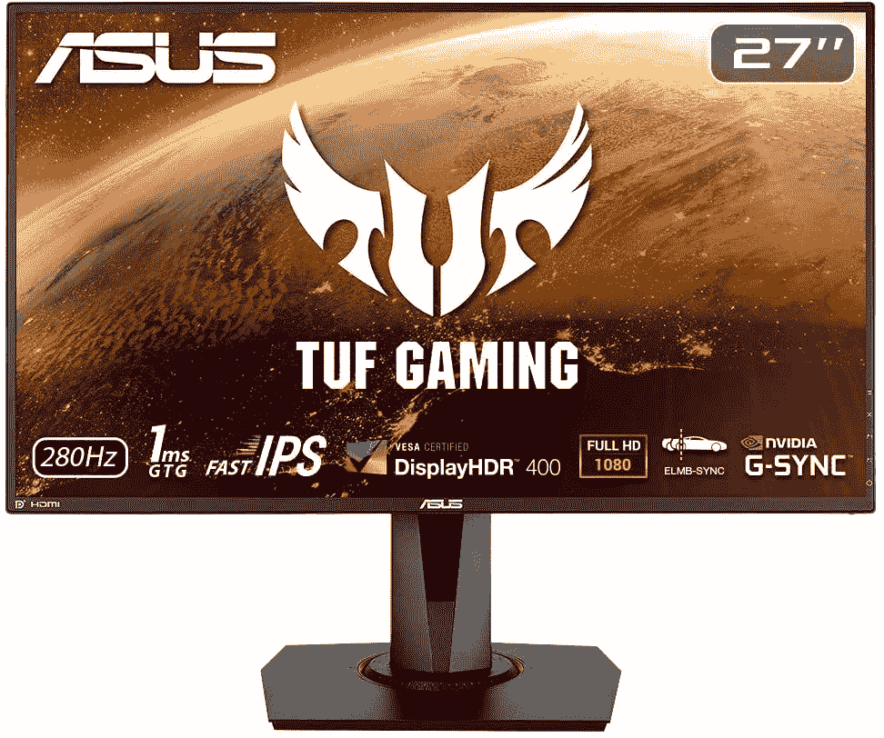
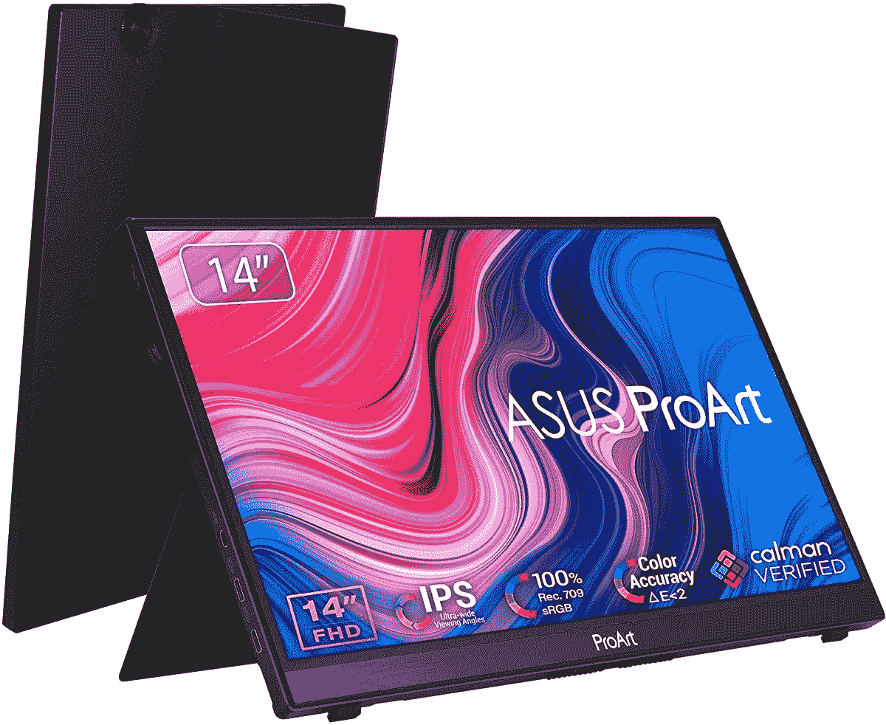
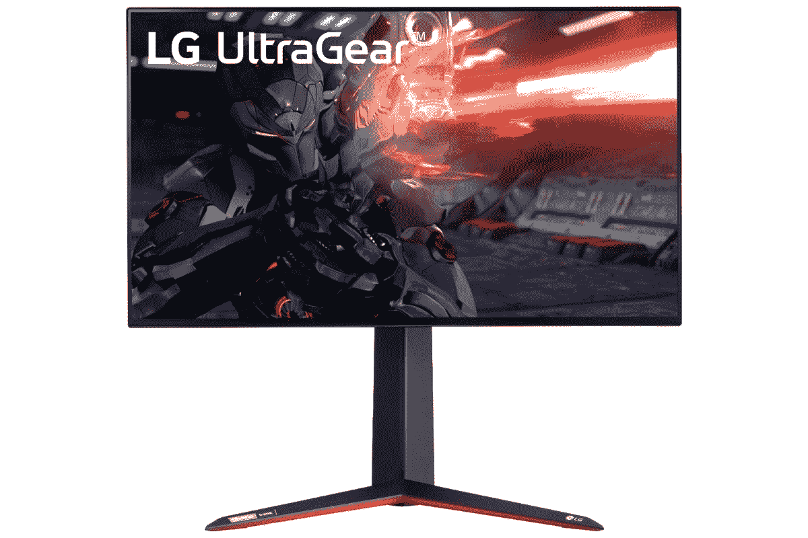
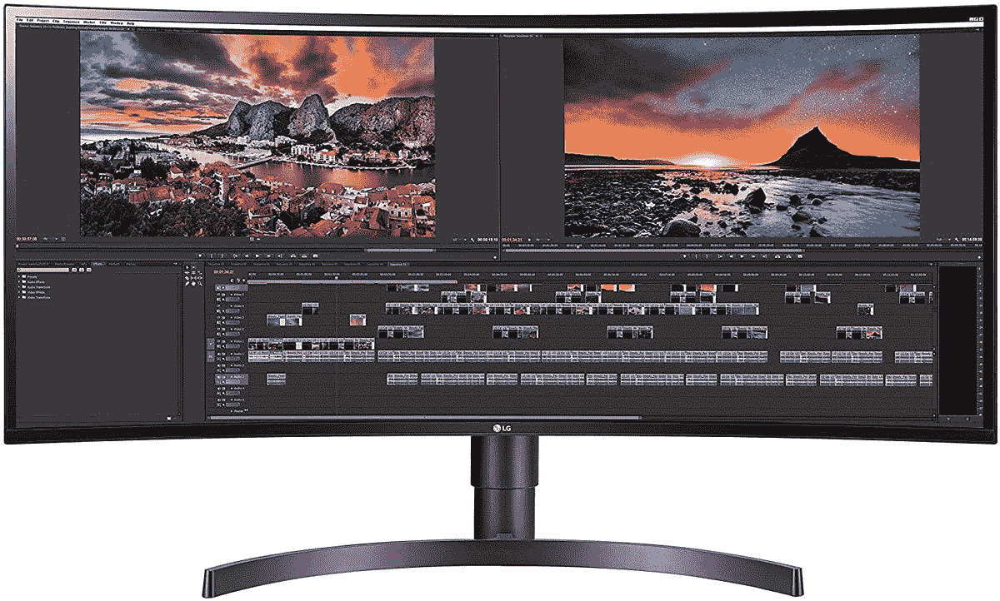
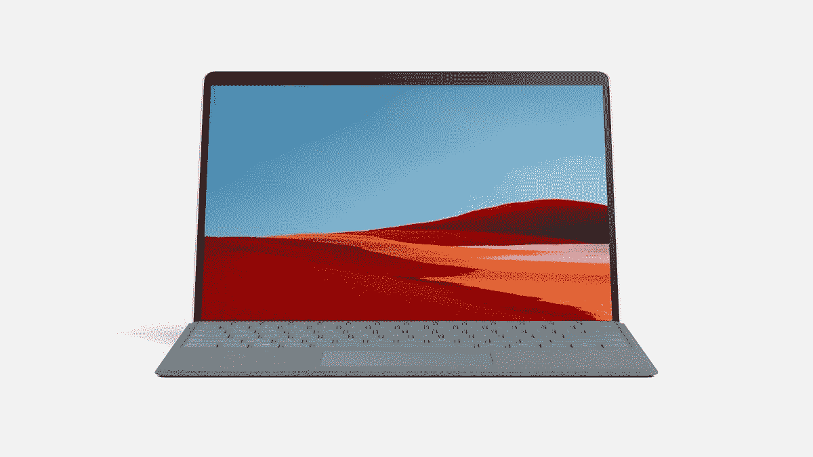

# Surface Pro X 的最佳显示器

> 原文：<https://www.xda-developers.com/best-surface-pro-x-monitors/>

Surface Pro X 最棒的部分之一是便携性，这有助于它成为一款真正好的 Windows 平板电脑(T2)。凭借超薄边框 13 英寸屏幕和对 LTE 的支持，您可以将工作带到任何地方。但是，当您在家或在办公室时，您将需要一台显示器来充分利用您的设备。这可以通过 USB-C 端口来完成，或者通过使用 Surface Connect 端口和 Surface Dock 2 来完成。

Surface Pro X 可以使用大量不同的显示器，但并非所有显示器都是最好的。在本指南中，我们为 Surface Pro X 挑选了一些我们最喜欢的显示器。它涵盖了各种类别，从廉价到宽屏、便携式等等。看看吧！

 <picture></picture> 

Asus VG279QM

##### 华硕 VG279QM

这是一款全高清显示器，可以用来扩展 Surface Pro X 上的屏幕。它还拥有超快的 280Hz 刷新率，因此 Windows 11 会感觉更生动。

 <picture></picture> 

Asus Proart PA148CTV

##### 华硕 ProArt PA148CTV 14 英寸便携式显示器

华硕 ProArt PA148CTV 是市场上最好的便携式显示器之一。如果你正在寻找可以随身携带的 Surface Pro X，这是一个不错的选择。它有一个 14 英寸的全高清 IPS 面板，支持 USB Type-C 输入。

 <picture></picture> 

Samsung Smart Monitor M8

##### 三星智能显示器 M8

显示器不仅仅是一个显示器。这款显示器不仅是 4K，而且还配有高质量的网络摄像头，您可以使用它进行视频通话。此外，即使没有 Surface Pro X，你也可以使用网飞等应用和其他几个流媒体服务

 <picture></picture> 

LG UltraGear 27GN950-B

##### LG UltraGear 27GN950-B

虽然 Surface Pro X 不是游戏机，但你可能想要一个刷新率超快的 4K 显示器。这就是 LG UltraGear 27GN950-B 上榜的原因。

##### 戴尔 UltraSharp U2723QE

Dell UltraSharp U2723QE 具有 4K 分辨率，并使用 IPS 黑科技，这使其对比度是普通 IPS 面板的两倍。它还覆盖了 98%的 DCI-P3，因此当连接到 Surface Pro X 时，颜色看起来很棒

 <picture></picture> 

LG Ultrawide 34WN80C-B

##### LG 超宽 34WN80C-B

这款显示器非常适合 Surface Pro X 屏幕以外的多任务处理。凭借 21:9 的宽高比，您可以并排堆叠大量窗口，完成更多工作

正如你所看到的，这些是 Surface Pro X 的最佳显示器。我们试图为每个人提供一点点东西。不过请记住，这些显示器可以与你拥有的任何其他 PC 或[任何其他 Surface](https://www.xda-developers.com/best-microsoft-surface-pcs/) 兼容，而不仅仅是 Surface Pro X。这就是为什么我喜欢有很多端口的显示器。我个人有一个戴尔 4K 显示器，我把 Surface Pro 8 挂在上面，还有我自己的 Xbox。像我们列表中的 Dell Ultrasharp 这样的选项非常适合这种情况。

如果你还没有检查它，或者拥有一个，你也可以通过下面的链接购买 Surface Pro X。这是一款非常棒的 Surface 平板电脑，电池续航时间长，并添加了 LTE。当然，如果你不喜欢，你也可以看看我们的最佳笔记本电脑指南。

 <picture></picture> 

Microsoft Surface Pro X

##### 微软 Surface Pro X

Surface Pro X 拥有现代的设计和 13 英寸的高分辨率显示屏。此外，由于其基于 ARM 的芯片组，它支持 LTE(可选)以实现移动连接，并提供 15 小时的电池续航时间。