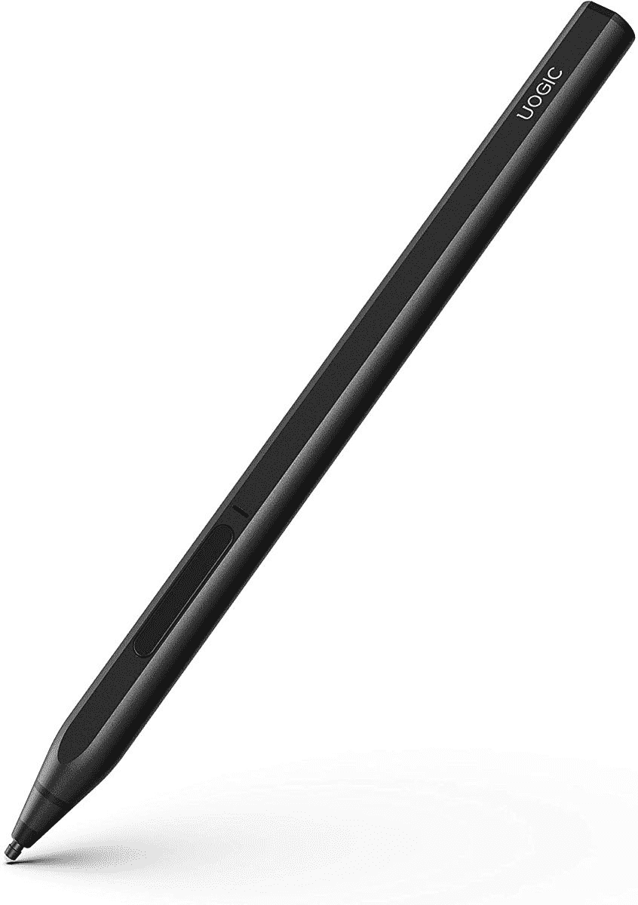

# Surface Pro X 的最佳笔

> 原文：<https://www.xda-developers.com/best-surface-pro-x-pens/>

# Surface Pro X 的最佳笔

为微软 Surface Pro X 寻找一支笔或触控笔？我们挑选了市面上最好的 Surface Pro X 笔。

Surface Pro X 是一款设计精美的 Windows 平板电脑，拥有华丽的显示屏。由于其基于 ARM 的芯片，这是微软 Surface 系列中的一款独特产品。该平板电脑还包含许多其他令人兴奋的功能，包括手写笔或笔支持。您可以使用手写笔来记笔记、画草图、做注释以及做许多其他事情。不幸的是，微软没有将笔与平板电脑捆绑在一起，但市场上有几种选择，包括该公司的 Surface Pen 和 Surface Slim Pen。我们为 Surface Pro X 挑选了最好的笔，你现在就可以订购。

*   <picture></picture>

    Surface Pen

    ##### 微软 Surface Pen

    官方 Surface Pen 让你在 Surface Pro X 平板上自然书写。你可以用笔尖写字或画画，另一端用来擦。它有 4096 级压力灵敏度，非常精确。此外，Surface Pen 使用 AAAA 电池供电，蓝牙 4.0 连接。

*   <picture></picture>

    sky mirror 磁性数字笔

    ##### sky mirror 磁性数字笔

    sky mirror 数字笔是官方 Surface Pen 的一个体面的预算替代品。它不需要配对，只需插入 AAAA 电池就可以开始使用。它有 1，024 级压力敏感度，并有一个口袋夹，便于存放。盒子里有两个笔尖，一个是硬的，另一个是软的。

*   <picture></picture>

    MoKo 手写笔为 Surface

    ##### 可比手写笔

    MoKo 手写笔是我们推荐中最实惠的笔。除了与 Surface Pro X 兼容之外，它还可以与许多其他 Windows 设备兼容。像 SkyMirror 笔一样，你可以在可比手写笔上获得 1024 级压力灵敏度，而且它不需要蓝牙配对。还有一个内置的夹子。

*   <picture></picture>

    uo gic Ink 581 Pen

    ##### uo gic Ink 581 Pen

    uo gic Ink 581 Pen 是一款出色的 Surface Pen 替代产品，具有 4，096 级压力敏感度和倾斜，支持底纹。它还有四种颜色可供选择，并配有充电电池。笔上有一个 MicroUSB 接口，用于充电。此外，您还可以使用右键单击和擦除按钮进行快速访问。

*   <picture></picture>

    renaissser Raphael 530

    ##### renaissser Raphael 530

    renaissser Raphael 530 是一款经济型笔，仍然提供一些强大的功能。它有 4，096 级压力，倾斜支持，和一个双橡皮擦，所以你可以按下侧面的按钮正常擦除或使用笔的尾端。它还有一个可持续 100 小时的可充电电池。

* * *

这些是微软 Surface Pro X 的最佳笔，它们中的每一支都将与 2019、2020 和 2021 Surface Pro X 型号配合使用。虽然官方的 [Surface Slim Pen](https://www.amazon.com/New-Microsoft-Surface-Slim-Pen/dp/B07YNLS53W/?tag=xda-5c1fb6o-20&ascsubtag=UUxdaUeUpU5481&asc_refurl=https%3A%2F%2Fwww.xda-developers.com%2Fbest-surface-pro-x-pens%2F&asc_campaign=Affiliate) 是 Surface Pro X 的最佳手写笔，但它也很贵。因此，如果你正在寻找一个好的预算替代方案，[u logic Ink 581 Pen](https://www.amazon.com/Uogic-Microsoft-Sensitivity-Rejection-Rechargeable/dp/B08BJLDFWT/?tag=xda-5c1fb6o-20&ascsubtag=UUxdaUeUpU5481&asc_refurl=https%3A%2F%2Fwww.xda-developers.com%2Fbest-surface-pro-x-pens%2F&asc_campaign=Affiliate)和 Renaisser Raphael 530 是绝佳的选择。两者都提供相似的功能和可充电电池。如果你不是一个大的手写笔用户，并且需要一些偶尔使用的东西，你也可以选择 MoKo 和 SkyMirror 笔。

你打算为 Surface Pro X 买哪一款手写笔？请在评论区告诉我们。与此同时，如果你仍然不确定是否购买 Surface Pro X，请确保查看我们选择的[最佳 Windows 平板电脑](https://www.xda-developers.com/best-windows-tablets/)和[最佳 Surface PC](https://www.xda-developers.com/best-microsoft-surface-pcs/)以获得一些优秀的替代品。

 <picture></picture> 

Microsoft Surface Pro X

##### 微软 Surface Pro X

Surface Pro X 拥有现代的设计和 13 英寸的高分辨率显示屏。由于其基于 ARM 的芯片组，它支持 LTE(可选)以实现移动连接，并提供 15 小时的电池续航时间。