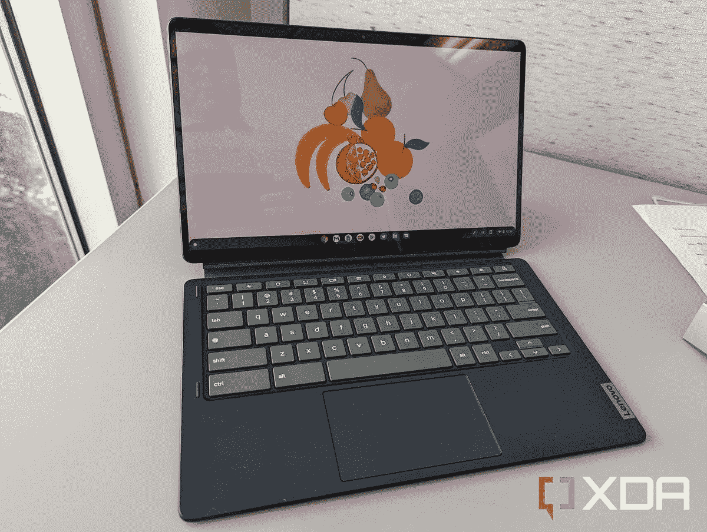
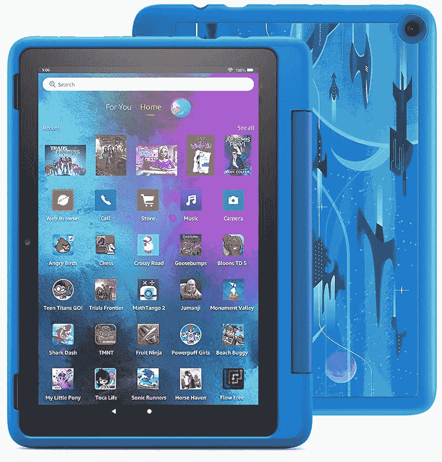

# 2023 年学校最佳平板电脑

> 原文：<https://www.xda-developers.com/best-tablets-for-school/>

这些年来，平板电脑发展了很多，现在市场上有一些很好的选择。许多较新的平板电脑变得如此强大和高效，以至于它们成为学校笔记本电脑甚至 T2 chrome book 的可靠替代品。将它们与键盘和鼠标配对，你就拥有了一台便携式办公设备，不仅便于携带，而且功能强大，足以为你处理几乎所有的日常任务。如果你正在考虑 2023 年给自己或孩子买哪一款平板电脑，那么你来对地方了。以下是 2023 年最好的学校用平板电脑:

## 整体最佳:苹果 iPad Air 5 (2022)

第五代 iPad Air 是我们在[最佳平板电脑系列](https://www.xda-developers.com/best-tablets/)中选出的最佳选择，是 2023 年学校的最佳平板电脑。它可能不是市场上最新或最强大的平板电脑，但足以让你完成学校的所有日常任务。iPad Air 5 由苹果的 M1 芯片驱动，这使得它比市场上的许多其他平板电脑都更强大。它基本上与采用 M1 芯片的老款 MacBook Air 或 iPad Pro 机型具有相同的原始功率。再加上 iPadOS 16 的进步，你会得到一个功能强大的平板电脑，让你可以使用传统笔记本电脑上的几乎所有东西。

iPad Air 5 最好的一点是它还兼容 Apple Pencil，这意味着你可以使用苹果的手写笔在上面做笔记。它的占地面积也相对较小，这意味着与传统的笔记本电脑或 Chromebook 相比，它更容易携带。iPad Air 5 的其他一些值得注意的功能包括 10.9 英寸液晶 60Hz 显示屏，用于身份验证的 TouchID 指纹传感器，以及升级的 12MP 超宽摄像头，也可以处理苹果的中央舞台功能。在做出购买决定之前，您可以阅读我们的 [iPad Air 5 评论](https://www.xda-developers.com/apple-ipad-air-5-review/)以了解更多信息。

 <picture></picture> 

Apple iPad Air 5

##### 苹果 iPad Air 5

iPad Air 5 提供强大的 M1 芯片、Apple Pencil 2 兼容性和 iPadOS 16 支持。

## 也很棒:三星 Galaxy Tab S8

如果你宁愿买一台 Android 平板电脑而不是 iPad，那么你可以考虑选择 Galaxy Tab S8 系列中的一款。Tab S8 系列的三款平板电脑都同样不错，但我们建议选择普通 Galaxy Tab S8 或 Plus 型号。它们都很好，拥有 2023 年学校用基本平板电脑的所有要素。另一方面， [Galaxy Tab S8 Ultra](https://www.xda-developers.com/samsung-galaxy-tab-s8-ultra-review/) 型号主要是为高级用户准备的，它也将花费你更多的钱。与 Plus 和 Ultra 型号相比，常规 Galaxy Tab S8 型号的体积更小，因此更易于携带。

就规格而言，Galaxy Tab S8 包装了 11 英寸 LTPS TFT 面板，支持 120Hz 刷新率。它与更大的型号采用相同的骁龙 8 代 1 芯片，因此您不一定会错过任何性能。Galaxy Tab S8 的一个亮点是它还配有 S Pen，这意味着你不必花更多的钱来购买额外的手写笔来搭配平板电脑。你可以开始使用它，比如在阅读时做笔记或突出重要信息。值得注意的是，你还可以使用 Galaxy Tab S8 上的 DeX 模式来处理需要更大显示屏的生产力任务。

##### 三星 Galaxy Tab S8

三星 Galaxy Tab S8 是该公司 2022 年旗舰平板电脑阵容的入门级设备，配备 S Pen 和 11 英寸显示屏。

## 最适合多任务处理:微软 Surface Pro 9

iPads 和 Android 平板电脑在处理多任务处理方面已经变得更好，但在这方面它们仍在某种程度上追赶 Windows。如果你想在 2023 年购买一台 Windows 平板电脑，那么我们建议你看看[微软 Surface Pro 9](https://www.xda-developers.com/surface-pro-9/) 。它可以说是目前生产力方面最好的平板电脑，与市场上的 iPad 和 Android 平板电脑相比，它可以更轻松地处理多任务处理等事情。

Surface Pro 9 平板电脑与其前代产品有很多相似之处，但在一些关键领域也有所改进。你仍然可以获得同样的 13 英寸面板，分辨率为 2880 x 1920，支持高达 120Hz 的刷新率，但它现在由英特尔的第 12 代芯片驱动，升级到多达 10 个内核和 12 个线程的酷睿 i7-1255U。它还有一个更强大的集成 GPU，可以满足您偶尔的游戏需求。微软还推出了 Surface Pro 9 的 5G 版本，但它由该公司的 SQ3 Arm 处理器而不是英特尔芯片驱动。你可以查看我们对 [Surface Pro 9 5G](https://www.xda-developers.com/surface-pro-9-5g-review/) 的评测，了解更多细节。

##### Surface Pro 9(无线网络)

Surface Pro 9 配备了第 12 代英特尔酷睿处理器，它首次采用了一系列美丽的颜色。这无疑是最好的平板电脑之一。

## 最佳 Chrome OS 平板电脑:联想 Chromebook Duet 5 

联想 Chromebook Duet 5 是我们选出的 2023 年最佳学生 ChromeOS 平板电脑。它包含一些可靠的规格和一组良好的功能，使它成为其价格范围内的一个很好的选择。联想 Chromebook Duet 5 搭载第二代高通骁龙 7c 处理器，这是一款基于 arm 的 CPU。它不如苹果的 M1 芯片强大，但它应该能够毫无问题地处理你的所有基本工作负载。你甚至可以用它流畅地玩一些安卓游戏和流媒体。

Chromebook Duet 5 的特别之处在于它的 OLED 面板。没错，联想将这款平板电脑与 OLED 面板打包在一起，本质上使其优于 iPad Air 和本系列中提到的许多其他平板电脑。这款 Chrome OS 平板电脑的其他一些值得注意的功能包括一组四阵列扬声器、两个 USB-C 端口和随附的键盘。你可以阅读我们的[联想 Chromebook Duet 5 评测](https://www.xda-developers.com/lenovo-ideapad-duet-5-chromebook-review/)，如果你想在做出购买决定之前了解更多关于这款平板电脑的信息。

##### 联想 Chromebook Duet 5

联想 Chromebook Duet 拥有充满活力的有机发光二极管显示屏和宽敞的键盘，是 ChromeOS 平板电脑的出差族

## 最佳预算平板电脑:苹果 iPad Mini (2021 年)

如果你不想让你的钱包向 iPad Air 5 或 Galaxy Tab S8 这样的昂贵选择敞开，那么你可以考虑看看 iPad Mini (2021)。这也是我们选择的最紧凑的平板电脑，因此它非常适合那些只想要一个小型可靠的平板电脑供休闲使用的学生。它的尺寸仅为 7.69 x 5.8 x 0.25 英寸，重量为 0.6 磅，因此它无疑是该系列中最紧凑的平板电脑。尽管外形小巧，但 iPad Mini 6 配备了一些强大的硬件。它由 A15 仿生芯片驱动，这与当前一代 [iPhone 14](https://www.xda-developers.com/apple-iphone-14-review/) 和 iPhone 14 Plus 型号采用的芯片相同。它还支持更新的 Apple Pencil 2。

iPad Mini 6 目前在美国的售价仅为 500 美元左右，是这一系列产品中最便宜的选择。或者，你也可以考虑购买便宜 50 美元的新款 iPad 10。但在 iPad Mini 6 上多花的 50 美元将会让你得到一个 A15 仿生芯片，而不是 A14 仿生，你还可以获得对新 Apple Pencil 2 的支持。在做出购买决定之前，请务必阅读我们的 [iPad Mini 6 评论](https://www.xda-developers.com/apple-ipad-mini-6-review/)。

## 6-12 岁最佳平板电脑:亚马逊 Fire HD 10 儿童专业版

亚马逊有适合 6-12 岁年龄段的 Fire HD 10 Kids Pro 平板电脑，配有 10.1 英寸 1080p 显示屏，坚固的外壳提供额外保护。它还附带一年的 Amazon Kids+，家长控制，以及两年的无忧保证。2GHz 八核处理器为平板电脑提供 3GB RAM 和 32GB 存储空间，可以使用高达 1TB 的 microSD 卡进行扩展。除了通过亚马逊 Kids+订阅的教育内容，它还包括书籍、电影、电视节目、歌曲、应用程序、游戏，此外，孩子们可以从数字商店请求更多内容，如网飞、《我的世界》、Zoom 等。

 <picture></picture> 

Amazon Fire HD 10 Kids Pro

##### 亚马逊消防 HD 10 儿童专业版

Fire HD 10 Kids Pro 平板电脑是一款面向 6 至 12 岁青少年学生的教育平板电脑。

这就是我们收集的 2023 年最好的学校平板电脑。苹果的 iPad Air 5 和三星 Galaxy Tab S8 是你现在可以买到的两个最好的选择。我们还增加了一些其他选项，包括 Windows 和 ChromeOS 平板电脑，所以请务必查看所有选项。如果你想要更多的选择，那么你可能会想停下来看看我们收集的[最佳 ipad](https://www.xda-developers.com/best-ipad/)、[最佳安卓平板电脑](https://www.xda-developers.com/best-android-tablets/)，甚至是[最佳 Chrome OS 平板电脑](https://www.xda-developers.com/best-chrome-os-tablets/)，看看现在所有的东西。