# 2023 年 TCL 20 系列最佳快速充电器

> 原文：<https://www.xda-developers.com/best-tcl-20-fast-charger/>

TCL 20 系列于今年早些时候首次亮相，该系列中的各种手机正在慢慢走向世界。该系列中的三款手机 TCL 20 Pro 5G、20S 和 20se——于 6 月登陆美国。其他型号，如 20L、20L+和 20 5G，在欧洲各国和其他市场均有销售。

虽然 [TCL 20 Pro 5G](https://www.xda-developers.com/tcl-20-pro-5g-review/) 和 TCL 20 5G 手机配有 4500 毫安时电池，但该系列中的其余手机使用 5000 毫安时电池。该公司还在所有 20 系列手机中增加了对 18W 快速充电的支持。然而，TCL 20 SE 在包括美国在内的一些市场上发布，不支持快速充电，最多只能支持 10W 充电。TCL 20 系列手机采用高通的 Quick Charge 快充技术，20 Pro 5G、20L、20L+和 20S 支持 Quick Charge 3.0，20 5G 摇摆快充 4+。

此外，该公司正在根据市场情况，将 18W 快速充电器与兼容的 TCL 20 系列手机捆绑销售。不过，如果你正在寻找一个替代的快速充电器，或者只是因为公司没有在你的国家捆绑一个快速充电器，我们可以帮助你。我们为所有 TCL 20 系列手机选择了最佳快速充电器，包括 TCL 20 Pro 5G、 [TCL 20S](https://www.xda-developers.com/tcl-20s-review/) 和 [TCL 20 SE](https://www.xda-developers.com/tcl-20-se-review/) 。

## 用于 TCL 20 系列的快速充电器(18W 或以上)

这些快速充电器非常适合所有 TCL 20 系列手机，包括两种 TCL 20 SE 型号。

 <picture>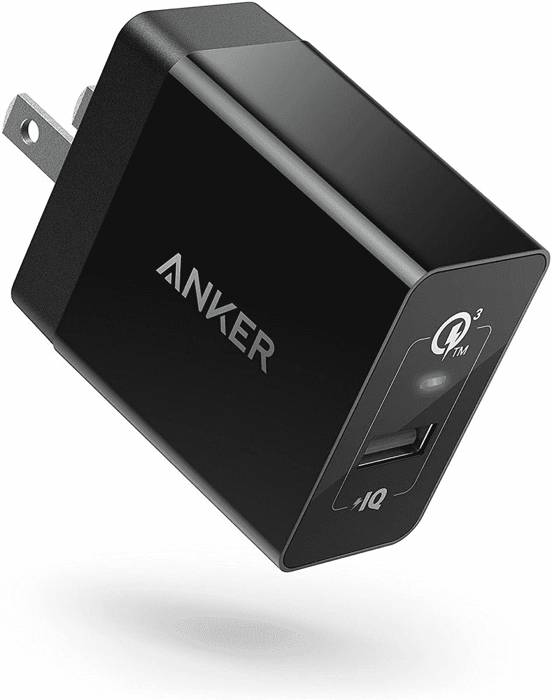</picture> 

Anker PowerPort+ 1

##### Anker PowerPort+ 1

Anker PowerPort+ 1 壁式充电器支持高通的快速充电 3.0 技术，并配有一个 A 型端口。它提供了高达 18W 的快速充电支持，这对于任何 TCL 20 系列手机来说都足够了。

 <picture>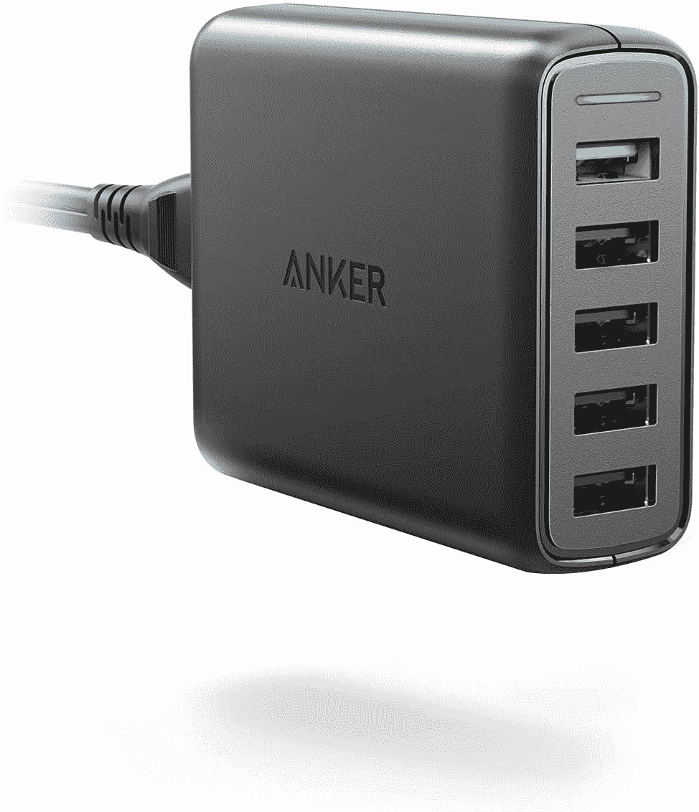</picture> 

Anker PowerPort Speed 5

##### Anker PowerPort Speed 5

如果你家里有多部手机或平板电脑，这款 Anker PowerPort Speed 5 充电器会非常有用。它配有五个 A 型端口，其中一个兼容快速充电 3.0。该充电器可输出高达 51.5 瓦的总功率。

 <picture>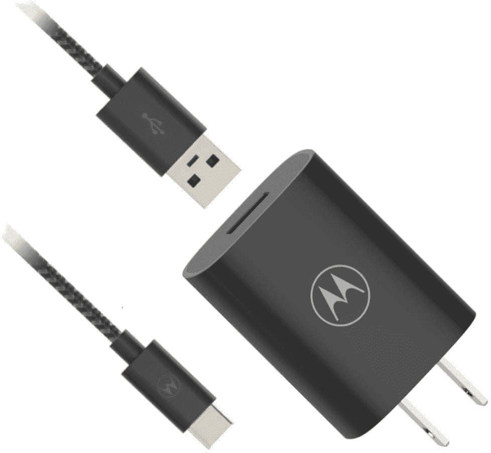</picture> 

Motorola TurboPower Flip Charger

##### 摩托罗拉涡轮动力翻转充电器

这款摩托罗拉 TurboPower 翻盖充电器不仅可以用于摩托罗拉手机，还可以用于其他兼容 Quick Charger 3.0 的设备，包括 TCL 20 系列手机。此外，充电器配有 A 型到 C 型编织电缆。

 <picture>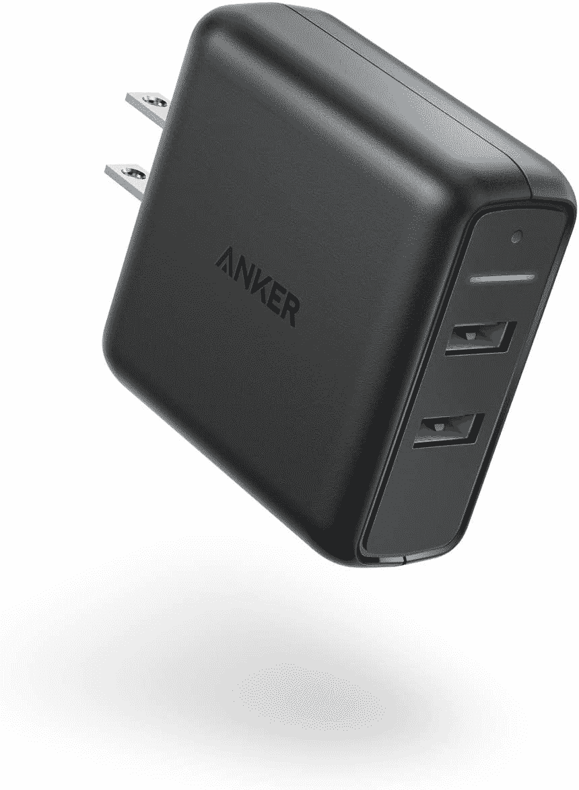</picture> 

Anker PowerPort Speed 2

##### Anker 动力端口速度 2

如果五个端口对你来说太多了，Anker PowerPort Speed 2 是一个只有两个 A 类端口的很好的选择。此外，这款充电器的两个端口都兼容 Quick Charge 3.0，每个端口可以输出近 20W 的功率。

 <picture>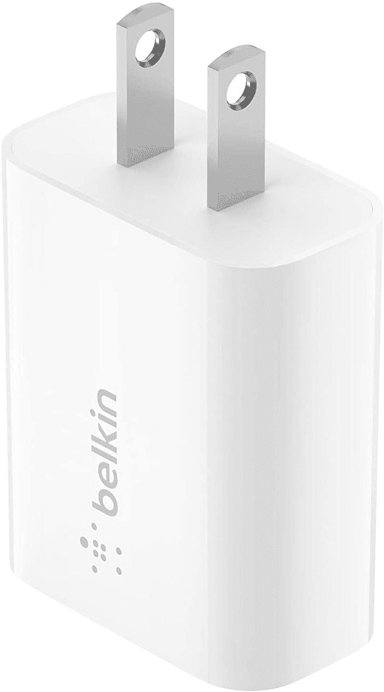</picture> 

Belkin Quick Charge Charger

##### Belkin 快速充电充电器

如果你不想进入多个端口，多个充电标准，需要一个刚刚工作的充电器，这款 Belkin 充电器非常适合你。它带有一个 A 型端口，支持 18W 充电。

 <picture></picture> 

Baseus 65W GaN Charger

##### Baseus 65W GaN 3 端口充电器

不仅仅是你的 TCL 需要一个快速充电器，Baseus GaN 充电器不仅支持高通快速充电，它还可以与 USB PD、三星的自适应快速充电和联发科的快速充电解决方案配合使用，如果你有不同制造商的设备，它将非常有用。

 <picture>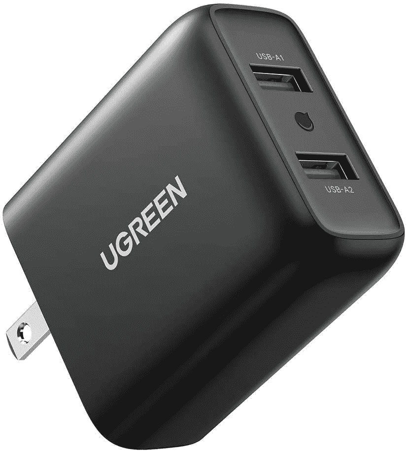</picture> 

Ugreen Dual Wall Charger

##### Ugreen 快充 36W 双壁充电器

Ugreen 制作了很棒的 USB 配件，这个壁式充电器也不例外。它带有两个 USB Type-A 端口，每个端口都支持快充 3.0 和最高 18W 的快充。

 <picture></picture> 

Belkin Boost Charge 27W

##### 贝尔金充电 27W

Belkin Boost Charge 27W 快速充电器支持快充 4+，甚至可以与 USB PD 设备配合使用。所以这款快速充电器不仅可以给任何一款 TCL 20 系列手机充电，你甚至可以用它来给其他设备快速充电。Belkin 还在包装盒中捆绑了 USB Type-C 到 Type-C 电缆。

 <picture>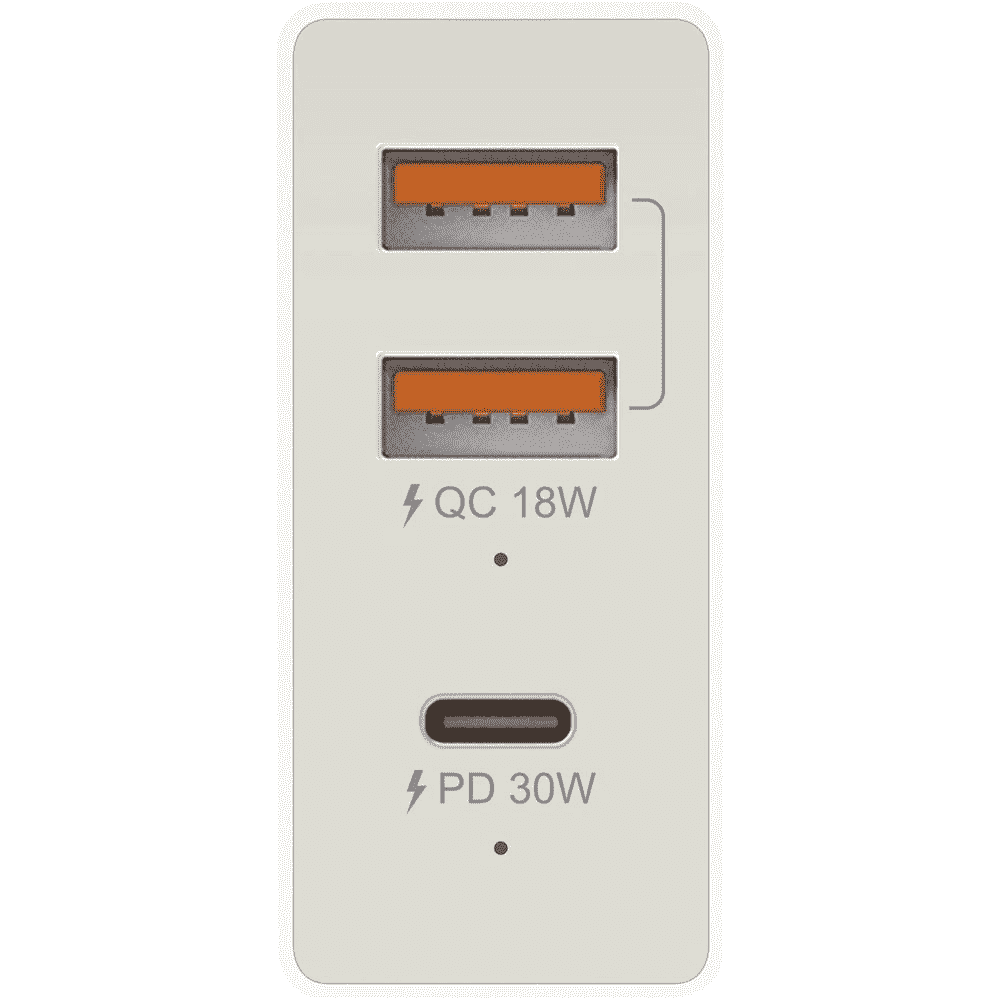</picture> 

J5create USB Super Charger

##### j5create 48W USB 充电器

j5create USB 超级充电器打包了三个端口，包括两个 USB Type-A 和一个 Type-C。虽然 Type-C 端口支持 USB PD 和最高 30W 的充电，但两个 USB Type-A 端口支持最高 18W 的充电和快速充电 3.0。

## 用于 TCL 20 SE 的快速充电器(12W 及以上)

除了上述也适用于 TCL 20 SE 的充电器之外，这里还有一些选项，虽然没有上述选项快，但足以以最高速度为 20 SE US 型号充电。

 <picture>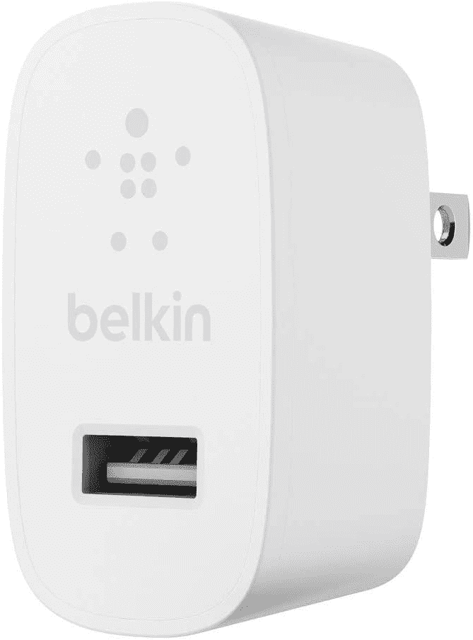</picture> 

Belkin USB Charger

##### Belkin USB 充电器 12W

如果你只是想给 TCL 20 SE 充电，Belkin USB 充电器是个不错的选择。它具有单个 A 型端口，可提供高达 12W 的功率。

 <picture></picture> 

Native Union Smart Charger

##### Native Union 超薄智能充电器

Native Union 智能充电器非常纤薄，厚度仅为 12 毫米，非常适合难以触及的空间。它还具有可折叠插头，便于存放。而且充电器上有两个 USB Type-A 口，每个都能输出 12W 的功率。

 <picture></picture> 

Anker PowerPort Mini Dual

##### Anker PowerPort 迷你双

Anker PowerPort 迷你双充电器包含两个 USB Type-A 端口。当使用单个端口时，它可以提供 12W 的功率；当使用两个端口时，它可以提供总共 12W 的功率。如果你有多台不支持快充的设备，这是个不错的选择。

 <picture>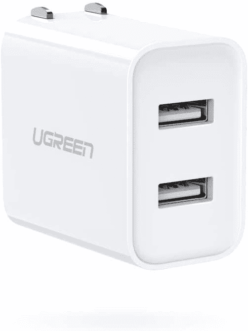</picture> 

Ugreen USB Wall Charger

##### UGREEN USB 充电器 3.1A 双端口壁式充电器

Ugreen USB 壁式充电器带有两个 USB Type-A 端口，当只使用一个端口时，两个端口都能够提供 12W 的功率。它还有一个可折叠的别针，是旅行的好选择。

 <picture>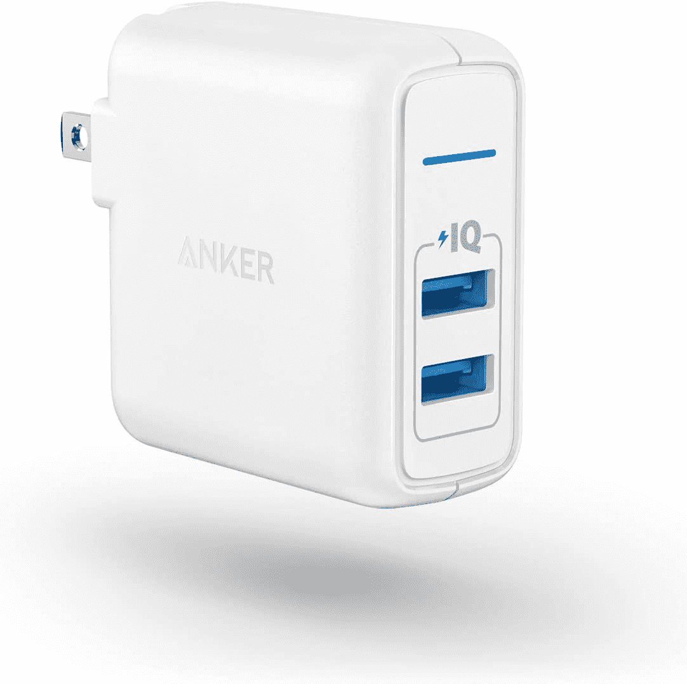</picture> 

Anker Elite Wall Charger

##### Anker Elite 24W 壁式充电器

除了它的 PowerPort Mini Dual，Anker 还提供了这个不那么纳米的选项，如果你想省钱的话，这个选项很棒。你有两个 A 型端口，即使两个都在使用，每个端口也可以提供高达 12W 的充电功率。

 <picture>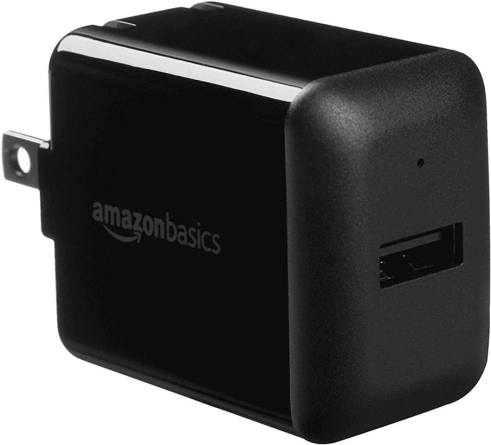</picture> 

AmazonBasics USB Charger

##### 亚马逊基础 12W USB 充电器

AmazonBasics USB 充电器配备了一个 USB Type-A 端口，能够提供高达 12W 的功率，足以满足 TCL 20 SE 的需求。它也超级实惠，是我们推荐的最便宜的之一。

这些都是 TCL 20 系列手机最好的快速充电器。如果你想要一个简单直接的充电器，Anker PowerPort+ 1 是所有 TCL 20 系列手机的好选择。但是，如果你需要一个专门为 TCL 20 SE 美版设计的充电器，那么 Belkin USB 充电器绝对不会错。

您打算为您的 TCL 20 系列手机购买哪种快速充电器？请在评论区告诉我们。