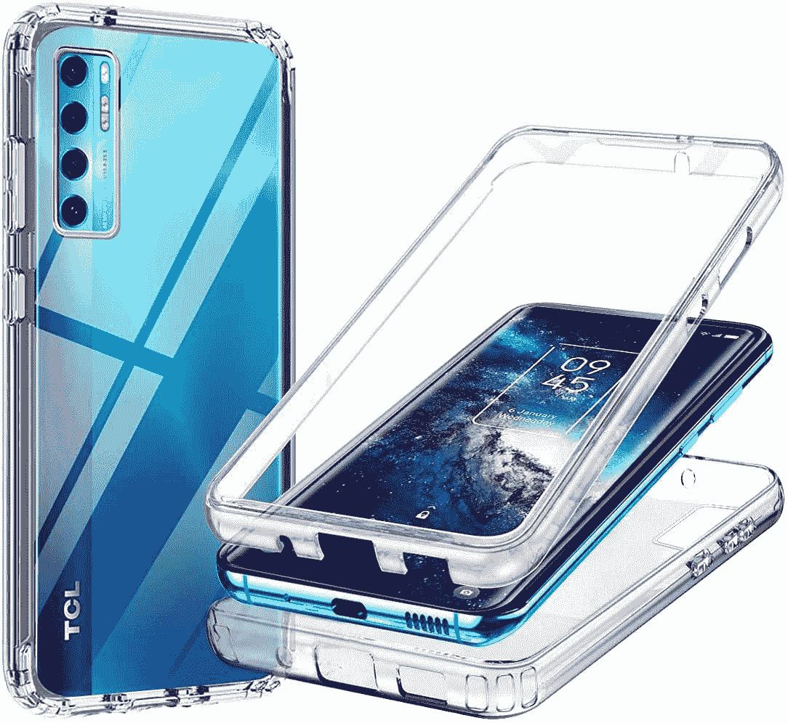
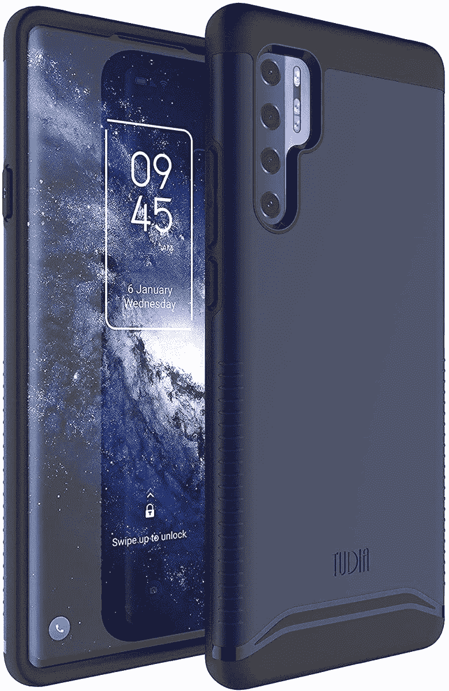
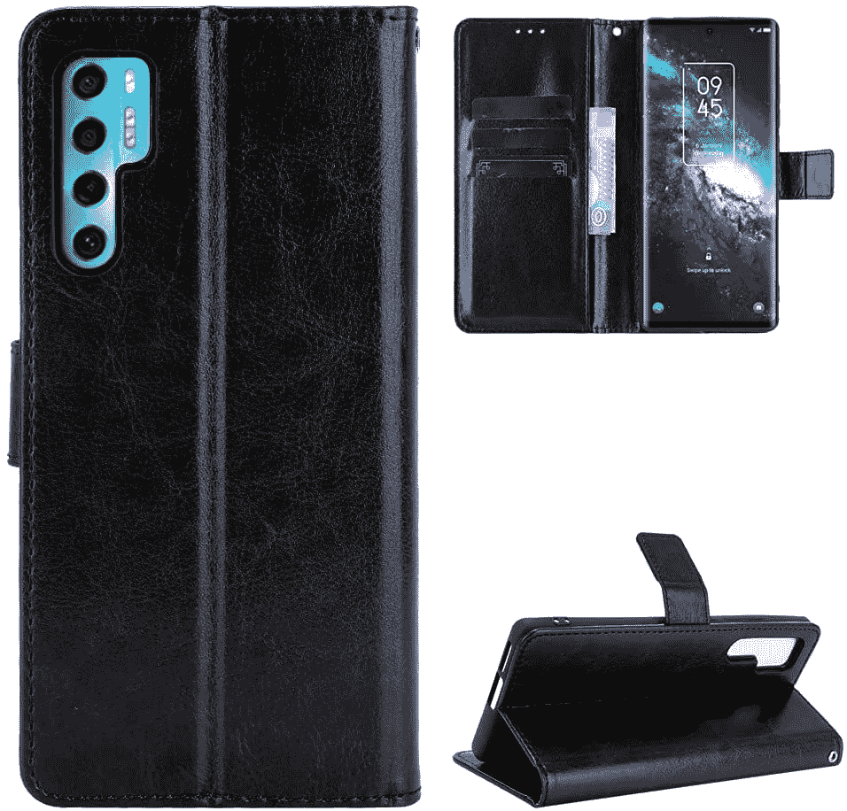

# 2023 年最佳 TCL 20 Pro 5G 机箱

> 原文：<https://www.xda-developers.com/best-tcl-20-pro-5g-cases/>

# 2023 年最佳 TCL 20 Pro 5G 机箱

这里是你能为你的 TCL 20 Pro 5G 找到的最好的保护套，以保护它免受划痕和跌落的影响。

TCL 20 Pro 5G 是该公司在 TCL 20 系列中提供的最好的智能手机。对于那些希望在预算内购买可靠手机的人来说，它在美国仍然是一个非常好的中端选择。它有一套很好的功能和规格，使其引人注目，特别是目前在美国的 400 美元。

如果你打算给自己买一部 TCL 20 Pro 5G，那么我们建议你买一个好的保护套，以防日常使用和滥用。它还带有一个弯曲的面板，更加脆弱。因此，如果你想知道购买哪个保护套来保护你的新 TCL 20 Pro 5G 智能手机，那么这里有一些可靠的选择可以考虑:

*   ##### VIESUP 超清保护套

    编辑推荐

    如果你正在寻找一款简单的透明保护套来炫耀你的 TCL 20 Pro 5G 智能手机的颜色，那么没有比 VIESUP 超清保护套更合适的了。它不会给你的设备增加太多体积，而且还带有精确的切口。

    T13
*   <picture></picture>

    晶莹剔透的坚固保险杠

    ##### CoverON Clear 坚固耐用的 TCL 20 Pro 5G 机箱

    最超值

    这款 cover on 坚固耐用的 TCL 20 Pro 5G 机箱非常适合那些生活方式活跃的人。这是一个防震外壳，配有内置屏幕保护器，为您的设备提供完整的 360 度保护。它有三种不同的颜色，都有一个清晰的背面来展示你的手机的颜色。

*   <picture></picture>

    Tudia 双层保护套

    ##### Tudia Dual shield TCL 20 Pro 5G 保护套

    Premium Pick

    Tudia Dual shield 保护套是一款比较贵的保护套，有一堆不同的颜色。这是一个薄的外壳，为您的手机提供了相当大的保护，所以如果您不想增加太多的设备体积，这是一个不错的选择。

*   ##### NZND 时尚保护套

    NZND 保护套有两种款式，背面都有彩色图案。外壳本身带有一个硬塑料背和一个 TPU 保险杠，它非常适合那些想改变手机外观而又不想花太多钱的人。

*   ##### Sitikai 支架盒

    这是一款适用于 TCL 20 Pro 5G 的简单支架盒，可以让您将其放置在平坦的表面上，获得免提观看体验。这款 TPU 手机套背面的可折叠支架也可以用来握持手机。还配有钢化玻璃屏幕保护套，所以增值不少。

    T17
*   <picture></picture>

    真皮钱夹翻盖手机套

    ##### 琼尼真皮钱夹 TCL 20 Pro 5G 手机套

    这款真皮钱夹手机套提供了全面的保护，因为它可以保护手机的正面和背面。这是一个钱包盒，所以它也有几个插槽，你可以存放信用卡或身份证，甚至一些现金。它还有三种不同的颜色，所以一定要挑选你喜欢的那种。

这就把我们带到了这个系列的最后，在这个系列中，我们突出了 TCL 20 Pro 5G 的最佳案例。我们在这个列表中添加了一个很好的选项组合，所以每个人都可以从中选择。如果我们要选择一个，那么我们会选择 VIESUP ultra clear 或 Tudia DualShield。如果你碰巧有积极的生活方式，或者如果你只是笨拙地使用智能手机，你也可以考虑购买 CoverON rugged case。

 <picture></picture> 

TCL 20 Pro 5G

##### TCL 20 Pro 5G

TCL 20 Pro 5G 是该公司 20 系列产品中最好的智能手机，它在价格上提供了良好的功能和规格组合。

那么你打算为你的 TCL 20 Pro 智能手机买哪个保护套呢？请在下面的评论中告诉我们。如果你仍然对购买这款手机犹豫不决，那么一定要在做出购买决定之前阅读我们的 [TCL 20 Pro 5G 评论](https://www.xda-developers.com/tcl-20-pro-5g-review/)以了解我们对它的看法。或者，你也可以看看我们收集的[最划算的安卓手机](https://www.xda-developers.com/best-cheap-android-phones/)来找出你的其他选择。