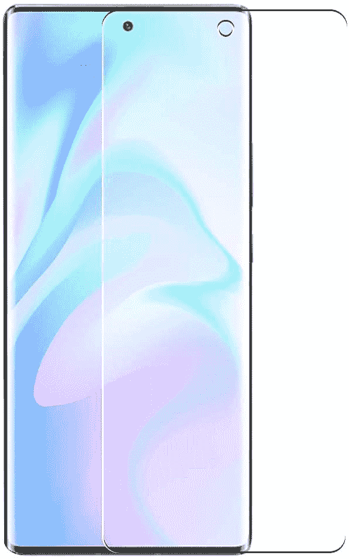
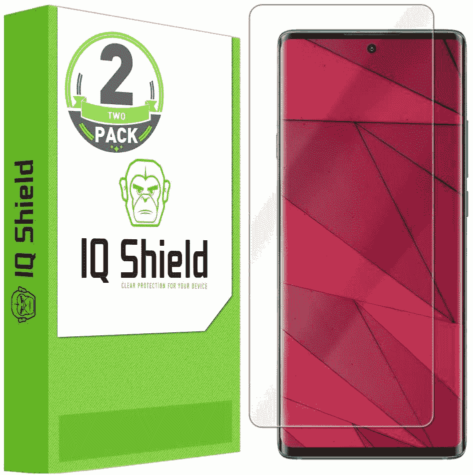
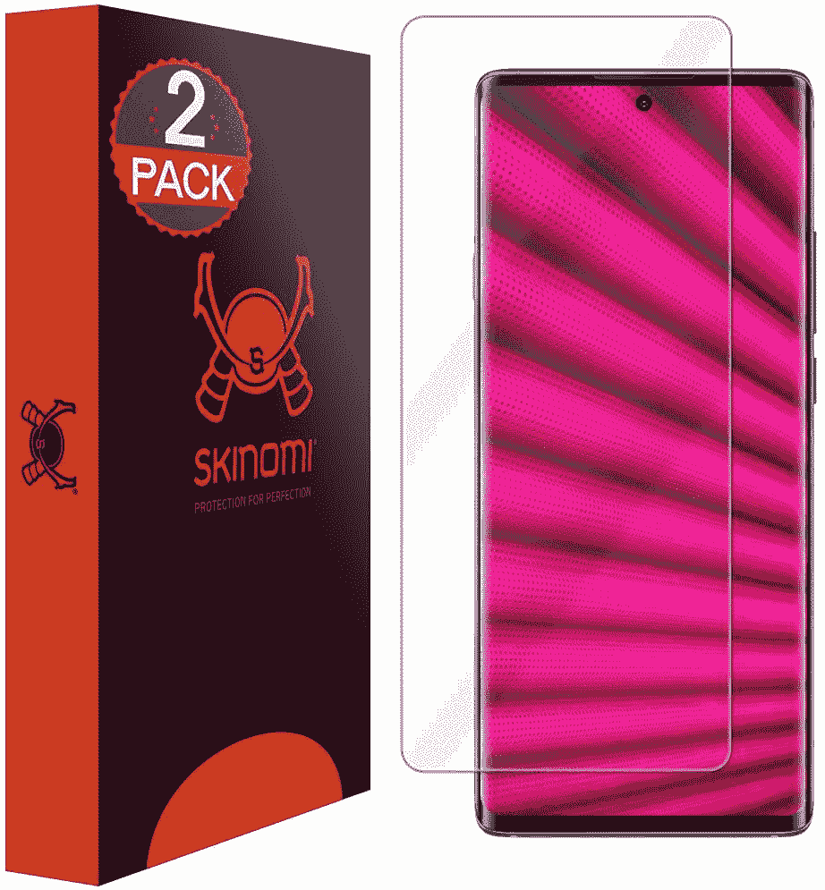
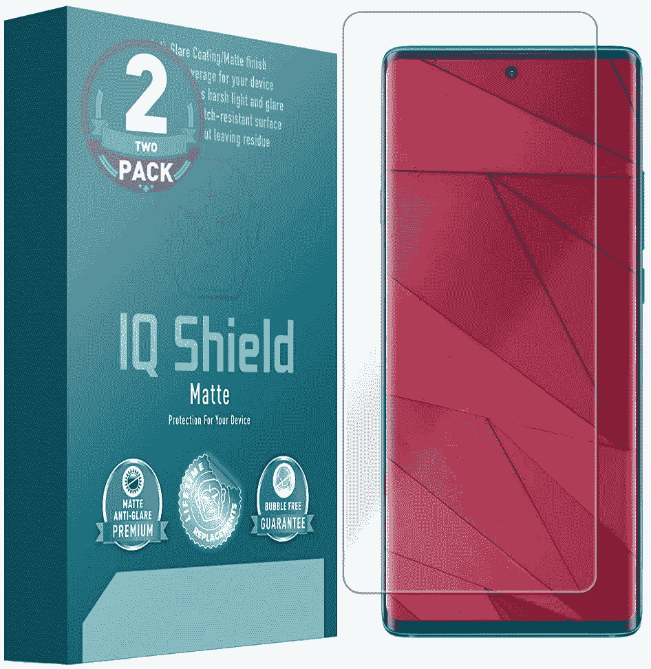
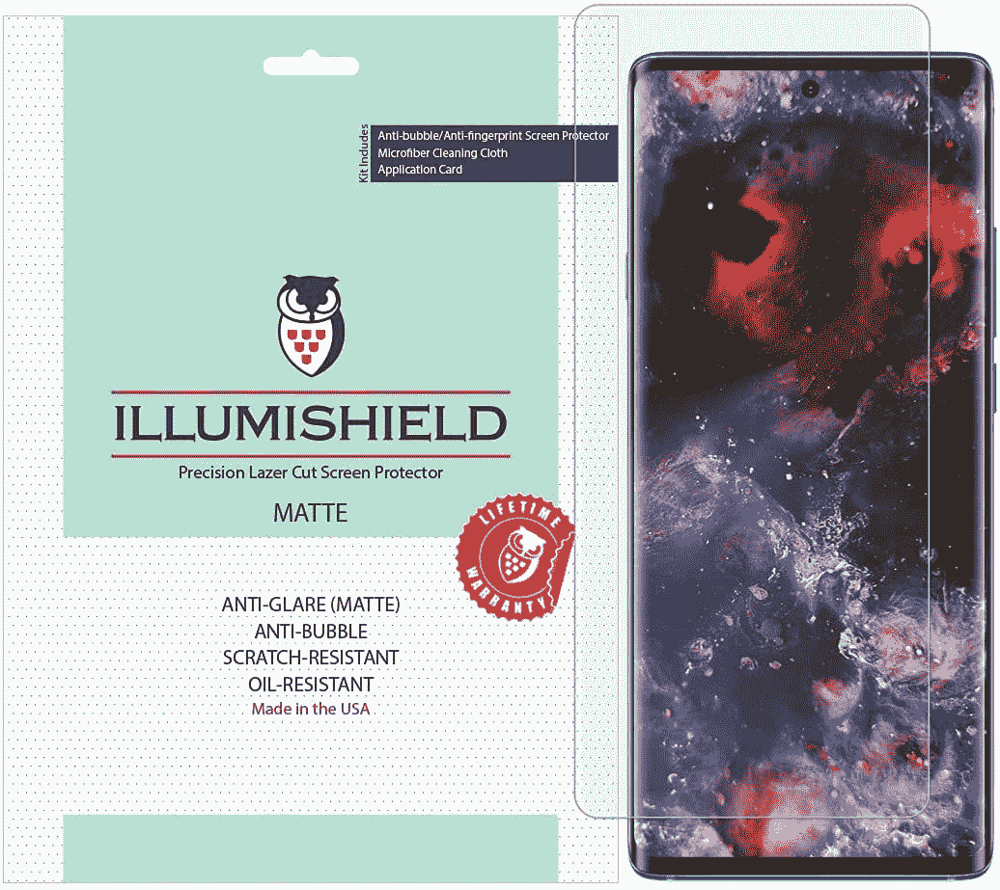
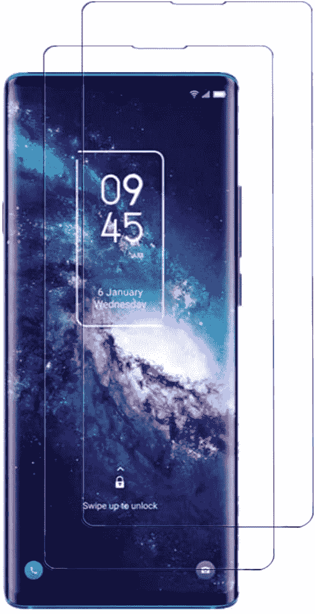
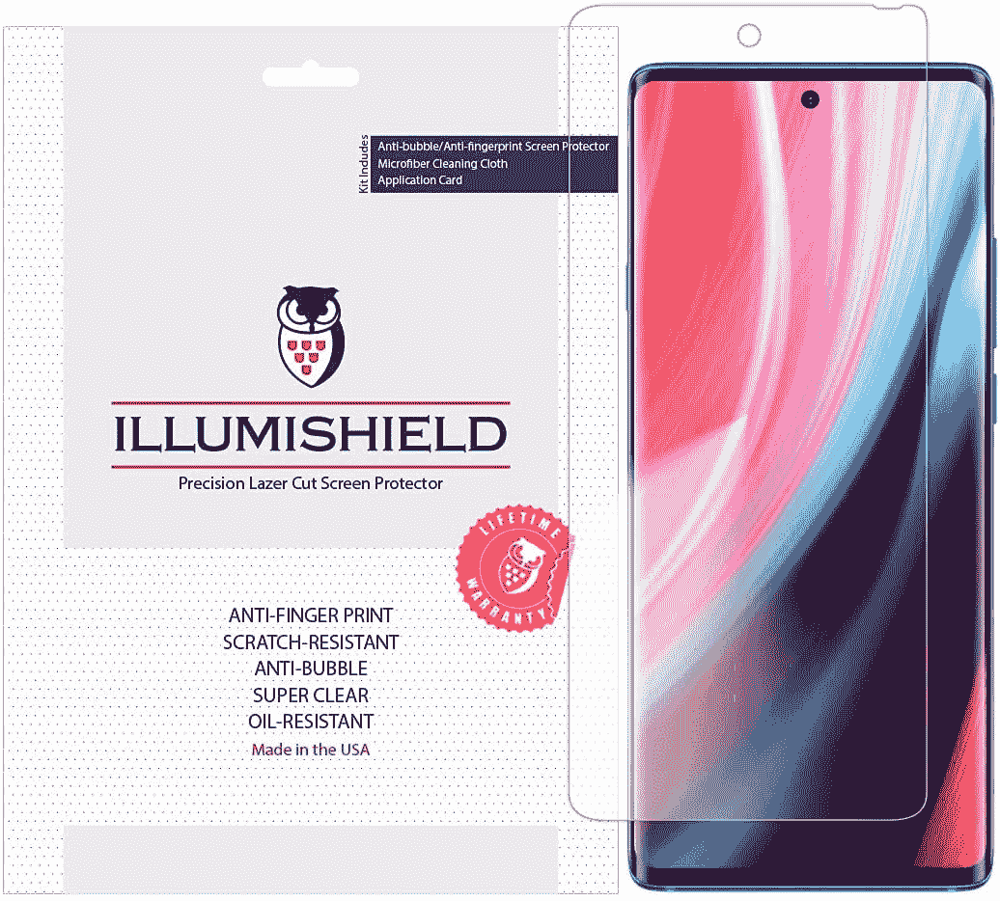

# 2023 年最佳 TCL 20 Pro 5G 屏幕保护器

> 原文：<https://www.xda-developers.com/best-tcl-20-pro-5g-screen-protector/>

# 2023 年最佳 TCL 20 Pro 5G 屏幕保护器

想要一个好的屏幕保护器给你的 TCL 20 Pro 5G？我们选择了市场上最好的 TCL 20 Pro 5G 屏幕保护器。

TCL 20 Pro 是该公司最新的顶级智能手机。它于 6 月在美国首次亮相，现在通过亚马逊销售。这款智能手机配备了 6.67 英寸全高清+ AMOLED 显示屏，长宽比为 20:9，刷新率为 60Hz。不幸的是，这款手机缺乏任何类型的保护玻璃，如康宁大猩猩玻璃，使巨大的屏幕容易受到日常事故的损坏。因此，如果你打算投资 500 美元购买一台 TCL 20 Pro 5G，为它配备一个屏幕保护器将是理想的选择。为了让你更容易为你的手机找到一个好的屏幕保护装置，我们选择了市场上最好的 TCL 20 Pro 5G 屏幕保护装置。

**[TCL 20 Pro 5G 回顾:美国稳健的中端选择](https://www.xda-developers.com/tcl-20-pro-5g-review/)**

如果你打算长时间使用手机，屏幕保护真的很有帮助。它可以防止将您的手机与其他物品(如钥匙和硬币)放在一起时可能出现的划痕，也可以防止显示屏在掉落到坚硬表面时破碎。明智的做法是将屏幕保护器与[好的外壳](https://www.xda-developers.com/best-tcl-20-pro-5g-cases/)配对，以增强保护。如果你摔了一个有保护套的手机，保护套很有可能会降低冲击力，保护你的手机。

 <picture></picture> 

DeltaShield Screen Protector

##### DeltaShield TCL 20 Pro 5G 屏幕保护器

这种 DeltaShield 屏幕保护器是一种 TPU 薄膜，具有疏油涂层，以防止指纹污迹。它还配备了“自我修复”技术，使轻微的划痕和绒毛随着时间的推移而消失。DeltaShield 包里有两个屏幕保护器。

 <picture></picture> 

Puccy Screen Protector

##### Puccy TCL 20 Pro 5G 屏幕保护器

像 DeltaShield 屏幕保护器一样，Puccy 屏幕保护器也是 TPU 电影。它具有 4H 硬度，可抵抗刮擦和磨损。此外，Puccy 保护器还具有自愈特性。

 <picture></picture> 

Dmax Armor Protector

##### Dmax 装甲钢化玻璃 TCL 20 Pro 5G 屏幕保护器

TCL 20 Pro 5G 的 Dmax 装甲屏幕保护器采用 3D 曲面玻璃设计，可以覆盖手机的整个屏幕表面。这种钢化玻璃保护器还包括疏水和疏油涂层，以抵抗汗水和指纹污迹。

 <picture></picture> 

Misd Screen Protector

##### Misd TCL 20 Pro 5G 屏幕保护器

TCL 20 Pro 5G 的 Misd 屏幕保护套是钢化玻璃。它带有抗冲击分散涂层，可以防止日常事故，包括跌落。玻璃还可以防止刮伤和磨损。

 <picture></picture> 

IQ Shield Screen Protector

##### 智商盾 TCL 20 Pro 5G 屏幕保护器

IQ Shield 屏幕保护器附带终身更换保修，这意味着如果出现任何问题，公司将给您发送一个替代品。它是由 TPU 制成的，你可以在 IQ 盾牌包中获得两个屏幕保护器。

 <picture></picture> 

Skinomi screen protector

##### Skinomi TCL 20 Pro 5G 屏幕保护器

Skinomi 的 TCL 20 Pro 5G 屏幕保护器使用军用级 TPU 薄膜，具有自修复特性。它旨在吸收冲击，并提供最大的覆盖范围。

 <picture></picture> 

IQ Shield Anti-glare film

##### 智商盾哑光 TCL 20 Pro 5G 屏幕保护器

这款 IQ Shield 屏幕保护器采用哑光表面处理，可减少在明亮区域使用时的眩光。它还带有疏油涂层，可以防止指纹污迹。屏幕保护器可以防止刮伤、擦伤和凹痕。

 <picture></picture> 

iLLumiShield Matte Protector

##### iLLumiShield 哑光 TCL 20 Pro 5G 屏幕保护器

用于 TCL 20 Pro 5G 的 iLLumishield 屏幕保护器由 PET 薄膜制成，包括多层以保护您的手机屏幕。它还可以减少眩光，并防止指纹污迹。

 <picture></picture> 

Viesup Tempered Glass protector

##### Viesup 钢化玻璃 TCL 20 Pro 5G 屏幕保护器

Viesup 钢化玻璃保护器具有 9H 硬度，可以保护您的手机屏幕免受划痕、磨损和凹陷。此外，它很容易安装，并且您可以在包装中获得两个屏幕保护器。

 <picture></picture> 

Skinomi Matte Screen Protector

##### Skinomi 哑光 TCL 20 Pro 5G 屏幕保护器

除了常规的屏幕保护外，Skinomi 还提供哑光版本。屏幕保护器由军用级材料制成，覆盖了 TCL 20 Pro 5G 屏幕的大部分。此外，它还能保护显示屏免受刮擦、刺穿和污迹的影响。

 <picture></picture> 

TingYR Tempered Glass

##### TingYR 钢化玻璃 TCL 20 Pro 5G 屏幕保护器

TingYR 钢化玻璃膜完美贴合 TCL 20 Pro 屏幕，保护屏幕免受刮伤和磕碰。该玻璃具有 9H 的硬度，并且易于应用。包裹里会有两张玻璃膜。

 <picture></picture> 

iLLumiShield Screen Protector

##### iLLumiShield 哑光 TCL Pro 5G 屏幕保护器

iLLumiShield 屏幕保护器使用 PET 薄膜来保护手机屏幕。它由优质材料制成，耐刮擦，防指纹。一个包装中有三个屏幕保护器。

这些都是市面上最好的 TCL 20 Pro 5G 屏幕保护器。如果你正在寻找一个好的钢化玻璃保护，Dmax 装甲保护是一个伟大的选择。然而，如果你想要一部 TPU 电影，IQ Shield 屏幕保护器将是一个不错的选择。如果你也在为你的 TCL 20 Pro 5G 寻找一个外壳，我们已经选择了市场上最好的 TCL 20 Pro 5G 外壳。

 <picture></picture> 

TCL 20 Pro 5G

##### TCL 20 Pro 5G

TCL 20 Pro 5G 是该公司 20 系列中的顶级手机。它装有一个骁龙 750G 的 SoC，运行在 Android 11 上。

你打算给你的 TCL 20 Pro 5G 买哪个屏幕保护套？请在评论区告诉我们。