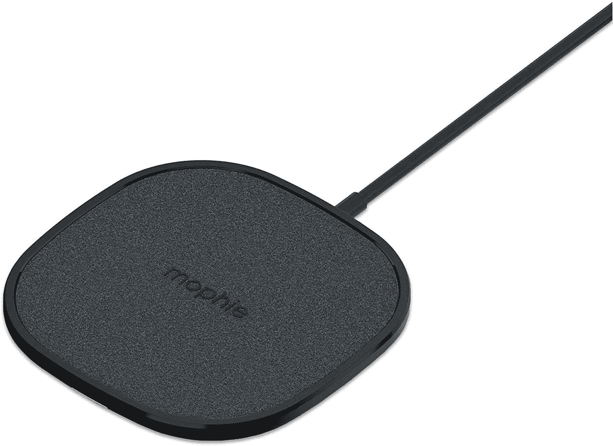
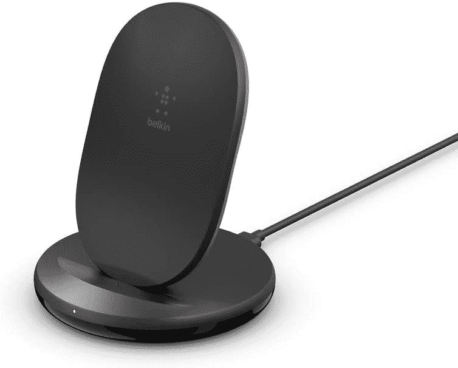
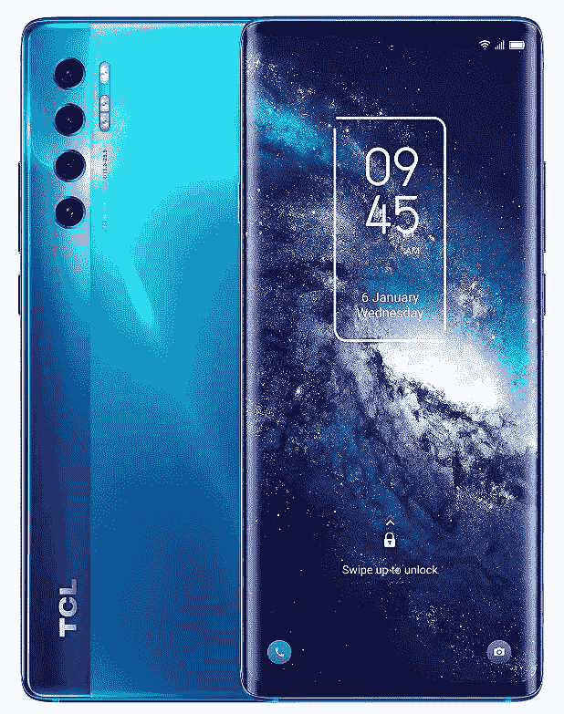

# 2023 年 TCL 20 Pro 5G 最佳无线充电器

> 原文：<https://www.xda-developers.com/best-tcl-20-pro-5g-wireless-chargers/>

# 2023 年 TCL 20 Pro 5G 最佳无线充电器

寻找 TCL 20 Pro 5G 无线充电器？我们选择了市场上最好的充电功率为 15W 的 TCL 20 Pro 5G 无线充电器。

[TCL 20 Pro 5G](https://www.xda-developers.com/tcl-20/) 是该公司新 20 系列中唯一一款配备无线充电的智能手机。它内置一个[4500 毫安时的电池](https://www.xda-developers.com/tcl-20-pro-5g-specifications/)，支持高达 15W 的快速无线充电。虽然该公司将兼容的 18W 有线快速充电器捆绑在盒子里，但如果您想使用这个功能，您必须单独购买一个无线充电器。为了让您更容易购买兼容的无线充电器，我们选择了市场上最好的 TCL 20 Pro 5G 无线充电器。

这里需要注意的是，并不是所有的无线充电器都附带电源适配器。所以你需要使用你自己的电源适配器。虽然捆绑的 TCL 壁式充电器在大多数情况下都能正常工作，但使用它并不能获得完全的 15W 无线充电。您会在几乎所有的无线充电器列表中注意到，它们需要 24W 快速充电 2.0 或 3.0 电源适配器来提供 15W 无线充电。但是由于捆绑的 TCL 充电器只有 18W，您可能会得到大约 10W 的无线充电。但是您可以从我们的[最佳充电器列表](https://www.xda-developers.com/best-usb-pd-fast-charger/)中订购一个电源适配器，以获得完整的 15W 无线充电。

## 最佳 TCL 20 Pro 5G 无线充电器

 <picture></picture> 

Belkin Boost Charge Fast Wireless Charging Pad

##### Belkin BoostCharge 15W 无线充电板

Belkin 无线充电板是 TCL 20 Pro 5G 的绝佳无线充电器选择。它支持高达 15W 的充电，并配有自己的交流适配器。所以您不必为一个 24W 快速充电适配器东奔西跑。它还包括防滑抓持材料，以保持手机在适当的位置。

 <picture></picture> 

Anker PowerWave II Stand

##### Anker PowerWave II 15W 无线充电器支架

Anker PowerWave II 支架是 TCL 20 Pro 5G 的另一款出色的无线充电器。它还支持高达 15W 的无线充电，并配有一系列安全保护装置，包括异物检测。此外，安科充电器自带交流适配器。

 <picture></picture> 

Anker PowerWave II Pad

##### Anker PowerWave II 15W 无线充电板

如果您更喜欢充电座而不是充电架，您会喜欢安克动力波 II 充电座。它与 PowerWave II 支架的无线充电器基本相同，但外形不同。它支持高达 15W 的无线充电，并配有自己的交流适配器。

 <picture></picture> 

Spigen Essential Fast Wireless Charger

##### Spigen 15W 无线充电板

Spigen Essential 无线充电器支持高达 15W 的充电功率，但电池盒中没有交流适配器。所以，您必须使用自己的快速充电 2.0/ 3.0 交流适配器，以获得最高的充电速度。此外，充电器有一个防滑橡胶手柄，以保持手机在充电器上的位置。

 <picture></picture> 

Spigen Wireless Charger

##### Spigen 可转换 15W 无线充电器

由于大多数人在卧室使用无线充电器，明亮的指示灯可能会干扰睡眠。因此，Spigen 无线充电器带有柔和的灯光，不会分散你的注意力。此外，该充电器支持高达 15W 的无线充电，并具有支架外形。

 <picture></picture> 

mophie wireless charging pad

##### 摩尔菲无线 15W 充电板

mophie 无线充电板采用麂皮表面处理，打造时尚外观。它配有高达 15W 的无线充电支持，因此您可以在手机上获得最高的充电速度。此外，您还将获得 mophie 充电器随附的电源适配器。

 <picture></picture> 

iOttie iON Wireless Duo

##### iOttie iON 无线二重奏

iOttie iON Wireless Duo 配有两个无线充电点，其中一个可以用于您的 TCL 20 Pro 5G，另一个可以为您的无线耳塞或智能手表充电。主充电点支持最高 15W 充电，副充电点支持最高 5W 充电。

 <picture></picture> 

Belkin Wireless Charging Stand

##### Belkin 15W 无线充电座

Belkin 无线充电支架配有双线圈，因此您的 TCL 20 Pro 5G 可以在纵向和横向模式下充电。而且充电器最大支持 15W 充电。然而，它的包装盒中没有交流适配器。

 <picture></picture> 

Mophie dual wireless charging pad

##### 摩尔菲双无线充电板

mophie dual 无线充电板实际上可以为三个设备充电。两个设备可以无线充电，而第三个设备可以使用 USB Type-A 端口进行有线充电。无线充电器支持高达 10W 的无线充电，所以你不会在你的 TCL 手机上获得最高 15W 的充电速度。

* * *

这些是市面上最好的 TCL 20 Pro 5G 无线充电器。您可以在 Belkin 快速充电支架和 Anker PowerWave II 支架之间进行选择，获得真正的无线充电体验。两个充电器都自带交流适配器。虽然无线充电很方便，但有线方式是最有效的充电方式。如果你想让手机快速充电，你应该通过手机自带的有线充电器来充电。

 <picture></picture> 

TCL 20 Pro 5G

##### TCL 20 Pro 5G

TCL 20 Pro 5G 是该公司 20 系列中的顶级手机。它装有一个骁龙 750G 的 SoC，运行在 Android 11 上。

你打算为你的 TCL 20 Pro 5G 买哪一款无线充电器？请在评论区告诉我们。同时，不要忘记查看我们关于[最佳 TCL 20 Pro 5G 保护套](https://www.xda-developers.com/best-tcl-20-pro-5g-cases/)和[屏幕保护器](https://www.xda-developers.com/best-tcl-20-pro-5g-screen-protector/)的购买指南，以保护您的新手机。