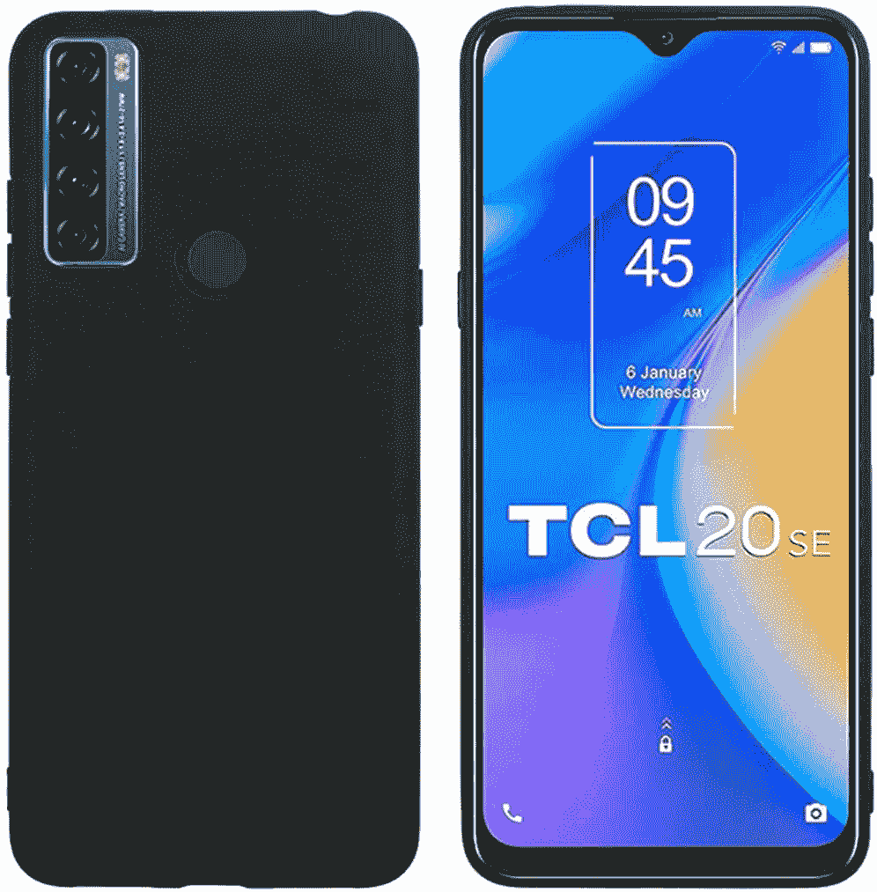
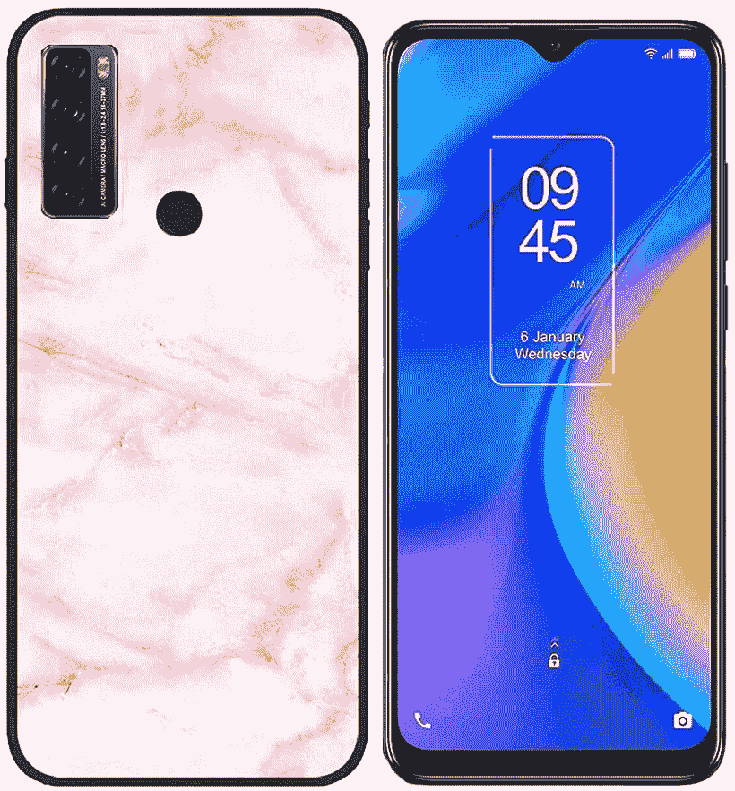
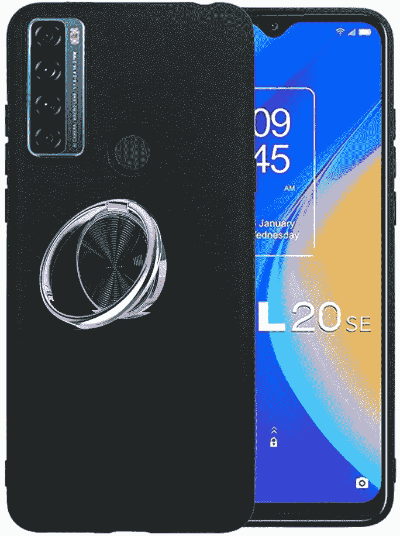

# 2023 年最值得购买的 TCL 20 SE 案例

> 原文：<https://www.xda-developers.com/best-tcl-20-se-cases/>

# 2023 年最值得购买的 TCL 20 SE 案例

找 TCL 20 SE 的案例？我们可以帮忙。我们选择了市场上最好的 TCL 20 SE 保护套，包括对开保护套和超薄保护套。

TCL 在 6 月份将它的廉价智能手机 TCL 20 SE T1 带到了美国。它的规格相当不错，包括骁龙 460 SoC、6.82 英寸高清显示屏、4GB 内存和 5000 毫安时电池。它还包括一个四后置摄像头，由一个 4800 万像素的摄像头和一个 1300 万像素的自拍摄像头组成。对于所有这些规格，你只需支付 190 美元。

虽然这款 TCL 手机可能不会花很多钱，但如果你打算购买它，你会希望保护你的投资。所以为它买一个箱子很有意义。为了让寻找这款手机的外壳更容易，我们选择了你现在可以买到的最好的 TCL 20 SE 外壳。该列表包含各种类型的案例，您可以选择最适合您的案例。无论您想要不增加体积的轻薄外壳，还是提供最佳保护的坚固外壳，我们都能满足您的需求。

说到最好的保护，还建议为 TCL 20 SE 搭配一个好的保护套和一个[屏幕保护套，这将有助于保护你的屏幕不被划伤甚至粉碎。](https://www.xda-developers.com/best-tcl-20-se-screen-protector/)

 <picture></picture> 

Shantime TCL 20 SE case

##### 山泰 TCL 20 SE 案例

Shantime 的这款 PU 皮套有一个 TPU 保险杠，以增强保护。此外，您将获得一个磁性翻盖，其中包括一个窗口，可以浏览通知和警报。此外，盖子内侧有一个卡槽，可以放信用卡或身份证。

 <picture></picture> 

Misd Slim Case

##### Misd 超薄 TCL 20 SE 表壳

TCL 手机的 Misd 超薄外壳由柔软的 TPU 材料制成，可以保护您的手机免受意外事故的影响。它还为所有端口、摄像头和指纹传感器提供了精确的开口，以便于访问。

 <picture></picture> 

Miside TCL 20 SE case

##### Miside TCL 20 SE 外壳

如果你正在为你的新 TCL 手机寻找屏幕保护和外壳，这款 Miside 组合是一个不错的选择。你会得到一个柔软的 TPU 盒和两个钢化玻璃保护套。屏幕保护器有一个友好的外壳设计。

 <picture></picture> 

YukeTop Case

##### YukeTop Folio TLC 20 SE 盒

这款用于 TCL 20 SE 的对开型保护套由合成革和硅胶制成，可提供更强的保护。它包括三个信用卡或身份证插槽以及一个现金插槽。此外，这种情况可以作为媒体消费的支架。它有三种颜色出售。

 <picture></picture> 

KJYF Silicone Cover

##### KJYF 硅胶 TCL 20 SE 表壳

如果你不想要看起来无聊的典型案例，这款 KJYF 硅盖背面有一个可爱的设计。还有其他几个设计选项，可以在亚马逊上搜索“KJYF TCL 20 SE case”找到。顾名思义，这种外壳是由硅胶制成的。

 <picture></picture> 

Tznzxm case

##### Tznzxm 大理石 TCL 20 SE 盒

如果你正在寻找一些色彩鲜艳的东西来保护你的手机，这款 Tznzxm 保护套是一个不错的选择。表壳由柔性 TPU 制成，后盖上带有大理石绘画设计。该公司提供了两种设计方案。

 <picture></picture> 

Ranyi TPU case

##### 冉义 TPU TCL 20 SE 案例

冉义 TPU 案例是你 TCL 20 SE 的另一个好选择。它配有一个环形支架，以增强抓地力。此外，您可以使用它将手机连接到磁性汽车支架上，或作为免提媒体消费的支架。

 <picture></picture> 

Flyme Case

##### Flyme 修身 TCL 20 SE 包

TCL 20 SE 的 Flyme 表壳纤薄轻巧，这要归功于其构造中使用的 TPU 材料。尽管如此，它还是为你的智能手机提供了很好的保护。该保护套还捆绑了两个屏幕保护器，因此您也可以保护您的屏幕。

 <picture></picture> 

CaKoo Wallet Case

##### CaKoo 钱包 TCL 20 SE 包

如果你正在为你的 20 多岁的孩子寻找一个钱包的话，这个 CaKoo 包是一个不错的选择。它使用 PU 皮革外部和 TPU 内部来保护智能手机。箱子里有两个卡槽和一个现金槽，用来存放你的物品。此外，您还可以将箱子折叠起来用作支架。

这些是你现在能买到的最好的 TCL 20 SE 手机套。如果你正在寻找一个优秀的超薄外壳，来自 [Misd](https://www.amazon.com/Misd-Compatible-Scratch-Resistant-Shock-Absorbing-Comfortable/dp/B096LVLD46/?tag=xda-4kgo77i-20&ascsubtag=UUxdaUeUpU6160&asc_refurl=https%3A%2F%2Fwww.xda-developers.com%2Fbest-tcl-20-se-cases%2F&asc_campaign=Short-Term) 的 TCL 20 SE 外壳是一个不错的选择。Folio 爱好者会欣赏 [YukeTop 案](https://www.amazon.com/YukeTop-TCL-20-SE-Leather/dp/B097D3W53G/?tag=xda-4kgo77i-20&ascsubtag=UUxdaUeUpU6160&asc_refurl=https%3A%2F%2Fwww.xda-developers.com%2Fbest-tcl-20-se-cases%2F&asc_campaign=Short-Term)。Shantime、Ranyi 和 Miside 案例是其他不错的选择。无论你遇到哪种情况，你都要为你的手机增加一些保护。有些手机套甚至能让你更好地握持手机，鉴于近来手机越来越大，这一点相当重要。

 <picture></picture> 

TCL 20 SE

##### TCL 20 SE

TCL 20 SE 是该公司最新的廉价手机。它运行在 Android 11 上，装有骁龙 460 SoC 和 5000 毫安时大电池。

你打算买哪个箱子？请在评论区告诉我们。此外，如果你正在为手机寻找屏幕保护器，我们也选择了[最佳 TCL 20 SE 屏幕保护器](https://www.xda-developers.com/best-tcl-20-se-screen-protector/)。