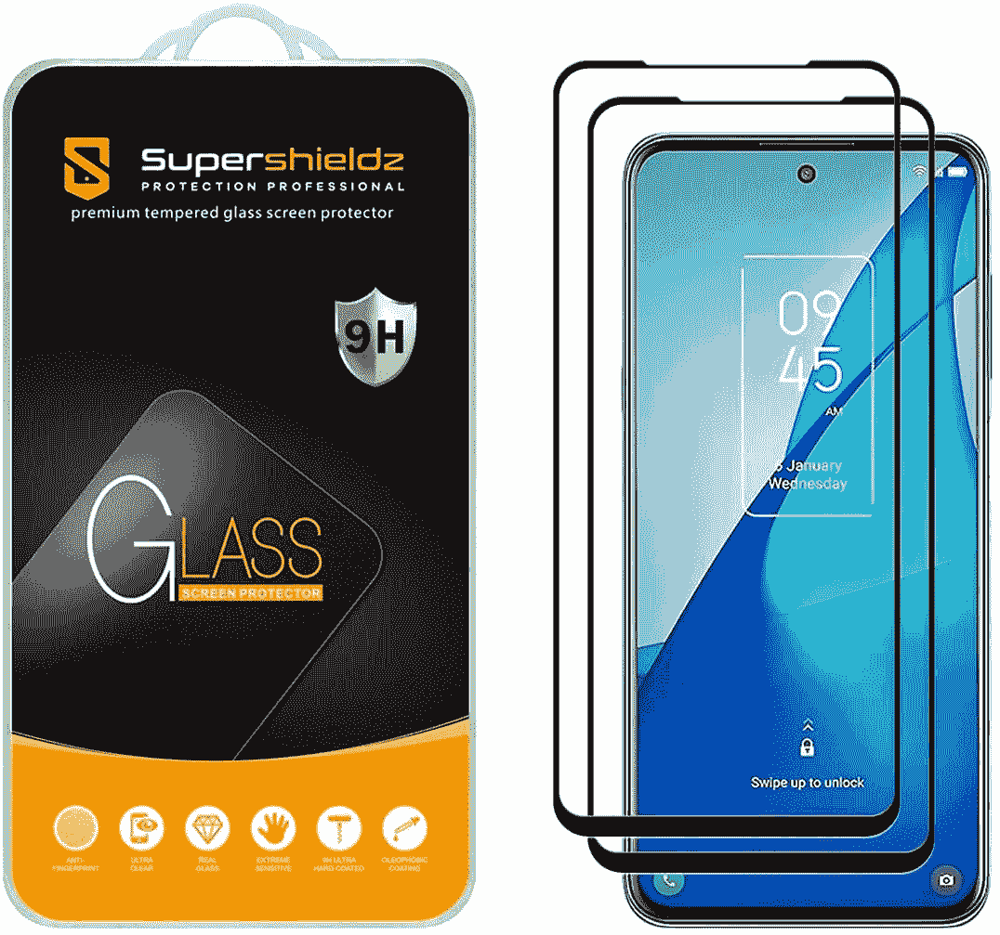
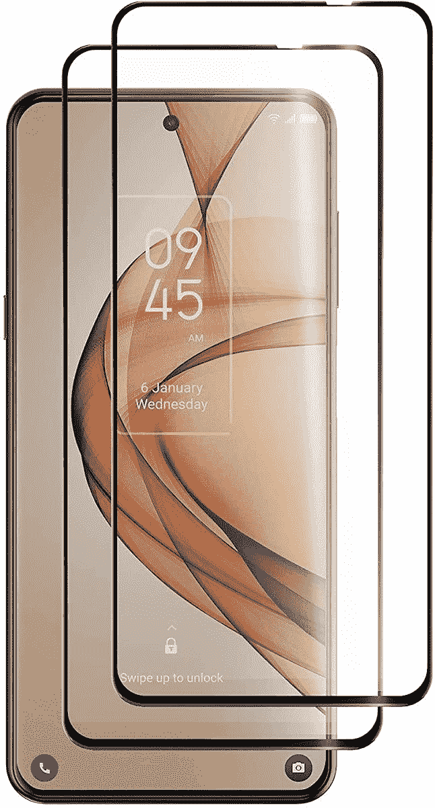
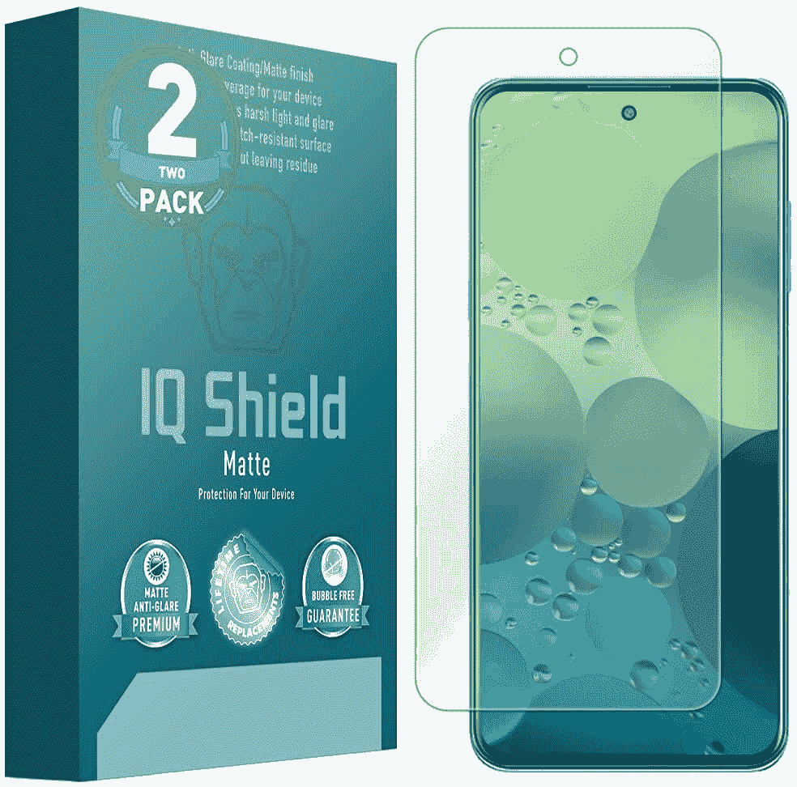
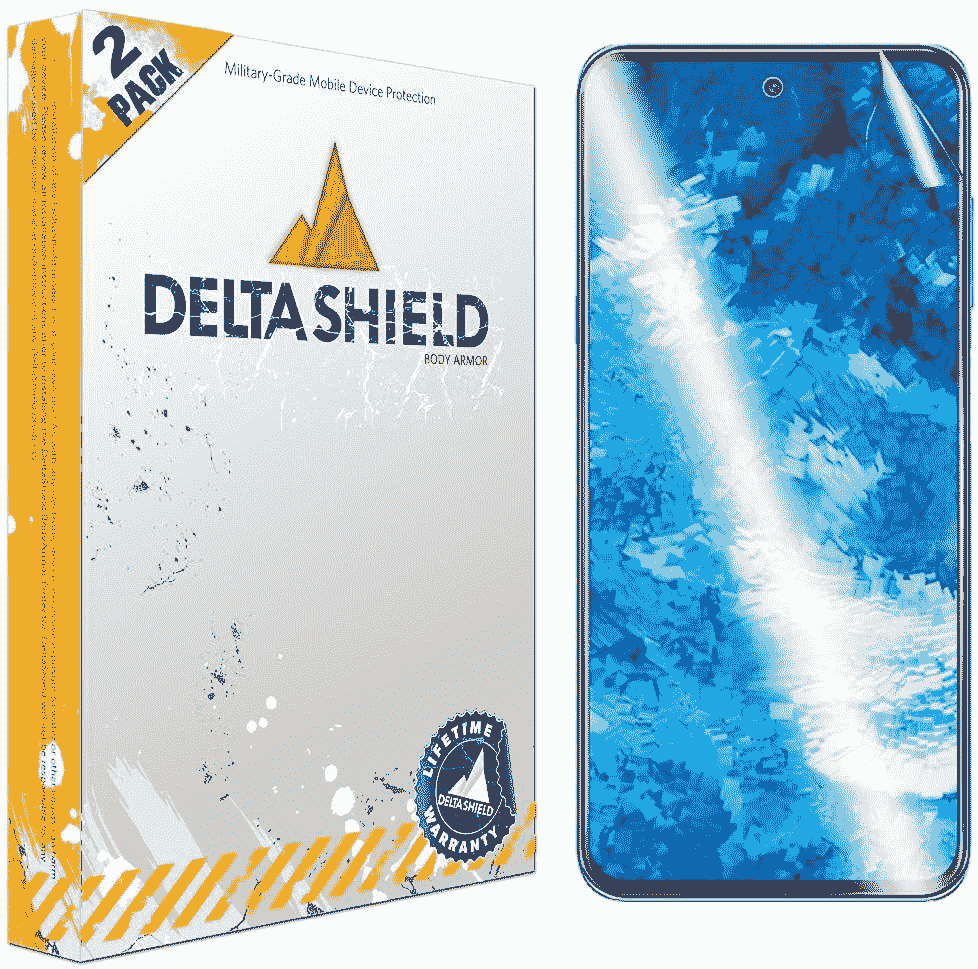
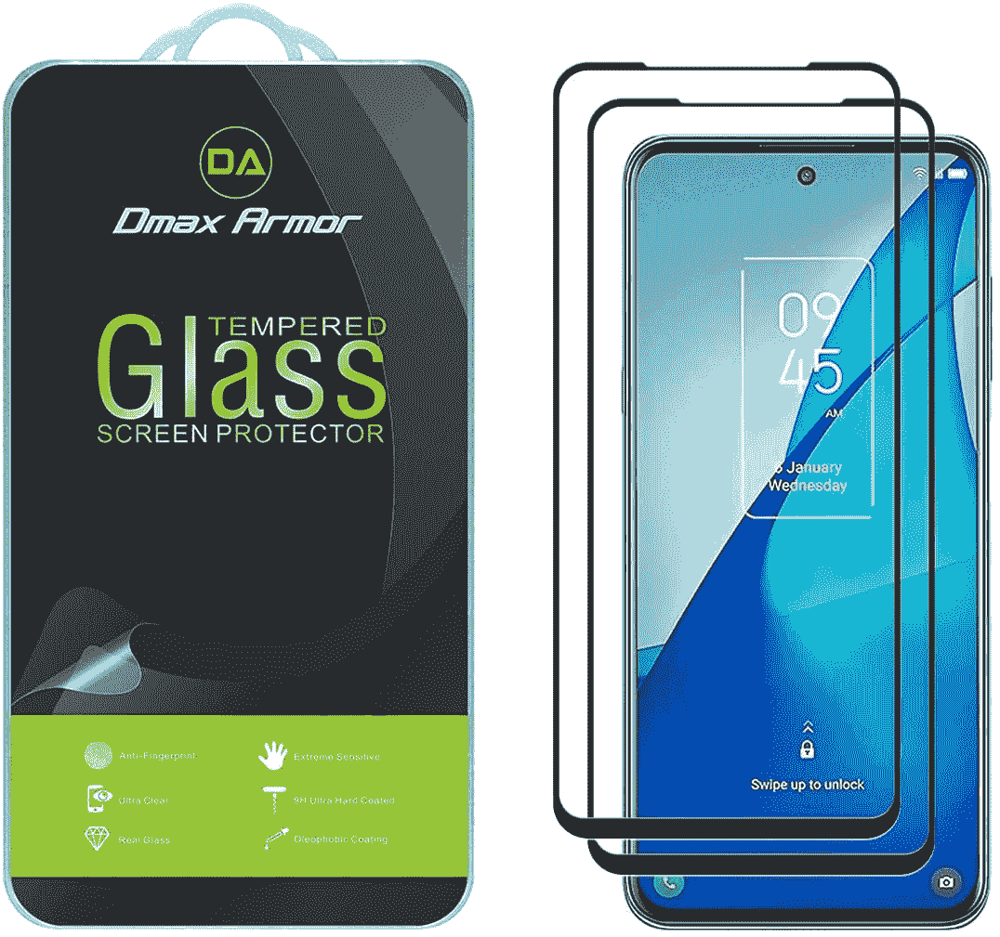
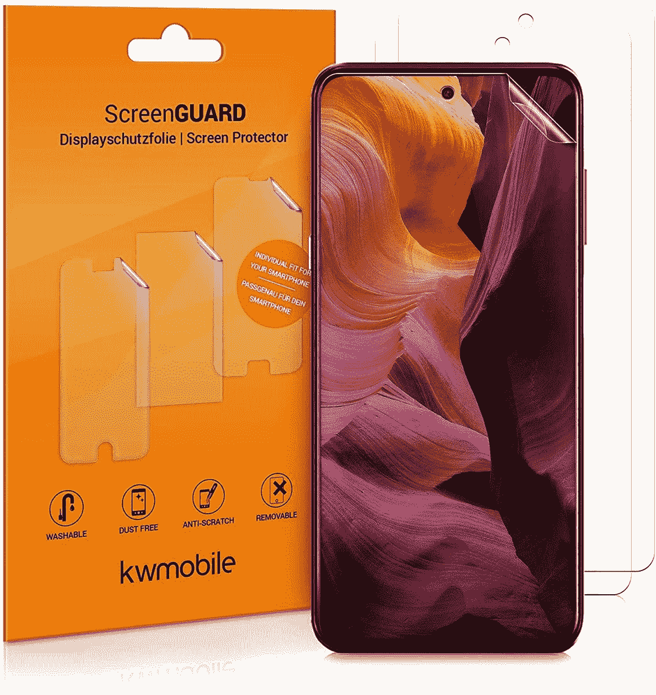
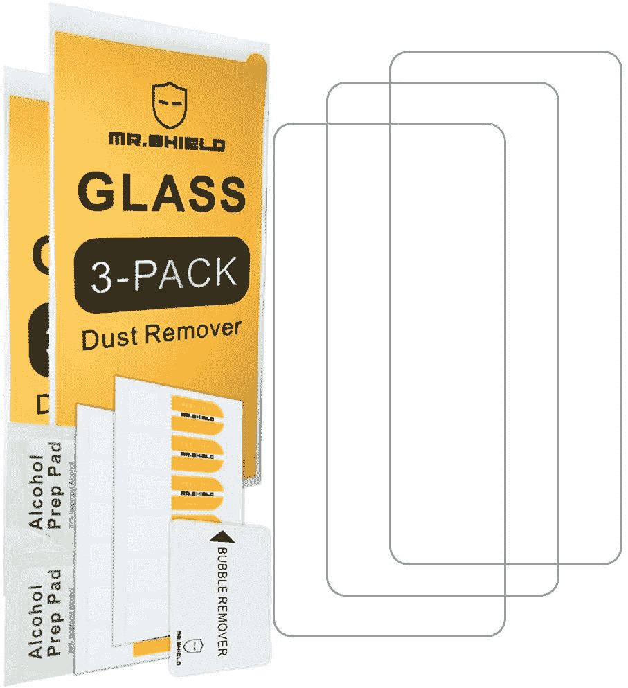
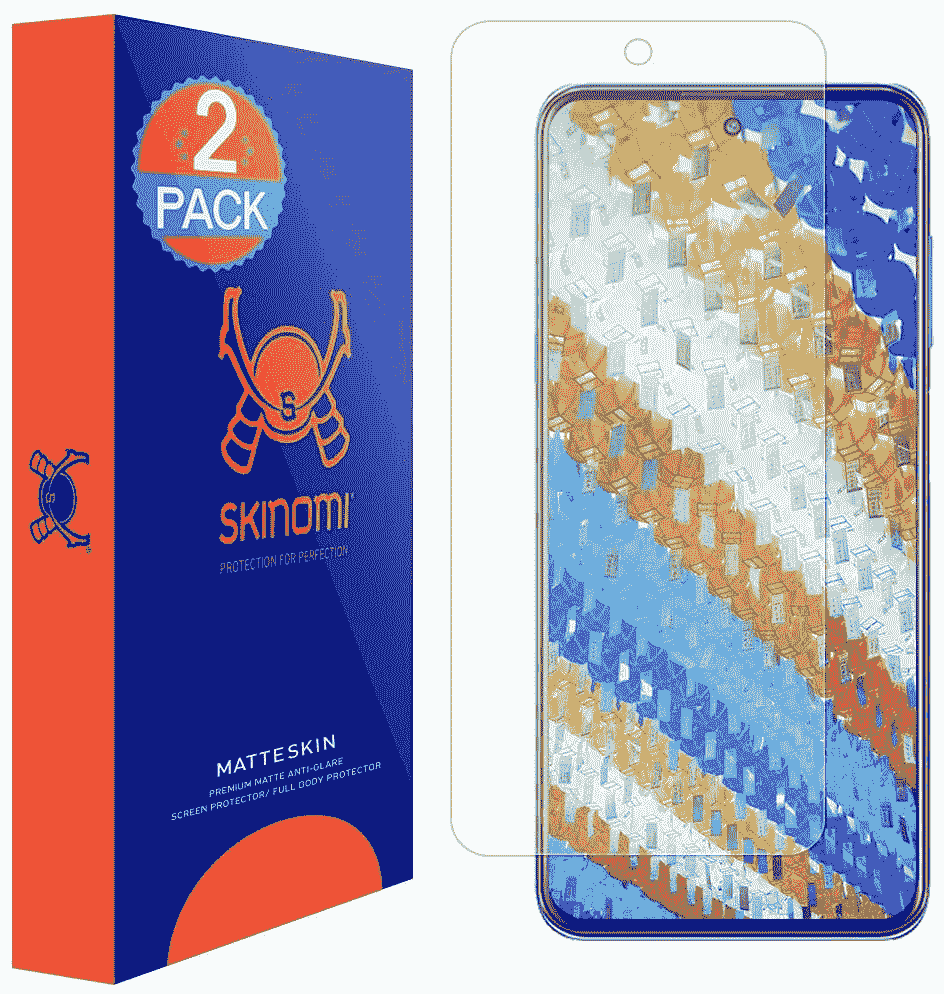

# 2023 年最佳 TCL 20S 屏幕保护器

> 原文：<https://www.xda-developers.com/best-tcl-20s-screen-protector/>

# 2023 年最佳 TCL 20S 屏幕保护器

为你的 TCL 20S 找一个屏幕保护器？我们挑选了市场上最好的 TCL 20S 屏幕保护器。看看吧！

TCL 20S 已经在美国上市。TCL 的这款中档智能手机配备了 6.67 英寸的 LCD 屏幕，具有全高清+ (1，080 x 2，400 像素)分辨率，20:9 的纵横比，2.5D 玻璃。如果你对手机感兴趣，可以看看我们的 [TCL 20S 评测](https://www.xda-developers.com/tcl-20s-review/)。像 TCL 20 系列的所有手机一样，该公司没有包括保护玻璃来覆盖屏幕。它配有一个普通的玻璃杯，在日常事故中容易损坏。因此，如果你打算购买 TCL 20S，明智的做法是为手机配备屏幕保护器。我们挑选了一些市场上最好的 TCL 20S 屏幕保护器来帮助您进行搜索。

在日常使用中，任何类型的显示器都很容易被划伤。如果你把手机和钥匙或硬币之类的东西放在口袋里，手机显示屏有可能会出现划痕。如果你先把手机摔在地上，甚至有可能打碎显示屏，这肯定是你不想做的，因为你以后要花一大笔钱去修理它。TCL 20S 的屏幕保护套搭配[的好保护套应该能为你的手机提供很好的保护。](https://www.xda-developers.com/best-tcl-20s-cases/)

 <picture></picture> 

Skinomi Screen Protector

##### Skinomi TCL 20S 屏幕保护器

TCL 20S 的 Skinomi 屏幕保护器是一种 TPU 膜，可抗刮擦、磨损和刺穿。它还配备了自我修复技术，使轻微的划痕和磨损随着时间的推移而消失。而且，它覆盖了整个屏幕，包括弯曲部分。

 <picture></picture> 

SuperShieldz Tempered Glass

##### SuperShieldz 钢化玻璃 TCL 20S 屏幕保护器

TCL 20S 的 SuperShieldz 钢化玻璃保护器采用 2.5D 圆形边缘，覆盖整个屏幕。它还带有疏油和疏水涂层，可以防止指纹污迹和汗水。

 <picture></picture> 

IQ Shield Screen Protector

##### 智商盾 TCL 20S 屏幕保护器

如果你不喜欢钢化玻璃，IQ Shield 的这款 TPU 保护膜是个不错的选择。它配有终身更换保修和运动疏油涂层，以抵御指纹污迹。

 <picture></picture> 

Foluu Tempered Glass

##### 托路钢化玻璃 TCL 20S 屏幕保护器

TCL 20S 的 Foluu 钢化玻璃保护器具有 9H 硬度，可保护您的手机屏幕免受刮伤、磨损和凹陷。该保护器还带有疏油涂层，易于安装。

 <picture></picture> 

IQ Shield Matte Screen Protector

##### 智商盾哑光 TCL 20S 屏幕保护器

这款 IQ Shield 屏幕保护器使用军用级别的薄膜来抵抗刮伤、擦伤和凹痕。该保护器还采用哑光表面，以减少明亮区域的眩光。你会在 IQ 盾包里得到两个屏幕保护器。

 <picture></picture> 

DeltaShield Screen Protector

##### DeltaShield TCL 20s 屏幕保护器

DeltaShield 屏幕保护器也由军用级 TPU 薄膜制成，具有疏油涂层。它还具有自我修复技术，使薄膜能够随着时间的推移使轻微的划痕和磨损消失。

 <picture></picture> 

Dmax Armor Tempered Glass

##### Dmax 装甲钢化玻璃 TCL 20S 屏幕保护器

Dmax 装甲钢化玻璃保护器具有 9H 硬度以及疏油涂层。它也很容易申请，你得到终身更换保修。Dmax 装甲包中有两个屏幕保护器。

 <picture></picture> 

iLLumiShield Screen Protector

##### iLLumiShield 哑光 TCL 20S 屏幕保护器

适用于 TCL 20S 的 iLLumiShield 屏幕保护器可防止刮擦和磨损。它还具有疏油涂层，可以防止指纹污迹。iLLumiShield 套装中有三个屏幕保护器，应该可以轻松支持您的整个手机使用寿命。

 <picture></picture> 

Kwmobile Screenguard

##### kwmobile 屏保 TCL 20S 屏保

如果你更喜欢 PET 膜而不是 TPU 屏幕保护器或钢化玻璃，Kwmobile 屏幕保护器是你的 TCL 20S 的一个好选择。它耐刮擦，带有疏油涂层。此外，该膜易于应用。

 <picture></picture> 

Mr. Shield Tempered Glass

##### Mr. Shield 钢化玻璃 TCL 20S 屏幕保护器

Mr. Shield 钢化玻璃是 TCL 20S 绝佳的屏幕保护物。它超薄 0.3 毫米，硬度为 9H。对于安装问题、缺陷和装配问题，您还可以获得终身更换。

 <picture></picture> 

Zmone Tempered Glass

##### Zmone 钢化玻璃 TCL 20S 屏幕保护器

Zmone 钢化玻璃由优质材料制成，可提供最大程度的保护。它具有 9H 硬度，并带有 2.5D 弧形边缘，可完全覆盖屏幕。此外，您还可以获得疏油和疏水涂层，以抵抗指纹和汗水。

 <picture></picture> 

Skinomi Matte Protector

##### Skinomi 哑光 TCL 20S 屏幕保护器

Skinomi 还为 TCL 20S 提供了哑光屏幕保护器。可以减少眩光，提高能见度。此外，该公司还使用了自我修复和军用材料来提供一流的保护。

这些是最好的 TCL 20S 屏幕保护器。如果你喜欢钢化玻璃保护罩，Dmax 盔甲会给你一个不错的选择。然而，如果你喜欢 TPU 电影《保护者》，[智商盾](https://www.amazon.com/Shield-Screen-Protector-Compatible-Anti-Bubble/dp/B098C8YHMK/?tag=xda-42vjq4n-20&ascsubtag=UUxdaUeUpU3224&asc_refurl=https%3A%2F%2Fwww.xda-developers.com%2Fbest-tcl-20s-screen-protector%2F&asc_campaign=Short-Term)提供了两个很好的选择。你打算给你的 TCL 20S 买哪个屏幕保护？请在评论区告诉我们。钢化玻璃屏幕保护器通常更具保护性，触摸起来也更光滑，因此我们建议将其置于 TPU 薄膜之上。

 <picture></picture> 

TCL 20S

##### TCL 20S

TCL 20S 采用 6.67 英寸全高清+显示屏，骁龙 665 SoC，Android 11。

同时，如果你也想要一个手机壳，我们已经选出了市场上[最好的 TCL 20S 手机壳](https://www.xda-developers.com/best-tcl-20s-cases/)。