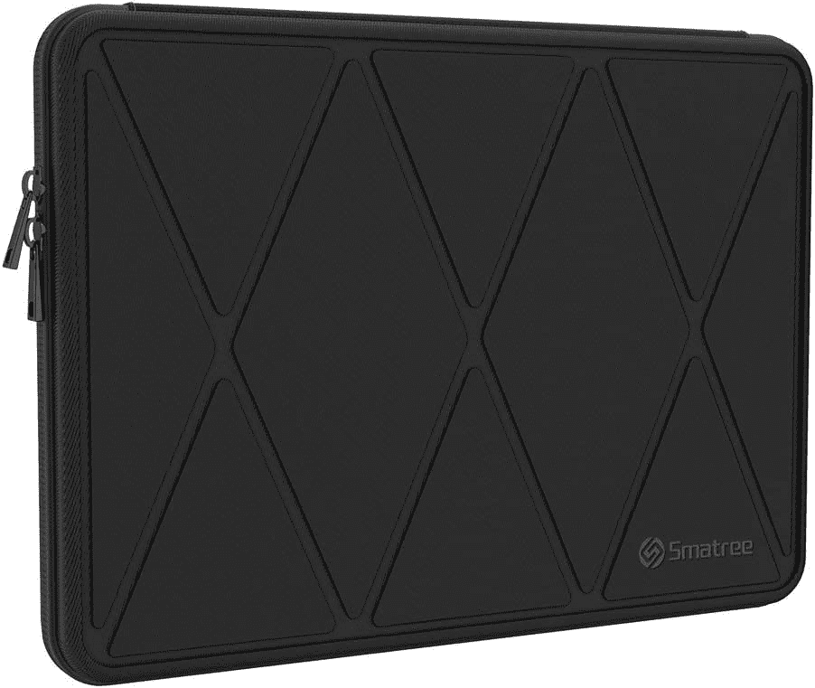

# 2023 年最佳联想 ThinkPad X1 Yoga Gen 8 机箱

> 原文：<https://www.xda-developers.com/best-thinkpad-x1-yoga-gen-8-cases/>

# 2023 年最佳联想 ThinkPad X1 Yoga Gen 8 机箱

将您的联想 ThinkPad X1 Yoga Gen 8 放入其中任何一个箱子中，帮助保护它免受刮擦、碰撞和跌落。

联想的 [ThinkPad X1 Yoga Gen 8](https://www.xda-developers.com/lenovo-thinkpad-x1-yoga-gen-8/) 是相当便携的[商务笔记本电脑](https://www.xda-developers.com/best-business-laptops/)。2.48 磅的重量和 0.60 英寸的厚度使它可以很容易地放入包中，去任何需要去的地方旅行。但为了避免损坏系统，系统有许多移动部件，如 360 度铰链，投资一个案例是一个好主意。

虽然 ThinkPad X1 Yoga Gen 8 没有很多特殊的硬壳套，但有很好的袖子和袋子可以容纳你的设备。然后你可以把袖子塞进你的书包或行李中，或者如果你买了一个笔记本电脑包或有肩带的袖子，像你真正的专业人士一样把它挂在肩膀上。其中一些箱子甚至提供衬垫保护和额外的文件和其他附件插槽。

我们收集了九个我们最喜欢的 ThinkPad X1 Yoga Gen 8 外壳，来自联想和 Tomtoc 等替代品牌。

*   ##### 联想 ThinkPad X1 皮套

    编辑推荐

    这是 ThinkPad X1 Yoga Gen 8 的官方皮套。它由优质皮革制成，非常适合专业场合。它有一个超细纤维内饰，可以保护你的笔记本电脑表面免受刮擦。

*   ##### Lacdo 360 保护笔记本电脑套

    最佳价值

    这个来自 Lacdo 的案例就简单一点。它的前面有一个配件槽和一个漂亮的提手。此外，它还配有用于额外保护的软垫

*   ##### 联想 Yoga 14 寸套

    联想的 14 寸笔记本电脑套是更低调版本的顶级建议皮套。它的正面有一个磁性皮革翻盖，外面有防溢出的羊毛毡，还有一个柔软的衬里。

*   <picture></picture>

    KINGSLONG 便携包

    ##### KINGSLONG 便携包

    这款适用于 ThinkPad X1 Yoga Gen 8 的便携包拥有一系列奇妙的口袋，可用于存放配件、文件或笔和手机等物品。它还有一个很棒的提手和肩带。

    T34
*   ##### Arvok 防水氯丁橡胶笔记本电脑套

    如果你想要一个更具视觉冲击力的笔记本电脑套，那么 Arvok 的这款非常棒。它有许多不同的颜色，有柔软的填充角，可以在旅途中保护您的 Yoga Gen 8。

*   <picture></picture>

    Smatree 15-16 寸硬壳笔记本电脑套

    ##### SMA tree 硬壳笔记本电脑套

    为了最大限度的保护免受撞击，你会想看看这款来自 SMA tree 的保护套。与我们名单上的其他人不同，它有一个坚硬的外壳，可以承受打击，防止你的 Yoga 8 在运输过程中弯曲。

*   ##### Spigen Rugged Armor Pro 笔记本电脑套

    这是 Yoga Gen 8 的一个很好的案例，因为它打开的方式。它很坚固，有一个全方位的拉链，让你像打开一本书一样打开外壳。虽然是为 MacBooks 设计的，但它非常适合联想的笔记本电脑。

    T34
*   ##### Tomtoc 手提单肩包

    这是一款非常适合将瑜伽 8 背在肩上的包。它有许多额外的靠垫，并配有额外的口袋。

*   ##### 惠普 Renew Business 14.1 英寸包

    那些关心环境的人可能想看看惠普的这款包。它由再生材料制成，有可锁的拉链，一个用于保护信用卡的 RFID 口袋，和一个超级柔软的填充肩带。

    T17

为了保护您的联想 ThinkPad 笔记本电脑，我们强烈建议您使用联想的官方保护套，比如联想 ThinkPad X1 皮套。它不仅奢华，与 ThinkPad X1 Yoga Gen 8 的顶级设计相匹配，而且它还有一个很棒的超细纤维内饰。当然，定价为 65 美元，这可能不是每个人的选择，所以 Lacdo 或 Smatree 的更便宜的保护套也一样好，提供基本的碰撞和刮擦保护。即使是 KingSlong 或 Tomtoc 的电脑包也很不错，因为它可以折叠起来，给你空间存放笔记本电脑和其他文件。无论您的需求是什么，ThinkPad 都有很多适合您的箱子。