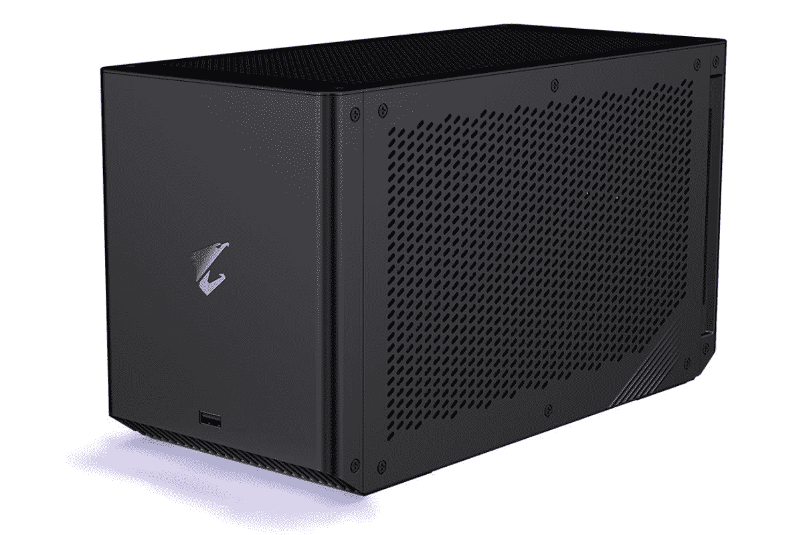
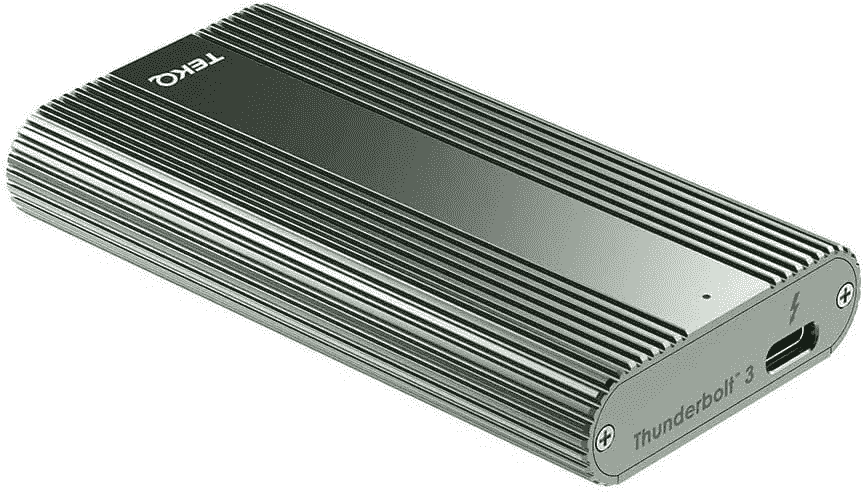

# 2023 年笔记本电脑最佳 Thunderbolt 配件

> 原文：<https://www.xda-developers.com/best-thunderbolt-accessories/>

近年来，Thunderbolt 已经成为许多笔记本电脑和个人电脑的重要组成部分。由英特尔开发的 Thunderbolt 协议使用 USB Type-C 端口来提供非常高的带宽——从 Thunderbolt 4 开始高达 40 Gbps——可用于连接各种外设。今天你可以买到的许多最好的笔记本电脑都带有 Thunderbolt 端口，你可以使用的配件从坞站到外部 GPU 都有，这可以大大扩展你的笔记本电脑的功能。

拥有专有的英特尔技术并不意味着 Thunderbolt 在几乎所有 AMD 笔记本电脑上都不可用。虽然这项技术是免版税的，但提供如此高的带宽是有成本的，再加上需要支付认证费用，所以公司通常不会在较便宜的笔记本电脑上提供这项功能。你还会在最新的 MacBook Pro 14 英寸和 16 英寸中找到 Thunderbolt 支持，尽管它们的端口旁边没有 Thunderbolt 标志。

但是如果你有一个 Thunderbolt 端口，你如何充分利用它呢？我们在这里提供帮助，我们已经收集了一吨你能买到的最好的 Thunderbolt 附件，它们利用了这种高带宽。正如我们提到的，有扩展坞和外部 GPU，但一些显示器和存储设备也使用 Thunderbolt。当然，你可能需要 Thunderbolt 电缆，所以我们也有一些。

## 最佳霹雳码头

从一些最好和最受欢迎的 Thunderbolt 配件开始，我们有扩展坞。 [Thunderbolt 坞站](https://www.xda-developers.com/best-thunderbolt-docks/)可用于为您的笔记本电脑添加更多端口，无论是 USB Type-A、显示输出、以太网，或者如果您想要菊花链，甚至更多 Thunderbolt 端口。有许多不同设计、端口和价格的端口，所以这里有几个你可以得到的好端口:

*   ##### 可插拔 16 合 1 Thunderbolt 4 坞站

    这款可插拔坞站在相对紧凑的设计中配备了多达 16 个端口，包括 4 个显示输出，2.5Gb 以太网。

*   ##### CalDigit TS4 Thunderbolt 4 坞站

    CalDigit TS4 是最昂贵的坞站之一，但它有多个 Thunderbolt 下游端口、USB Type-A 和 Type-C、DisplayPort、以太网等等，这是一个令人难以置信的强大解决方案。

*   ##### Anker 777 Thunderbolt 4 Dock

    Anker 777 是一款高级坞站，拥有全金属机箱和大量端口，包括两个 HDMI 输出、USB Type-A 和以太网。

*   <picture></picture>

    Razer Thunderbolt 4 Dock

    ##### Razer Thunderbolt 4 Dock

    这款时尚而又外观出众的 Dock 增加了多个 Thunderbolt 下游端口、USB Type-A、以太网等等。白色也可能更适合某些设置。

*   <picture></picture>

    肯辛顿 Thunderbolt 4 坞站

    ##### 肯辛顿 SD5700T Thunderbolt 4 坞站

    这款肯辛顿坞站拥有硬朗的金属外观设计，并为您提供大量端口，包括下游 Thunderbolt、USB Type-A、SD 读卡器、以太网和耳机插孔，外加 90W 充电

*   <picture></picture>

    sate chi 雷电 3 坞

    ##### Satechi Thunderbolt 4 坞

    这款 sate chi Thunderbolt 4 坞与其他选件相比并不过分昂贵，但它仍然有很好的端口选择，包括 Thunderbolt 下游连接、USB Type-A 和以太网。

*   ##### 戴尔 Thunderbolt 坞站 WD22TB4

    这款戴尔坞站是另一个不错的选择，具有四个显示器输出、以太网、USB Type-A 和下游 Thunderbolt。它采用模块化设计，将电源与端口分开，便于维修。

    T34
*   ##### Anker PowerExpand 5 合 1 Thunderbolt 4 Mini Dock

    如果你想给你的笔记本电脑增加更多的 Thunderbolt 端口，Anker PowerExpand 5 合 1 增加了其中的三个，外加一个用于外设的 USB Type-A 端口。它支持为您的笔记本电脑 85W 充电。

*   ##### CalDigit Element Hub

    另一个很棒的选择如果你的主要精力是增加更多的 Thunderbolt 端口，CalDigit Element Hub 给你三个，外加四个 USB 型连接。

    T17

## 最佳外部 GPU 盘柜

最好的(也是最酷的)Thunderbolt 配件之一是一个[外部 GPU](https://www.xda-developers.com/best-external-gpus-for-your-laptop/) ，你可以使用一根电缆连接到你的笔记本电脑。我们中的许多人想要一台[轻便、易于携带的笔记本电脑](https://www.xda-developers.com/best-lightweight-laptops/)，但也想要一台[家用游戏电脑](https://www.xda-developers.com/best-gaming-laptops/)的强大功能，外部 GPU 可以让你做到这一点。虽然 egpu 是 Thunderbolt 之前的东西，但现在使用它们要容易得多，并且根据您的品味和需求，有大量的 GPU 外壳选择。

这里需要注意的一点是，苹果硅 MAC 不支持外部 GPU，所以你将无法在那些笔记本电脑上使用这些。在基于英特尔的 MacBooks 上，只有部分 AMD 镭龙 GPU 受支持。

*   ##### Sonnet 分离盒 750

    这款 Sonnet GPU 盘柜采用时尚的设计，看起来很现代，但它有一个强大的 750 瓦 PSU，能够在峰值负载期间为您的 GPU 提供高达 475 瓦的功率(连续 375 瓦)，另外为您的笔记本电脑提供 100 瓦的功率。不过，它不适合 GeForce RTX 3090。

    T33
*   ##### 雷蛇 Core X Chroma

    对于 RGB 灯光的爱好者来说，雷蛇 Core X Chroma 可以为你的桌面设置增添一抹亮色。它还有一个 700 瓦的 PSU，为 GPU 提供 500 瓦的功率，为笔记本电脑提供 100 瓦的充电功率，并支持最多 3 插槽 GPU，应该可以容纳大多数现代 GPU。

*   <picture></picture>

    技嘉 Aorus RTX 3080 游戏盒

    ##### 技嘉 Aorus RTX 3080 游戏盒

    与大多数 GPU 机箱不同的是，Aorus 游戏盒预装了一个 GPU，在这种情况下是一个 RTX 3080。此外，它有很多通风孔和背面的许多端口。然而，在现货中很难找到。

## 最佳雷电监视器

如果您想要直接连接到显示器，而不需要任何适配器，有几个显示器选项支持 Thunderbolt 连接。这些通常是相当高端的显示器，因为更便宜的替代品通常带有 HDMI、DisplayPort 或标准的 USB Type-C 连接。除了作为高端显示器，一些最好的 Thunderbolt 显示器还可以让你连接其他配件，也可以作为一种扩展坞。以下是一些不错的选择:

*   <picture></picture>

    Dell UltraSharp 27 up 2720 q

    ##### Dell UltraSharp up 2720 q

    Dell UltraSharp 27 4K 显示器具有超清晰的 4K 分辨率，覆盖 100%的 Adobe RGB，可用于高级色彩校准。它还提供了 1300:1 的对比度，并包括一个遮光罩，以获得更好的可视性。

*   <picture></picture>

    明基 PD3220U

    ##### 明基 PD3220U

    如果你想要一台超清晰的专业显示器，明基 PD 3220 u 配有 4K 显示屏，可覆盖 100%的 sRGB 和 Rec。709，DCI-P3 的 95%,并且它具有额定为δE≤3 的色彩准确度。它还支持 Thunderbolt 菊花链。

*   ##### 联想 ThinkVision P27u-20

    这款 27 英寸显示器配备了极其锐利的 4K 面板，它覆盖了 99%的 DCI-P3 和 Adobe RGB。它还支持 DisplayHDR 400，并具有广泛的连接功能，包括一个以太网端口和一个 USB 集线器。

*   <picture></picture>

    三星 J791 系列

    ##### 三星 J791 34 英寸超宽显示器

    超宽显示器对于生产力来说非常棒，这是一个坚实的起点。它很锐利，有 100 赫兹的刷新率，还增加了额外的端口，包括 Thunderbolt 菊花链。再加上相对实惠。

*   ##### LG ultra wide 38wn 95 c-W

    如果你想要一台使用 Thunderbolt 的游戏显示器，这可能是你能得到的最接近的了。这是一款超宽显示器，具有 QHD 分辨率、144Hz 刷新率和 NVIDIA G-Sync 支持。它还支持 HDR 600，覆盖了 P3 98%的 DCI。

*   ##### 戴尔 UltraSharp u 4021 qw

    需要大量空间和大量像素？这款超宽戴尔显示器的尺寸为 40 英寸，配有一个超锐利的 5K2K 面板，为您提供大量空间并排运行多个应用程序，使多任务处理变得轻而易举。不过，这是有代价的。

    T17

## 最佳迅雷存储

它们并不常见，但如果你想要为你的笔记本电脑提供超高速的外部存储，Thunderbolt 固态硬盘是你可以得到的最佳配件之一。不同的公司有几个选择，虽然它们可能有点贵，但如果你关心速度，你绝对物有所值。以下是一些不错的选择:

*   <picture></picture>

    萨布伦特火箭 XTRM-Q

    ##### 萨布伦特火箭 XTRM-Q

    这款萨布伦特 SSD 的容量范围很广，从 512GB 到 8TB 不等，虽然有些型号不可用。它使用 Thunderbolt 提供高达 2700 MB/s 的速度，但它也可以通过普通 USB 端口以高达 900MB/s 的速度工作。

*   ##### Fantom Drives Extreme

    这款 Fantom Drives SSD 采用时尚的金属机箱，容量高达 4TB，是绝佳的替代产品。使用 Thunderbolt，速度可达 2，800MB/s(读取)，常规 USB 连接速度可达 1，050MB/s。

    T34
*   ##### 可插拔雷电 3 固态硬盘

    这款来自 Plugable 的选件采用了不同的设计，带有内置线缆，因此您不必担心会丢失。这个型号稍微慢一点，速度高达 2400 MB/s，不支持非 Thunderbolt 端口。

    

*   <picture></picture>

    TEKQ Super Veloce SSD

    ##### TEKQ Super Veloce SSD

    不仅仅是一款便携式 SSD，这款机型实际上是一款适用于您想要的任何 SSD 的成熟外壳，因此您可以在以后升级它，或者如果您想将外部驱动器出售给其他人，也可以更换 SSD。速度高达 2400 MB/s，但除非你的电脑支持 Thunderbolt，否则无法工作。

*   ##### SanDisk Professional PRO-G40

    SanDisk 的这款专业固态硬盘提供高达 2，700MB/s 的超高传输速度，还支持速度高达 1，050MB/s 的常规 USB 连接。它采用了额外的耐用设计，可以防尘、防水和承受高达 4000 磅的压力。

*   <picture></picture>

    LaCie 加固型 SSD

    ##### LaCie 加固型 SSD Pro

    是 SanDisk 型号的可靠替代产品，这款 LaCie SSD 采用了更多的橡胶处理设计，使用 Thunderbolt 时支持高达 2，400MB/s 的速度，尽管它在常规 USB 端口上也可以以较慢的速度工作。

## 最佳雷电电缆

在所有这些附件中，最好不要忘记它们需要特定的 Thunderbolt 电缆。虽然大多数情况下盒子里都会有这些电缆，但您可能会丢失或损坏它们。如果你需要一个替代品，这里有几个选项供你选择:

*   ##### 可插拔的 Thunderbolt 4 线缆

    这款 Thunderbolt 4 线缆不仅支持 40Gbps 的传输速度，如果你有兼容的 PC 和充电器，它还可以提供 240W 的充电功率，即使是最苛刻的笔记本电脑也能快速充电。

*   <picture></picture>

    Maxonar Thunderbolt 4 线缆

    ##### maxon ar Thunderbolt 4 线缆

    为了额外的耐用性，这款 maxon ar 线缆完全包裹在尼龙之中。它支持 Thunderbolt 4 的所有功能，最长可达 6.6 英尺

*   <picture></picture>

    Anker Thunderbolt 4 线缆

    ##### Anker Thunderbolt 4 线缆

    这款 Anker 线缆带给你 Thunderbolt 4 的全部功能，包括 40Gbps 带宽和 100W 功率。它有 2.2 英尺长，对于大多数用途来说已经足够了。

* * *

当谈到购买任何配件时，它总是取决于你的个人需求，所以你可能会也可能不会在所有这些类别中找到价值。无论是哪种方式，Thunderbolt 配件的功能都远远超过了大多数 USB 设备，无论是为您提供超高速的外部固态硬盘，让您在轻便的笔记本电脑上玩高端游戏，还是只通过一个端口为您的整个桌面设置供电。对于所有这些需求，这份清单上的配件会很好地为你服务，你有选择的余地。值得注意的是，随着 USB4 的出现，许多 Thunderbolt 功能在不正式支持 Thunderbolt 的笔记本电脑上是可能的，但如何将 USB4 实现到他们的设备中总是由每个制造商决定。有些功能可能不可用，因此您需要深入了解。

如果你仍然在寻找一台可以充分利用这些配件的笔记本电脑，我们有一个你今天可以购买的最好的 Thunderbolt 4 笔记本电脑的列表。这些都将支持此列表中的附件。