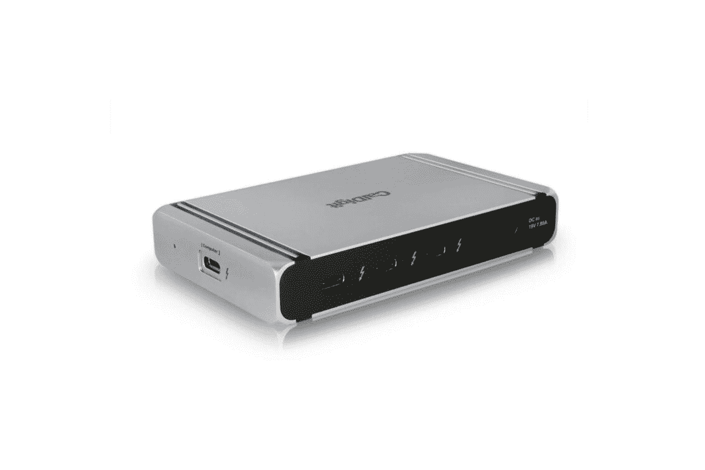
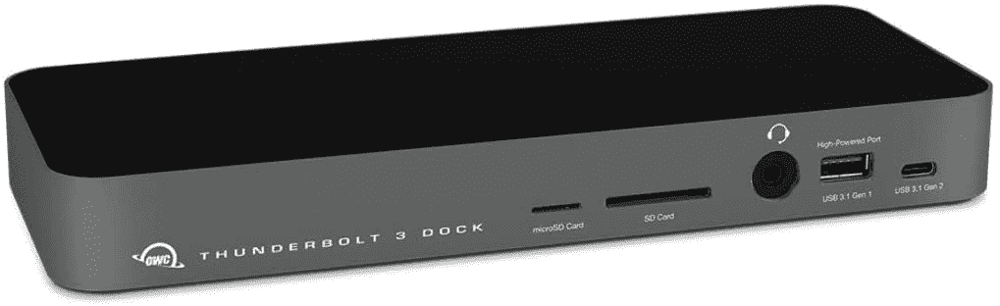
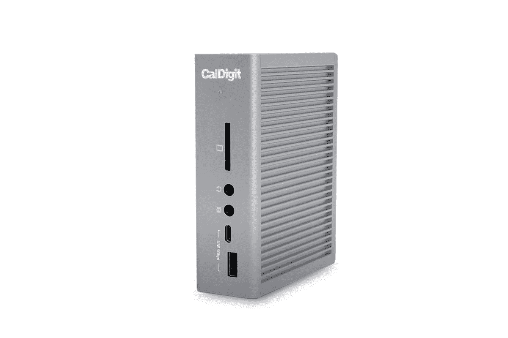
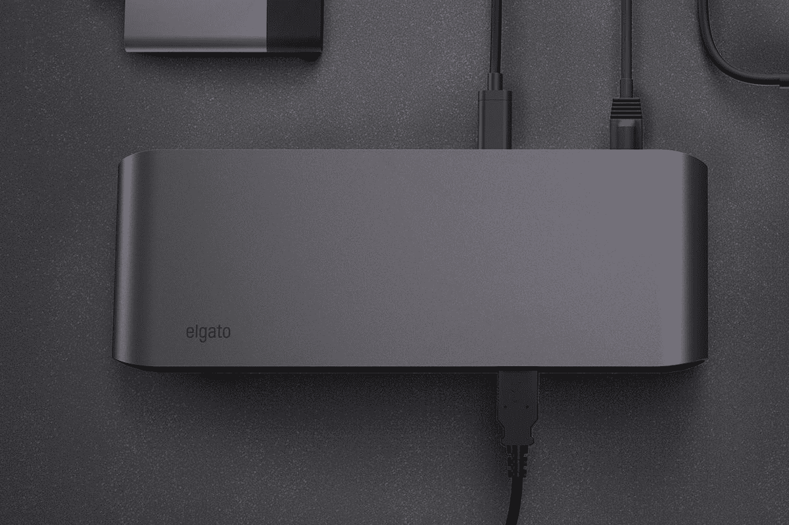
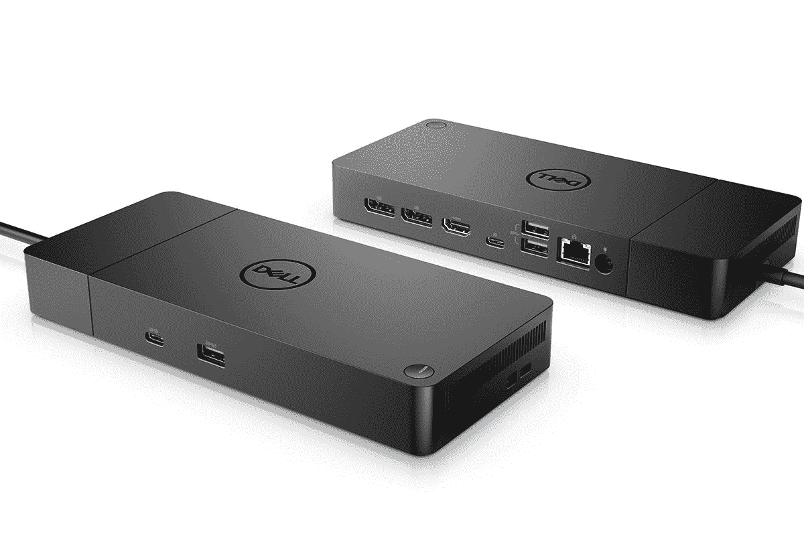

# 2023 年最佳笔记本电脑 Thunderbolt 坞站

> 原文：<https://www.xda-developers.com/best-thunderbolt-docks/>

随着越来越多的笔记本电脑提供超高速端口，Thunderbolt 终于赶上来了。2020 年,《霹雳 4》取代了《T2》《雷电 3》,虽然它并没有更快，但在其他几个领域也有升级。最新版本定义了新的规范，以支持 40Gbps 的全速，电缆最长可达 2m，支持两个 4K 显示器而不是一个(或一个 8K 显示器)，支持至少一个 100W 电源的端口用于笔记本电脑充电，允许所有坞站支持从睡眠中唤醒，并提供针对 Thunderspy 攻击的 DMA 保护。Thunderbolt 4 还将最低 PCIe 带宽提高了一倍，达到 32Gb/s，这意味着对外部 GPU 的支持更加强大。

Thunderbolt 的最佳用例之一是，您可以使用简单的 dock 扩展台式机或笔记本电脑上的 I/O 连接选项。这允许您连接多个设备，包括 4K 显示器、USB 驱动器、音频设备、存储卡等。因此，这里有一些你能买到的最好的迅雷坞站。我们选择了雷电 3 和 Thunderbolt 4 坞站的组合，因此您可以根据自己的要求进行选择。

## 霹雳 4 坞站

Thunderbolt 4 建立在雷电 3 的基础上，引入了更高的最低要求，并进一步推动了功能。例如，它支持两个 4K 显示器(或一个 8K 显示器)，而不是只有一个 4K 屏幕。更不用说一个配件最多可以有四个 Thunderbolt 端口，而不是只有两个。下面你可以找到一些目前最好的 Thunderbolt 4 坞站。

### 最佳整体:肯辛顿 SD5700T Thunderbolt 4 扩展坞

肯辛顿以其设备安全解决方案而闻名，但它也生产码头和集线器。他们的最新产品是 SD5700T Thunderbolt 4 扩展坞。该坞站总共提供 11 个端口，包括一个 SD 读卡器、四个 Thunderbolt 4 端口、四个 USB-A 端口(前面一个 5V/1.5A 充电端口，后面三个 Gen2 10Gbps 端口)、一个千兆以太网端口和一个 3.5 毫米音频组合插孔。该坞站还支持 90W 功率输出，这意味着你可以为任何 Thunderbolt 4 或支持雷电 3 的 Windows 或 Mac 笔记本电脑充电。你需要注意的是，这个坞站上没有 DisplayPort 或 HDMI 端口，所以你只能连接一个支持 USB-C 的显示器，或者你必须添加另一个适配器。

 <picture></picture> 

Kensington Thunderbolt 4 Docking Station

##### Kensington SD5700T Thunderbolt 4 扩展坞

最佳综合

这款肯辛顿 Thunderbolt 坞站增加了 USB 端口、SD 读卡器、以太网和 Thunderbolt 菊花链。它还能为您的笔记本电脑提供 90W 的功率，无论您将它连接到什么设备。

### 最佳精选:Belkin Connect Pro Thunderbolt 4 Dock

 <picture></picture> 

Belkin Thunderbolt 4 Dock Pro

这种高级 Belkin 坞站支持由 macOS 和 Windows 驱动的笔记本电脑。它提供 12 个端口，包括一个 SD 读卡器、音频输入/输出、带 PD 3.0 快速充电的 USB-C 3.1 Gen 2 端口、两个 Thunderbolt 4 端口、两个 HDMI 2.0 端口、千兆以太网、两个 USB-A 3.1 端口和两个 USB-A 2.0 端口。该包装还包括一根 0.8 米的 Thunderbolt 4 电缆，允许您将坞站和笔记本电脑分开，而不需要依赖额外的延长线。

 <picture></picture> 

Belkin Thunderbolt 4 Dock Pro

##### Belkin Connect Pro 雷电 4 坞站

最佳溢价精选

Belkin Thunderbolt 4 Dock Pro 比大多数坞站都要贵，但它确实有稳定的端口供应，有两个 HDMI 端口、Thunderbolt 菊花链、以太网和四个 USB Type-A 端口。此外，它可以通过 USB-C 给你的手机充电，并且有一个 SD 读卡器。如果你有预算，这可能是一个有效的选择。

### 最适合普通用户:CalDigit 元素中心

CalDigit Element Hub 是目前为数不多的 Thunderbolt 4 坞站之一，有助于扩展您的笔记本电脑、Mac 或台式 PC 上的 Thunderbolt 和 USB Type-A 端口的数量。它向后兼容雷电 3、USB-C 和 USB 4，并支持双 4K 或单个 8K 显示器和 60W 的功率传输，可为包括笔记本电脑、智能手机等在内的各种设备充电。它相当紧凑，适合主要需要多个快速 USB 端口的用户。

 <picture></picture> 

CalDigit Element Hub

##### CalDigital Element Thunderbolt 4 Dock

最适合普通用户

如果你不需要大量的端口，CalDigit Element Hub 给你四个 USB Type-A 连接和三个 Thunderbolt 下游端口，仍然可以连接很多配件。此外，它非常紧凑，比大多数 Thunderbolt 坞站更实惠。

### 最适合高级用户:CalDigit TS4 Thunderbolt 4 Dock

 <picture></picture> 

CalDigit TS4

这款来自 CalDigit 的 Thunderbolt 4 坞站有 18 个端口，可帮助您充分利用笔记本电脑。其中包括一个内置的 DisplayPort 1.4 连接器、8 个具有全 10Gb/s 性能的 USB 端口、SD & microSD 4.0 UHS-II 读卡器、3 个 Thunderbolt 4 (40Gb/s)端口、3 个音频端口、2.5GbE 和一个安全插槽。由于支持 98W 功率传输，您将能够快速为兼容笔记本电脑充电。

##### CalDigit TS4 Thunderbolt 4 坞站

最适合超级用户

Thunderbolt docks 不会比 CalDigit TS4 好多少。总共有 18 个端口，包括 Thunderbolt 下游端口、DisplayPort、USB-C、USB-A 和超快 2.5Gb 以太网，这一个是另一回事。它还具有坚固的金属结构，这有助于它感觉优质和耐用。

### 最适合极简主义者:Anker PowerExpand 5 合 1 Thunderbolt 4 迷你坞站

在充电配件和 USB 集线器方面，Anker 是一个知名且可靠的品牌。该公司提供 PowerExpand 5 合 1 Thunderbolt 4 迷你坞站，顾名思义，这是一个能够扩展您的连接能力的小型 Thunderbolt 4 坞站。它具有一个 85W Thunderbolt 4 上行端口、三个 Thunderbolt 4 下行端口和一个 USB-A 端口。Thunderbolt 4 下游端口支持 15W 功率传输和 30Hz 的单个 8K 显示器，或高达 60Hz 的 4K 的双显示器。

##### Anker PowerExpand 5 合 1 雷电 4 迷你坞站

最适合极简主义者

Anker 的一款相当紧凑的 Thunderbolt 4 坞站，可提供高达 85W 的功率输出，最大 15W 的手机充电功率，并支持 8K@30Hz 或双 4K@60Hz 显示屏。

### 最适合游戏玩家的:雷蛇雷电 4 Dock Chroma

一个带 RGB 的迅雷坞？为什么不呢？Razer 以其高质量的游戏外设而闻名，该公司已经推出了自己的 Thunderbolt 4 坞站。除了时髦的 RGB 照明，该坞站还提供了一个 SD 读卡器、一个 3.5 毫米音频插孔、三个 Thunderbolt 4 下游端口、一个 Thunderbolt 4 上游端口、千兆以太网和三个 USB-A 3.2 Gen 2 端口。这与 Kensington SD5700T 非常相似，事实上，甚至连端口的位置也很相似。同样，没有显示端口或 HDMI 端口，但是您可以使用附加的 Thunderbolt 端口插入双 4K 显示器。

 <picture></picture> 

Razer Thunderbolt 4 Dock

##### 雷蛇雷电 4 码头色度

最适合游戏玩家

如果你想在你的设置中增加一点 RGB，Razer Thunderbolt 4 dock Chroma 是一个不错的选择。这个特殊的坞站配有一个 SD 读卡器、一个 3.5 毫米音频插孔、三个 Thunderbolt 4 下游端口、一个 Thunderbolt 4 上游端口、千兆以太网和三个 USB-A 3.2 Gen 2 端口。

* * *

## 雷电 3 码头

雷电 3 是一个较老的标准，但它仍然有效，并被一些制造商今天使用。它包括更多限制，例如支持单个 4K 显示器和每个配件最多两个 Thunderbolt 端口。如果你正在寻找一个雷电 3 码头，你可以在下面找到一些最好的选择。

### 最佳综合:OWC 14 港雷电 3 码头

 <picture></picture> 

OWC 14-Port Thunderbolt 3 Dock

这款来自 OWC 的雷电 3 坞站配有 14 个端口——USB 3.1 Gen 2/Gen 1、雷电 3、microSD 读卡器、SD 读卡器、mini DisplayPort、千兆以太网、S/PDIF 和组合音频 I/O。它最多支持两个 4K 或单个 5K 显示器，因此您可以将其连接到大屏幕上。由于多平台兼容性，你可以在 MAC 和 Windows PCs 上使用它。更不用说它支持高达 85W 的笔记本供电和充电。

 <picture></picture> 

OWC 14-Port Thunderbolt 3 Dock

##### OWC 14 港雷电 3 码头

最佳综合

OCW 的这个坞站带有 14 个端口，允许您将多功能设备和附件连接到 Mac 或 Windows PC。

### 超级用户的最佳选择:卡尔迪奇 TS3 Plus

CalDigit TS3 加是一个强烈推荐的雷电 3 坞站，因为它提供了广泛的 I/O 和连接能力，而不是一个，而是两个笔记本电脑在同一时间。事实上，我们还推荐它作为新款 Surface Laptop 4 的最佳坞站之一。它配备了两个 Thunderbolt 端口、五个 USB 3.2 Type-A、一个 USB 3.2 Type-C、一个 USB 3.2 Gen 2 Type-C、DisplayPort 1.2、3.5 毫米音频输入、3.5 毫米音频输出、千兆以太网、光学音频、UHS-II SD 卡插槽，并支持 87W 功率传输。

 <picture></picture> 

CalDigit TS3 Plus

##### 加州 TS3 雷电 3 码头

最适合高级用户

这个 beast 提供了 15 个端口，包括 USB-C、以太网、SD 卡等等。虽然它提到它支持 2 个外部显示器，但请记住，M2 限制您只能使用 1 个。

### 最佳溢价奖:埃尔加托雷电 3 专业码头

一根电缆。“不妥协”是 Elgato 对其雷电 3 Pro Dock 的评价。它看起来很时尚，配有一组可靠的 I/O 端口，包括两个 USB 3.1 Gen 1 Type-A 端口、一个 3.5 毫米音频组合端口、一个 SD 卡插槽和一个 microSD 卡插槽。在背面，它提供了千兆以太网，3.5 毫米耳机插孔，两个 USB 3.1 Gen 2 Type-A 端口，两个雷电 3 端口和一个显示端口。该公司声称，你可以使用 DisplayPort 连接 4K 显示器，使用雷电 3 端口之一连接第二个 4K 显示器。

 <picture></picture> 

Elgato Thunderbolt 3 Pro Dock

##### 埃尔加托雷电 3 专业码头

最佳溢价奖

Elgato 的雷电 3 专业坞站是一个圆滑的解决方案，以扩大您的 I/O 选项，特别是音频，因为这一个提供了两个连接两个耳机的选项。

### 最适合普通用户:戴尔 Thunderbolt 坞站 WD19TBS

戴尔自己的 Thunderbolt 坞站非常适合扩展您的连接选项。值得注意的是，该坞站没有任何音频端口，也没有任何存储卡读卡器。在前面，有一个 USB 3.1 Gen 1 Type-A 端口和一个 USB 3.1 Gen 2 Type-C 端口。在坞站的背面，有两个 DisplayPort 1.4、一个 HDMI、一个支持 DisplayPort 的 USB-C 端口、两个 USB 3.1 Gen 1 Type-A 端口、千兆以太网和雷电 3。据戴尔称，该坞站最多可支持三个显示器，包括单个 5K 和双 4K 显示器，以及高达 130W 的功率传输。

 <picture></picture> 

Dell Thunderbolt Dock WD19TBS

##### 戴尔迅雷坞站 WD19TBS

最适合普通用户

戴尔雷电 3 坞站的独特之处在于，它提供高达 130 瓦的功率，这意味着您可以轻松地为笔记本电脑充电，并且仍然可以正常运行。

### 最佳实惠选择:UtechSmart 雷电 3 扩展坞

这款来自 UtechSmart 的 12 合 1 雷电 3 坞站包括一个 4K HDMI 1、一个 HDMI 2、一个 VGA、两个 USB 2.0、一个 RJ45 千兆以太网(10/100/1000)、一个用于充电的 USB-C、一个用于数据传输的 USB-C、一个 SD/TF 和两个 USB 3.0 端口。它与苹果电脑和 Windows 电脑都兼容，而且价格合理。

 <picture></picture> 

UtechSmart Docking Station

##### UtechSmart 雷电 3 扩展坞

最实惠的选择

这款 12 合 1 雷电 3 坞站提供了一切功能，可以满足 macOS 和 Windows 机器上的大多数(或全部)端口需求。

* * *

如果我个人必须从这些 Thunderbolt 坞站中选择一个，我会选择 CalDigit TS4 Thunderbolt 4 坞站。它提供了几乎所有你期望从码头上看到的港口类型，而且它是由一家声誉良好的公司制造的。如果我不得不选择雷电 3 码头，我同样会选择 [CalDigial TS3 加雷电 3 码头](https://www.amazon.com/CalDigit-TS3-Plus-Thunderbolt-Dock/dp/B07CZPV8DF?tag=xda-52p1k09-20&ascsubtag=UUxdaUeUpU557&asc_refurl=https%3A%2F%2Fwww.xda-developers.com%2Fbest-thunderbolt-docks%2F&asc_campaign=Commerce)。

随着更多的 Thunderbolt 4 笔记本电脑进入市场，我们预计未来几个月将有更多品牌推出坞站解决方案。确保你也浏览了我们列出的一些你应该在 2022 年购买的[最佳笔记本电脑](https://www.xda-developers.com/best-laptops/)，如果你喜欢游戏，这里是我们推荐的[最佳游戏笔记本电脑](https://www.xda-developers.com/best-gaming-laptops/)。