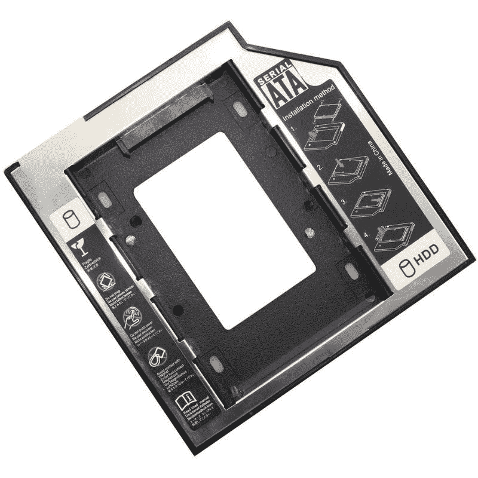
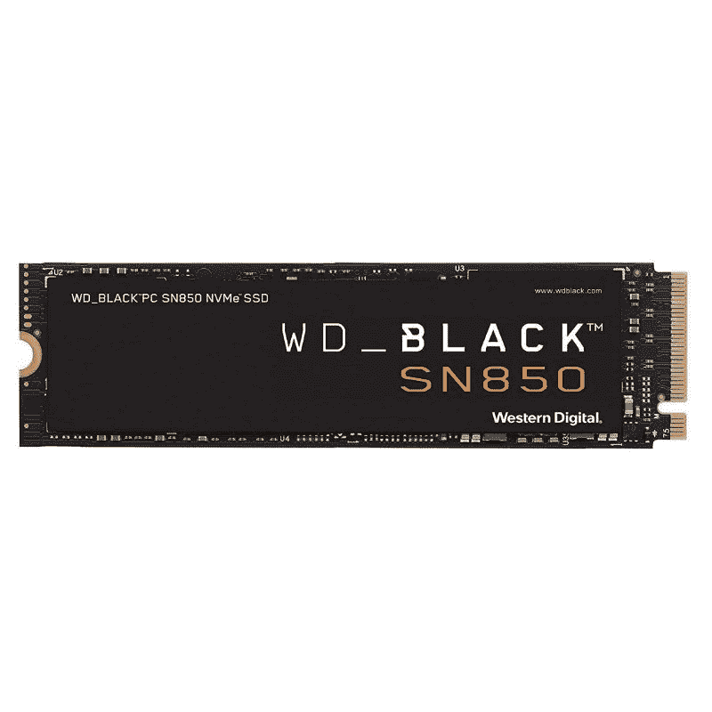
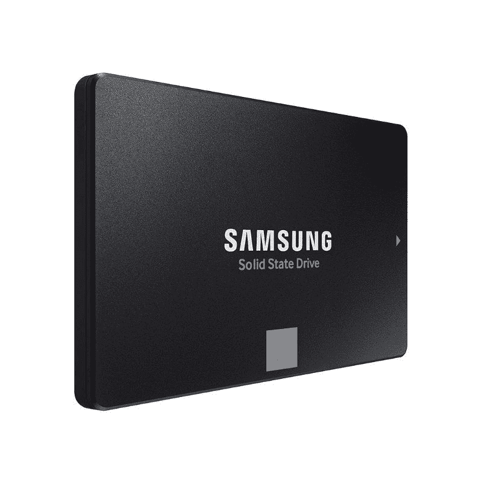
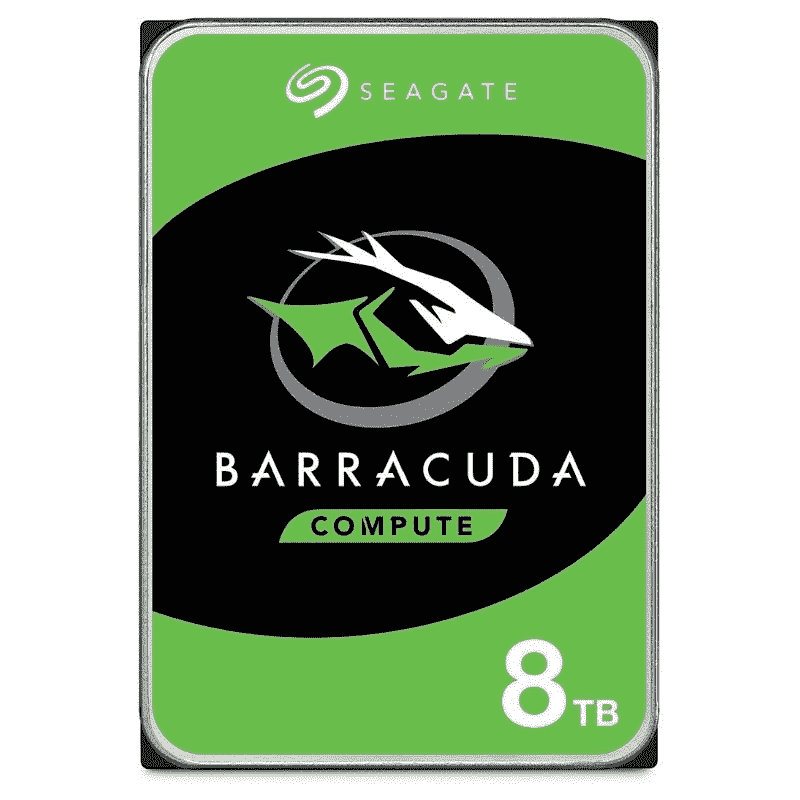

# 添加固态硬盘是旧电脑提高性能的最佳升级方式

> 原文：<https://www.xda-developers.com/best-upgrade-for-old-pc-m2-ssd/>

过去的几年对那些试图为新的个人电脑制造获得零件的人来说是艰难的。自全球芯片短缺成为焦点以来，已经过去了一年多，但当涉及到为构建获取部件时，情况只会变得更糟。当然，你总是可以找到一个变通办法来获得新的组件，但这可能是一个调整你现有的 PC 或笔记本电脑的好时机，看看你是否可以挤出更多的使用。在本文中，我们将讨论改变您的电脑体验的一个最重要的升级——升级到固态硬盘。没错，添加固态硬盘(SSD)是任何人都可以对 PC 进行的最佳升级，并可以看到明显的性能差异。

## 存储驱动器:您电脑的最佳升级

台式电脑比笔记本电脑更容易升级，因为你在机箱内有更多的工作空间，而且部件很容易更换。然而，升级的程度实际上取决于预算和组件的可用性。因此，电脑的内存和存储是升级时最先考虑的两个组件。它们都可以在市场上买到，并且易于安装，无需完全拆除系统。但是你应该先升级哪个——RAM 还是存储？

虽然 RAM 对计算机的整体性能至关重要，但以内存升级的名义，你能做的也就这么多了。除非您使用的是非常旧的系统，否则您可能已经在使用速度和时间都相当不错的 DDR4 内存了。在这种情况下，你能做的就是增加更多的内存。但是如果你已经安装了足够的内存，那么你就不会通过增加内存来显著提高电脑的性能。

但是，存储升级可以显著提高整体性能。从传统硬盘升级到固态硬盘将为您的电脑注入新的活力。这可能之前已经讨论过很多次了，但请允许我们提醒您，固态硬盘会将机械磁盘驱动器打得落花流水。我们特别提到硬盘，是因为仍有数量惊人的用户将硬盘作为计算的首选存储选项。据 [Statista](https://www.statista.com/statistics/275336/global-shipment-figures-for-hard-disk-drives-from-4th-quarter-2010/) 统计，2021 年第一季度硬盘驱动器(HDD)的单位出货量达到 6417 万。虽然没有之前几年那么高，但仍然是一个巨大的数字。

## 固态硬盘的优势

如果您还没有，我们建议您将台式机或笔记本电脑上的硬盘换成 2.5 英寸硬盘。我们不一定要深入到详细的基准测试中，以显示固态硬盘相对于传统硬盘有多大的改进。这是因为即使是相当便宜的固态硬盘也可以提供比 7200RPM 硬盘显著的性能提升。这主要是因为固态硬盘可以从磁盘上的任何位置读取和写入数据，几乎不会影响性能。正如你所见，基于 PCIe 3.0 的 NVMe 固态硬盘在 CrystalDiskMark 测试中提供了令人印象深刻的读写速度。

相比之下，硬盘驱动器只能提供大约 100MB/s 的顺序读写速度。使用 SSD 的优势还延伸到了合成基准之外。配备固态硬盘的电脑速度会更快，通常只需几秒钟。除了在文件传输过程中节省几分钟时间之外，它还能更快地启动和运行应用程序。虽然游戏玩家在玩游戏时会看到加载时间的明显差异，但我们认为，即使是那些在学校、工作或商务中使用计算机的人也将从更快的计算机中受益匪浅。

更不用说，硬盘驱动器还会出现碎片，从而影响系统的整体性能。对于那些好奇的人来说，硬盘驱动器中的碎片发生在大文件的碎片散落在磁盘上的时候。固态硬盘不受碎片影响，因为它们缺少物理读取磁头。这意味着数据可以存储在任何地方而不会受到影响，从而使固态硬盘的速度更快。

除了明显的差异，固态硬盘比硬盘更好，因为它们更耐用，噪音更小，寿命也更长。它们现在也有大容量的，这使得它们非常适合作为你电脑的主存储器。

## 固态硬盘的不同类型和技术

有几种类型的固态硬盘，但你的升级选择也取决于不同类型的格式和连接。如果你正在升级一台旧机器，那么你可能必须坚持传统的硬盘和大多数 2.5 英寸固态硬盘使用的 SATA 连接。确保您拥有最新版本的 SATA(即 SATA III)以获得最佳速度也很重要。如果你不知道，SATA III 的速度是 SATA II 的两倍，是古老的 SATA I 连接类型的四倍。

PCIe 也是一种现代连接选项，如今被广泛用于提高性能。它提供了比 SATA 更快更可靠的连接，但也更贵。还有 PCIe NVMe 固态硬盘，它基本上使用一种协议来与你的电脑更快地沟通。如果您希望系统发挥最佳性能，我们还建议您从 SATA 升级到 M.2 连接器。许多现代主板和笔记本电脑也有多个 M.2 插槽，但在相对较旧的系统上可能没有这个选项。

升级您现有的笔记本电脑或台式机实际上非常简单。只需识别您现有系统中的主板，即可轻松确定哪个固态硬盘可以安装在其中。不用进入太多的细节，可以肯定地说，你的旧笔记本电脑和台式机可能使用 2.5 毫米 SATA 驱动器。任何相对较新的产品都将使用 M.2 SATA 或 NVMe 硬盘。

如果您正在为一台带有 CD/DVD 驱动器的旧笔记本电脑制定 SSD 升级计划，那么您可以通过一个简单的附件来利用这一优势。你可以从亚马逊(Amazon)购买一个简单的 caddy 适配器来添加一个 2.5 英寸的驱动器，而不是更换硬盘。这将基本上从你的笔记本电脑上移除 CD/DVD-ROM 驱动器，但它现在很有可能正在积灰。我们认为这个 DIY 项目是值得的，因为你可以把你的旧硬盘作为备用硬盘。

 <picture></picture> 

HDD/SSD Caddy Adapter with mounting bracket

##### RLECS 硬盘/固态硬盘盒适配器

这款 HDD/SSD caddy 适配器可用于将笔记本电脑中的 CD/DVD 驱动器替换为 2.5 英寸驱动器。

## 价格差异

就每千兆字节的美元价格而言，固态硬盘比硬盘更贵。例如，一个 1TB 的硬盘大约要花 30 美元。但另一方面，即使是入门级的 2.5 英寸 1TB SATA 固态硬盘，起价也将在 90 美元左右。当您提升容量时，这种差异会更加明显。您可能会使用 500GB 或 1TB 的固态硬盘作为系统中的主要驱动器，因此预计会在存储上花费 100 美元或更多。我们建议您查看我们收集的[最佳 M.2 固态硬盘](https://www.xda-developers.com/best-m-2-ssd/)，找到目前市场上的一些最佳选择。我们已经向该列表添加了大量可靠的选项，并且我们不断更新该列表以提供新的选项。

## 为您的电脑升级固态硬盘:最终想法

在本文中，我们已经向您介绍了大量的首字母缩写词和术语，但是有什么收获呢？嗯，市场上仍然有大量的硬盘驱动器，它们在价格和容量上赢得很大。另一方面，如果你更注重速度、外形和碎片等因素，固态硬盘是值得考虑的。这也很大程度上取决于你的用法。预算购买者和数据囤积者将会发现硬盘的巨大价值，并且至少在可预见的未来会继续这样做。它们没有固态硬盘快，但如果只是想转储一堆文件，它们就很棒。

但如果你是一个超级用户，不介意花更多的钱来获得更快的启动、应用程序启动和更快的游戏加载时间，那么 SSD 是一个不错的选择。M.2 NVMe 固态硬盘的性能往往优于 SATA 选项，但在做出购买决定之前，您需要确保您的 PC 或笔记本电脑已准备好升级。你也可以选择双驱动系统，这样可以两全其美。这将允许您使用速度更快的固态硬盘作为操作系统和应用程序的主要驱动器，而高容量硬盘可以满足您的原始存储需求。我们在下面留下了几条建议，请务必查看:

 <picture></picture> 

Western Digital Black SN850 M.2 SSD

##### WD Black SN850 NVMe M.2 固态硬盘

西部数据黑色 SN850 是市场上最好的 M.2 NVMe 固态硬盘之一。这是一款 PCIe Gen4 固态硬盘，速度高达 7000 MB/s。

 <picture></picture> 

Samsung 870 EVO SATA III SSD

##### 三星 870 EVO 固态硬盘

三星 870 EVO 是市场上的最佳选择之一。它在 2.5 英寸的外形中提供可靠的连接，并使用 SATA 连接。

 <picture></picture> 

Seagate BarraCuda Compute HDD

##### 希捷梭鱼电脑硬盘

硬盘是增加电脑存储容量的可靠方法。Seagate BarraCuda Compute 是市场上一款可靠的 3.5 英寸驱动器，存储容量高达 8TB。

寻找一些选项来升级您电脑的内存？查看我们收集的[最佳 DDR4 RAM](https://www.xda-developers.com/best-ddr4-ram/) 和 [DDR5 RAM 套件](https://www.xda-developers.com/best-ddr5-ram/)，在市场上找到一些可靠的选项。或者，您也可以加入我们的 [XDA 计算论坛](https://forum.xda-developers.com/c/xda-computing.12289/)，从我们社区的专家那里获得更多产品推荐。