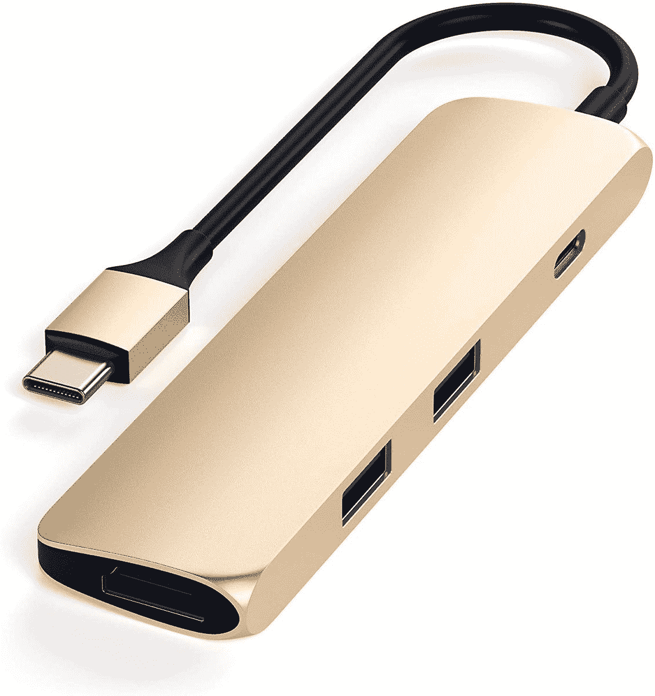
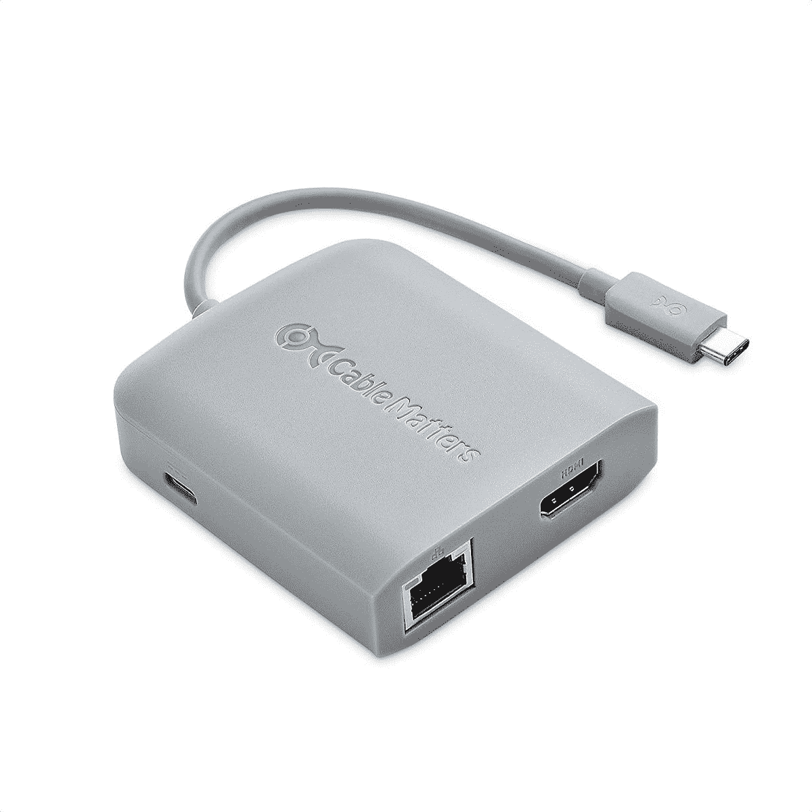
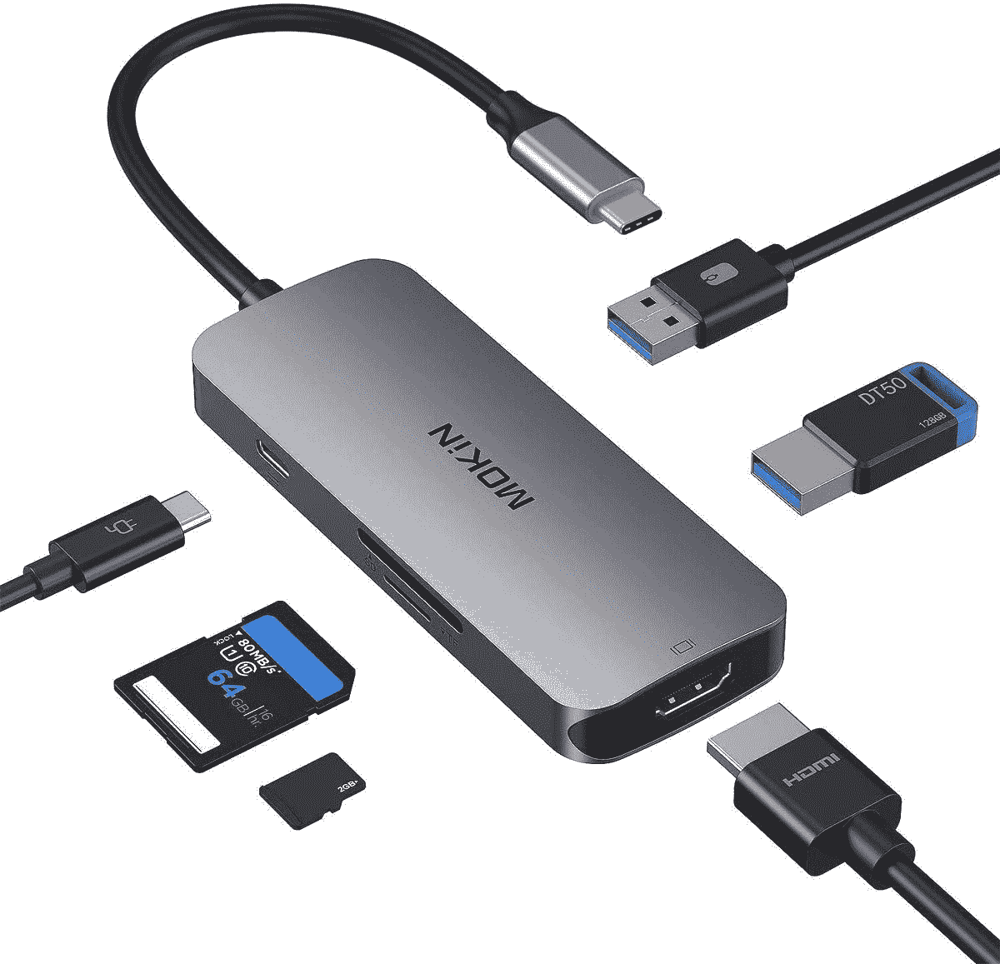
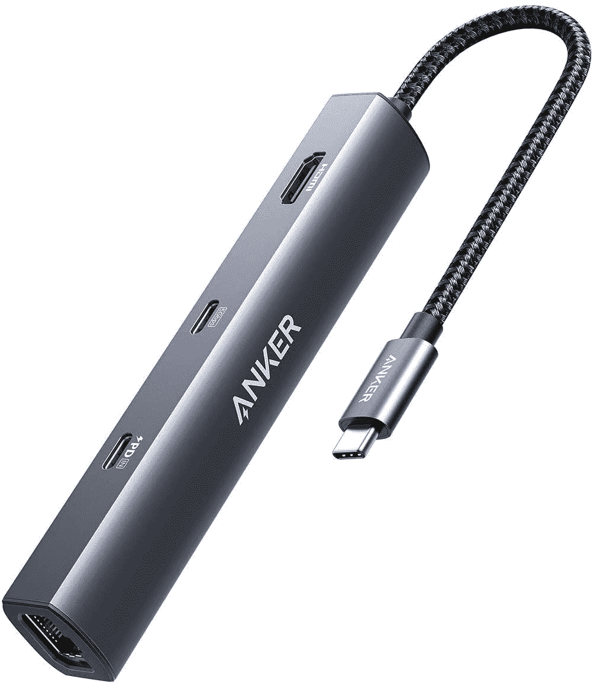

# 2023 年最佳 USB-C 集线器

> 原文：<https://www.xda-developers.com/best-usb-c-hub/>

# 2023 年最佳 USB-C 集线器

笔记本电脑需要 USB-C 集线器吗？我们选择了市场上最好的 USB-C 集线器。我们的首选包括 Anker、HP 等公司的集线器。

随着笔记本电脑变得越来越薄越来越轻，最大的牺牲之一就是端口。如今许多高端笔记本电脑只包括 USB-C 端口，仅此而已。虽然我们同意 USB-C 是未来的发展方向，但对我们许多人来说，依赖 USB 类型、HDMI、以太网等仍然是现实。这就是 USB-C 集线器进入框架的地方，我们已经收集了最好的来帮助您。

USB 集线器恢复了一些或所有缺失的端口，并允许您将大量设备连接到您的笔记本电脑。它们为您提供了一些笔记本电脑可能缺乏的多功能性，但如果您不需要所有这些额外的端口，它们仍允许您轻装旅行。如果你想要更多的连接，你可能也想考虑一下你现在能买到的最好的 Thunderbolt 坞站。这些提供了更高的速度，但不是每个 USB-C 端口都支持 Thunderbolt。这份清单上的产品几乎适用于任何笔记本电脑。

*   <picture></picture>

    Satechi 超薄多端口适配器

    ##### sate chi 多端口适配器 V2

    如果你不需要 sate chi 的其他 USB hub 中存在的所有端口，这个 hub 或许可以诱惑你。Satechi 的超薄 USB 集线器也由铝制成，并带有两个 A 型端口，一个用于供电的 C 型端口和一个 HDMI 端口。

*   <picture></picture>

    Hiearcool 7 合 1 USB-C hub

    ##### Hiearcool 7 合 1 USB-C hub

    拥有一堆端口很重要，但风格也很重要，Hiearcool USB-C hub 为您提供了 7 个端口，包括几个 USB-A 型端口它有几种颜色可供选择，所以你可以得到看起来更独特的东西。

*   <picture></picture>

    Anker 655 USB-C Hub

    ##### Anker 655 8 合 1 USB-C Hub

    the Anker power expand USB-C Hub 具有许多有用的端口，包括 USB-C 电源传输、两个 USB Type-A 端口、一个耳机插孔，甚至是用于有线互联网的 RJ45 以太网与大多数其他集线器相比，它有一个相当独特的设计，它有一根很好的尼龙电缆，所以它感觉真的很好。

*   <picture></picture>

    Totu 9 合 1 集线器

    ##### Totu 9 合 1 USB-C 集线器

    如果您打算将多个显示器连接到您的笔记本电脑，这款铝制 Totu 集线器会非常有用。它包含两个 HDMI 端口和一个 VGA 端口。HDMI 端口最高支持 4K 30Hz 输出，而 VGA 最高支持 1080p。你还可以获得三个 USB 3.0 Type-A 端口、一个 SD 卡插槽、一个 microSD 卡插槽和一个用于 PD 的 Type-C 端口。

*   <picture></picture>

    Anker 341 USB-C Hub

    ##### Anker power expand+7 合 1 USB-C Hub

    如果您正在寻找一款具有多个端口且价格实惠的体面的 Type-C hub，这款 Anker hub 就是您的朋友。它有很好的端口和插槽选择，如两个 Type-A 3.0 端口，一个用于数据传输的 Type-C 端口，一个用于供电的 Type-C 端口(高达 85W)，一个 HDMI 端口，microSD 卡插槽和一个 SD 卡插槽。

*   <picture></picture>

    Baseus 17 合 1 USB-C 坞站

    ##### Baseus 17 合 1 USB-C 坞站

    拥有您想要的所有端口，这款 Baseus USB-C 集线器是您办公桌上的最佳选择之一。它有 17 个端口，包括三个 HDMI 端口、五个 USB-A 端口、三个 USB-C 端口(一个用于供电)和以太网。

*   <picture></picture>

    可插拔的 USB-C 三 4K 扩展坞

    ##### 可插拔的 USB-C 4K 三显示器扩展坞

    这款可插拔扩展坞很特别，因为它支持三个 60Hz 的 4K 显示器，即使在苹果 M1 和 M2 MAC 上也是如此。此外，它还有大量其他端口，包括向您的手机和笔记本电脑供电、以太网等。

*   <picture></picture>

    线缆事项 USB C Hub

    ##### 线缆事项 USB C Hub

    这款小巧的线缆事项 USB C Hub 自带五个端口，可以满足大多数基本需求，其中包括一个 Type-C 端口，用于供电(最高 60W)。其他四个端口包括以太网、两个 USB 2.0 Type-A 端口和支持 60Hz 4K 显示的 HDMI。

*   <picture></picture>

    Surface USB-C Travel Hub

    ##### 微软 Surface USB-C Travel Hub

    这款来自微软的紧凑型 Hub 承载了 Surface line 的现代 disng 语言，为您提供稳定的端口供应。它包括 USB Type-C、USB Type-A、HDMI、VGA 和千兆以太网。但是，它不支持直通充电。

*   <picture></picture>

    Anker power expand 11-in-1

    ##### Anker 565 11-in-1 USB-C Hub

    包装共有 11 个端口，Anker PowerExpand+是一款非常多功能的 Hub。它包括 HDMI，DisplayPort，三个 USB Type-A 端口，两个 USB-C(一个用于 85W 充电)，一个耳机插孔，以及 SD 和 microSD 读卡器。如果想有线上网，它甚至有 RJ45 以太网。

*   <picture></picture>

    Mokin USB-C Hub

    ##### Mokin 5 合 1 USB Hub

    这款 Mokin USB-C Hub 特别小巧实惠，但在端口上也不错过。你有一个 USB Type-C 端口用于供电，两个 USB Type-A 端口，HDMI 以及 microSD 和 SD 读卡器。它非常紧凑，价格实惠，所以这是一个显而易见的。

*   <picture></picture>

    Belkin USB-C Hub

    ##### Belkin 7 合 1 USB-C Hub

    这款 Belkin 产品与列表中的许多其他 USB Type-C Hub 相似，但 Belkin 是您可能更喜欢的可靠品牌。它包含两个数据传输速度高达 5Gbps 的 USB Type-A 端口、一个音频插孔、HDMI 端口、能够提供 85W 功率的 Type-C 端口和卡插槽。

*   <picture></picture>

    塔格斯多端口集线器

    ##### 塔格斯 USB-C 多端口集线器

    如果你不想在 USB-C 集线器上花太多钱，而你只想要 USB 端口，塔格斯可能会给你一些东西。这款超级实惠的 USB 型集线器包含三个 A 型端口和一个 C 型端口，可提供高达 100 瓦的功率。

*   <picture></picture>

    Anker power expand 6-in-1

    ##### Anker power expand 6-in-1 USB-C Hub

    Anker power expand USB-C Hub 是目前最紧凑的多端口 Hub 之一。尽管外形纤薄，但它集成了两个 USB 类端口、以太网、HDMI 和两个 C 类端口。其中一个 C 型端口的功率高达 65W。

这些就是我们现在认为的 USB-C 集线器的最佳选择。如你所见，不同的设计、功能和价位有很多选择。Anker 特别有一些很棒的集线器，PowerExpand+ 7 合 1 USB C 集线器是经济实惠的好选择，Anker 565 包装了大量可供选择的端口。如果你想整理你的桌面，可插拔的 USB-C 三 4K 显示器扩展坞可能是你能找到的最好的选择。

你打算买哪个 USB-C 集线器？请在评论区告诉我们。与此同时，如果你正在寻找一台新的笔记本电脑，我们已经选择了[台配备 USB Type-C 端口的最佳笔记本电脑](https://www.xda-developers.com/best-usb-c-laptops/)和[台配备 Thunderbolt 4 端口的最佳笔记本电脑](https://www.xda-developers.com/best-thunderbolt-4-laptops/)，它们将与列表中的集线器完美搭配。